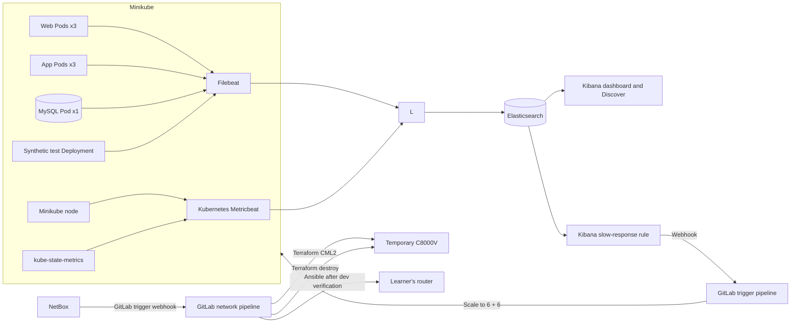

# Final Lab: A Practical DevOps with NetBox, Vault, CML, and ELK

## Duration

**4 hours**

This final lab includes the complete application, Elastic observability with alert-driven scaling, a testing environment, and network intent stored in NetBox. When the intent changes in NetBox, a webhook is sent to GitLab to trigger a dedicated CI/CD configuration pipeline. Each learner may choose a name for their authorized router in NetBox. For safety, the pipeline creates a temporary C8000V in Cisco Modeling Labs (CML), validates the intended configuration there, deploys it to the production router, verifies the production deployment, and destroys the temporary CML lab.

All application, monitoring, configuration, Terraform, Ansible, test, Kubernetes, and pipeline files are included in the Final Lab package. Completing an earlier lab is not required, although learners need access to the local NetBox instance installed in Lab 1. The instructor will provide CML 2.9 or newer.


## Objectives

By the end of this lab, you will:

- Deploy and observe the three-tier application on Minikube.
- Centralize Kubernetes, application, RESTCONF, and synthetic telemetry in Elastic.
- Trigger a GitLab scale-out CI/CD pipeline from a Kibana rule.
- Use NetBox for router inventory and loopback intent.
- Trigger a GitLab network-configuration CI/CD pipeline when loopback intent is created or updated.
- Validate the loopback configuration on a temporary, on-demand C8000V in CML before deploying it to production.
- Retrieve production credentials from Vault and clean up the temporary C8000V router at the end.

## How the components work



Kubernetes Metricbeat monitors the node, Pods, containers, and volumes inside Minikube. kube-state-metrics provides the desired and current workload state, including Pod counts. Filebeat collects Pod logs and detailed RESTCONF request and response events from the application. The synthetic test Deployment uses the real web interface at the interval selected by the learner and records the HTTP status and web response time.

## Before you begin: clean up the previous lab

Complete this section only if you performed Lab 7 on the same Minikube profile:

1. Open the Lab 7 project in GitLab.
2. Open **Build > Pipelines**.
3. Open the most recent successful pipeline for `main`.
4. Find the **cleanup** stage.
5. Select **Run** for the manual `cleanup-minikube` job.
6. Wait until the cleanup job succeeds.

The Lab 7 cleanup first drops its application database, clearing all application accounts and records. It then removes its namespace, workloads, MySQL claim, and persistent volume. Its database data is permanently deleted, but its Minikube images are retained.

Confirm that the shared application namespace has been removed:

```bash
kubectl get namespace network-devops
```

The expected result is `NotFound`. The Final Lab creates and uses the separate `network-devops` namespace.

### Required external lab services

- The new local NetBox instance installed in Lab 1, with an administrator account.
- CML 2.9 or newer (an instructor-provided instance).
- A "production" router, authorized by the instructor with HTTPS RESTCONF enabled for Ansible.
- A shell GitLab runner with `python3`, Python virtual-environment support, `curl`, `sha256sum`, `kubectl`, `minikube`, and `docker` available. The pipeline installs pinned Ansible and Terraform executables inside the project workspace and does not depend on the runner user's interactive environment or `PATH`.

## Step 1: Create the Final Lab repository

Create a private GitLab project named `netdevops-lab08-netbox-cicd` and initialize it with a README.

Clone the new project and create the working branch:

```bash
mkdir -p ~/netdevops-labs
cd ~/netdevops-labs
git clone https://gitlab.com/YOUR-GITLAB-NAMESPACE/netdevops-lab08-netbox-cicd.git
cd netdevops-lab08-netbox-cicd
git switch -c feature/lab08-netbox-cicd
```

Copy only the complete instructor-provided Final Lab files into the new repository:

```bash
cp -R "/path/to/Lab 08 - NetBox-Driven Network Configuration/." .
git status
```

## Step 2: Prepare the Final Lab configuration

Start the Minikube profile:

```bash
minikube start --profile network-devops --driver=docker
minikube profile network-devops
minikube status --profile network-devops
```

Generate values for the pipeline variables and keep the output available for Step 4:

```bash
openssl rand -hex 16
openssl rand -hex 16
openssl rand -hex 32
python3 -c "from cryptography.fernet import Fernet; print(Fernet.generate_key().decode())"
```

## Step 3: Start ELK

```bash
cd ~/course-platform/elastic
cp ~/netdevops-labs/netdevops-lab08-netbox-cicd/elastic/compose.override.yaml .
cp ~/netdevops-labs/netdevops-lab08-netbox-cicd/elastic/logstash/pipeline/logstash.conf pipeline/
docker compose -f compose.yaml -f compose.override.yaml config --quiet
docker compose -f compose.yaml -f compose.override.yaml config \
  | grep -E 'XPACK_ENCRYPTEDSAVEDOBJECTS_ENCRYPTIONKEY|XPACK_ACTIONS_ALLOWEDHOSTS'
docker compose -f compose.yaml -f compose.override.yaml up -d
docker compose -f compose.yaml -f compose.override.yaml up -d --force-recreate kibana logstash
docker compose -f compose.yaml -f compose.override.yaml ps
docker compose -f compose.yaml -f compose.override.yaml exec kibana \
  printenv XPACK_ENCRYPTEDSAVEDOBJECTS_ENCRYPTIONKEY
curl -fsS 'http://127.0.0.1:9200/_cluster/health?wait_for_status=yellow&timeout=120s'
```

The merged configuration must display both `XPACK_` settings, and `printenv` must display `lab08-kibana-encrypted-objects-key-2026`. Do not continue if either check is empty. Recreating Logstash activates the Final Lab index-routing pipeline even when the ELK containers are already running from Lab 1. Recreating Kibana applies the stable encrypted-saved-object key required by connectors and restricts outbound connector traffic to `gitlab.com`. The Logstash row must include `0.0.0.0:15044->5044/tcp`. Port `5044` remains available only on localhost for Lab 1, while port `15044` is the Final Lab ingestion port for Kubernetes. Use this configuration only on the isolated course workstation.

## Step 4: Determine the Logstash address

Use the Minikube gateway IP instead of a DNS hostname:

```bash
export LOGSTASH_IP=$(minikube ssh --profile network-devops -- \
  "ip route show default" | awk '{print $3; exit}')
export LOGSTASH_HOST="${LOGSTASH_IP}:15044"
echo "$LOGSTASH_HOST"
minikube ssh --profile network-devops -- "nc -zv ${LOGSTASH_IP} 15044"
```

Do not continue until the connection test reaches port `15044`.

### 4.1 Configure a new local NetBox instance

Complete this section with the NetBox administrator account created during installation. NetBox is the source of truth: create the learner's router in NetBox before deploying the Final Lab. Names in this section are examples; learners may choose their own router name, but must use that exact case-sensitive name wherever the guide refers to `NETBOX_ROUTER_NAME`.

#### A. Sign in and confirm the NetBox URL

1. Open the NetBox URL and sign in with the administrator account created during installation in Lab 1.
2. Copy only the base URL, for example `http://192.0.2.20:8000`. Do not include `/api/`, a UI page path, or a trailing object ID.
3. Confirm that both the Ubuntu GitLab-runner host and the Minikube environment can reach this URL. Do not use `127.0.0.1` unless NetBox runs inside the same network namespace as the caller.

If NetBox was installed locally by Lab 1, Docker initially publishes it only on the Ubuntu loopback address. Inside an application Pod, `127.0.0.1` means that Pod—not the Ubuntu host—so it cannot reach host NetBox at `http://127.0.0.1:8000`.

Use the gateway that the Minikube node uses to reach the Ubuntu host. Publish NetBox on that host-side gateway address:

```bash
export MINIKUBE_HOST_IP=$(minikube ssh --profile network-devops -- \
  "ip route show default" | awk '{print $3; exit}')
cd ~/course-platform/netbox
sed -i "s/127.0.0.1:8000:8080/${MINIKUBE_HOST_IP}:8000:8080/" \
  docker-compose.override.yml
grep "${MINIKUBE_HOST_IP}:8000:8080" docker-compose.override.yml
docker compose config --quiet
docker compose up -d --force-recreate netbox
export NETBOX_URL="http://${MINIKUBE_HOST_IP}:8000"
echo "$NETBOX_URL"
ss -lnt | grep "${MINIKUBE_HOST_IP}:8000"
curl -fsS "$NETBOX_URL/api/status/" | jq
minikube ssh --profile network-devops -- \
  "curl -fsS '${NETBOX_URL}/api/status/'" | jq
```

The checks prove three different things: the Compose override contains the binding, Ubuntu is listening on the gateway address, and the Minikube node can reach the NetBox API. Do not continue unless all three succeed. If a host firewall blocks the final request, permit TCP port `8000` only from the Minikube profile's node address or subnet; do not open it to every network.

Record the printed URL. Later, enter this exact value in the application's **Inventory management** form.


#### B. Create the minimum device catalog

Build the small device catalog used by this lab in the order below. A manufacturer must exist before its device type can be created. The platform is optional in NetBox, but this lab records it so the learner's router is clearly identified as IOS XE. Skip an object only if the instructor has already created the correct equivalent.

1. Open **Organization > Sites**, select **Add**, enter a name such as `Network DevOps Lab`, set **Status** to **Active**, and save.
2. Open **Devices > Manufacturers**, select **Add**, enter the router manufacturer (for example `Cisco`), and save.
3. Open **Devices > Device Types**, select **Add**, choose the manufacturer, enter the actual model of the learner's router, and save.
4. Open **Devices > Device Roles**, select **Add**, enter `Learner Router`, choose a color, and save.
5. Open **Devices > Platforms**, select **Add**, enter `IOS XE`, optionally select the manufacturer, and save.

Menu names can differ slightly between NetBox releases. Use the global search for **Sites**, **Manufacturers**, **Device Types**, **Device Roles**, or **Platforms** if an item is not under the stated menu.

#### C. Create the production router

1. Open **Devices > Devices** and select **Add**.
2. Enter a unique learner-selected name, for example `learner-name-router`. Record the spelling and capitalization; this becomes the `NETBOX_ROUTER_NAME` GitLab variable later.
3. Select the device type, role, site, and platform created above.
4. Set **Status** to **Active** and save.
5. In the left-side **Device Components** panel, locate **Interfaces** and select the **+ (Add)** icon on the same row.
6. Name the management interface exactly as it exists on the router, for example `GigabitEthernet1`.
7. Select the appropriate physical interface type, leave **Enabled** selected, optionally select **Management only**, and create the interface.
8. In the main left navigation, open **IPAM > IP Addresses**. This is a separate IPAM menu; do not look for an IP-address action inside the device or interface page.
9. Select **Add** in the IP Addresses page.
10. Enter the instructor-provided management address with its real prefix length, for example `192.0.2.10/24`, and set **Status** to **Active**.
11. In **Assignment**, select the **Device** tab. Use the **Interface** selector to choose the learner's router and then the management interface created above.
12. Select **Make this the primary IP for the device/VM**.
13. Save the IP address. NetBox assigns it to the selected interface and records it as the device's primary IPv4 address in the same operation.

The application ignores inactive devices and devices without a primary IPv4 address. Do not enter the RESTCONF TCP port as part of the IP address.

#### D. Add the optional RESTCONF-port field

The web application uses TCP port `443` when no custom value is set. If the learner's router uses another externally reachable RESTCONF port:

1. Open **Customization > Custom Fields** and select **Add**.
2. Set **Name** to exactly `restconf_port`. If the form shows a separate **Label** field, set it to `RESTCONF port`.
3. Set **Type** to **Integer**.
4. Under **Object types**, select **DCIM > Device**.
5. Make the field optional, then save.
6. Return to **Devices > Devices**, edit the learner's router, enter the externally reachable RESTCONF port in **RESTCONF port**, and save.

Use a value from `1` through `65535`. Leave the field empty when the router uses port `443`.

#### E. Create the NetBox API token

For this isolated learner lab, the simplest setup is to create a token for the learner account that owns the lab objects. In a shared environment, the instructor should instead provide a dedicated service account with view permission for devices, interfaces, and IP addresses.

1. Open the user profile menu and select **API Tokens**.
2. Select **Add a token**. The application supports both legacy tokens and NetBox v2 tokens.
3. Enter the description `Final Lab inventory read access`.
4. Leave **Write enabled** disabled; the Final Lab reads NetBox through the API and creates new intent through the NetBox UI.
5. Set an expiration time if required by the course policy.
6. Create the token and copy its plaintext value immediately. NetBox may not display it again.
7. Keep the value ready for the application's **Inventory management** form; never commit it, create a GitLab variable for it, or paste it into screenshots.


### 4.2 Store router credentials in Vault

Start the Lab 1 Vault and read its development root token:

```bash
cd ~/course-platform/vault
docker compose up -d
export LAB_VAULT_TOKEN="$(sed -n 's/^VAULT_DEV_ROOT_TOKEN_ID=//p' .env)"
```

Store the shared RESTCONF credentials:

```bash
read -r -p 'RESTCONF username: ' LAB_ROUTER_USERNAME
read -r -s -p 'RESTCONF password: ' LAB_ROUTER_PASSWORD; echo
jq -n --arg username "$LAB_ROUTER_USERNAME" --arg password "$LAB_ROUTER_PASSWORD" \
  '{username:$username,password:$password}' \
| docker exec -i -e VAULT_ADDR=http://127.0.0.1:8200 \
    -e VAULT_TOKEN="$LAB_VAULT_TOKEN" course-vault \
    vault kv put -mount=secret lab8/production-router -
unset LAB_ROUTER_USERNAME LAB_ROUTER_PASSWORD
```

Create a read-only pipeline token:

```bash
cat <<'EOF' | docker exec -i -e VAULT_ADDR=http://127.0.0.1:8200 \
  -e VAULT_TOKEN="$LAB_VAULT_TOKEN" course-vault \
  vault policy write lab8-production-router-read -
path "secret/data/lab8/production-router" {
  capabilities = ["read"]
}
EOF
export LAB8_PIPELINE_VAULT_TOKEN="$(docker exec \
  -e VAULT_ADDR=http://127.0.0.1:8200 \
  -e VAULT_TOKEN="$LAB_VAULT_TOKEN" course-vault \
  vault token create -policy=lab8-production-router-read -field=token)"
printf '%s\n' "$LAB8_PIPELINE_VAULT_TOKEN"
```

Copy the printed token into GitLab in the next section, then unset both token variables. Repeat this section after every Vault restart.

### 4.3 Create the GitLab CI/CD variables

In GitLab, open **Settings > CI/CD > Variables** and create:

| Key | Value |
|---|---|
| `MYSQL_PASSWORD` | First 16-byte hexadecimal value |
| `MYSQL_ROOT_PASSWORD` | Second 16-byte hexadecimal value |
| `FLASK_SECRET_KEY` | 32-byte hexadecimal value |
| `INVENTORY_ENCRYPTION_KEY` | Generated Fernet key |
| `LOGSTASH_HOST` | The value printed in Step 4 |
| `NETBOX_SKIP_TLS_VERIFY` | `false`; use `true` only for the instructor's isolated self-signed service |
| `VAULT_ADDR` | `http://127.0.0.1:8200` |
| `VAULT_TOKEN` | Value of `LAB8_PIPELINE_VAULT_TOKEN`; mark **Masked and hidden** |

### 4.4 Create the GitLab pipeline trigger

Create a GitLab pipeline trigger token now:

1. Open **Settings > CI/CD > Pipeline trigger tokens**.
2. Create a token named `Final Lab automation` and copy it immediately.
3. Return to the project's main page, open the top-right three-dot menu, and select **Copy project ID: NUMBER**.
4. Keep the trigger token and project ID available for Step 13.3. Do not add either value as a GitLab CI/CD variable; NetBox uses them in its direct webhook URL.
5. Add `NETBOX_ROUTER_NAME` as a GitLab CI/CD variable using the exact, case-sensitive learner-router name recorded in Step 4.1.

## Step 5: Create and start the Final Lab runner

In GitLab:

1. Open **Settings > CI/CD > Runners**.
2. Select **Create project runner**.
3. Select Linux.
4. Add the tags `lab8` and `minikube`.
5. Disable **Run untagged jobs**.
6. Create the runner and copy its `glrt-` authentication token.

Register the runner as the current Ubuntu user:

```bash
mkdir -p ~/.gitlab-runner-lab08
gitlab-runner register --config "$HOME/.gitlab-runner-lab08/config.toml"
```

Enter:

- GitLab URL: `https://gitlab.com`
- Token: the Final Lab project runner token
- Description: `lab08-minikube-shell-runner`
- Tags: `lab8,minikube`
- Executor: `shell`

Start the runner in a separate terminal and keep it running:

```bash
gitlab-runner run --config "$HOME/.gitlab-runner-lab08/config.toml"
```

## Step 6: Deploy the Final Lab through CI/CD

Commit and push the supplied Final Lab implementation:

```bash
git status
git add .
git diff --staged
git commit -m "Build NetBox-driven network automation"
git push -u origin feature/lab08-netbox-cicd
```

The feature-branch push does not create a pipeline. In GitLab:

1. Open **Code > Merge requests**.
2. Create a merge request from `feature/lab08-netbox-cicd` into `main`.
3. Review the changes and select **Merge**.
4. Open **Build > Pipelines** and select the new `main` pipeline.
5. Wait for `unit-test`, `build-images`, `deploy-minikube`, `verify-deployment`, and `post-deployment-web-test` to succeed.

The pipeline builds three images and deploys the web, application, and database tiers together with Filebeat, Metricbeat, kube-state-metrics, and the synthetic test Deployment. Do not run `docker build`, `minikube image load`, or `kubectl apply` manually.

Verify the deployed capacity:

```bash
kubectl -n network-devops get deployment,statefulset,pods -o wide
```

The web and application Deployments must show `3/3`; the configuration Deployment and database StatefulSet must show `1/1`.

## Step 7: Configure and test the application

Open the application:

```bash
minikube service network-monitor-web \
  --namespace network-devops \
  --profile network-devops
```

On the first visit, create the administrator account and sign in. Open the **Inventory management** tab, enter the reachable **NetBox URL** and the read-only **NetBox API token** created in Step 4.1, then select **Retrieve inventory from NetBox**. The browser sends those values to the authenticated application-tier endpoint; the application tier—not the browser—calls the NetBox API. After a successful request, the application stores the URL and an encrypted token in its database so the NetBox-triggered pipeline can retrieve the current loopback intent through the application. The plaintext token is never returned to the browser, and the token field is cleared after every attempt.

Open **Synthetic testing** and configure the test:

1. Enter a new username that is different from the administrator username.
2. Enter a password for this dedicated synthetic-test account.
3. Select an interval: **30 seconds**, **1 minute**, **2 minutes**, **5 minutes**, **10 minutes**, or **30 minutes**.
4. Select **Save and start testing**. The application creates the non-administrator account and stores the synthetic configuration.
5. Wait for the first check. The **Last synthetic test** panel changes to **Success** or **Failure** and shows the HTTP status, response time, and timestamp.
6. Confirm that the **Web response time** chart receives a point. This duration starts immediately before the synthetic client requests the network-monitor web page and stops when the initial web response finishes loading; it does not include login or RESTCONF collection time.

Generate a router collection from the web interface, and then confirm that the application logged RESTCONF request and response events:

```bash
kubectl -n network-devops logs deployment/network-monitor-app --since=2m \
  | grep RESTCONF
```

For each CPU and memory query, the request event contains `restconf.request.payload`, including the method, complete URL, Accept header, and an empty GET body. The response event contains the HTTP status, duration, and complete decoded RESTCONF payload in `restconf.response.payload`. The log does not contain the username, password, or authorization header.

To inspect the payloads directly, run:

```bash
kubectl -n network-devops logs deployment/network-monitor-app --since=10m \
  | jq 'select(."event.action" == "restconf_request" or ."event.action" == "restconf_response") | {
      timestamp: ."@timestamp",
      action: ."event.action",
      router: ."network.router.name",
      metric: ."network.router.metric",
      request: ."restconf.request.payload",
      status: ."http.response.status_code",
      response: ."restconf.response.payload"
    }'
```

```bash
kubectl -n network-devops get daemonset,deployment,pods -o wide
kubectl -n network-devops logs daemonset/filebeat --tail=20
kubectl -n network-devops logs daemonset/metricbeat --tail=20
kubectl -n network-devops logs deployment/metricbeat-state --tail=20
kubectl -n network-devops logs deployment/network-monitor-synthetic --tail=20
```

A successful result contains:

- `monitor.status: up`
- `event.outcome: success`
- `http.response.status_code: 200`
- `event.duration_ms`
- `event.duration_ms`, containing the network-monitor web response time

The synthetic Deployment checks for configuration changes every five seconds. A newly saved account or interval takes effect without redeploying the application.

## Step 8: Confirm Elasticsearch data

Use the web application, configure synthetic testing, wait for its first result, and then run:

```bash
for INDEX_PATTERN in \
  'kubernetes-metrics-*' \
  'kubernetes-logs-*' \
  'network-monitor-logs-*' \
  'network-monitor-synthetic-*'; do
  printf '\n%s\n' "$INDEX_PATTERN"
  curl -s "http://127.0.0.1:9200/_cat/indices/$INDEX_PATTERN?v"
done

curl -s 'http://127.0.0.1:9200/network-monitor-synthetic-*/_search?size=1&sort=@timestamp:desc' \
  | jq '.hits.hits[0]._source'
```

Do not continue to Step 9 until all four index families are listed. Kibana cannot create a data view for an index pattern that has not received any documents.

Filebeat mounts the Minikube node's `/var/log` tree and Docker's `/var/lib/docker/containers` directory read-only. Kubernetes container links resolve through `/var/log/pods` to the Docker runtime log, and Filebeat enriches each event with Pod metadata. Its fingerprint length is reduced to 64 bytes so short synthetic records are harvested. The Step 10 namespace filter keeps the dashboard scoped to this lab.

## Step 9: Create Kibana data views

Open `http://127.0.0.1:5601`, then open **Stack Management > Data Views**. Create these data views using `@timestamp` as the time field:

| Data view | Index pattern |
|---|---|
| Kubernetes metrics | `kubernetes-metrics-*` |
| Kubernetes logs | `kubernetes-logs-*` |
| Application logs | `network-monitor-logs-*` |
| Synthetic service | `network-monitor-synthetic-*` |

Confirm the data in **Discover**:

1. Open the main navigation menu in the upper-left corner.
2. Select **Discover**. If it is not visible, use the global search field at the top of Kibana, search for `Discover`, and select **Discover** from the results.
3. Alternatively, open `http://127.0.0.1:5601/app/discover` directly.
4. Open the data-view selector in the upper-left area of Discover.
5. Select each of the four data views and confirm that recent documents appear.
6. Set the time picker to **Last 24 hours** if no documents are initially displayed.

## Step 10: Build the Kubernetes metrics dashboard

Create **Network DevOps - Kubernetes Capacity** with **Last 15 minutes**, 30-second refresh, and the **Kubernetes metrics** data view.

Create these **Metric** panels with **Last value**:

| Panel | Field | Filter | Baseline |
|---|---|---|---|
| Available web Pods | `kubernetes.deployment.replicas.available` | `namespace: network-devops`, deployment `network-monitor-web` | 3 |
| Available application Pods | `kubernetes.deployment.replicas.available` | `namespace: network-devops`, deployment `network-monitor-app` | 3 |
| Ready database Pods | `kubernetes.statefulset.replicas.ready` | `namespace: network-devops`, StatefulSet `network-monitor-db` | 1 |

Verify StatefulSet data first:

```bash
curl -s 'http://127.0.0.1:9200/kubernetes-metrics-*/_count' \
  -H 'Content-Type: application/json' \
  -d '{"query":{"term":{"metricset.name":"state_statefulset"}}}'
```

Add these Lens charts:

| Panel | Type | Metric | Breakdown |
|---|---|---|---|
| Deployment replicas | Line | Last desired and available replicas | deployment |
| Pod phase by tier | Stacked bar | Unique pod count | phase and tier |
| Container restarts | Bar | Maximum restarts | container |
| Pod CPU | Line | Average `kubernetes.pod.cpu.usage.node.pct` | pod |
| Pod memory | Line | Average `kubernetes.pod.memory.usage.node.pct` | pod |
| Node CPU | Line | Average `kubernetes.node.cpu.usage.nanocores` | node |
| Node memory | Line | Average `kubernetes.node.memory.usage.bytes` | node |

Filter application panels to `network-devops`. Use date histograms for line charts, **Percent** for percentages, and **Bytes** for memory. Save the dashboard.

## Step 11: Explore logs in Discover

Open **Discover**, set **Last 30 minutes**, and use:

| Purpose | Data view | KQL |
|---|---|---|
| Kubernetes Pods | Kubernetes logs | `kubernetes.namespace: "network-devops"` |
| Application errors | Application logs | `kubernetes.namespace: "network-devops" AND log.level: (warning OR error)` |
| RESTCONF activity | Application logs | `event.action: (restconf_request OR restconf_response)` |
| Failed synthetic checks | Synthetic service | `event.outcome: failure` |

Add timestamp, Pod/container, level, action, HTTP status, duration, and message as needed. Expand one RESTCONF request and response. Confirm payloads are present and credentials are absent.

## Step 12: Create event-driven scaling with a Kibana rule

In this exercise, define three values and tune them during testing:

- `x`: number of slow synthetic results required to raise the alert
- `y`: lookback period, in minutes
- `z`: response-time threshold, in milliseconds

A useful starting point is `x = 3`, `y = 5`, and `z = 500`. Adjust `z` after observing the normal `event.duration_ms` values in Discover. The rule will alert when at least `x` synthetic results within the last `y` minutes are greater than `z` milliseconds.

### 12.1 Reuse the Final Lab GitLab pipeline trigger

Reuse the `Final Lab automation` trigger token and numeric project ID created in Step 4. Construct this URL, replacing all three uppercase placeholders:

   ```text
   https://gitlab.com/api/v4/projects/PROJECT_ID/trigger/pipeline?token=TRIGGER_TOKEN&ref=BRANCH&variables%5BELASTIC_ACTION%5D=scale_out
   ```

   Use `main` for `BRANCH` unless your GitLab project uses another default branch. Keep the token secret and never add this URL to Git.

The root `.gitlab-ci.yml` conditionally loads one of three independent pipeline definitions. A normal push to `main` loads `.gitlab/main-pipeline.yml`; a trigger with `ELASTIC_ACTION=scale_out` loads `.gitlab/elastic-scale-out-pipeline.yml`; and a trigger with `NETBOX_ACTION=provision_loopback` loads `.gitlab/netbox-loopback-pipeline.yml`. Jobs from the other two definitions do not appear in each pipeline.

The Elastic-triggered pipeline has its own four stages:

1. `validate-alert` verifies the trigger source, action value, Minikube profile, and target deployments.
2. `scale-out` scales the web and application Deployments to six replicas and waits for both rollouts.
3. `verify-capacity` verifies six desired and six available replicas for both tiers.
4. `capacity-management` provides the manual `reset-capacity` job that restores both tiers to three replicas for another experiment.

### 12.2 Enable the Kibana connector license

The generic **Webhook** connector requires an Elastic Gold-capable license. The default Basic license does not enable it. For this lab, every learner must activate Elastic's free 30-day trial before creating the connector.

1. In Kibana, open the navigation menu.
2. Select **Management > Stack Management**.
3. Under **Stack**, select **License Management**.
4. Select **Start trial**.
5. Confirm **Start my trial** and wait for Kibana to report that the trial license is active.
6. Return to **Stack Management > Connectors**.
7. Select **Create connector** and confirm that the **Webhook** tile is enabled and no longer displays **This connector requires a Gold license**.

An Elastic cluster can start a trial only once. If License Management reports that a trial was previously activated, use an instructor-provided cluster with an active trial or another license that includes the Webhook connector. The Final Lab Compose override separately configures the encryption key required to store connector secrets; activating the trial does not replace that configuration.

### 12.3 Create and test the GitLab Webhook connector

1. Open **Stack Management > Connectors** and select **Create connector**.
2. Choose **Webhook**.
3. Enter `GitLab - scale network monitor to six` as the connector name.
4. Set **Method** to `POST`.
5. Paste the URL constructed in section 12.1.
6. Under **Authentication**, select **None**. The GitLab pipeline trigger token is already contained in the connector URL, so do not configure Basic authentication, a username, or a password.
7. If a request body is requested, enter:

   ```json
   {}
   ```

8. Save the connector.
9. Select **Test**, send `{}`, and confirm that GitLab creates a pipeline.
10. In GitLab, open **Build > Pipelines** and open the pipeline marked **trigger token**. Confirm that its `validate-alert`, `scale-out`, and `verify-capacity` stages all succeed. Its final `capacity-management` stage contains the optional manual reset job. It must not contain the normal test, build, deploy, or cleanup stages.

Testing the connector performs a real scale-out. Verify the result, then restore the baseline before testing the rule:

```bash
kubectl -n network-devops get deployment network-monitor-web network-monitor-app
```

In the trigger-token pipeline created by the connector test, open the `capacity-management` stage and run the manual `reset-capacity` job. Confirm that both deployments return to three replicas before continuing.

### 12.4 Create the repeated-slow-response rule

1. In Kibana, open **Stack Management > Rules** and select **Create rule**.
2. Choose **Elasticsearch query** as the rule type.
3. Name the rule `Repeated slow synthetic responses`.
4. Select the `network-monitor-synthetic-*` index and `@timestamp` as the time field.
5. Choose **KQL** and enter the following query, replacing `Z` with your chosen response-time threshold:

   ```text
   event.dataset: "network_monitor.synthetic" AND event.duration_ms > Z
   ```

6. Set the time window to the last `y` minutes.
7. Set the threshold to a document count **greater than or equal to** `x`. If your Kibana version offers only **is above**, enter `x - 1`; for example, use **above 2** to trigger on three matching results.
8. Run the rule every 30 seconds or every 1 minute. The check interval must be shorter than `y`.
9. Add an action and select `GitLab - scale network monitor to six`.
10. Configure the action to run only when the alert becomes active or when its status changes to active. Do not run the action after every rule evaluation.
11. Enter `{}` as the Webhook body if the action form requests one.
12. Save and enable the rule.

Kibana versions label some fields differently. The resulting rule must express the same condition: count documents matching the KQL query during the last `y` minutes and alert when the count is at least `x`.

### 12.5 Generate results and observe automatic scaling

1. Sign in to the network-monitor web application.
2. Open **Synthetic testing** and select a 30-second or 1-minute interval.
3. Confirm that the dedicated synthetic-test account is configured and the latest checks succeed.
4. Wait until at least `x` results whose `event.duration_ms` exceeds `z` fall inside the `y`-minute window. For a quick demonstration, temporarily choose `z` slightly below the normal response time you observed in Discover.
5. In Kibana, open the rule details and confirm that its state becomes active.
6. In GitLab, open **Build > Pipelines** and confirm that a pipeline marked **trigger token** starts. Confirm that `validate-elastic-alert`, `scale-out-web-and-app`, and `verify-scaled-capacity` succeed in sequence.
7. Verify the live Kubernetes state:

   ```bash
   kubectl -n network-devops get deployment network-monitor-web network-monitor-app
   kubectl -n network-devops rollout status deployment/network-monitor-web --timeout=180s
   kubectl -n network-devops rollout status deployment/network-monitor-app --timeout=180s
   ```

Both deployments must show six desired and six available replicas. The database remains one Pod. After the next Metricbeat collection, the Kubernetes dashboard should show:

```text
Web Pods          6
Application Pods  6
Database Pods     1
Configuration Pods 1
```

### 12.6 Fine-tune and repeat the experiment

- Increase `z` if ordinary responses trigger the rule too easily.
- Increase `x` to ignore isolated slow checks.
- Increase `y` to detect sustained degradation over a longer period; decrease it to react faster.
- Let the rule recover before starting another trial. Running the action only when the alert becomes active prevents a new GitLab pipeline on every evaluation.
- To return to the three-replica baseline, run `reset-capacity` from the Elastic-triggered pipeline's `capacity-management` stage. Do not edit the manifests: they intentionally retain the normal value of three replicas.

Revoke the GitLab pipeline trigger token after completing the lab if the project will no longer use this automation.

## Step 13: Deliver NetBox loopback intent through development and production

The Final Lab adds a separate NetBox-triggered pipeline. It does not run the normal application or Elastic scaling jobs. Its enforced order is:

```text
validate NetBox event
  → create and start a temporary C8000V with Terraform CML2
  → configure C8000V loopbacks with Ansible
  → verify C8000V loopback count against NetBox
  → configure the learner's router with Ansible
  → verify the learner's router loopback count against NetBox
  → destroy the temporary CML lab with Terraform
```

The `validate-netbox-event` job checks `FLASK_SECRET_KEY` and `NETBOX_ROUTER_NAME`, resolves the running web service URL, and requests sanitized loopback intent from the application. It does not require `NETBOX_URL` or `NETBOX_API_TOKEN`; learners saved those through **Inventory management**. Immediately before each production Ansible operation, the trigger pipeline reads the learner-router RESTCONF username and password from the Lab 1 Vault server. The production stage cannot begin unless variable validation and development verification succeed. The automatic cleanup job uses GitLab's normal success behavior, so it runs only after all preceding stages succeed. The same `cleanup-dev` stage also provides the optional `manually-destroy-c8000v-development` job so learners can remove the temporary CML environment after a failed or stopped pipeline.

### 13.1 Confirm Vault is ready

The main deployment and both production Ansible jobs read the shared RESTCONF credentials from Vault. If Vault has restarted, repeat Step 4.2 and update the masked GitLab `VAULT_TOKEN`.

```bash
curl -fsS http://127.0.0.1:8200/v1/sys/health | jq
```

### 13.2 Create the required GitLab variables

Open **Settings > CI/CD > Variables** and add the following. Mark credentials and tokens **Masked and hidden**. Mark production and CML credentials **Protected** only if trigger-token pipelines on your default branch are allowed to read protected variables.

| Variable | Purpose |
|---|---|
| `CML2_ADDRESS` | CML controller URL |
| `CML2_TOKEN` | JWT copied from the CML user menu |
| `CML2_SKIP_VERIFY` | `false`; use `true` only for the isolated self-signed CML lab |
| `TF_VAR_c8000v_image_definition` | Exact installed C8000V image definition name |
| `TF_VAR_external_connector` | CML external connector label, normally `System Bridge` |
| `TF_VAR_dev_router_ip` | Unused static IPv4 address and prefix for C8000V `GigabitEthernet1`, for example `192.0.2.50/24` |
| `TF_VAR_dev_default_gateway` | IPv4 default gateway for that subnet, without a prefix |
| `TF_VAR_dev_username` | Temporary C8000V administrator username |
| `TF_VAR_dev_password` | Temporary C8000V administrator password |
| `PROD_ROUTER_HOST` | Management address of the instructor-authorized learner router |
| `PROD_ROUTER_RESTCONF_PORT` | Learner-router HTTPS RESTCONF port; optional, defaults to `443` |
| `VAULT_ADDR` | Lab 1 Vault URL reachable by the shell runner: `http://127.0.0.1:8200` |
| `VAULT_TOKEN` | Value of `LAB8_PIPELINE_VAULT_TOKEN`, restricted by the `lab8-production-router-read` policy; mark **Masked and hidden** |

Choose `TF_VAR_dev_router_ip` from the subnet connected to the selected CML external connector. It must be unused, reachable from the Ubuntu GitLab runner, and written in CIDR notation. Set `TF_VAR_dev_default_gateway` to the gateway on the same subnet. The pipeline rejects an invalid address or a gateway outside that subnet. During `terraform-dev`, Terraform supplies C8000V day-zero configuration that sets the hostname and domain name, creates the privilege-15 learner account with an explicitly clear-text input (`secret 0`) that IOS XE immediately hashes, enables AAA and local HTTP authentication, enables RESTCONF and the HTTPS server, disables plain HTTP, configures the static address and mask on `GigabitEthernet1`, and adds `ip route 0.0.0.0 0.0.0.0 <gateway>`.

The `terraform-dev` job then waits up to ten minutes for an authenticated RESTCONF request to succeed on HTTPS port `443`. It cannot release `configure-dev` merely because the TCP port is open. The Ansible inventory uses the `ansible.netcommon.httpapi` connection with the `ansible.netcommon.restconf` network OS. Because the temporary C8000V uses a lab-generated HTTPS certificate, certificate validation is disabled for this isolated exercise; do not copy that setting into production.

Ansible configures each loopback with `ansible.netcommon.restconf_config` and verifies the resulting YANG data with `ansible.netcommon.restconf_get`. After configuration, Ansible sends a direct RESTCONF `POST` to `/restconf/operations/cisco-ia:save-config/` to copy the running configuration to startup configuration. The RPC uses `ansible.builtin.uri` because `restconf_config` performs a preliminary `GET`, while an IOS XE operation resource permits `POST` but rejects `GET` with HTTP `405 Method Not Allowed`.

`PROD_ROUTER_USERNAME` and `PROD_ROUTER_PASSWORD` are no longer GitLab variables. `write_ansible_inventory.py` authenticates to Vault separately in both production jobs, reads those values only in job memory, and writes the resulting Ansible inventory with mode `0600`. That inventory is not included in job artifacts. Remove the obsolete production username and password variables from **Settings > CI/CD > Variables** if they exist.

The pipeline validates `CML2_ADDRESS`, `CML2_TOKEN`, and `CML2_SKIP_VERIFY`, then maps them explicitly to the Terraform variables `TF_VAR_address`, `TF_VAR_token`, and `TF_VAR_skip_verify`. The provider block consumes those variables directly; it does not depend on implicit provider environment discovery. Other Terraform inputs already use the `TF_VAR_` prefix. The pipeline stores Terraform state in GitLab's authenticated HTTP state backend named for the trigger pipeline; it does not upload state as a downloadable job artifact. Never place credentials in Terraform, Ansible, YAML, or Markdown files.

Each Ansible job creates `.ansible-venv`, installs the pinned version from `automation/requirements-python.txt`, installs the required collections from `automation/requirements.yml`, and calls `.ansible-venv/bin/ansible-playbook` explicitly. Do not activate a learner-owned virtual environment in the runner configuration and do not rely on `ansible-playbook` or `ansible-galaxy` being present in the shell runner's interactive `PATH`.

Each Terraform job runs `automation/scripts/install_terraform.sh`, which downloads the pinned Linux build for the runner architecture, verifies it against HashiCorp's published SHA-256 checksum, and installs it as `.tools/terraform`. All Terraform commands use that explicit path. The `.tools/terraform` cache avoids downloading the same verified version for every job. Do not rely on a learner-installed `terraform` command being present in the shell runner's interactive `PATH`.

### 13.3 Build the direct GitLab trigger URL

Use the project ID and pipeline trigger token copied in Step 4.3. Replace all four placeholders below, but do not run or paste the completed URL into a shared terminal because it contains the trigger token:

```text
https://GITLAB-HOST/api/v4/projects/PROJECT-ID/trigger/pipeline?token=TRIGGER-TOKEN&ref=DEFAULT-BRANCH
```

For GitLab.com, `GITLAB-HOST` is `gitlab.com`. `PROJECT-ID` is the numeric project ID, `TRIGGER-TOKEN` is the Final Lab pipeline trigger token, and `DEFAULT-BRANCH` is normally `main`. Keep the completed URL ready for the next section.

### 13.4 Create the NetBox webhook

1. Sign in to NetBox.
2. Open **Webhooks** from the NetBox navigation. If it is not visible in the expanded navigation, use NetBox's navigation search for `Webhooks`; do not use the browser's global page search.
3. Select **Add**.
4. Name the webhook `Final Lab GitLab network pipeline`.
5. Set **URL** to the complete direct GitLab trigger URL from Step 13.3.
6. Set **HTTP method** to `POST` and **HTTP content type** to `application/json`.
7. Leave **Additional headers** empty.
8. Set **Body template** to this JSON. It supplies the variable that selects the dedicated NetBox pipeline:

   ```json
   {"variables":{"NETBOX_ACTION":"provision_loopback"}}
   ```

9. Keep SSL verification enabled.
10. Save the webhook.

Treat the webhook URL as a secret because it contains the GitLab trigger token. NetBox sends the POST request directly to GitLab; no application tier relays the webhook. The triggered pipeline uses `NETBOX_ROUTER_NAME` and the NetBox connection saved in **Inventory management** to retrieve and validate the learner router's complete current loopback intent.

### 13.5 Create the NetBox event rule

1. Open **Event Rules** from the NetBox navigation and select **Add**. If it is not visible in the expanded navigation, use NetBox's navigation search for `Event Rules`.
2. Name the rule `Learner router loopback assigned IPv4 address`.
3. Select object type **IPAM > IP Address**.
4. Enable the **Object created** and **Object updated** events. Enabling updated is necessary when an existing address is assigned to an interface after its creation.
5. Set **Action type** to **Webhook**, then set **Webhook** (the action choice) to `Final Lab GitLab network pipeline`.
6. Save and enable the rule.

The event rule can start the pipeline for any created or updated IP-address object. The pipeline always retrieves the complete current IPv4 `/32` loopback intent for the device named by `NETBOX_ROUTER_NAME`; it does not trust event data as configuration input.

### 13.6 Create the learner-router loopback intent

1. In NetBox, open **Devices > Devices** and select the device whose name exactly matches your `NETBOX_ROUTER_NAME` value.
2. In the left-side **Device Components** panel, locate **Interfaces** and select the **+ (Add)** icon on the same row.
3. Enter an unused name such as `Loopback108`.
4. Select interface type **Virtual**, leave **Enabled** selected, and create the interface.
5. In the main left navigation, open **IPAM > IP Addresses** and select **Add**.
6. Enter an instructor-approved, unused IPv4 `/32`, for example `192.0.2.108/32` only when that documentation prefix is appropriate for the isolated lab.
7. Set **Status** to **Active** and, when the field is available, set **Role** to **Loopback**.
8. In **Assignment**, select the **Device** tab. Use the **Interface** selector to choose the learner's router and then the new loopback interface. Do not select **Make this the primary IP for the device/VM** for a test loopback.
9. Save the IP address. Creating this assigned IP-address object is the NetBox event that the Final Lab event rule observes.

NetBox now sends the event directly to GitLab. Open the webhook's delivery/log view in NetBox and confirm that GitLab returned a successful `2xx` response. Do not copy a logged request URL into screenshots because it contains the trigger token.

### 13.7 Follow the dedicated GitLab pipeline

Open **Build > Pipelines** and select the new pipeline marked **trigger token**. It must show only these stages:

1. `validate-netbox-event`
2. `terraform-dev`
3. `configure-dev`
4. `verify-dev`
5. `configure-production`
6. `verify-production`
7. `cleanup-dev`

Confirm the following evidence in order:

- `validate-netbox-event` retrieves every virtual loopback with an IPv4 `/32` from the learner's NetBox device and writes `build/netbox-loopbacks.json`.
- `create-c8000v-development` creates and starts a temporary `cat8000v` node through the CML2 provider and obtains its management address.
- `configure-c8000v-development` applies all NetBox loopbacks idempotently.
- `verify-c8000v-development` succeeds only when the development C8000V loopback count equals the NetBox count.
- `configure-production-router` runs only after successful development verification and applies the same intent to the learner's router.
- `verify-production-router` succeeds only when the production count equals the NetBox count.
- `destroy-c8000v-development` runs automatically only after all preceding stages succeed and then destroys the temporary CML lab.
- `manually-destroy-c8000v-development` is an optional manual action that uses the same Terraform state and destroy procedure. Run it when a failed or stopped trigger pipeline leaves the temporary CML lab behind.

Do not retry only the production job after changing NetBox intent. Start a new event-driven pipeline so the current intent passes development validation first.

### 13.8 Display live loopbacks in the web application

1. Sign in to the Final Lab web application.
2. Open **Inventory management**.
3. Locate your learner-named router and select **Loopbacks**.
4. Confirm that the table displays each loopback's **Name**, **Admin status**, **Protocol status**, **IP address**, and **Mask**.
5. Confirm that the new interface appears with the expected `/32` address and mask `255.255.255.255`.

The table is collected live from the learner's router through RESTCONF; it is not a copy of NetBox data. A mismatch therefore provides visible evidence that automation or verification needs investigation.

## Completion criteria

- Kubernetes node, Pod, container, readiness, restart, and replica metrics are visible.
- Pod-count panels show web `3`, application `3`, and database `1` during normal operation.
- Inventory management provides no manual device create or delete control.
- The application tier retrieves each active device's name, primary management IPv4 address, and RESTCONF port from NetBox, and the web tier displays those synchronized fields.
- NGINX, Flask, MySQL, and synthetic logs are searchable.
- Every RESTCONF CPU and memory query records a sanitized request object and the complete response payload without recording credentials.
- The synthetic test Deployment uses the dedicated learner-created account and selected interval.
- The application shows the last synthetic outcome and a chart of request-to-response time.
- Kubernetes logs, application logs, complete RESTCONF payloads, and synthetic results have been inspected in Discover.
- The only learner-created dashboard contains Kubernetes metrics.
- A learner-selected `x`, `y`, and `z` are configured in the repeated-slow-response Kibana rule.
- The Webhook connector starts the dedicated GitLab scale-out pipeline with `ELASTIC_ACTION=scale_out`.
- The dedicated trigger pipeline completes its validation, scale-out, and capacity-verification stages without loading the normal application pipeline or rebuilding images.
- Kibana reflects web `6`, application `6`, and database `1` after automatic scaling.
- NetBox sends its event webhook directly to the dedicated GitLab trigger pipeline.
- Terraform creates and later destroys a temporary C8000V lab through the CML2 provider.
- Development verification proves that the C8000V and NetBox loopback counts match before production configuration begins.
- Production verification proves that the learner's router and its NetBox device contain the same number of loopbacks.
- Inventory management displays live loopback name, administrative status, protocol status, IP address, and mask.
- No password, cookie, authorization header, or router credential is stored in Elasticsearch.

## Troubleshooting

| Problem | Check |
|---|---|
| Application Pods crash | Pods, application logs, and recent namespace events |
| MySQL errors | Original database variables or the documented cleanup |
| No Logstash data | Port `15044`, Beats logs, and Logstash logs |
| Elasticsearch red | Disk space, allocation explanation, and container logs |
| Missing data view | Confirm its index exists |
| Synthetic index missing | Save a test, wait one interval, inspect its Pod |
| Kibana Webhook unavailable | Trial/license and encrypted-object key |
| GitLab trigger missing | Project ID, token, branch, and action variable |
| NetBox webhook fails | Delivery response and `NETBOX_ACTION` |
| Inventory empty | Active device, primary IPv4, readable API token |
| Terraform/CML fails | URL/token, image, connector, capacity, IP, gateway |
| Development RESTCONF fails | Route, port 443, credentials, RESTCONF and HTTPS |
| Vault read fails | Vault process, address, read-only token, KV path |
| Verification fails | NetBox artifact versus RESTCONF data |
| Cleanup fails | Retry or use the manual destroy job in the same pipeline |

Useful checks:

```bash
kubectl -n network-devops get pods
kubectl -n network-devops get events --sort-by=.lastTimestamp | tail -30
curl -fsS http://127.0.0.1:8200/v1/sys/health | jq
```

Direct RESTCONF test:

```bash
curl --insecure --user 'USERNAME:PASSWORD' \
  -H 'Accept: application/yang-data+json' \
  'https://DEV_ROUTER_IP/restconf/data/Cisco-IOS-XE-native:native/hostname'
```

HTTP `401` means rejected router credentials. Vault `403` means insufficient token access. A timeout usually means routing, firewall, or service readiness.

## Cleanup

In GitLab, open the successful Final Lab `main` pipeline and run the manual `cleanup-minikube` job. Wait until it succeeds. The job removes:

- The entire `network-devops` namespace and all Final Lab workloads.
- All application records, including the administrator account, synthetic-test account and configuration, router inventory, and synthetic results. The job explicitly drops the application database before removing storage.
- The MySQL persistent volume claim and its associated persistent volume, permanently deleting the database storage.

The cleanup job verifies that the namespace and captured database PV no longer exist. It leaves Minikube images, the shared Minikube profile, and the external ELK installation intact.

Confirm that the most recent NetBox-triggered pipeline completed `destroy-c8000v-development` and that the temporary `Final Lab loopback validation` lab is absent from CML. In NetBox, disable and delete `Learner router loopback assigned IPv4 address`, then delete the `Final Lab GitLab network pipeline` webhook. Remove only the loopback and IP address objects that the instructor authorizes learners to remove.

In Kibana, delete the `Repeated slow synthetic responses` rule and the `GitLab - scale network monitor to six` connector. In GitLab, return to **Settings > CI/CD > Pipeline trigger tokens** and revoke `Final Lab automation`. These external objects cannot be removed safely by the Kubernetes cleanup job.

Stop ELK without deleting its data:

```bash
cd ~/course-platform/elastic
docker compose -f compose.yaml -f compose.override.yaml stop
```
