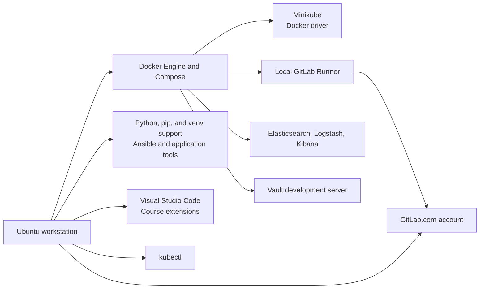

# Lab 1: Workstation Installation

## Duration

**4 hours**

This lab prepares the workstation used throughout the course. You will install command-line development tools locally, including the operating-system package required to create Python virtual environments. You will also secure a GitLab.com account and deploy the selected supporting platforms as containers. Lab 2 creates and clones the `network-devops` project, registers its runner, and creates the course Python environment.

The instructions target a dedicated Ubuntu LTS workstation. Complete the lab only on an instructor-approved system. Package names and vendor installation procedures can change; use the course versions supplied by the instructor and compare the commands with the official documentation before using them outside the lab.

## Objectives

- Install and verify Python, pip, Python `venv` support, Git, Ansible, Visual Studio Code, Docker Engine, and Docker Compose.
- Confirm that the workstation can create Python virtual environments. The course environment is created in Lab 2.
- Install and verify `kubectl` and Minikube.
- Create and secure a GitLab.com account.
- Install and start a local GitLab Runner for registration in Lab 2.
- Start an Elastic Stack laboratory environment for log collection and visualization.
- Start HashiCorp Vault in development mode for later secrets exercises.
- Demonstrate safe platform start, stop, and cleanup operations.

## Workstation architecture



## Required environment

Recommended minimum for running selected platforms concurrently:

| Resource | Minimum | Recommended |
|---|---:|---:|
| CPU | 6 logical CPUs | 8–12 logical CPUs |
| Memory | 16 GB | 24 GB or more |
| Free disk | 60 GB | 100 GB or more |
| Virtualization | Enabled | Enabled with nested virtualization if the workstation is a VM |

The Elastic Stack and Minikube are resource-intensive. Do not keep every platform running when it is not required. Never expose these lab services to an untrusted network.

Suggested local ports:

| Service | URL or port |
|---|---|
| GitLab.com | `https://gitlab.com` |
| Vault | `http://127.0.0.1:8200` |
| Elasticsearch | `http://127.0.0.1:9200` |
| Kibana | `http://127.0.0.1:5601` |
| Logstash input for later labs | `127.0.0.1:5044` |

## Part 1: Inspect and update the workstation

```bash
whoami
hostnamectl
cat /etc/os-release
uname -m
free -h
df -h /
egrep -c '(vmx|svm)' /proc/cpuinfo
sudo apt update
sudo apt upgrade -y
sudo apt install -y git curl wget jq ca-certificates gnupg lsb-release \
  openssh-client make unzip apt-transport-https
```

The virtualization check should return a value greater than zero. If it returns zero on a virtual machine, ask the instructor whether nested virtualization is enabled. The Minikube Docker driver does not require a second hypervisor, but sufficient CPU and memory are still required.

Configure Git identity:

```bash
git config --global user.name "Your Name"
git config --global user.email "your-email@example.com"
git config --global init.defaultBranch main
git --version
```

## Part 2: Install Python, pip, and virtual-environment support

```bash
sudo apt install -y python3 python3-pip python3-venv
python3 --version
python3 -m pip --version
python3 -m venv --help | head
```

The `python3-venv` package supplies the standard-library module used to create isolated Python environments. Lab 1 installs and verifies that capability but does not create the course environment. Lab 2 creates `~/network-devops/.venv` after the course repository is ready.

Install Ansible from the Ubuntu package repository so its command is available for workstation verification:

```bash
sudo apt install -y ansible
ansible --version
```

Verify that Python can load the `venv` module:

```bash
python3 -c 'import venv; print("Python venv support is available")'
```

Do not create `.venv` yet, and do not install course libraries into the system Python environment with `sudo pip`. Lab 2 creates the isolated environment and installs the project dependencies inside it.

## Part 3: Install Visual Studio Code

Install the official Visual Studio Code Snap package on the Ubuntu workstation:

```bash
sudo snap install --classic code
code --version
```

If Snap is unavailable or prohibited by the instructor, use Microsoft's current Debian/Ubuntu package procedure instead of adding an unofficial repository. The `code` command must be available in the learner's terminal before continuing.

Install the extensions used during the course:

```bash
code --install-extension ms-python.python
code --install-extension redhat.vscode-yaml
code --install-extension ms-azuretools.vscode-docker
code --install-extension ms-kubernetes-tools.vscode-kubernetes-tools
code --install-extension GitLab.gitlab-workflow
code --install-extension hashicorp.terraform
code --list-extensions --show-versions
```

Open a temporary course workspace. Lab 2 will open the cloned project directory after creating it:

```bash
mkdir -p ~/course-workspace
cd ~/course-workspace
code .
```

The project interpreter and repository do not exist until Lab 2. Open a terminal inside the editor and verify that the system Python and Git commands are available:

```bash
git --version
python3 --version
```

Extensions execute with the learner's permissions and may access workspace content. Install only the extensions listed by the instructor, review their publishers, and do not paste tokens or passwords into extension settings.

## Part 4: Install Docker Engine and Docker Compose

Remove conflicting unofficial packages if they are present, then use Docker's official Ubuntu repository:

```bash
for pkg in docker.io docker-doc docker-compose docker-compose-v2 podman-docker containerd runc; do
  sudo apt-get remove -y "$pkg" 2>/dev/null || true
done
sudo install -m 0755 -d /etc/apt/keyrings
sudo curl -fsSL https://download.docker.com/linux/ubuntu/gpg \
  -o /etc/apt/keyrings/docker.asc
sudo chmod a+r /etc/apt/keyrings/docker.asc
```

```bash
. /etc/os-release
echo "deb [arch=$(dpkg --print-architecture) signed-by=/etc/apt/keyrings/docker.asc] https://download.docker.com/linux/ubuntu ${UBUNTU_CODENAME:-$VERSION_CODENAME} stable" |
  sudo tee /etc/apt/sources.list.d/docker.list >/dev/null
sudo apt update
sudo apt install -y docker-ce docker-ce-cli containerd.io \
  docker-buildx-plugin docker-compose-plugin
sudo systemctl enable --now docker
sudo usermod -aG docker "$USER"
```

Sign out and back in so that group membership is refreshed. Then verify:

```bash
docker version
docker compose version
docker run --rm hello-world
```

Membership in the `docker` group grants control of the Docker daemon and is effectively privileged access to the workstation. Use it only on the dedicated lab host.

## Part 5: Install `kubectl`

Install the Kubernetes client from the official package repository. The repository minor version must match the instructor-approved Kubernetes release:

```bash
KUBERNETES_MINOR=v1.35
curl -fsSL "https://pkgs.k8s.io/core:/stable:/${KUBERNETES_MINOR}/deb/Release.key" |
  sudo gpg --dearmor -o /etc/apt/keyrings/kubernetes-apt-keyring.gpg
echo "deb [signed-by=/etc/apt/keyrings/kubernetes-apt-keyring.gpg] https://pkgs.k8s.io/core:/stable:/${KUBERNETES_MINOR}/deb/ /" |
  sudo tee /etc/apt/sources.list.d/kubernetes.list >/dev/null
sudo apt update
sudo apt install -y kubectl
kubectl version --client
```

If the course uses another minor release, replace `v1.35` before adding the repository. Do not assume the example remains current in a later course delivery.

## Part 6: Install and start Minikube

Download the binary that matches the workstation architecture:

```bash
case "$(uname -m)" in
  x86_64) MINIKUBE_ARCH=amd64 ;;
  aarch64|arm64) MINIKUBE_ARCH=arm64 ;;
  *) echo "Unsupported architecture"; exit 1 ;;
esac
curl -LO "https://storage.googleapis.com/minikube/releases/latest/minikube-linux-${MINIKUBE_ARCH}"
sudo install "minikube-linux-${MINIKUBE_ARCH}" /usr/local/bin/minikube
rm "minikube-linux-${MINIKUBE_ARCH}"
minikube version
```

Create the course cluster with the Docker driver:

```bash
minikube start --driver=docker --cpus=4 --memory=8192 --disk-size=30g \
  --profile network-devops
minikube profile network-devops
kubectl cluster-info
kubectl get nodes -o wide
kubectl create namespace network-devops
kubectl get namespaces
```

Lifecycle commands:

```bash
minikube stop --profile network-devops
minikube start --profile network-devops
minikube status --profile network-devops
```

`minikube delete --profile network-devops` permanently deletes the cluster. Use it only when instructed.

## Part 7: Create and secure the GitLab.com account

Open [GitLab.com](https://gitlab.com/users/sign_up) and create an individual account, or sign in with the instructor-approved account. Use an address that you can verify during the lab. Do not create a self-managed GitLab server on the workstation.

After signing in:

1. Verify the account email address.
2. Open **Edit profile > Access > Password and authentication** and enable two-factor authentication.
3. Store recovery codes in the instructor-approved password manager.
4. Review active sessions and sign out any session you do not recognize.
5. Do not create a personal access token unless a later exercise explicitly requires one.

Do not create the course project in this lab. Lab 2 begins by creating a new private project named `network-devops` and cloning it to the workstation.

## Part 8: Install the local GitLab Runner

GitLab.com hosts the repository and pipeline control plane. The learner workstation runs the Docker-based runner. Copy and start the supplied runner Compose project in a platform directory outside the future Git repository:

```bash
mkdir -p ~/course-platform
cp -R "/path/to/Lab 01 - Workstation Installation/platform/." \
  ~/course-platform/
cd ~/course-platform/gitlab-runner
cp .env.example .env
# Confirm the instructor-approved image tag before continuing.
docker compose config --quiet
docker compose pull
docker compose up -d
docker compose ps
docker exec course-gitlab-runner gitlab-runner --version
```

At this stage, `gitlab-runner --version` must work, but the runner remains unregistered. Lab 2 registers it after the learner creates the `network-devops` project. Mounting the Docker socket gives jobs broad control of the workstation, so the runner must later remain locked to the learner's private course project and must not execute untrusted project code.

## Part 9: Install the Elastic Stack laboratory services

Elastic requires Elasticsearch, Logstash, and Kibana to use the same version. Use the supplied pinned Compose file and confirm its version with the instructor; do not improvise mixed versions.

```bash
cd ~/course-platform/elastic
cp .env.example .env
# Replace STACK_VERSION with the instructor-approved version.
docker compose config --quiet
docker compose pull
docker compose up -d
```

The supplied Compose project includes Elasticsearch, Logstash, and Kibana at one version. The installation is complete only when all three services are present and healthy:

```bash
docker compose ps
curl -s http://127.0.0.1:9200 | jq
docker compose ps --services | grep -E 'elasticsearch|logstash|kibana'
```

Open `http://127.0.0.1:5601`. Do not combine a Logstash image from a different stack version. A production Elastic deployment requires TLS, authentication, durable storage, capacity planning, backup, and lifecycle policy; the quickstart is not a production design.

Stop it when verification is complete:

```bash
docker compose stop
```

## Part 10: Install HashiCorp Vault for laboratory use

Use the supplied Compose definition to start Vault in development mode bound to the workstation loopback address:

```bash
cd ~/course-platform/vault
cp .env.example .env
# Replace VAULT_VERSION with the instructor-approved version.
docker compose up -d
export VAULT_ADDR=http://127.0.0.1:8200
curl -s "$VAULT_ADDR/v1/sys/health" | jq
```

The development server is initialized, unsealed, in-memory, and deliberately insecure. Its root token grants complete access, and its data disappears when the container is removed. Never use this configuration or token outside the lab.

Stop and restart it without deleting the container:

```bash
docker stop course-vault
docker start course-vault
```

## Platform lifecycle summary

| Platform | Start | Stop without deleting data |
|---|---|---|
| GitLab.com | Browser-based service; no local lifecycle | Sign out when required |
| Runner | `docker compose up -d` in `~/course-platform/gitlab-runner` | `docker compose stop` |
| Minikube | `minikube start -p network-devops` | `minikube stop -p network-devops` |
| Elastic | `docker compose up -d` in its directory | `docker compose stop` |
| Vault | `docker compose up -d` in `platform/vault` | `docker compose stop` |

## Completion criteria

- Python, pip, and the `venv` module run successfully on the workstation.
- Learners can explain that Lab 2 creates the course virtual environment.
- Ansible reports its executable, Python, and collection paths.
- Visual Studio Code opens the temporary course workspace and contains the required extensions. Lab 2 opens the cloned project and selects its `.venv` interpreter.
- Docker Engine and Docker Compose pass their verification commands.
- `kubectl` reaches the `network-devops` Minikube profile.
- The GitLab.com account is verified and protected with two-factor authentication.
- The local runner container starts and reports its version; project registration occurs in Lab 2.
- Elasticsearch, Logstash, and Kibana start, and Elasticsearch answers its local health request.
- Vault's health endpoint responds, and the learner can explain why development mode is unsafe.

## Cleanup

For normal course continuation, stop unused local platforms but retain their containers and volumes. Do not delete application data.

```bash
docker stop course-vault course-gitlab-runner 2>/dev/null || true
minikube stop --profile network-devops
docker system df
```

Do not run broad pruning commands. They can remove images, volumes, or caches required by later labs.

## Further references

- [Python virtual environments](https://docs.python.org/3/library/venv.html)
- [Visual Studio Code on Linux](https://code.visualstudio.com/docs/setup/linux)
- [Visual Studio Code command line](https://code.visualstudio.com/docs/configure/command-line)
- [Docker Engine on Ubuntu](https://docs.docker.com/engine/install/ubuntu/)
- [Install kubectl on Linux](https://kubernetes.io/docs/tasks/tools/install-kubectl-linux/)
- [Minikube start](https://minikube.sigs.k8s.io/docs/start/)
- [Create a GitLab project](https://docs.gitlab.com/user/project/)
- [GitLab Runner in Docker](https://docs.gitlab.com/runner/install/docker/)
- [Elastic local development installation](https://www.elastic.co/docs/deploy-manage/deploy/self-managed/local-development-installation-quickstart)
- [Vault developer quickstart](https://developer.hashicorp.com/vault/docs/get-started/developer-qs)

## Key takeaways

- Small development tools run locally; larger course platforms use controlled containers and persistent volumes.
- Version capture makes the learning environment reproducible and supportable.
- Stopping a service and deleting its state are different lifecycle operations.
- GitLab Runner, Docker socket access, and Vault root tokens are privileged trust boundaries.
- Local-development configurations are suitable for learning, not production deployment.
