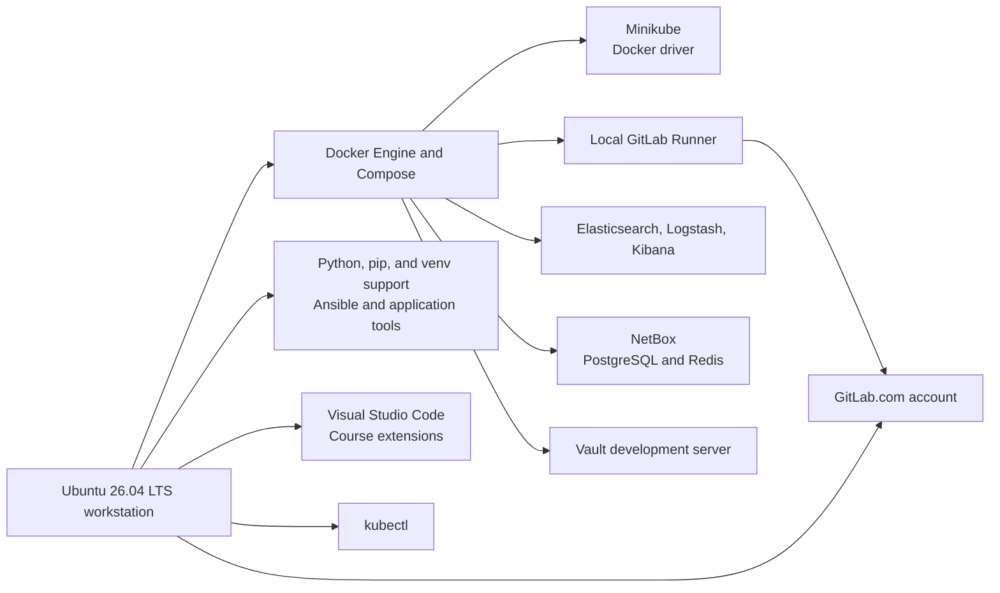

# Lab 1: Workstation Installation

## Duration

**5 hours**

This standalone lab prepares a workstation for network DevOps work. You will install command-line development tools locally, secure a GitLab.com account, and deploy selected supporting platforms as containers. You will also create a dedicated Lab 1 folder and GitLab repository. No files from another lab are required.

The instructions target a dedicated 64-bit Ubuntu 26.04 LTS workstation. Complete the lab only on an instructor-approved system. Package names and vendor installation procedures can change; use the course versions supplied by the instructor and compare the commands with the official documentation before using them outside the lab.

## Objectives

- Install and verify Python, pip, Python `venv` support, Git, Ansible, Visual Studio Code, Docker Engine, and Docker Compose.
- Create a dedicated Lab 1 folder and private GitLab repository.
- Confirm that the workstation can create Python virtual environments.
- Install and verify `kubectl` and Minikube.
- Create and secure a GitLab.com account.
- Install and start a local GitLab Runner for later registration when a CI/CD lab requires it.
- Start an Elastic Stack laboratory environment for log collection and visualization.
- Install NetBox as the source of truth used by later inventory and automation labs.
- Start HashiCorp Vault in development mode for secrets exercises.
- Demonstrate safe platform start, stop, and cleanup operations.

## Lab workspace and repository

Use a separate folder and GitLab repository for this lab:

- Folder: `~/netdevops-labs/netdevops-lab01-workstation`
- GitLab project: `netdevops-lab01-workstation`

Do not reuse, empty, or modify another lab's folder. This lab is independent and can be completed in any order once its required workstation access is available.

Create the local folder now. Part 7 creates the GitLab project after the account is ready.

```bash
mkdir -p ~/netdevops-labs/netdevops-lab01-workstation
```

## Workstation architecture



## Required environment

Recommended minimum for running selected platforms concurrently:

| Resource | Minimum | Recommended |
|---|---:|---:|
| Operating system | Ubuntu 26.04 LTS, 64-bit | Fully updated instructor image |
| CPU | 6 logical CPUs | 8–12 logical CPUs |
| Memory | 16 GB | 24 GB or more |
| Free disk | 60 GB | 100 GB or more |
| Virtualization | Enabled | Enabled with nested virtualization if the workstation is a VM |

The Elastic Stack and Minikube are resource-intensive. Do not keep every platform running when it is not required. Never expose these lab services to an untrusted network.

Suggested local ports:

| Service | URL or port |
|---|---|
| GitLab.com | `https://gitlab.com` |
| Vault | `http://127.0.0.1:8200` |
| Elasticsearch | `http://127.0.0.1:9200` |
| Kibana | `http://127.0.0.1:5601` |
| Logstash input for later labs | `127.0.0.1:5044` |
| NetBox | `http://127.0.0.1:8000` |

## Part 1: Prepare the workstation

Install the common packages required by the remaining workstation procedures.

```bash
sudo apt update
sudo apt install -y git curl wget jq ca-certificates gnupg lsb-release \
  openssh-client make unzip apt-transport-https
```

These commands update the Ubuntu package index, apply available updates, and install the common utilities required by later installation procedures.

Configure Git identity:

```bash
git config --global user.name "Your Name"
git config --global user.email "your-email@example.com"
git config --global init.defaultBranch main
git --version
```

## Part 2: Install Python, pip, and virtual-environment support

Install the Python runtime and the standard virtual-environment capability that Lab 2 will use for the course project.

```bash
sudo apt install -y python3 python3-pip python3-venv
python3 --version
python3 -m pip --version
python3 -m venv --help | head
```

The `python3-venv` package supplies the standard-library module used to create isolated Python environments. Each application lab creates its own `.venv` inside its own repository.

Install Ansible from the Ubuntu package repository so its command is available for workstation verification:

```bash
sudo apt install -y ansible
ansible --version
```

Verify that Python can load the `venv` module:

```bash
python3 -c 'import venv; print("Python venv support is available")'
```

Do not install lab libraries into the system Python environment with `sudo pip`. Create a separate `.venv` inside each lab repository when that lab requires Python dependencies.

## Part 3: Install Visual Studio Code

Install the official Visual Studio Code Snap package on the Ubuntu workstation:

```bash
sudo snap install --classic code
code --version
```

If Snap is unavailable or prohibited by the instructor, use Microsoft's current Debian/Ubuntu package procedure instead of adding an unofficial repository. The `code` command must be available in the learner's terminal before continuing.

Install the extensions used during the course:

```bash
code --install-extension ms-python.python
code --install-extension redhat.vscode-yaml
code --install-extension ms-azuretools.vscode-docker
code --install-extension ms-kubernetes-tools.vscode-kubernetes-tools
code --install-extension GitLab.gitlab-workflow
code --install-extension hashicorp.terraform
code --list-extensions --show-versions
```

Open the dedicated Lab 1 workspace:

```bash
cd ~/netdevops-labs/netdevops-lab01-workstation
code .
```

The project interpreter and repository do not exist until Lab 2. Open a terminal inside the editor and verify that the system Python and Git commands are available:

```bash
git --version
python3 --version
```

Extensions execute with the learner's permissions and may access workspace content. Install only the extensions listed by the instructor, review their publishers, and do not paste tokens or passwords into extension settings.

## Part 4: Install Docker Engine and Docker Compose

Use Docker's official Ubuntu repository:

```bash
sudo install -m 0755 -d /etc/apt/keyrings
sudo curl -fsSL https://download.docker.com/linux/ubuntu/gpg \
  -o /etc/apt/keyrings/docker.asc
sudo chmod a+r /etc/apt/keyrings/docker.asc
```

```bash
. /etc/os-release
echo "deb [arch=$(dpkg --print-architecture) signed-by=/etc/apt/keyrings/docker.asc] https://download.docker.com/linux/ubuntu ${UBUNTU_CODENAME:-$VERSION_CODENAME} stable" |
  sudo tee /etc/apt/sources.list.d/docker.list >/dev/null
sudo apt update
sudo apt install -y docker-ce docker-ce-cli containerd.io \
  docker-buildx-plugin docker-compose-plugin
sudo systemctl enable --now docker
sudo usermod -aG docker "$USER"
```

Sign out and back in so that group membership is refreshed. Then verify:

```bash
docker version
docker compose version
docker run --rm hello-world
```

Membership in the `docker` group grants control of the Docker daemon and is effectively privileged access to the workstation. Use it only on the dedicated lab host.

## Part 5: Install `kubectl`

Install the Kubernetes client from the official package repository. The repository minor version must match the instructor-approved Kubernetes release:

```bash
KUBERNETES_MINOR=v1.35
curl -fsSL "https://pkgs.k8s.io/core:/stable:/${KUBERNETES_MINOR}/deb/Release.key" |
  sudo gpg --dearmor -o /etc/apt/keyrings/kubernetes-apt-keyring.gpg
echo "deb [signed-by=/etc/apt/keyrings/kubernetes-apt-keyring.gpg] https://pkgs.k8s.io/core:/stable:/${KUBERNETES_MINOR}/deb/ /" |
  sudo tee /etc/apt/sources.list.d/kubernetes.list >/dev/null
sudo apt update
sudo apt install -y kubectl
kubectl version --client
```

If the course uses another minor release, replace `v1.35` before adding the repository. Do not assume the example remains current in a later course delivery.

## Part 6: Install and start Minikube

Download the binary that matches the workstation architecture:

```bash
case "$(uname -m)" in
  x86_64) MINIKUBE_ARCH=amd64 ;;
  aarch64|arm64) MINIKUBE_ARCH=arm64 ;;
  *) echo "Unsupported architecture"; exit 1 ;;
esac
curl -LO "https://storage.googleapis.com/minikube/releases/latest/minikube-linux-${MINIKUBE_ARCH}"
sudo install "minikube-linux-${MINIKUBE_ARCH}" /usr/local/bin/minikube
rm "minikube-linux-${MINIKUBE_ARCH}"
minikube version
```

Create the course cluster with the Docker driver:

```bash
minikube start --driver=docker --cpus=4 --memory=8192 --disk-size=30g \
  --profile network-devops
minikube profile network-devops
kubectl cluster-info
kubectl get nodes -o wide
kubectl create namespace network-devops
kubectl get namespaces
```

Lifecycle commands:

```bash
minikube stop --profile network-devops
minikube start --profile network-devops
minikube status --profile network-devops
```

`minikube delete --profile network-devops` permanently deletes the cluster. Use it only when instructed.

## Part 7: Create and secure the GitLab.com account

Open [GitLab.com](https://gitlab.com/users/sign_up) and create an individual account, or sign in with the instructor-approved account. Use an address that you can verify during the lab. Do not create a self-managed GitLab server on the workstation.

After signing in:

1. Verify the account email address.
2. Open **Edit profile > Access > Password and authentication** and enable two-factor authentication.
3. Store recovery codes in the instructor-approved password manager.
4. Review active sessions and sign out any session you do not recognize.
5. Do not create a personal access token unless a later exercise explicitly requires one.

Create a blank private project named `netdevops-lab01-workstation` without initializing it with a README. Connect the dedicated Lab 1 folder to the new project:

```bash
cd ~/netdevops-labs/netdevops-lab01-workstation
git init -b main
git remote add origin https://gitlab.com/YOUR-GITLAB-NAMESPACE/netdevops-lab01-workstation.git
git commit --allow-empty -m "Initialize Lab 1 workspace"
git push -u origin main
git status
```

Do not place files from any other lab in this repository.

## Part 8: Install the local GitLab Runner

GitLab.com hosts the repository and pipeline control plane. The learner workstation runs the Docker-based runner. Copy and start the supplied runner Compose project in a platform directory outside the future Git repository:

```bash
mkdir -p ~/course-platform
cp -R "/path/to/Lab 01 - Workstation Installation/platform/." \
  ~/course-platform/
cd ~/course-platform/gitlab-runner
cp .env.example .env
grep '^GITLAB_RUNNER_IMAGE=' .env
docker compose config --quiet
docker compose pull
docker compose up -d
docker compose ps
docker exec course-gitlab-runner gitlab-runner --version
```

At this stage, `gitlab-runner --version` must work, but the runner remains unregistered. Lab 5 registers it when the learner begins working with CI/CD. Mounting the Docker socket gives jobs broad control of the workstation, so the runner must later remain locked to the learner's private course project and must not execute untrusted project code.

## Part 9: Install the Elastic Stack laboratory services

Elastic requires Elasticsearch, Logstash, and Kibana to use the same version. Use the supplied pinned Compose file and confirm its version with the instructor; do not improvise mixed versions.

Elasticsearch requires at least **10 GB of free space** on the filesystem that stores Docker data. Check the available space before pulling or starting the Elastic images:

```bash
df -h /var/lib/docker
```

The `Avail` column must show `10G` or more. Stop here and free or expand disk space if less than 10 GB is available. Elasticsearch blocks primary-shard allocation when the filesystem exceeds its disk watermark, leaving the cluster in `red` status.

```bash
cd ~/course-platform/elastic
cp .env.example .env
grep '^STACK_VERSION=' .env
docker compose config --quiet
docker compose pull
docker compose up -d
```

The supplied Compose project includes Elasticsearch, Logstash, and Kibana at one version. The installation is complete only when all three services are present and healthy:

```bash
docker compose ps
curl -s http://127.0.0.1:9200 | jq
curl -s http://127.0.0.1:9200/_cluster/health | jq
docker compose ps --services | grep -E 'elasticsearch|logstash|kibana'
```

The cluster status must be `yellow` or `green`. Do not continue while it is `red`.

Open `http://127.0.0.1:5601`. Do not combine a Logstash image from a different stack version. A production Elastic deployment requires TLS, authentication, durable storage, capacity planning, backup, and lifecycle policy; the quickstart is not a production design.

Stop it when verification is complete:

```bash
docker compose stop
```

## Part 10: Install NetBox for laboratory use

NetBox provides the inventory source of truth used by the later labs. Install the community-maintained NetBox Docker project in `~/course-platform`, outside every learner lab repository. The upstream project supplies compatible NetBox, PostgreSQL, Redis, and worker services in one Compose project.

Clone the supported release branch and record the exact commit used for this course run:

```bash
cd ~/course-platform
test ! -e netbox || { echo "~/course-platform/netbox already exists"; exit 1; }
git clone --depth 1 --branch release \
  https://github.com/netbox-community/netbox-docker.git netbox
cd netbox
git rev-parse HEAD | tee NETBOX_DOCKER_COMMIT
cp docker-compose.override.yml.example docker-compose.override.yml
sed -i 's/- "8000:8080"/- "127.0.0.1:8000:8080"/' \
  docker-compose.override.yml
grep '127.0.0.1:8000:8080' docker-compose.override.yml
```

Do not continue unless the final command shows the loopback-only port mapping. If the instructor supplies a particular NetBox Docker release or commit, check out that exact revision before pulling images. The NetBox container image and the checked-out NetBox Docker files must remain compatible; do not update one independently of the other.

Validate, pull, and start the platform:

```bash
docker compose config --quiet
docker compose pull
docker compose up -d
docker compose ps
```

Initial database migrations and static-file preparation can take several minutes. Follow startup progress without displaying secrets:

```bash
docker compose logs --tail=100 netbox
until curl -fsS http://127.0.0.1:8000/api/status/ >/dev/null; do
  echo "Waiting for NetBox..."
  sleep 10
done
curl -fsS http://127.0.0.1:8000/api/status/ | jq
```

Create the first administrator interactively:

```bash
docker compose exec netbox \
  /opt/netbox/netbox/manage.py createsuperuser
```

Choose a unique administrator username, enter the learner's email address, and use a unique password stored in the instructor-approved password manager. Do not place the password in the Compose override, shell history, Git, screenshots, or lab notes.

Open `http://127.0.0.1:8000`, sign in, and confirm that the NetBox home page loads. Later labs will use this instance for devices, management addresses, loopback interfaces, API tokens, event rules, and webhooks. Do not create shared or production device records unless the instructor authorizes them.

Stop and restart NetBox without deleting its PostgreSQL data:

```bash
cd ~/course-platform/netbox
docker compose stop
docker compose up -d
```

Do not run `docker compose down --volumes`; deleting these volumes removes the NetBox database, administrator account, inventory, tokens, and automation objects.

This procedure follows the official [NetBox Docker quickstart](https://github.com/netbox-community/netbox-docker). It is suitable for the isolated course workstation, not a production deployment. A production service requires TLS, backups, restricted access, external secret management, monitoring, and an approved upgrade process.

## Part 11: Install HashiCorp Vault for laboratory use

Use the supplied Compose definition to start Vault in development mode bound to the workstation loopback address:

```bash
cd ~/course-platform/vault
cp .env.example .env
grep '^VAULT_VERSION=' .env
docker compose up -d
export VAULT_ADDR=http://127.0.0.1:8200
curl -s "$VAULT_ADDR/v1/sys/health" | jq
```

The development server is initialized, unsealed, in-memory, and deliberately insecure. Its root token grants complete access, and its data disappears when the container is removed. Never use this configuration or token outside the lab.

Stop and restart it without deleting the container:

```bash
docker stop course-vault
docker start course-vault
```

## Part 12: Run the workstation verification

Copy and run the supplied verification program after all command-line tools have been installed:

```bash
cp "/path/to/Lab 01 - Workstation Installation/verify_workstation.py" \
  ~/course-platform/verify_workstation.py
python3 ~/course-platform/verify_workstation.py
```

Every entry should report `PASS`. This check confirms that the required commands are available; the service checks completed in the preceding parts confirm that the local platforms can also start and respond.

## Platform lifecycle summary

| Platform | Start | Stop without deleting data |
|---|---|---|
| GitLab.com | Browser-based service; no local lifecycle | Sign out when required |
| Runner | `docker compose up -d` in `~/course-platform/gitlab-runner` | `docker compose stop` |
| Minikube | `minikube start -p network-devops` | `minikube stop -p network-devops` |
| Elastic | `docker compose up -d` in its directory | `docker compose stop` |
| NetBox | `docker compose up -d` in `~/course-platform/netbox` | `docker compose stop` |
| Vault | `docker compose up -d` in `platform/vault` | `docker compose stop` |

## Completion criteria

- Python, pip, and the `venv` module run successfully on the workstation.
- Python virtual environments can be created inside individual lab repositories.
- Ansible reports its executable, Python, and collection paths.
- Visual Studio Code opens the Lab 1 workspace and contains the required extensions.
- Docker Engine and Docker Compose pass their verification commands.
- `kubectl` reaches the `network-devops` Minikube profile.
- The GitLab.com account is verified and protected with two-factor authentication.
- The local runner container starts and reports its version.
- Elasticsearch, Logstash, and Kibana start, and Elasticsearch answers its local health request.
- NetBox and its supporting services start, its status API responds, and the learner can sign in with the administrator account.
- Vault's health endpoint responds.

## Cleanup

For normal course continuation, stop unused local platforms but retain their containers and volumes. Do not delete application data.

```bash
docker stop course-vault course-gitlab-runner 2>/dev/null || true
(cd ~/course-platform/netbox && docker compose stop)
minikube stop --profile network-devops
docker system df
```

Do not run broad pruning commands because they can delete unrelated local data.
