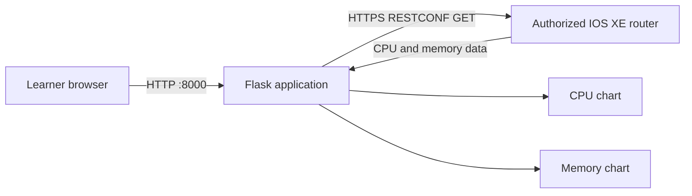

# Lab 2: Package the Network Monitoring Application with Docker

## Duration

**4 hours**

The instructor provides a working Flask application that connects to an authorized Cisco IOS XE router through RESTCONF, retrieves processor and memory observations, and displays them as two time-series charts. You will first prove that the supplied application works in its Python virtual environment. You will then define its runtime in a Dockerfile, build an image, run a container, inspect the resulting runtime, and exercise the Docker lifecycle.

This is the first implementation stage of the cumulative application. Do not redesign the RESTCONF adapter or add new application features during this lab. The engineering question is whether the same tested application can be packaged and executed consistently.

## Objectives

- Verify the supplied Flask application before packaging it.
- Confirm the RESTCONF read paths and returned data on an authorized router.
- Explain the Docker build context and `.dockerignore` boundary.
- Create a Dockerfile for the supplied application.
- Build and identify the application image.
- Run the application with external configuration and credentials.
- Verify container health and application behavior.
- Inspect image, container, process, network, mount, resource, and log information.
- Exercise create, start, stop, restart, remove, rebuild, and cleanup operations safely.

## Application flow



The application performs read-only operations. IOS XE software versions can expose different YANG models, revisions, and response shapes. The supplied adapter centralizes the resource paths and parsing rules. Confirm those values against the assigned router rather than inventing a path or disabling validation.

## Required environment

- The workstation prepared in Lab 1.
- Docker Engine and the Compose plugin running.
- The course Python virtual environment.
- The instructor-provided `network-monitor` starter application.
- An instructor-provided IOS XE router or authorized sandbox with RESTCONF enabled.
- Management reachability to the router.
- The router's trusted CA certificate when required.

Never use a production router unless the instructor has explicitly authorized it. Do not commit credentials, `.env` files, router certificates containing private keys, or captured operational data.

## Supplied project structure

```text
network-devops/
├── app/
│   ├── app.py
│   ├── config.py
│   ├── restconf_client.py
│   ├── metrics_service.py
│   ├── templates/
│   │   └── dashboard.html
│   └── static/
│       ├── app.js
│       └── style.css
├── tests/
├── certificates/
│   └── .gitkeep
├── requirements.txt
├── .env.example
├── .gitignore
└── README.md
```

File names may differ slightly in the instructor bundle. Locate the Flask entry point, configuration loader, RESTCONF adapter, templates, static files, dependency declaration, and tests before proceeding.

## Part 1: Prepare a feature branch

Use the repository created in Lab 1:

```bash
cd ~/network-devops
git status
git pull --ff-only
git switch -c feature/lab02-container-package
source .venv/bin/activate
python -m pip install -r requirements.txt
python -m pip check
```

Copy `.env.example` to `.env`, restrict it, and insert only the credentials and endpoint supplied for the lab:

```bash
cp .env.example .env
chmod 600 .env
```

Expected variables are similar to:

```text
ROUTER_HOST=<assigned-management-address>
ROUTER_PORT=443
ROUTER_USERNAME=<assigned-username>
ROUTER_PASSWORD=<assigned-password>
RESTCONF_VERIFY=true
RESTCONF_CA_BUNDLE=/absolute/path/to/router-ca.pem
FLASK_SECRET_KEY=<generated-local-value>
```

Keep TLS verification enabled. If the router uses a private CA, point the application at the correct CA certificate. Do not use `verify=False` to conceal a certificate or hostname problem.

Confirm that `.env` is ignored:

```bash
git check-ignore -v .env
```

## Part 2: Test the supplied application before containerizing it

Run the automated tests:

```bash
python -m pytest -v
```

Start the application using the documented entry point. One common pattern is:

```bash
flask --app app.app run --host 127.0.0.1 --port 8000
```

Use the command in the supplied README if it differs. Open `http://127.0.0.1:8000` and verify:

1. The dashboard loads without a browser error.
2. The application identifies the assigned router.
3. The CPU chart receives samples.
4. The memory chart receives samples.
5. A refresh produces later timestamps rather than duplicate hard-coded data.
6. No password, token, or authorization header appears in the page, browser console, or Flask log.

Use the browser developer tools to inspect the chart-data request. Record its URL, HTTP status, returned content type, sample timestamp, and top-level JSON keys. Do not record live credentials or complete device output.

Stop Flask with `Ctrl+C`.

### Failure checkpoint

Do not begin the Docker build if the native application fails. Containerization does not repair an incorrect RESTCONF path, unavailable router, invalid credential, certificate failure, or application defect.

Classify the failure:

| Symptom | Likely boundary to inspect |
|---|---|
| DNS or connection timeout | Routing, VPN, firewall, address, or port |
| TLS verification failure | Certificate trust, hostname, validity, or CA bundle |
| `401` or `403` | Authentication or authorization |
| `404` | RESTCONF resource path or model availability |
| `406` or `415` | `Accept` or `Content-Type` header |
| Parser error | Returned model revision or response shape |
| Empty chart | Collection, normalization, chart API, or browser JavaScript |

## Part 3: Define the Docker build boundary

Create `.dockerignore` in the repository root:

```text
.git
.gitignore
.env
.venv
__pycache__/
*.py[cod]
.pytest_cache/
tests/
evidence/
certificates/*
!certificates/.gitkeep
```

The build context is everything Docker can send to the builder. `.dockerignore` reduces accidental disclosure, build size, and cache invalidation. It is not a substitute for keeping secrets outside the project directory.

Inspect the candidate context:

```bash
git status --short
find . -maxdepth 3 -type f | sort
```

Confirm that source, templates, static content, and `requirements.txt` are available, while `.env`, the virtual environment, Git history, test caches, and certificates are excluded.

## Part 4: Create the Dockerfile

Create `Dockerfile` in the repository root:

```dockerfile
FROM python:3.12-slim

ENV PYTHONDONTWRITEBYTECODE=1 \
    PYTHONUNBUFFERED=1

WORKDIR /app

RUN groupadd --system app && useradd --system --gid app app

COPY requirements.txt ./
RUN python -m pip install --no-cache-dir --upgrade pip \
    && python -m pip install --no-cache-dir -r requirements.txt

COPY --chown=app:app app/ ./app/

USER app
EXPOSE 8000

HEALTHCHECK --interval=15s --timeout=3s --start-period=20s --retries=3 \
  CMD python -c "import urllib.request; urllib.request.urlopen('http://127.0.0.1:8000/health', timeout=2)" || exit 1

CMD ["gunicorn", "--bind", "0.0.0.0:8000", "--workers", "1", "--threads", "4", "app.app:app"]
```

If `gunicorn` is not already pinned in `requirements.txt`, add an instructor-approved version and rerun the native tests. The `/health` path must match the supplied application. A liveness endpoint should prove that the process can serve a request without requiring the router to be reachable; otherwise a router outage could restart a healthy application repeatedly.

Explain the file before building:

| Instruction | Responsibility |
|---|---|
| `FROM` | Selects the controlled base runtime |
| `ENV` | Sets stable non-secret Python behavior |
| `WORKDIR` | Defines the application directory |
| first `COPY` and `RUN` | Installs declared dependencies in a cacheable layer |
| second `COPY` | Adds application source without local secrets |
| `USER` | Drops root privileges for normal execution |
| `HEALTHCHECK` | Defines process-level health evidence |
| `CMD` | Defines the default production process |

## Part 5: Build and identify the image

```bash
docker build --pull -t network-monitor:lab02 .
docker image ls network-monitor
docker image inspect network-monitor:lab02 \
  --format 'ID={{.Id}} Architecture={{.Architecture}} Size={{.Size}} User={{.Config.User}}'
docker history --no-trunc network-monitor:lab02
```

The first build retrieves a base image and installs dependencies. A later source-only change should reuse the dependency layer. Review `docker history` for unexpected commands or values. Secret values must not appear in any layer.

Record the immutable local image identifier:

```bash
docker image inspect network-monitor:lab02 --format '{{.Id}}' \
  | tee evidence/lab02-image-id.txt
```

An image ID identifies local image content. A registry digest becomes the portable promotion identity after the image is pushed in a later lab.

## Part 6: Run the container

The container requires runtime configuration, a published local port, and a route to the assigned router. Start with Docker's default bridge network:

```bash
docker run -d \
  --name network-monitor \
  --env-file .env \
  --read-only \
  --tmpfs /tmp:rw,noexec,nosuid,size=64m \
  --cap-drop ALL \
  --security-opt no-new-privileges:true \
  -p 127.0.0.1:8000:8000 \
  network-monitor:lab02
```

Check status and logs:

```bash
docker ps --filter name=network-monitor
docker logs --tail=50 network-monitor
docker inspect network-monitor --format '{{json .State.Health}}' | jq
curl -fsS http://127.0.0.1:8000/health | jq
```

Open the dashboard and verify both charts again. If the host can reach the router through a VPN but the bridged container cannot, inspect the route and DNS behavior with the instructor. Use host networking only when the lab platform requires it and only on Linux:

```bash
docker rm -f network-monitor
docker run -d --name network-monitor --network host --env-file .env \
  --read-only --tmpfs /tmp:rw,noexec,nosuid,size=64m \
  --cap-drop ALL --security-opt no-new-privileges:true \
  network-monitor:lab02
```

With host networking, Docker does not publish the port; the application binds directly in the host network namespace. Record which network mode was required and why.

## Part 7: Inspect and explain the running container

Run each command and explain what its output proves:

```bash
docker container inspect network-monitor | jq '.[0] | {
  image: .Image,
  state: .State,
  user: .Config.User,
  env_names: [.Config.Env[] | split("=")[0]],
  network_mode: .HostConfig.NetworkMode,
  port_bindings: .HostConfig.PortBindings,
  readonly_rootfs: .HostConfig.ReadonlyRootfs,
  cap_drop: .HostConfig.CapDrop,
  mounts: .Mounts
}'
docker top network-monitor
docker stats --no-stream network-monitor
docker port network-monitor
docker diff network-monitor
docker logs --timestamps --tail=20 network-monitor
```

Interpretation guide:

- `.Image` links the container to the exact image used at creation.
- `.State.Status` reports lifecycle state; `.State.Health` reports the Docker health-check result.
- `.Config.User` should identify the non-root application account.
- The environment-name list can confirm variable names without printing their secret values.
- Network mode and port bindings explain how the browser and router traffic leave the container.
- `ReadonlyRootfs`, dropped capabilities, and `no-new-privileges` limit runtime authority.
- `docker top` shows the container processes from the host view.
- `docker stats` reports current resource consumption, not application correctness.
- `docker diff` reports changes to the container writable layer.
- Logs provide application evidence but must not contain credentials.

Do not run `docker inspect` and share the unfiltered output: environment values can include secrets.

## Part 8: Exercise the Docker lifecycle

### Stop and start the same container

```bash
docker stop network-monitor
docker ps -a --filter name=network-monitor
docker start network-monitor
docker ps --filter name=network-monitor
```

The container retains its writable layer and configuration while stopped.

### Restart the process boundary

```bash
docker restart network-monitor
docker logs --since=2m network-monitor
```

### Remove and recreate the container

```bash
docker rm -f network-monitor
docker run -d --name network-monitor --env-file .env \
  --read-only --tmpfs /tmp:rw,noexec,nosuid,size=64m \
  --cap-drop ALL --security-opt no-new-privileges:true \
  -p 127.0.0.1:8000:8000 network-monitor:lab02
```

A new container starts from the same image and has a new container identity. The image remains unchanged.

### Rebuild after a controlled source change

Change only the dashboard subtitle, rerun the native tests, and build a new tag:

```bash
python -m pytest -v
docker build -t network-monitor:lab02.1 .
docker image inspect network-monitor:lab02 network-monitor:lab02.1 \
  --format '{{.RepoTags}} {{.Id}}'
```

Replace the running container with the new image only after tests pass:

```bash
docker rm -f network-monitor
docker run -d --name network-monitor --env-file .env \
  --read-only --tmpfs /tmp:rw,noexec,nosuid,size=64m \
  --cap-drop ALL --security-opt no-new-privileges:true \
  -p 127.0.0.1:8000:8000 network-monitor:lab02.1
```

Verify health and both charts. Docker does not modify an existing container when a new image is built; replacement is an explicit lifecycle action.

## Part 9: Preserve evidence and commit the work

```bash
mkdir -p evidence
docker image inspect network-monitor:lab02.1 \
  --format 'Image={{.Id}} Created={{.Created}} User={{.Config.User}}' \
  > evidence/lab02-final-image.txt
docker inspect network-monitor \
  --format 'Container={{.Id}} Image={{.Image}} Status={{.State.Status}} Health={{.State.Health.Status}}' \
  > evidence/lab02-runtime.txt
git status --ignored
git diff
git add Dockerfile .dockerignore requirements.txt app tests evidence
git diff --staged
git commit -m "Package network monitoring application"
git push -u origin feature/lab02-container-package
```

Before committing, inspect every evidence file for addresses, credentials, tokens, certificates, and sensitive router data.

## Completion criteria

- The supplied Flask application passes tests and displays live CPU and memory data before packaging.
- The Docker build context excludes secrets and workstation-only files.
- The Dockerfile installs pinned dependencies and runs as a non-root user.
- `network-monitor:lab02.1` builds successfully.
- The container becomes healthy and both charts display router observations.
- The learner can explain image, container, writable layer, published port, network mode, health state, logs, and resource output.
- Stop, start, restart, remove, recreate, rebuild, and replacement operations have been demonstrated.
- No secret appears in Git, image history, evidence, or application logs.

## Cleanup

Retain the final image for Lab 3, but remove the disposable container:

```bash
docker rm -f network-monitor
docker image ls network-monitor
git status
```

Do not delete the image or repository. Lab 3 evolves the same application into a three-tier service.

## Key takeaways

- Test the application before packaging it so that application failures are not confused with container failures.
- A Dockerfile defines a reproducible runtime boundary; it does not provide router authorization or prove the network outcome.
- Images are immutable templates, while containers are replaceable runtime instances.
- Configuration and credentials enter at runtime and remain outside image layers.
- Health, process state, logs, and resource usage provide different kinds of evidence.
