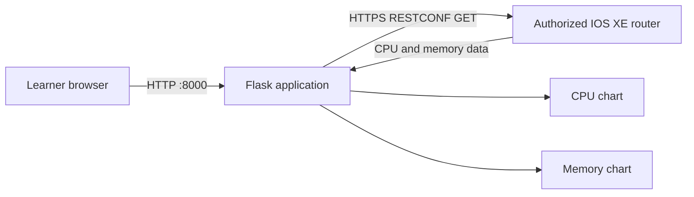

# Lab 2: Package the Network Monitoring Application with Docker

## Duration

**4 hours**

The instructor provides a working Flask application that connects to an authorized Cisco IOS XE router through RESTCONF, retrieves processor and memory observations, and displays them as two time-series charts. The supporting files, including the Dockerfile and `.dockerignore`, are already supplied. You will create the Python virtual environment used throughout the course, verify the application, build the image, run the container, and exercise the Docker lifecycle.

This is the first implementation stage of the cumulative application. Do not redesign the RESTCONF adapter or add new application features during this lab. The engineering question is whether the same tested application can be packaged and executed consistently.

## Objectives

- Create, activate, and verify the course-wide Python virtual environment.
- Create the private `network-devops` project on GitLab.com and clone it to the workstation.
- Register the workstation runner with the new project.
- Verify the supplied Flask application before packaging it.
- Confirm the RESTCONF read paths and returned data on an authorized router.
- Build and identify the application image.
- Run the application with external configuration and credentials.
- Verify that the container can resolve names and reach the assigned router through Docker networking.
- Verify container health and application behavior.
- Inspect image, container, process, network, mount, resource, and log information.
- Exercise create, start, stop, restart, remove, rebuild, and cleanup operations safely.

## Application flow



The application performs read-only operations. IOS XE software versions can expose different YANG models, revisions, and response shapes. The supplied adapter centralizes the resource paths and parsing rules. Confirm those values against the assigned router rather than inventing a path or disabling validation.

## Required environment

- The workstation prepared in Lab 1.
- Docker Engine and the Compose plugin running.
- Python, pip, and `venv` support installed in Lab 1.
- The instructor-provided `network-monitor` starter application.
- An instructor-provided IOS XE router or authorized sandbox with RESTCONF enabled.
- Management reachability to the router.

Never use a production router unless the instructor has explicitly authorized it. Do not commit credentials, `.env` files, or captured operational data.

## Supplied project structure

```text
network-devops/
├── app/
│   ├── app.py
│   ├── config.py
│   ├── restconf_client.py
│   ├── metrics_service.py
│   ├── templates/
│   │   └── dashboard.html
│   └── static/
│       ├── app.js
│       └── style.css
├── tests/
├── requirements.txt
├── .env.example
├── .gitignore
└── README.md
```

File names may differ slightly in the instructor bundle. Locate the Flask entry point, configuration loader, RESTCONF adapter, templates, static files, dependency declaration, and tests before proceeding.

## Part 1: Create and clone the course project

Sign in to the GitLab.com account prepared in Lab 1. Create a new project using the current GitLab interface:

1. Select **Create new > New project/repository**.
2. Select **Create blank project**.
3. Enter `network-devops` as both the project name and project slug.
4. Select **Private** unless the instructor specifies another visibility level.
5. Select **Initialize repository with a README**.
6. Select **Create project**.

Copy the HTTPS clone URL displayed by GitLab, then clone the new project:

```bash
cd ~
git clone https://gitlab.com/YOUR-GITLAB-NAMESPACE/network-devops.git
cd network-devops
git remote -v
git status
git pull --ff-only
git switch -c feature/lab02-container-package
```

Authenticate through the approved browser or credential-manager flow. Never place an account password or access token in the clone URL or shell history.

Copy the instructor-provided starter application into the cloned repository. Preserve the `.git` directory and do not copy any supplied credentials:

```bash
cp -R "/path/to/Lab 02 - Package the Network Monitoring Application/." \
  ~/network-devops/
cd ~/network-devops
git status
```

Confirm that the expected `app`, `tests`, `requirements.txt`, and example environment files are present before continuing.

## Part 2: Create the course Python virtual environment

Create the environment at the root of the cloned project:

```bash
cd ~/network-devops
python3 -m venv .venv
source .venv/bin/activate
python -m pip install --upgrade pip
python -m pip install -r requirements.txt
python -m pip check
which python
python --version
```

The course pins Flask `3.0.3`, a Python 3.12-compatible release that is available from older approved package mirrors as well as public PyPI. Do not replace the supplied version with a newer release unless the instructor has validated that release against the course mirror and application.

The path printed by `which python` must end in `network-devops/.venv/bin/python`. This is the single learner-managed Python environment for the remainder of the course. Later labs activate the same environment instead of creating separate environments in individual lab directories.

Confirm that Git excludes the environment:

```bash
git check-ignore -v .venv
```

If Git does not report an ignore rule, add `.venv/` to the project `.gitignore` before continuing. Never commit the environment directory. It contains platform-specific executables and installed dependencies that must be reproduced from dependency declarations instead.

In Visual Studio Code, open the command palette, select **Python: Select Interpreter**, and choose `~/network-devops/.venv/bin/python`. New integrated terminals should activate the environment automatically. If activation does not occur, run:

```bash
cd ~/network-devops
source .venv/bin/activate
```

At the start of every later lab, activate this environment and confirm the interpreter before running Python, Ansible, or test commands:

```bash
source ~/network-devops/.venv/bin/activate
which python
python -m pip check
```

Use `deactivate` only when you intentionally want to leave the course environment.

## Part 3: Register the project runner

In the new GitLab.com `network-devops` project:

1. Open **Settings > CI/CD** and expand **Runners**.
2. Select **Create project runner**.
3. Select Linux and add the tags `docker,validation`.
4. Allow untagged jobs only when directed by the instructor.
5. Create the runner and copy its authentication token beginning with `glrt-`.

Register the runner container installed in Lab 1:

```bash
docker start course-gitlab-runner
docker exec -it course-gitlab-runner gitlab-runner register
```

Use these values when prompted:

- GitLab URL: `https://gitlab.com`
- Token: the project runner authentication token
- Description: `course-docker-runner`
- Executor: `docker`
- Default image: `python:3.12-slim`

Verify registration and confirm that GitLab.com reports the runner as online:

```bash
docker exec course-gitlab-runner gitlab-runner list
docker exec course-gitlab-runner gitlab-runner verify
```

Do not store the runner token in the project or a screenshot.

## Part 4: Prepare the application configuration

The supplied application reads its router endpoint and credentials from environment variables. Prepare the local runtime file before starting the application. The native Python process and the container both use this file, but it must never be added to the repository.

Copy `.env.example` to `.env`, restrict it, and insert only the credentials and endpoint supplied for the lab:

```bash
cp .env.example .env
chmod 600 .env
```

Expected variables are similar to:

```text
ROUTER_HOST=<assigned-management-address>
ROUTER_PORT=443
ROUTER_USERNAME=<assigned-username>
ROUTER_PASSWORD=<assigned-password>
RESTCONF_VERIFY=false
MOCK_MODE=false
FLASK_SECRET_KEY=<generated-local-value>
```

Replace every value enclosed in angle brackets. `ROUTER_HOST` must contain the assigned router's resolvable hostname or management IP address, and `MOCK_MODE` must remain `false` when collecting live data. RESTCONF certificate verification remains disabled throughout this course because the instructor-provided lab routers use laboratory certificates.

### Understand `MOCK_MODE`

`MOCK_MODE` selects the source of the CPU and memory values displayed by the application:

| Setting | Application behavior | Intended use |
|---|---|---|
| `MOCK_MODE=true` | Generates changing demonstration values locally and does not send RESTCONF requests to the router | Brief user-interface checks when the assigned router is unavailable |
| `MOCK_MODE=false` | Connects to `ROUTER_HOST` and retrieves current CPU and memory information through RESTCONF | Required setting for the Lab 2 verification and container build |

When mock mode is enabled, the dashboard displays **demonstration data** beside the target name. These values do not prove router reachability, authentication, RESTCONF operation, or correct response parsing.

Learners may briefly observe mock mode before testing the live workflow:

```bash
sed -i 's/^MOCK_MODE=.*/MOCK_MODE=true/' .env
flask --app app.app run --host 127.0.0.1 --port 8000
```

Open the dashboard and confirm that **demonstration data** appears. Stop Flask with `Ctrl+C`, restore live mode, and verify the setting:

```bash
sed -i 's/^MOCK_MODE=.*/MOCK_MODE=false/' .env
grep '^MOCK_MODE=' .env
```

The expected output is `MOCK_MODE=false`. Configuration is read when the application process starts, so restart Flask or recreate the container after changing this value. Do not continue to the live application verification or Docker build while mock mode is enabled.

Confirm that `.env` is ignored:

```bash
git check-ignore -v .env
```

Confirm the effective non-secret settings before starting Flask:

```bash
python - <<'PY'
from app.config import Settings

settings = Settings()
print(f"Router: {settings.router_host}:{settings.router_port}")
print(f"Mock mode: {settings.mock_mode}")
print(f"RESTCONF certificate verification: {settings.verify_tls}")
PY
```

The router value must match the instructor-assigned target and mock mode must be `False`. This check deliberately does not print the username or password.

## Part 5: Verify the supplied application before containerizing it

Start the application using the documented entry point. One common pattern is:

```bash
flask --app app.app run --host 127.0.0.1 --port 8000
```

Use the command in the supplied README if it differs. Open `http://127.0.0.1:8000` and verify:

1. The dashboard loads without a browser error.
2. The application identifies the assigned router.
3. The CPU chart receives samples.
4. The memory chart receives samples.
5. A refresh produces later timestamps rather than duplicate hard-coded data.
6. No password, token, or authorization header appears in the page, browser console, or Flask log.

Use the browser developer tools to inspect the chart-data request. Identify its URL, HTTP status, returned content type, sample timestamp, and top-level JSON keys. Do not expose live credentials or complete device output.

Stop Flask with `Ctrl+C`.

### Failure checkpoint

Do not begin the Docker build if the native application fails. Containerization does not repair an incorrect RESTCONF path, unavailable router, invalid credential, or application defect.

Classify the failure:

| Symptom | Likely boundary to inspect |
|---|---|
| DNS or connection timeout | Routing, VPN, firewall, address, or port |
| `401` or `403` | Authentication or authorization |
| `404` | RESTCONF resource path or model availability |
| `406` or `415` | `Accept` or `Content-Type` header |
| Parser error | Returned model revision or response shape |
| Empty chart | Collection, normalization, chart API, or browser JavaScript |

## Part 6: Build and identify the image

Build the supplied application definition and inspect the resulting immutable image identity.

```bash
docker build --pull -t network-monitor:lab02 .
docker image ls network-monitor
docker image inspect network-monitor:lab02 \
  --format 'ID={{.Id}} Architecture={{.Architecture}} Size={{.Size}} User={{.Config.User}}'
docker history --no-trunc network-monitor:lab02
```

The first build retrieves a base image and installs dependencies. A later source-only change should reuse the dependency layer. Review `docker history` for unexpected commands or values. Secret values must not appear in any layer.

Record the immutable local image identifier:

```bash
docker image inspect network-monitor:lab02 --format '{{.Id}}'
```

An image ID identifies local image content. A registry digest becomes the portable promotion identity after the image is pushed in a later lab.

## Part 7: Run the container

The container requires runtime configuration, a published local port, and outbound access to the assigned router. Start with Docker's default bridge network. Add only the `NET_RAW` capability required by the supplied `ping` utility; all other Linux capabilities remain dropped:

```bash
docker run -d \
  --name network-monitor \
  --env-file .env \
  --read-only \
  --tmpfs /tmp:rw,noexec,nosuid,size=64m \
  --cap-drop ALL \
  --cap-add NET_RAW \
  --security-opt no-new-privileges:true \
  -p 127.0.0.1:8000:8000 \
  network-monitor:lab02
```

Check status and logs:

```bash
docker ps --filter name=network-monitor
docker logs --tail=50 network-monitor
docker inspect network-monitor --format '{{json .State.Health}}' | jq
curl -fsS http://127.0.0.1:8000/health | jq
```

Verify the container's outbound network path. The first command confirms name resolution when `ROUTER_HOST` is a hostname. The second sends ICMP packets to the configured target:

```bash
docker exec network-monitor python -c \
  'import os, socket; host=os.environ["ROUTER_HOST"]; print(host, "->", socket.gethostbyname(host))'
docker exec network-monitor sh -c 'ping -c 3 "$ROUTER_HOST"'
```

Some networks intentionally block ICMP. In that case, a failed ping does not by itself prove that container networking is broken. Request application metrics to verify the actual HTTPS RESTCONF path:

```bash
curl -fsS http://127.0.0.1:8000/api/metrics | jq
```

The response must contain the assigned router name or address, a timestamp, `cpu_percent`, and `memory_percent`. Docker's bridge network provides outbound routing through the workstation; no container port needs to be published for this outbound RESTCONF connection.

Open the dashboard and verify both charts again. Confirm that the header shows the assigned router and does not contain **demonstration data**. If it does, set `MOCK_MODE=false` in `.env`, remove the container, and repeat the `docker run` command so the new process receives the corrected value.

If the host can reach the router through a VPN but the bridged container cannot, inspect the route and DNS behavior with the instructor. Use host networking only when the lab platform requires it and only on Linux:

```bash
docker rm -f network-monitor
docker run -d --name network-monitor --network host --env-file .env \
  --read-only --tmpfs /tmp:rw,noexec,nosuid,size=64m \
  --cap-drop ALL --cap-add NET_RAW --security-opt no-new-privileges:true \
  network-monitor:lab02
```

With host networking, Docker does not publish the port; the application binds directly in the host network namespace. Explain which network mode was required and why.

## Part 8: Inspect and explain the running container

Run each command and explain what its output proves:

```bash
docker container inspect network-monitor | jq '.[0] | {
  image: .Image,
  state: .State,
  user: .Config.User,
  env_names: [.Config.Env[] | split("=")[0]],
  network_mode: .HostConfig.NetworkMode,
  port_bindings: .HostConfig.PortBindings,
  readonly_rootfs: .HostConfig.ReadonlyRootfs,
  cap_drop: .HostConfig.CapDrop,
  mounts: .Mounts
}'
docker top network-monitor
docker stats --no-stream network-monitor
docker port network-monitor
docker diff network-monitor
docker logs --timestamps --tail=20 network-monitor
```

Interpretation guide:

- `.Image` links the container to the exact image used at creation.
- `.State.Status` reports lifecycle state; `.State.Health` reports the Docker health-check result.
- `.Config.User` should identify the non-root application account.
- The environment-name list can confirm variable names without printing their secret values.
- Network mode and port bindings explain how the browser and router traffic leave the container.
- `ReadonlyRootfs`, dropped capabilities, and `no-new-privileges` limit runtime authority.
- `docker top` shows the container processes from the host view.
- `docker stats` reports current resource consumption, not application correctness.
- `docker diff` reports changes to the container writable layer.
- Logs provide application evidence but must not contain credentials.

Do not run `docker inspect` and share the unfiltered output: environment values can include secrets.

## Part 9: Exercise the Docker lifecycle

### Stop and start the same container

```bash
docker stop network-monitor
docker ps -a --filter name=network-monitor
docker start network-monitor
docker ps --filter name=network-monitor
```

The container retains its writable layer and configuration while stopped.

### Restart the process boundary

```bash
docker restart network-monitor
docker logs --since=2m network-monitor
```

### Remove and recreate the container

```bash
docker rm -f network-monitor
docker run -d --name network-monitor --env-file .env \
  --read-only --tmpfs /tmp:rw,noexec,nosuid,size=64m \
  --cap-drop ALL --cap-add NET_RAW --security-opt no-new-privileges:true \
  -p 127.0.0.1:8000:8000 network-monitor:lab02
```

A new container starts from the same image and has a new container identity. The image remains unchanged.

### Rebuild after a controlled source change

Change only the dashboard subtitle, start the application locally, and confirm that the dashboard and chart-data request still work. Stop the local process, then build a new tag:

```bash
docker build -t network-monitor:lab02.1 .
docker image inspect network-monitor:lab02 network-monitor:lab02.1 \
  --format '{{.RepoTags}} {{.Id}}'
```

Replace the running container with the new image only after the local verification succeeds:

```bash
docker rm -f network-monitor
docker run -d --name network-monitor --env-file .env \
  --read-only --tmpfs /tmp:rw,noexec,nosuid,size=64m \
  --cap-drop ALL --cap-add NET_RAW --security-opt no-new-privileges:true \
  -p 127.0.0.1:8000:8000 network-monitor:lab02.1
```

Verify health and both charts. Docker does not modify an existing container when a new image is built; replacement is an explicit lifecycle action.

## Part 10: Commit and push the work

Publish the completed packaging change to the learner's GitLab project.

```bash
git status --ignored
git diff
git add Dockerfile .dockerignore requirements.txt app tests
git diff --staged
git commit -m "Package network monitoring application"
git push -u origin feature/lab02-container-package
```

## Completion criteria

- The supplied Flask application is verified locally and displays live CPU and memory data before packaging.
- `network-monitor:lab02.1` builds successfully.
- The container becomes healthy and both charts display router observations.
- The container resolves the configured router target and reaches its RESTCONF service through Docker networking.
- The learner can explain image, container, writable layer, published port, network mode, health state, logs, and resource output.
- Stop, start, restart, remove, recreate, rebuild, and replacement operations have been demonstrated.
- No secret appears in Git, image history, or application logs.

## Cleanup

Retain the final image for Lab 3, but remove the disposable container:

```bash
docker rm -f network-monitor
docker image ls network-monitor
git status
```

Do not delete the image or repository. Lab 3 evolves the same application into a three-tier service.

## Key takeaways

- Test the application before packaging it so that application failures are not confused with container failures.
- A Dockerfile defines a reproducible runtime boundary; it does not provide router authorization or prove the network outcome.
- Images are immutable templates, while containers are replaceable runtime instances.
- Configuration and credentials enter at runtime and remain outside image layers.
- Health, process state, logs, and resource usage provide different kinds of evidence.
