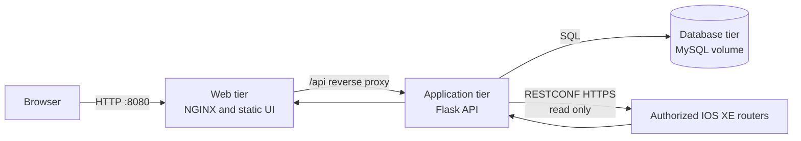

# Lab 3: Implement a Three-Tier Network Monitoring Application

## Duration

**3 hours**

In this standalone lab, you will implement a three-tier application: an NGINX web tier, a Flask application/API tier, and a persistent MySQL database tier. The instructor-provided Lab 3 files contain the complete starting application; the Lab 2 folder and repository are not used. The first user creates the administrator account through a controlled initialization workflow. After signing in, the administrator can add authorized IOS XE routers to the inventory and select them for CPU and memory monitoring.

Docker Compose defines how the three services are built, configured, connected, checked, started, replaced, stopped, and removed. The result is still one application, but its responsibilities and state boundaries are explicit.

## Objectives

- Separate presentation, application, and data responsibilities.
- Implement a one-time administrator initialization workflow.
- Hash account passwords before storage.
- Store application users and router inventory in persistent MySQL storage.
- Add an authenticated inventory page for authorized IOS XE routers.
- Keep router credentials out of browser responses and container images.
- Build the web and application images and use a pinned MySQL image.
- Deploy the application with Docker Compose.
- Verify service dependencies, health, persistence, and RESTCONF monitoring.
- Exercise the Docker Compose lifecycle without accidentally deleting data.

## Three-tier architecture



Only the web tier publishes a host port. The application and database communicate on a private Compose network. The application tier alone reaches router management endpoints. MySQL has a persistent named volume and is not published to the workstation network.

## Service responsibilities

| Tier | Responsibilities | Must not own |
|---|---|---|
| Web | Static HTML, CSS, JavaScript, reverse proxy | Password validation, database access, router credentials |
| Application | Authentication, authorization, validation, inventory API, RESTCONF collection | Durable database files, public exposure of credentials |
| Database | Users, password hashes, router records, encrypted credential fields, schema state | RESTCONF sessions, browser rendering, authorization decisions |

The official MySQL image is not rebuilt simply to claim ownership of a database image. It is pulled by immutable version tag, inspected, and used as the database artifact. Custom initialization or migrations belong in versioned application migration files, not in a hand-edited database container.

## Required environment

- Docker Engine and Docker Compose on an instructor-approved workstation.
- Instructor-provided Lab 3 starter files or specifications.
- One instructor-authorized IOS XE RESTCONF router.

## Lab workspace and repository

Use a new folder and private GitLab project for this lab:

- Folder: `~/netdevops-labs/netdevops-lab03-three-tier`
- GitLab project: `netdevops-lab03-three-tier`

Do not delete or overwrite the Lab 2 folder. Do not copy Lab 2 files into this repository. Create a blank private GitLab project, initialize it with a README, clone it, and copy only the supplied Lab 3 files:

```bash
mkdir -p ~/netdevops-labs
cd ~/netdevops-labs
git clone https://gitlab.com/YOUR-GITLAB-NAMESPACE/netdevops-lab03-three-tier.git
cd netdevops-lab03-three-tier
git status
git pull --ff-only
git switch -c feature/lab03-three-tier
cp -R "/path/to/Lab 03 - Implement a Three-Tier Application/." \
  ~/netdevops-labs/netdevops-lab03-three-tier/
python3 -m venv .venv
source .venv/bin/activate
python -m pip install -r requirements.txt -r requirements-dev.txt
python -m pip check
```

Confirm that `web/`, `app/`, `tests/`, `compose.yaml`, and both requirements files are present.

## Target project structure

```text
netdevops-lab03-three-tier/
├── web/
│   ├── Dockerfile
│   ├── nginx.conf
│   └── static/
│       ├── index.html
│       ├── app.js
│       └── style.css
├── app/
│   ├── Dockerfile
│   ├── __init__.py
│   ├── config.py
│   ├── models.py
│   ├── routes.py
│   ├── security.py
│   ├── restconf_client.py
├── tests/
├── compose.yaml
├── requirements.txt
├── .env.example
├── .dockerignore
└── README.md
```

## Step 1: Prepare configuration and secrets

Create `.env` from `.env.example` and restrict it:

```bash
cp .env.example .env
chmod 600 .env
```

Use generated lab values rather than the examples:

```text
MYSQL_IMAGE=mysql:<instructor-approved-version>
MYSQL_DATABASE=network_monitor
MYSQL_USER=network_app
MYSQL_PASSWORD=<generated-value>
MYSQL_ROOT_PASSWORD=<different-generated-value>
DATABASE_URL=mysql+pymysql://network_app:<url-encoded-password>@db:3306/network_monitor
FLASK_SECRET_KEY=<generated-value>
INVENTORY_ENCRYPTION_KEY=<generated-value>
```

Do not commit `.env`. URL-encode the database password in `DATABASE_URL` when required.

## Step 2: Test and build the application

Validate the resolved model without displaying secrets in shared output:

```bash
docker compose config --quiet
python -m pytest -q
```

Build the two custom images and pull the pinned database image:

```bash
docker compose build --pull web app
docker compose pull db
docker image ls network-monitor-web network-monitor-app mysql
```

List the built images:

```bash
docker compose images
```

Run the source tests and perform a small smoke check against each image before starting the complete stack:

```bash
python -m pytest -q
docker run --rm network-monitor-app:lab03 python -c 'import flask, pymysql'
docker run --rm network-monitor-web:lab03 nginx -t
```

The final application image intentionally excludes tests. A later pipeline can run them in a dedicated build stage or test image rather than copying test code into the production runtime.

## Step 3: Start and verify the application

Start the complete service model and verify each tier before using the web interface.

```bash
docker compose up -d
docker compose ps
docker compose logs --tail=100 db app web
```

Wait until all services are healthy. Inspect dependency behavior:

```bash
docker compose exec app python -c \
  "import socket; print(socket.gethostbyname('db'))"
docker compose exec web wget -q -O - http://app:8000/health/ready
curl -fsS http://127.0.0.1:8088/health
```

Confirm that MySQL has no published host port:

```bash
docker compose port db 3306
```

No mapping should be returned.

## Step 4: Complete first-time administrator setup

Open `http://127.0.0.1:8088`. The application should redirect to or present the setup page because the database contains no users.

1. Enter the administrator username assigned by the instructor.
2. Enter and confirm a strong unique lab password.
3. Submit the form once.
4. Sign out and sign in using the new account.
5. Attempt to revisit the setup page.

The second setup attempt must be rejected by the server even if the browser request is submitted manually.

Verify the database without printing hashes or secrets:

```bash
docker compose exec db sh -lc \
  'mysql -u"$MYSQL_USER" -p"$MYSQL_PASSWORD" "$MYSQL_DATABASE" -e \
  "SELECT id, username, is_admin, created_at FROM users;"'
```

The table should contain one administrator. Do not display or copy the password-hash column.

## Step 5: Add and monitor IOS XE inventory

Open the **Router inventory** section and add the assigned router. RESTCONF certificate verification is disabled for the course environment.

After saving:

1. Confirm that the inventory list displays the router name and endpoint.
2. Confirm that no router password appears in the HTML or browser network response.
3. Open the dashboard and select the router.
4. Wait for at least two samples.
5. Confirm that CPU and memory charts display timestamps and values.

Inspect only safe inventory columns:

```bash
docker compose exec db sh -lc \
  'mysql -u"$MYSQL_USER" -p"$MYSQL_PASSWORD" "$MYSQL_DATABASE" -e \
  "SELECT id, name, host, port, enabled FROM routers;"'
```

## Step 6: Verify database persistence

### Replace application containers while keeping database state

```bash
docker compose down
docker compose up -d
docker compose ps
```

Sign in with the same administrator and confirm that router inventory remains. `docker compose down` removed service containers and networks but retained the named volume.

### Verify volume identity

```bash
docker volume ls --filter name=mysql_data
docker volume inspect "$(docker volume ls -q --filter name=mysql_data)"
```

A named volume keeps the database state when the application containers are replaced. It is not removed unless the learner explicitly uses `docker compose down --volumes`.

## Step 7: Docker Compose lifecycle

Relate each Compose command to its effect on running services and persistent database state.

| Goal | Command | Effect on database volume |
|---|---|---|
| Create or update services | `docker compose up -d` | Retained |
| View service state | `docker compose ps` | No change |
| Follow logs | `docker compose logs -f app` | No change |
| Stop processes | `docker compose stop` | Retained |
| Start stopped services | `docker compose start` | Retained |
| Restart one service | `docker compose restart app` | Retained |
| Rebuild custom images | `docker compose build web app` | Retained |
| Replace changed services | `docker compose up -d --build` | Retained |
| Remove containers and networks | `docker compose down` | Retained |
| Remove containers, networks, and volumes | `docker compose down --volumes` | **Deleted** |

Practice safe scaling and inspection:

```bash
docker compose top
docker compose stats --no-stream
docker compose config --services
docker compose images
docker compose logs --since=10m app
```

## Step 8: Commit and push the work

Publish the verified three-tier implementation to the dedicated Lab 3 GitLab project.

```bash
git status --ignored
git add web app tests compose.yaml requirements.txt .env.example \
  .dockerignore README.md
git diff --staged
git commit -m "Deploy three-tier network monitoring application"
git push -u origin feature/lab03-three-tier
```

## Completion criteria

- Web, application, and database responsibilities are separated.
- The web and application images build successfully, and the pinned MySQL image is present.
- Docker Compose starts all three services and reports healthy state.
- Only the web tier exposes a workstation port.
- The first administrator can be created exactly once and can authenticate afterward.
- Passwords are hashed; router credentials are encrypted and absent from API responses.
- The inventory section adds an instructor-authorized IOS XE router.
- CPU and memory charts obtain current data through the application tier.
- Administrator and router records survive container replacement.
- Stop, rebuild, replacement, and volume-preservation operations have been verified.

## Cleanup

Stop the Lab 3 services after collecting the required evidence:

```bash
docker compose stop
docker compose ps -a
git status
```

Run `docker compose down --volumes` only when you intentionally want to delete the Lab 3 database. No later lab depends on this volume.
