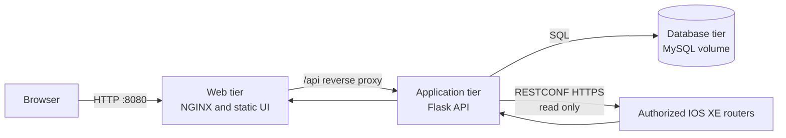

# Lab 3: Implement a Three-Tier Network Monitoring Application

## Duration

**6 hours**

Lab 2 packaged one Flask process that served the interface, application logic, and router integration. In this lab, you will evolve the same repository into a three-tier application: an NGINX web tier, a Flask application/API tier, and a persistent MySQL database tier. The first user creates the administrator account through a controlled initialization workflow. After signing in, the administrator can add authorized IOS XE routers to the inventory and select them for CPU and memory monitoring.

Docker Compose defines how the three services are built, configured, connected, checked, started, replaced, stopped, and removed. The result is still one application, but its responsibilities and state boundaries are explicit.

## Objectives

- Separate presentation, application, and data responsibilities.
- Implement a one-time administrator initialization workflow.
- Hash account passwords before storage.
- Store application users and router inventory in persistent MySQL storage.
- Add an authenticated inventory page for authorized IOS XE routers.
- Keep router credentials out of browser responses and container images.
- Build the web and application images and use a pinned MySQL image.
- Deploy the application with Docker Compose.
- Verify service dependencies, health, persistence, and RESTCONF monitoring.
- Exercise the Docker Compose lifecycle without accidentally deleting data.

## Three-tier architecture



Only the web tier publishes a host port. The application and database communicate on a private Compose network. The application tier alone reaches router management endpoints. MySQL has a persistent named volume and is not published to the workstation network.

## Service responsibilities

| Tier | Responsibilities | Must not own |
|---|---|---|
| Web | Static HTML, CSS, JavaScript, reverse proxy | Password validation, database access, router credentials |
| Application | Authentication, authorization, validation, inventory API, RESTCONF collection | Durable database files, public exposure of credentials |
| Database | Users, password hashes, router records, encrypted credential fields, schema state | RESTCONF sessions, browser rendering, authorization decisions |

The official MySQL image is not rebuilt simply to claim ownership of a database image. It is pulled by immutable version tag, inspected, and used as the database artifact. Custom initialization or migrations belong in versioned application migration files, not in a hand-edited database container.

## Required environment

- Completed Lab 2 repository and final `network-monitor` image.
- Docker Engine and Docker Compose from Lab 1.
- Instructor-provided Lab 3 starter files or specifications.
- One authorized IOS XE RESTCONF router; a second router is optional.
- Trusted CA certificates required by the assigned routers.

Before editing:

```bash
cd ~/network-devops
git status
git pull --ff-only
git switch -c feature/lab03-three-tier
source .venv/bin/activate
```

## Target project structure

```text
network-devops/
├── web/
│   ├── Dockerfile
│   ├── nginx.conf
│   └── static/
│       ├── index.html
│       ├── login.html
│       ├── setup.html
│       ├── inventory.html
│       ├── app.js
│       └── style.css
├── app/
│   ├── Dockerfile
│   ├── __init__.py
│   ├── config.py
│   ├── models.py
│   ├── routes.py
│   ├── security.py
│   ├── restconf_client.py
├── tests/
├── certificates/
│   └── .gitkeep
├── compose.yaml
├── requirements.txt
├── .env.example
├── .dockerignore
└── README.md
```

## Part 1: Define the application contracts

Before writing container definitions, identify the service contracts.

### Browser and web tier

- `GET /` returns the monitoring page.
- `GET /setup` returns first-use administrator setup.
- `GET /login` returns the login page.
- `GET /inventory` returns the authenticated inventory page.
- Requests under `/api/` are proxied to the application service.

### Application API

The supplied or implemented API should provide equivalent operations:

| Method and path | Purpose | Access requirement |
|---|---|---|
| `GET /health/live` | Process liveness | Internal health check |
| `GET /health/ready` | Database and migration readiness | Internal health check |
| `GET /api/setup/status` | Report whether an administrator exists | Unauthenticated, no sensitive detail |
| `POST /api/setup/admin` | Create the first administrator | Allowed only while no user exists |
| `POST /api/session` | Authenticate and establish a session | Unauthenticated |
| `DELETE /api/session` | End the current session | Authenticated |
| `GET /api/routers` | List safe router metadata | Authenticated |
| `POST /api/routers` | Add an authorized router | Administrator |
| `DELETE /api/routers/{id}` | Remove an inventory record | Administrator |
| `GET /api/routers/{id}/metrics` | Retrieve CPU and memory observations | Authenticated |

Do not return router passwords, encrypted credential values, password hashes, MySQL connection strings, session secrets, or RESTCONF authorization headers.

### Database model

The supplied starter uses SQLAlchemy to initialize these records. A production evolution should replace automatic schema creation with versioned database migrations:

```text
users
  id, username, password_hash, is_admin, created_at

routers
  id, name, host, port, username, password_ciphertext,
  ca_bundle_name, enabled, created_at, updated_at
```

Use a unique constraint for the normalized username and an appropriate uniqueness rule for router name or management endpoint. Validate lengths and types in the application as well as the database.

## Part 2: Implement safe first-use administrator creation

The setup endpoint must use a transaction:

1. Query whether any user exists.
2. If a user exists, return a conflict or forbidden response.
3. Validate the requested username and password.
4. Hash the password with the framework's supported adaptive password-hashing function.
5. Insert the administrator and commit.
6. Return success without returning the password or hash.

The browser hiding the setup page is not a security control. The server must reject later administrator-creation requests. Protect concurrent first-use requests with a database transaction and uniqueness constraint so that two simultaneous requests cannot create two initial administrators.

Run the authentication and setup tests before building:

```bash
python -m pytest -v
```

Expected cases include:

- Setup is available when the user table is empty.
- Weak, malformed, or mismatched credentials are rejected.
- The stored value is a password hash, not the submitted password.
- Setup becomes unavailable immediately after the first administrator is committed.
- A second setup request cannot create another initial administrator.
- Invalid login fails without revealing whether a username exists.

## Part 3: Implement the router inventory workflow

The inventory form collects:

- Display name
- Management hostname or IP address
- RESTCONF HTTPS port
- RESTCONF username and password
- CA bundle selection or trust-profile reference
- Enabled state

Validate the record on the server. Reject malformed hostnames, invalid IP addresses, ports outside the permitted range, duplicate records, unsupported schemes, and targets outside the instructor-approved lab scope.

Encrypt the router password before database storage using the application encryption key supplied at runtime. Password encryption does not replace access control: only the application identity should be able to read the ciphertext, and no API response should return it.

When the administrator selects **Test connection**, perform a bounded read-only RESTCONF request. Return a categorized result such as reachable, TLS failure, authentication failure, authorization failure, resource unsupported, timeout, or unexpected response. Do not save an unverified router unless the instructor permits it for troubleshooting practice.

Run the inventory tests:

```bash
python -m pytest -v
```

RESTCONF response fixtures should test normal data, missing leaves, different numeric encodings, authorization failure, and timeout without requiring a live router for every test.

## Part 4: Create the application image

Create `app/Dockerfile`:

```dockerfile
FROM python:3.12-slim

ENV PYTHONDONTWRITEBYTECODE=1 \
    PYTHONUNBUFFERED=1

WORKDIR /app
RUN groupadd --system app && useradd --system --gid app app

COPY requirements.txt ./
RUN python -m pip install --no-cache-dir -r requirements.txt

COPY --chown=app:app app/ ./app/
USER app

EXPOSE 8000
HEALTHCHECK --interval=15s --timeout=3s --start-period=30s --retries=3 \
  CMD python -c "import urllib.request; urllib.request.urlopen('http://127.0.0.1:8000/health/live', timeout=2)" || exit 1

CMD ["gunicorn", "--bind", "0.0.0.0:8000", "--workers", "2", "--threads", "2", "app.app:app"]
```

The application entry point may differ in the starter bundle. Update only the import path, not the security boundaries.

## Part 5: Create the web image

Create `web/nginx.conf`:

```nginx
server {
    listen 8080;
    server_name _;

    root /usr/share/nginx/html;
    index index.html;

    location /api/ {
        proxy_pass http://app:8000;
        proxy_set_header Host $host;
        proxy_set_header X-Forwarded-For $proxy_add_x_forwarded_for;
        proxy_set_header X-Forwarded-Proto $scheme;
    }

    location /health {
        access_log off;
        return 200 "healthy\n";
    }

    location / {
        try_files $uri $uri/ /index.html;
    }
}
```

Create `web/Dockerfile`:

```dockerfile
FROM nginx:stable-alpine
COPY web/nginx.conf /etc/nginx/conf.d/default.conf
COPY web/static/ /usr/share/nginx/html/
EXPOSE 8080
HEALTHCHECK --interval=15s --timeout=3s --start-period=10s --retries=3 \
  CMD wget -q -O - http://127.0.0.1:8080/health || exit 1
```

The NGINX image should be pinned to the instructor-approved immutable version or digest before it is promoted beyond the local lab.

## Part 6: Prepare Compose configuration and secrets

Create `.env` from `.env.example` and restrict it:

```bash
cp .env.example .env
chmod 600 .env
```

Use generated lab values rather than the examples:

```text
MYSQL_IMAGE=mysql:<instructor-approved-version>
MYSQL_DATABASE=network_monitor
MYSQL_USER=network_app
MYSQL_PASSWORD=<generated-value>
MYSQL_ROOT_PASSWORD=<different-generated-value>
DATABASE_URL=mysql+pymysql://network_app:<url-encoded-password>@db:3306/network_monitor
FLASK_SECRET_KEY=<generated-value>
INVENTORY_ENCRYPTION_KEY=<generated-value>
```

Do not commit `.env`. Avoid characters that break a URL unless the password is URL-encoded in `DATABASE_URL`. In a later security stage, these values move to a secrets service; this lab concentrates on service and persistence boundaries.

## Part 7: Create the three-tier Compose application

Create `compose.yaml`:

```yaml
services:
  db:
    image: ${MYSQL_IMAGE}
    restart: unless-stopped
    environment:
      MYSQL_DATABASE: ${MYSQL_DATABASE}
      MYSQL_USER: ${MYSQL_USER}
      MYSQL_PASSWORD: ${MYSQL_PASSWORD}
      MYSQL_ROOT_PASSWORD: ${MYSQL_ROOT_PASSWORD}
    volumes:
      - mysql_data:/var/lib/mysql
    networks:
      - data
    healthcheck:
      test: ["CMD-SHELL", "mysqladmin ping -h 127.0.0.1 -uroot -p$$MYSQL_ROOT_PASSWORD --silent"]
      interval: 10s
      timeout: 5s
      retries: 10
      start_period: 30s

  app:
    build:
      context: .
      dockerfile: app/Dockerfile
    image: network-monitor-app:lab03
    restart: unless-stopped
    env_file:
      - .env
    depends_on:
      db:
        condition: service_healthy
    volumes:
      - ./certificates:/certificates:ro
    networks:
      - frontend
      - data
      - management
    read_only: true
    tmpfs:
      - /tmp:rw,noexec,nosuid,size=64m
    cap_drop:
      - ALL
    security_opt:
      - no-new-privileges:true
    healthcheck:
      test: ["CMD", "python", "-c", "import urllib.request; urllib.request.urlopen('http://127.0.0.1:8000/health/ready', timeout=2)"]
      interval: 15s
      timeout: 3s
      retries: 5
      start_period: 30s

  web:
    build:
      context: .
      dockerfile: web/Dockerfile
    image: network-monitor-web:lab03
    restart: unless-stopped
    depends_on:
      app:
        condition: service_healthy
    ports:
      - "127.0.0.1:8088:8080"
    networks:
      - frontend
    read_only: true
    tmpfs:
      - /var/cache/nginx:rw,noexec,nosuid,size=32m
      - /var/run:rw,noexec,nosuid,size=8m
    cap_drop:
      - ALL
    security_opt:
      - no-new-privileges:true

networks:
  frontend:
  data:
    internal: true
  management:

volumes:
  mysql_data:
```

If the selected NGINX image requires different filesystem permissions for read-only operation, use the instructor-tested unprivileged image or document the required writable paths. Do not solve the problem by running every container as root.

The `management` network does not by itself restrict the application to approved routers. Host firewall policy, VPN routing, and later platform controls enforce the actual destination boundary.

## Part 8: Validate and build the images

Validate the resolved model without displaying secrets in shared output:

```bash
docker compose config --quiet
```

Build the two custom images and pull the pinned database image:

```bash
docker compose build --pull web app
docker compose pull db
docker image ls network-monitor-web network-monitor-app mysql
```

Inspect the three image identities:

```bash
docker image inspect network-monitor-web:lab03 \
  --format 'Web={{.Id}} User={{.Config.User}}'
docker image inspect network-monitor-app:lab03 \
  --format 'App={{.Id}} User={{.Config.User}}'
docker compose images
```

Run the source tests and perform a small smoke check against each image before starting the complete stack:

```bash
python -m pytest -q
docker run --rm network-monitor-app:lab03 python -c 'import flask, pymysql'
docker run --rm network-monitor-web:lab03 nginx -t
```

The final application image intentionally excludes tests. A later pipeline can run them in a dedicated build stage or test image rather than copying test code into the production runtime.

## Part 9: Start and verify the application

```bash
docker compose up -d
docker compose ps
docker compose logs --tail=100 db app web
```

Wait until all services are healthy. Inspect dependency behavior:

```bash
docker compose exec app python -c \
  "import socket; print(socket.gethostbyname('db'))"
docker compose exec web wget -q -O - http://app:8000/health/ready
curl -fsS http://127.0.0.1:8088/health
```

Confirm that MySQL has no published host port:

```bash
docker compose port db 3306
```

No mapping should be returned.

## Part 10: Complete first-time administrator setup

Open `http://127.0.0.1:8088`. The application should redirect to or present the setup page because the database contains no users.

1. Enter the administrator username assigned by the instructor.
2. Enter and confirm a strong unique lab password.
3. Submit the form once.
4. Sign out and sign in using the new account.
5. Attempt to revisit the setup page.

The second setup attempt must be rejected by the server even if the browser request is submitted manually.

Verify the database without printing hashes or secrets:

```bash
docker compose exec db sh -lc \
  'mysql -u"$MYSQL_USER" -p"$MYSQL_PASSWORD" "$MYSQL_DATABASE" -e \
  "SELECT id, username, is_admin, created_at FROM users;"'
```

The table should contain one administrator. Do not query or copy the password-hash column into evidence.

## Part 11: Add and monitor IOS XE inventory

Open the **Inventory** page and add the assigned router. Use the CA trust configuration provided by the instructor. Select **Test connection** before saving.

After saving:

1. Confirm that the inventory list displays name, endpoint, enabled status, and last test result.
2. Confirm that no router password appears in the HTML or browser network response.
3. Open the dashboard and select the router.
4. Wait for at least two samples.
5. Confirm that CPU and memory charts display timestamps and values.
6. Add a second authorized router if one is available and verify that the dashboard changes target cleanly.

Inspect only safe inventory columns:

```bash
docker compose exec db sh -lc \
  'mysql -u"$MYSQL_USER" -p"$MYSQL_PASSWORD" "$MYSQL_DATABASE" -e \
  "SELECT id, name, host, port, enabled FROM routers;"'
```

## Part 12: Verify persistence and failure boundaries

### Replace application containers while keeping database state

```bash
docker compose down
docker compose up -d
docker compose ps
```

Sign in with the same administrator and confirm that router inventory remains. `docker compose down` removed service containers and networks but retained the named volume.

### Restart only the application tier

```bash
docker compose restart app
docker compose ps
curl -fsS http://127.0.0.1:8088/api/setup/status | jq
```

The administrator and router inventory must remain.

### Observe database unavailability

```bash
docker compose stop db
docker compose ps
curl -i http://127.0.0.1:8088/api/routers
docker compose start db
```

The API should report unavailable or not ready; it must not silently return an empty inventory. Wait for the database and application to become healthy, then verify recovery. A liveness probe should not restart the application continuously merely because the database is temporarily unavailable; readiness should represent dependency availability.

### Verify volume identity

```bash
docker volume ls --filter name=mysql_data
docker volume inspect "$(docker volume ls -q --filter name=mysql_data)"
```

A volume is persistent local storage, not a backup. A production design requires tested backups, restoration, encryption, retention, and access control.

## Part 13: Docker Compose lifecycle

| Goal | Command | Effect on database volume |
|---|---|---|
| Create or update services | `docker compose up -d` | Retained |
| View service state | `docker compose ps` | No change |
| Follow logs | `docker compose logs -f app` | No change |
| Stop processes | `docker compose stop` | Retained |
| Start stopped services | `docker compose start` | Retained |
| Restart one service | `docker compose restart app` | Retained |
| Rebuild custom images | `docker compose build web app` | Retained |
| Replace changed services | `docker compose up -d --build` | Retained |
| Remove containers and networks | `docker compose down` | Retained |
| Remove containers, networks, and volumes | `docker compose down --volumes` | **Deleted** |

Practice safe scaling and inspection:

```bash
docker compose top
docker compose stats --no-stream
docker compose config --services
docker compose images
docker compose logs --since=10m app
```

Do not scale the application tier until session storage, background work, schema migrations, and in-memory chart state have been evaluated for multiple instances.

## Part 14: Record evidence and commit

```bash
mkdir -p evidence
docker compose ps --format json > evidence/lab03-compose-state.json
docker compose images > evidence/lab03-images.txt
curl -fsS http://127.0.0.1:8088/api/setup/status \
  > evidence/lab03-setup-status.json
git status --ignored
```

Inspect the files. Remove addresses or identifiers the instructor considers sensitive. Never preserve `.env`, credentials, hashes, encryption keys, session cookies, or unfiltered container inspection output.

```bash
git add web app tests compose.yaml requirements.txt .env.example \
  .dockerignore evidence README.md
git diff --staged
git commit -m "Deploy three-tier network monitoring application"
git push -u origin feature/lab03-three-tier
```

## Completion criteria

- Web, application, and database responsibilities are separated.
- The web and application images build successfully, and the pinned MySQL image is present.
- Docker Compose starts all three services and reports healthy state.
- Only the web tier exposes a workstation port.
- The first administrator can be created exactly once and can authenticate afterward.
- Passwords are hashed; router credentials are encrypted and absent from API responses.
- The inventory page adds and removes authorized IOS XE routers.
- CPU and memory charts obtain current data through the application tier.
- Administrator and router records survive container replacement.
- Database failure changes readiness and produces an explicit application error.
- The learner can explain the difference between `stop`, `down`, rebuild, replacement, and `down --volumes`.

## Cleanup

Retain the database and images for later CI/CD, security, and observability labs:

```bash
docker compose stop
docker compose ps -a
git status
```

Do not run `docker compose down --volumes`. The MySQL volume contains the cumulative application state used by later labs.

## Key takeaways

- A three-tier design separates presentation, application policy, and persistent state.
- Service names provide discovery inside Compose; internal container addresses are disposable.
- Startup order does not prove readiness, so each tier needs a meaningful health contract.
- First-use administration must be enforced transactionally by the server, not merely hidden in the browser.
- Named volumes survive container replacement, but persistence is not the same as backup.
- Compose makes the local deployment repeatable; it does not yet automate source review, qualification, promotion, or protected delivery.
