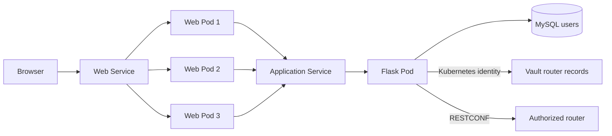

# Lab 4: Deploy, Secure, and Scale the Application on Kubernetes

## Duration

**3 hours**

In this standalone lab, you will deploy a supplied three-tier monitoring application to Minikube, place all router connection information and login credentials in HashiCorp Vault, and scale the stateless web tier from one Pod to three. The Lab 4 files contain the complete application baseline; the Lab 3 folder and repository are not required.

The monitoring application no longer creates, changes, or deletes router inventory. Vault is the authoritative store for each router's name, address, RESTCONF port, username, password, and enabled state. The web interface provides a read-only view of that inventory and retrieves CPU and memory data only after the application authenticates to Vault with its Kubernetes workload identity.

## Objectives

- Map the three-tier Compose application to Kubernetes objects.
- Deploy MySQL, Flask, NGINX, and Vault to Minikube.
- Configure Vault KV v2 and Kubernetes authentication.
- Bind a least-privilege policy to the application service account.
- Create complete router records directly in Vault.
- Confirm that the application exposes no router inventory mutation API.
- Display the responding web Pod name and IP address.
- Scale the web Deployment from one replica to three.
- Verify service distribution, persistence, Vault access, and RESTCONF monitoring.

## Runtime architecture



MySQL retains application users and sessions. Vault owns router data. The application service account can list router names and read router records, but it cannot write or delete them.

## Supplied files

```text
Lab 04 - Deploy and Scale on Kubernetes/
├── Lab4.md
├── app/                       # Vault-backed Flask application
├── web/                       # Read-only inventory UI and Pod identity
├── tests/
├── requirements.txt
├── requirements-dev.txt
├── kubernetes/
│   ├── namespace.yaml
│   ├── configmap.yaml
│   ├── mysql.yaml
│   ├── vault.yaml
│   ├── token-review.yaml
│   ├── app.yaml
│   └── web.yaml
└── scripts/
    ├── create-secrets.sh
    ├── configure-vault.sh
    ├── store-router-record.sh
    ├── deploy.sh
    └── verify.sh
```

## Part 1: Create the Lab 4 workspace and repository

Use a new folder and private GitLab project:

- Folder: `~/netdevops-labs/netdevops-lab04-kubernetes`
- GitLab project: `netdevops-lab04-kubernetes`

Do not reuse, delete, or copy files from a previous lab folder. Create a blank private GitLab project, initialize it with a README, clone it, and copy only the complete instructor-provided Lab 4 files.

```bash
mkdir -p ~/netdevops-labs
cd ~/netdevops-labs
git clone https://gitlab.com/YOUR-GITLAB-NAMESPACE/netdevops-lab04-kubernetes.git
cd netdevops-lab04-kubernetes
git status
git pull --ff-only
git switch -c feature/lab04-kubernetes-vault
cp -R "/path/to/Lab 04 - Deploy and Scale on Kubernetes/app" .
cp -R "/path/to/Lab 04 - Deploy and Scale on Kubernetes/web" .
cp -R "/path/to/Lab 04 - Deploy and Scale on Kubernetes/tests" .
cp -R "/path/to/Lab 04 - Deploy and Scale on Kubernetes/kubernetes" .
cp -R "/path/to/Lab 04 - Deploy and Scale on Kubernetes/scripts" .
cp "/path/to/Lab 04 - Deploy and Scale on Kubernetes/requirements"*.txt .
python3 -m venv .venv
source .venv/bin/activate
```

## Part 2: Test and build the images

Verify the Vault-backed behavior before producing the two application images used by Kubernetes.

```bash
python -m pip install -r requirements.txt -r requirements-dev.txt
python -m pytest -q
docker build -t network-monitor-app:lab04 -f app/Dockerfile .
docker build -t network-monitor-web:lab04 web
docker run --rm network-monitor-web:lab04 nginx -t
```

The tests prove that inventory comes from Vault, metric collection uses the complete Vault record, and `POST /api/routers` is unavailable.

## Part 3: Start Minikube and load images

Start the course cluster and make the locally built images available to its container runtime.

```bash
minikube start --profile network-devops
minikube profile network-devops
minikube image load network-monitor-app:lab04 --profile network-devops
minikube image load network-monitor-web:lab04 --profile network-devops
minikube image ls --profile network-devops | grep network-monitor
kubectl get nodes -o wide
```

## Part 4: Create application and Vault bootstrap secrets

Create the namespace and runtime secrets required to initialize the application and laboratory Vault service.

```bash
kubectl apply -f kubernetes/namespace.yaml
bash scripts/create-secrets.sh
read -rsp "Vault laboratory bootstrap token: " VAULT_BOOTSTRAP_TOKEN
echo
export VAULT_BOOTSTRAP_TOKEN
kubectl -n network-devops create secret generic vault-bootstrap \
  --from-literal=token="$VAULT_BOOTSTRAP_TOKEN" \
  --dry-run=client -o yaml | kubectl apply -f -
```

The bootstrap token is used only to configure the laboratory Vault server. Do not commit it, print it, or give it to the application. The supplied Vault runs in development mode and is not suitable for production.

## Part 5: Deploy and configure Vault

Deploy Vault and bind the application workload identity to a read-only router-record policy.

```bash
kubectl apply -f kubernetes/token-review.yaml
kubectl apply -f kubernetes/vault.yaml
kubectl -n network-devops rollout status deployment/vault --timeout=180s
bash scripts/configure-vault.sh
```

The policy allows:

```hcl
path "secret/metadata/network/routers" {
  capabilities = ["list"]
}
path "secret/data/network/routers/*" {
  capabilities = ["read"]
}
```

It grants no write, update, delete, administrative, or unrelated-secret access.

## Part 6: Add router information to Vault

Choose a short Vault-safe name. Enter every router field on the controlled workstation:

```bash
read -rp "Router name: " ROUTER_NAME
read -rp "Router host or IP: " ROUTER_HOST
read -rp "RESTCONF port [443]: " ROUTER_PORT
ROUTER_PORT=${ROUTER_PORT:-443}
read -rp "Router login username: " ROUTER_USERNAME
read -rsp "Router login password: " ROUTER_PASSWORD
echo
export ROUTER_NAME ROUTER_HOST ROUTER_PORT ROUTER_USERNAME ROUTER_PASSWORD
bash scripts/store-router-record.sh
unset ROUTER_USERNAME ROUTER_PASSWORD
```

The resulting path is `secret/data/network/routers/<router-name>`. Its data contains:

```json
{
  "host": "router.example.net",
  "port": 443,
  "username": "monitoring-user",
  "password": "stored-only-in-vault",
  "enabled": true
}
```

Repeat the procedure for additional instructor-authorized routers. Do not add router records through the monitoring page, application API, MySQL, Kubernetes ConfigMaps, or GitLab variables.

Inspect metadata without displaying secret values:

```bash
kubectl -n network-devops exec deployment/vault -- env \
  VAULT_ADDR=http://127.0.0.1:8200 VAULT_TOKEN="$VAULT_BOOTSTRAP_TOKEN" \
  vault kv metadata get "secret/network/routers/$ROUTER_NAME"
```

## Part 7: Deploy the three application tiers

Apply the version-controlled manifests in dependency order and wait for each rollout to become ready.

```bash
kubectl apply -f kubernetes/configmap.yaml
kubectl apply -f kubernetes/mysql.yaml
kubectl -n network-devops rollout status deployment/mysql --timeout=180s
kubectl apply -f kubernetes/app.yaml
kubectl -n network-devops rollout status deployment/network-monitor-app --timeout=180s
kubectl apply -f kubernetes/web.yaml
kubectl -n network-devops rollout status deployment/network-monitor-web --timeout=180s
kubectl -n network-devops get deployment,pod,service,pvc -o wide
```

## Part 8: Open and verify the application

Access the Kubernetes Service and confirm the complete browser-to-router monitoring path.

```bash
minikube service network-monitor-web --url --profile network-devops
```

Create the first web administrator if the Lab 4 database is empty, sign in, and select **Refresh inventory**. Confirm that the router appears without its username or password. Collect CPU and memory data.

The upper-right badge displays the web Pod name and Pod IP that answered `/instance`. The application Pod independently authenticates to Vault and reads the selected router record when metrics are requested.

## Part 9: Scale the web tier

Increase only the stateless presentation tier and observe how the Service distributes new connections.

```bash
kubectl -n network-devops scale deployment/network-monitor-web --replicas=3
kubectl -n network-devops rollout status deployment/network-monitor-web
kubectl -n network-devops get pods -l app=network-monitor,tier=web -o wide
kubectl -n network-devops get endpointslice \
  -l kubernetes.io/service-name=network-monitor-web
```

Open several tabs or issue repeated new connections:

```bash
WEB_URL=$(minikube service network-monitor-web --url --profile network-devops)
for attempt in $(seq 1 15); do
  curl -s -H 'Connection: close' "$WEB_URL/instance"
done | sort | uniq -c
```

Kubernetes distributes connections among ready endpoints but does not guarantee that each tab reaches a different Pod.

## Part 10: Commit and push the work

Publish the verified Kubernetes and Vault configuration to the dedicated Lab 4 project.

```bash
git status
git diff
git add app web tests requirements*.txt kubernetes scripts
git diff --staged
git commit -m "Deploy Kubernetes application with Vault inventory"
git push -u origin feature/lab04-kubernetes-vault
```

## Completion criteria

- The application and web images pass tests and build successfully.
- Vault stores every router connection and authentication field.
- The application uses Kubernetes authentication and a short-lived Vault token.
- The web interface displays read-only Vault inventory without credentials.
- No application route creates, updates, or deletes router records.
- CPU and memory collection succeeds through Vault-backed RESTCONF authentication.
- Three ready web Pods serve the application and expose distinct runtime identities.
- MySQL is not used as router inventory.

## Cleanup

Scale the web tier to one and clear local shell values:

```bash
kubectl -n network-devops scale deployment/network-monitor-web --replicas=1
unset VAULT_BOOTSTRAP_TOKEN ROUTER_NAME ROUTER_HOST ROUTER_PORT
```

You may stop or delete this lab environment after collecting the required evidence. No later lab depends on it. Vault development mode loses its data if the Vault Pod is replaced. Production Vault requires TLS, durable storage, controlled initialization and unsealing, audit logging, backups, and high availability.

## Key takeaways

- Vault can own both connection metadata and credentials behind one policy boundary.
- Workload identity avoids distributing a static Vault token to the application.
- Kubernetes scaling changes runtime capacity without changing router inventory.
- Inventory mutation should occur through the designated authority, not every consuming application.
