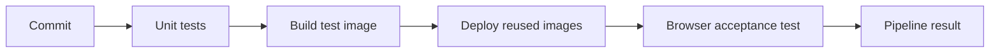
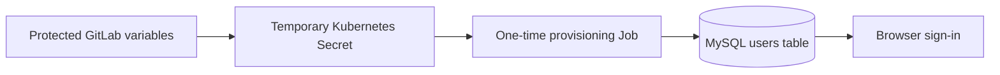

# Lab 5: Build, Test, and Deploy with GitLab CI/CD

## Duration

**3 hours**

In this standalone lab, you will express application checks and deployment controls as a GitLab CI/CD pipeline executed by a private Docker runner. The instructor-provided Lab 5 package includes the application source, tests, Kubernetes baseline, and pipeline files required for this lab. No earlier lab repository or runtime state is required.

The preparation procedure builds or loads the supplied baseline `network-monitor-web:lab05`, `network-monitor-app:lab05`, and `mysql:8.4` images. It also builds `network-monitor-e2e`, whose only purpose is to test the deployed application through its web interface. The test signs in with a dedicated account, collects CPU and memory observations from an authorized inventory target, and checks the displayed values and chart.

## Objectives

- Map build, unit-test, deployment, and acceptance-test responsibilities to GitLab jobs.
- Configure a private Docker runner to reach the learner's Minikube API safely.
- Protect the kubeconfig and test credentials as GitLab CI/CD variables.
- Build or load the application images supplied for Lab 5.
- Build a dedicated browser-test image.
- Deploy version-controlled Kubernetes manifests through a protected job.
- Provision a non-administrator test account without committing its password.
- Test the application from the user's point of view.
- Explain pipeline ordering, environments, job dependencies, and failure behavior.

## Delivery flow



The arrows represent pipeline gates. A failed job stops later stages by default. The deployment job therefore cannot run when source tests fail, and the acceptance test cannot run until the Kubernetes rollout becomes ready.

## Required environment

- An instructor-approved workstation with Docker, Git, Python, Minikube, `kubectl`, and a local GitLab Runner installed.
- The complete instructor-provided Lab 5 standalone package.
- A new private GitLab.com project created for this lab.
- A fresh or reusable Minikube profile available on the runner host. The Lab 5 setup creates its required namespace, secrets, Vault records, administrator, and router inventory.
- The selected router must be reachable from Minikube and return RESTCONF CPU and memory data.

Do not use a production cluster, production credentials, or an unrestricted shared runner. The local runner controls the Docker daemon and receives a Kubernetes credential capable of changing the course namespace.

## Supplied Lab 5 structure

```text
Lab 05 - Build Test and Deploy with GitLab CI-CD/
├── Lab5.md
├── .gitlab-ci.yml
├── ci/
│   └── e2e/
│       ├── Dockerfile
│       ├── package.json
│       └── tests/
│           └── monitoring.spec.js
├── kubernetes/
│   └── test-user-job.yaml
└── scripts/
    └── provision-test-user.sh
```

## Part 1: Create the Lab 5 workspace and repository

Use a separate folder and private GitLab project:

- Folder: `~/netdevops-labs/netdevops-lab05-gitlab-cicd`
- GitLab project: `netdevops-lab05-gitlab-cicd`

Do not reuse or delete another lab folder. Create a blank private project, initialize it with a README, clone it, and copy only the complete Lab 5 standalone package.

```bash
mkdir -p ~/netdevops-labs
cd ~/netdevops-labs
git clone https://gitlab.com/YOUR-GITLAB-NAMESPACE/netdevops-lab05-gitlab-cicd.git
cd netdevops-lab05-gitlab-cicd
git status
git pull --ff-only
git switch -c feature/lab05-gitlab-pipeline
cp -R "/path/to/Lab 05 - Build Test and Deploy with GitLab CI-CD/." \
  ~/netdevops-labs/netdevops-lab05-gitlab-cicd/
python3 -m venv .venv
source .venv/bin/activate
```

Confirm that the repository contains the supplied application source, tests, runtime manifests, pipeline file, and end-to-end test files before continuing.

## Part 2: Register and prepare the Docker runner

In the GitLab.com `netdevops-lab05-gitlab-cicd` project:

1. Open **Settings > CI/CD** and expand **Runners**.
2. Select **Create project runner**.
3. Select Linux and add the tags `docker,validation`.
4. Leave **Run untagged jobs** disabled.
5. Create the runner and copy its authentication token beginning with `glrt-`.

Start and register the instructor-approved local runner container:

```bash
docker start course-gitlab-runner
docker exec -it course-gitlab-runner gitlab-runner register
```

Enter the following values when prompted:

- GitLab URL: `https://gitlab.com`
- Token: the project runner authentication token
- Description: `course-docker-runner`
- Executor: `docker`
- Default image: `python:3.12-slim`

Confirm that registration succeeded and that GitLab.com reports the runner as online:

```bash
docker exec course-gitlab-runner gitlab-runner list
docker exec course-gitlab-runner gitlab-runner verify
```

Do not store the runner authentication token in the project or include it in screenshots.

The Docker runner executes each job in an isolated container. Pipeline jobs need two controlled capabilities:

1. The image-build job requires the host Docker socket.
2. Kubernetes jobs require a flattened kubeconfig supplied as a protected file variable.

Confirm the runner configuration contains the Docker socket and uses locally built images when present:

```toml
[[runners]]
  executor = "docker"
  [runners.docker]
    image = "python:3.12-slim"
    privileged = false
    pull_policy = "if-not-present"
    volumes = ["/cache", "/var/run/docker.sock:/var/run/docker.sock"]
```

The exact `config.toml` is stored in the runner's Docker volume. Inspect it without printing the authentication token:

```bash
docker exec course-gitlab-runner sh -c \
  'grep -E "executor|image|privileged|pull_policy|volumes" /etc/gitlab-runner/config.toml'
docker restart course-gitlab-runner
docker exec course-gitlab-runner gitlab-runner verify
```

Do not enable privileged mode for this lab. Docker-socket access is already highly privileged and is acceptable only on the dedicated course workstation.

## Part 3: Create a portable kubeconfig

The default Minikube kubeconfig refers to certificate files on the workstation. A CI job cannot read those paths. Flatten the selected context so the certificate data is embedded:

```bash
mkdir -p ~/course-platform
kubectl config view --minify --flatten --raw > ~/course-platform/minikube-ci.kubeconfig
KUBECONFIG=~/course-platform/minikube-ci.kubeconfig kubectl get nodes
```

This file contains credentials. Upload it to GitLab in the next part, then remove it immediately. Never add it to Git or pipeline artifacts.

## Part 4: Configure protected GitLab variables

In **Settings > CI/CD > Variables**, create these variables:

| Variable | Type | Protection | Purpose |
|---|---|---|---|
| `KUBE_CONFIG` | File | Protected | Flattened Minikube kubeconfig |
| `E2E_USERNAME` | Variable | Protected and masked | Dedicated test username, such as `ci-monitor` |
| `E2E_PASSWORD` | Variable | Protected and masked | Unique test password of at least 12 characters |

Use environment scope `course/minikube` if available. Do not expose either credential in command output. After saving `KUBE_CONFIG`, delete the local copy:

```bash
rm ~/course-platform/minikube-ci.kubeconfig
git status --ignored
```

Protected variables are available only to pipelines on protected branches or tags. Ask the instructor to protect `main` and allow the learner's role to merge before running the deployment pipeline.

## Part 5: Confirm the pipeline stages

The supplied `.gitlab-ci.yml` defines four stages:

| Stage | Job | Result |
|---|---|---|
| `verify` | `unit-test` | Application source tests pass |
| `package-test` | `build-e2e-image` | Browser-test image exists on the runner host |
| `deploy` | `deploy-minikube` | Existing application images are deployed and ready |
| `acceptance` | `browser-acceptance` | Authenticated monitoring works through the web page |

The runtime application images are not rebuilt in this lab. The deployment job inspects their presence inside Minikube before applying the manifests. If an image is missing, the job fails and identifies the prerequisite that must be restored.

## Part 6: Build the browser-test image

```bash
docker build -t network-monitor-e2e:local ci/e2e
docker run --rm network-monitor-e2e:local npx playwright --version
```

Do not place credentials in the image.

## Part 7: Configure test-user provisioning

The supplied Kubernetes Job uses the existing application image and application model to create or update one non-administrator account. Its password arrives from a temporary Kubernetes Secret created by `provision-test-user.sh`.



The Secret is removed after the Job succeeds. The database retains only the password hash. The account can read Vault-backed router inventory and collect metrics; the application exposes no router inventory mutation operations.

## Part 8: Validate the files locally

Run fast local checks so formatting or manifest errors do not consume runner time.

```bash
python -m pytest -q
docker build -t network-monitor-e2e:local ci/e2e
kubectl apply --dry-run=client -f kubernetes/test-user-job.yaml
git diff --check
```

The provisioning manifest will validate without the temporary credential Secret, but the Job can run only after the script creates that Secret.

## Part 9: Commit and run the merge-request pipeline

Push the pipeline definition and use a merge request to exercise its non-production validation path.

```bash
git add .gitlab-ci.yml ci/e2e kubernetes/test-user-job.yaml \
  scripts/provision-test-user.sh
git diff --staged
git commit -m "Add GitLab delivery and acceptance pipeline"
git push -u origin feature/lab05-gitlab-pipeline
```

Create a merge request into `main`. The merge-request pipeline runs source tests and builds the test image, but the rules prevent deployment from an unprotected feature branch. Review the job logs and confirm that no protected values appear.

## Part 10: Merge the validated change

Before merging, verify:

- Unit tests exercise authentication and inventory authorization.
- The test image is the only image built by this pipeline.
- Deployment jobs are restricted to the default protected branch.
- The Kubernetes credential is a file variable and is not in the repository.
- The testing user is not an administrator.
- The browser test has a defined timeout and verifies the complete application workflow.

Merge the approved change. The default-branch pipeline should progress through all four stages.

## Part 11: Follow the deployment job

The deployment job performs these controls in order:

1. Select the supplied kubeconfig.
2. Confirm the target context, namespace, and node.
3. Confirm the Lab 4 application images are already present.
4. Apply the version-controlled manifests.
5. Wait for MySQL, Flask, and NGINX rollouts.
6. Provision the restricted test user.
7. Report the deployed workload and service state in the job log.

## Part 12: Follow the browser acceptance test

The acceptance job runs inside `network-monitor-e2e`. It starts a local `kubectl port-forward`, then Playwright:

1. Opens the monitoring web page.
2. Signs in using `E2E_USERNAME` and `E2E_PASSWORD`.
3. Confirms an inventory router is available.
4. Collects two observations through the web interface.
5. Confirms CPU and memory percentages are displayed as numbers.
6. Confirms the chart canvas contains rendered pixels.
7. Confirms the web-instance badge identifies a Pod.
8. Reports whether the complete browser workflow passed.

This end-to-end test proves that the deployed application works through the same browser boundary used by an operator.

## Part 13: Verify the pipeline result

In GitLab, open **Build > Pipelines** and select the default-branch pipeline. Confirm that the graph completed in this order:

- `unit-test`
- `build-e2e-image`
- `deploy-minikube`
- `browser-acceptance`

Confirm that every job succeeds, the deployment becomes ready, and the browser acceptance job retrieves CPU and memory data.

## Completion criteria

- The private Docker runner completes tagged jobs without privileged mode.
- The kubeconfig and testing credentials exist only as protected GitLab variables and temporary runtime values.
- Unit tests pass before deployment.
- The pipeline builds only the dedicated browser-test image.
- The previously built web, app, and database images remain the deployed runtime images.
- Kubernetes rollouts become ready on the protected default branch.
- A non-administrator testing account is provisioned idempotently.
- The browser test retrieves and displays numeric CPU and memory data.
- The chart contains rendered data and the instance badge identifies a web Pod.

## Cleanup

Remove the local test image when it is no longer required:

```bash
docker image rm network-monitor-e2e:local
```

Keep this lab's GitLab variables, runner configuration, Minikube namespace, and persistent data only until you have collected the required evidence. No later lab depends on them. Delete the `e2e-test-credentials` Secret if a failed job left it behind:

```bash
kubectl -n network-devops delete secret e2e-test-credentials --ignore-not-found
```
