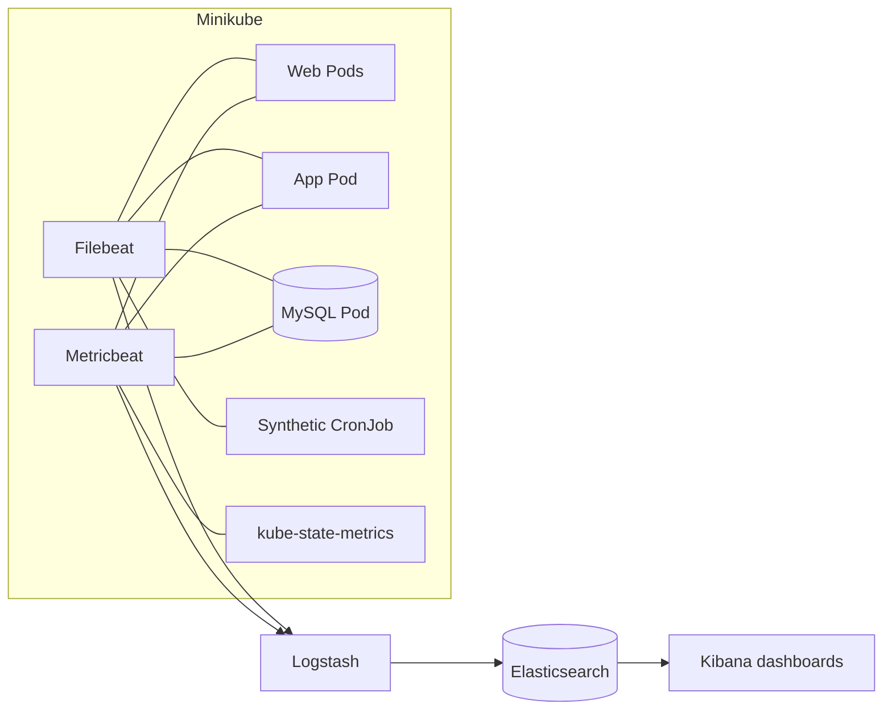

# Lab 6: Monitor the Application and Kubernetes with the Elastic Stack

## Duration

**6 hours**

Lab 4 secured the router inventory and credential path with Vault, and Lab 5 automated delivery. The platform can now place a protected application on Kubernetes, but operators still need evidence that the cluster, containers, application tiers, and monitored service remain healthy after deployment. In this lab, you will send structured application and Kubernetes telemetry to Elasticsearch, inspect it in Kibana, and build dashboards that connect resource state with user-visible behavior.

The design uses three related telemetry streams:

- **Logs:** NGINX, Flask, MySQL, Vault, and Kubernetes workload output collected by Filebeat.
- **Metrics:** node, Pod, container, volume, and workload-state measurements collected by Metricbeat and kube-state-metrics.
- **Synthetic checks:** a scheduled browser container that signs in, requests router CPU and memory data, measures elapsed time, and reports success or failure.

Container resource utilization is produced by the Kubernetes metrics collector rather than copied into every application log line. Kibana correlates the streams by time, namespace, workload, Pod, container, and service fields.

## Objectives

- Emit structured JSON logs from the web and application tiers.
- Include Pod/container identity and IP information where the event is produced.
- Collect web, application, database, Vault, and test-container logs from Kubernetes.
- Collect Kubernetes node, workload, Pod, container CPU, memory, restart, and readiness metrics.
- Run an authenticated synthetic monitoring check every two minutes.
- Measure monitoring-page reachability, router-metric retrieval, and end-to-end response time.
- Route telemetry into separate Elasticsearch index families.
- Build dashboards for cluster, container, application, and synthetic-service health.
- Correlate a slow or failed user check with logs and container behavior.

## Observability architecture



## Supplied files

```text
Lab 06 - Monitor with the Elastic Stack/
├── Lab6.md
├── app/
│   ├── __init__.py
│   └── observability.py
├── lab04-web/
│   └── nginx.conf
├── synthetic/
│   ├── Dockerfile
│   ├── package.json
│   └── synthetic-check.js
├── elastic/
│   ├── compose.override.yaml
│   └── logstash/pipeline/logstash.conf
├── kubernetes/
│   ├── app-observability-patch.yaml
│   ├── filebeat.yaml
│   ├── metricbeat.yaml
│   └── synthetic-monitor.yaml
├── scripts/
│   └── deploy-observability.sh
└── ci/
    └── lab06.gitlab-ci.yml
```

## Part 1: Prepare the cumulative branch

Add the supplied telemetry components to the same application repository used by the delivery pipeline.

```bash
cd ~/network-devops
git status
git pull --ff-only
git switch -c feature/lab06-observability
cp -R "/path/to/Lab 06 - Monitor with the Elastic Stack/app/." app/
cp -R "/path/to/Lab 06 - Monitor with the Elastic Stack/lab04-web/." lab04-web/
cp -R "/path/to/Lab 06 - Monitor with the Elastic Stack/synthetic" .
cp -R "/path/to/Lab 06 - Monitor with the Elastic Stack/kubernetes/." kubernetes/
cp -R "/path/to/Lab 06 - Monitor with the Elastic Stack/scripts/." scripts/
cp -R "/path/to/Lab 06 - Monitor with the Elastic Stack/ci/." ci/
```

Keep the Elastic configuration separate until Part 3 because it belongs to the workstation Compose project rather than the application repository runtime.

## Part 2: Examine the telemetry contract

The Flask formatter emits one JSON object per request. Important fields include:

| Field | Meaning |
|---|---|
| `service.name` | Stable application component |
| `event.dataset` | Telemetry stream and parser selection |
| `kubernetes.pod.name` | Replaceable runtime instance |
| `kubernetes.pod.ip` | Pod address when the event was emitted |
| `trace.id` | Request correlation identifier |
| `http.response.status_code` | Application result |
| `event.duration_ms` | Application processing time |
| `network.router.cpu.pct` | CPU value observed from the router |
| `network.router.memory.pct` | Memory value observed from the router |

NGINX writes access logs to standard output and errors to standard error. Its JSON log includes the container hostname, serving IP, request path, status, request duration in seconds, and upstream duration in seconds. MySQL continues to write its native logs. Filebeat enriches all container logs with Kubernetes namespace, Pod, container, node, and label metadata.

Do not log session cookies, authorization headers, passwords, Vault tokens, RESTCONF payloads, or full request bodies.

## Part 3: Make Logstash reachable from Minikube

Copy the supplied pipeline and override into the Lab 1 Elastic project:

```bash
cd ~/course-platform/elastic
cp "/path/to/Lab 06 - Monitor with the Elastic Stack/elastic/compose.override.yaml" .
cp "/path/to/Lab 06 - Monitor with the Elastic Stack/elastic/logstash/pipeline/logstash.conf" pipeline/
```

Determine the workstation address reachable from the Minikube node. With the Docker driver, `host.minikube.internal` commonly resolves inside the node:

```bash
minikube ssh --profile network-devops -- getent hosts host.minikube.internal
```

Set `ELASTIC_INGEST_HOST=0.0.0.0` only on an isolated training workstation with its firewall restricting TCP 5044 to the Minikube network. Then start the stack:

```bash
export ELASTIC_INGEST_HOST=0.0.0.0
docker compose -f compose.yaml -f compose.override.yaml config --quiet
docker compose -f compose.yaml -f compose.override.yaml up -d
curl -s http://127.0.0.1:9200/_cluster/health | jq
```

The Lab 1 stack disables Elastic authentication and TLS. Do not expose ports 9200, 5601, or 5044 to an untrusted network. Production ingestion requires TLS, authenticated Beats, certificate validation, durable storage, index lifecycle management, and capacity controls.

## Part 4: Build the observable application images

Package the updated logging configuration and synthetic monitor, then load all three images into Minikube.

```bash
cd ~/network-devops
docker build -t network-monitor-app:lab06 -f app/Dockerfile .
docker build -t network-monitor-web:lab06 lab04-web
docker build -t network-monitor-synthetic:lab06 synthetic
minikube image load network-monitor-app:lab06 --profile network-devops
minikube image load network-monitor-web:lab06 --profile network-devops
minikube image load network-monitor-synthetic:lab06 --profile network-devops
```

Patch and restart the runtime tiers:

```bash
kubectl -n network-devops patch deployment network-monitor-app \
  --type=strategic --patch-file kubernetes/app-observability-patch.yaml
kubectl -n network-devops set image deployment/network-monitor-web \
  web=network-monitor-web:lab06
kubectl -n network-devops rollout status deployment/network-monitor-app
kubectl -n network-devops rollout status deployment/network-monitor-web
```

Verify that one application request produces parseable JSON:

```bash
kubectl -n network-devops logs deployment/network-monitor-app --tail=1 | jq
kubectl -n network-devops logs deployment/network-monitor-web --tail=1 | jq
```

## Part 5: Deploy Kubernetes log and metric collectors

The endpoint must be addressable from a Pod. For the Docker Minikube driver, begin with:

```bash
export LOGSTASH_HOST=host.minikube.internal:5044
export E2E_USERNAME
export E2E_PASSWORD
bash scripts/deploy-observability.sh
```

Filebeat runs once per node because container log files are node-local. Metricbeat also runs once per node to query kubelet resource metrics. A separate Metricbeat Deployment reads desired and current workload state from kube-state-metrics.

Inspect status and errors:

```bash
kubectl -n network-devops get daemonset,deployment,pod -o wide
kubectl -n network-devops logs daemonset/filebeat --tail=30
kubectl -n network-devops logs daemonset/metricbeat --tail=30
kubectl -n network-devops logs deployment/metricbeat-state --tail=30
```

The supplied kubelet configuration disables certificate verification only for the single-node laboratory. A production collector must validate the kubelet certificate.

## Part 6: Run the synthetic monitoring container

The CronJob runs every two minutes with `concurrencyPolicy: Forbid`. It opens the real web interface, signs in with the restricted Lab 5 account, selects an inventory router, collects CPU and memory, and writes one JSON result.

Create an immediate test run instead of waiting for the schedule:

```bash
JOB="synthetic-manual-$(date +%s)"
kubectl -n network-devops create job --from=cronjob/network-monitor-synthetic "$JOB"
kubectl -n network-devops wait --for=condition=complete "job/$JOB" --timeout=120s
kubectl -n network-devops logs "job/$JOB" | jq
```

A successful record contains:

- `monitor.status: up`
- `event.outcome: success`
- HTTP status from the web page
- end-to-end `event.duration_ms`
- retrieved router CPU and memory percentages

The measurement combines page access, authentication, application processing, Vault retrieval, RESTCONF requests, and rendering. It represents user-visible service time rather than only server processing time.

## Part 7: Confirm Elasticsearch ingestion

Confirm that each expected telemetry family has reached Elasticsearch before creating Kibana objects.

```bash
curl -s 'http://127.0.0.1:9200/_cat/indices/network-monitor-*,kubernetes-*?v'
curl -s 'http://127.0.0.1:9200/network-monitor-synthetic-*/_search?size=1&sort=@timestamp:desc' | jq '.hits.hits[0]._source'
curl -s 'http://127.0.0.1:9200/kubernetes-metrics-*/_search?size=1&sort=@timestamp:desc' | jq '.hits.hits[0]._source'
```

Expected index families are:

- `network-monitor-logs-*`
- `network-monitor-synthetic-*`
- `kubernetes-logs-*`
- `kubernetes-metrics-*`

Do not continue to dashboard creation until all four index families contain recent documents. Ask the instructor to correct the training platform if an expected stream is unavailable.

## Part 8: Create Kibana data views

Open `http://127.0.0.1:5601`, go to **Stack Management > Data Views**, and create:

| Name | Index pattern | Time field |
|---|---|---|
| Network monitoring logs | `network-monitor-logs-*` | `@timestamp` |
| Synthetic availability | `network-monitor-synthetic-*` | `@timestamp` |
| Kubernetes logs | `kubernetes-logs-*` | `@timestamp` |
| Kubernetes metrics | `kubernetes-metrics-*` | `@timestamp` |

Use **Discover** before building visualizations. Confirm numerical fields are mapped as numbers and identity fields are searchable keywords. Do not build dashboards on malformed or empty data.

## Part 9: Build the Kubernetes cluster-status dashboard

Create a dashboard named **Network DevOps — Kubernetes Status** with:

1. Metric: count of ready nodes.
2. Metric: desired versus available Deployment replicas.
3. Metric: count of Pods by phase.
4. Line chart: node CPU percentage over time.
5. Line chart: node memory working set over time.
6. Table: Pod, namespace, node, phase, restart count, and age.
7. Table: PersistentVolumeClaim phase and requested capacity.
8. Log panel filtered to warning and error events.

Set the dashboard namespace control to `network-devops`. A green current state alone is insufficient; retain time-series panels so learners can see transitions during rollouts.

## Part 10: Build the container-status dashboard

Create **Network DevOps — Container Status** with:

1. Container CPU usage grouped by `kubernetes.container.name` and Pod.
2. Container memory working set grouped by container and Pod.
3. CPU and memory limit-utilization ratios where limits exist.
4. Container restart count and termination reason.
5. Pod-network receive and transmit rate.
6. Table containing container name, container ID, Pod name, Pod IP, image, node, CPU, and memory.
7. Log stream filtered by the selected Pod or container.

Use a top-N limit only for overview charts. The detailed table must allow every course container to be found.

## Part 11: Build the web-application dashboard

Create **Network DevOps — Application Health** with:

1. Request rate by `service.name`.
2. HTTP status count split into success, client error, and server error.
3. Average and 95th-percentile `event.duration_ms`.
4. Average upstream response duration for NGINX.
5. Router metric-collection success and failure count.
6. Latest observed router CPU and memory percentages.
7. Logs from `network-monitor-web`, `network-monitor-app`, and MySQL on one timeline.
8. Table containing timestamp, service, Pod name, Pod IP, path, status, duration, and trace identifier.

The router CPU and memory values describe the monitored router. Metricbeat CPU and memory values describe the containers. Label them explicitly to prevent incorrect interpretation.

## Part 12: Build the synthetic-service dashboard

Create **Network DevOps — User Experience** with:

1. Current monitor status.
2. Availability percentage: successful checks divided by all checks.
3. End-to-end response time with average, 95th percentile, and maximum.
4. Check outcome count over time.
5. Latest router CPU and memory values returned through the web workflow.
6. Failure table showing timestamp, error type, sanitized message, and duration.
7. Annotation or linked view for application errors in the same time window.

Use a two-minute expected interval when interpreting missing data. Absence of checks is itself a monitoring failure; it does not prove the application is healthy.

## Part 13: Integrate with GitLab CI/CD

Include the supplied jobs in `.gitlab-ci.yml`:

```yaml
include:
  - local: ci/lab06.gitlab-ci.yml
```

Create protected `LOGSTASH_HOST` and retain the Lab 5 Kubernetes and synthetic-test variables. Disable earlier jobs that build or deploy the same application and web images. The Lab 6 jobs build commit-addressed app, web, and synthetic images, deploy the collectors, start an immediate synthetic check, and leave the recurring CronJob enabled.

## Part 14: Commit and push the work

Publish the observability implementation after logs, metrics, and synthetic checks have been verified.

```bash
git status
git diff
git add .gitlab-ci.yml ci app web synthetic kubernetes
git diff --staged
git commit -m "Add Elastic monitoring and synthetic checks"
git push -u origin feature/lab06-observability
```

## Completion criteria

- Web and application logs are valid JSON and contain workload identity and timing fields.
- Filebeat ingests logs for web, app, database, Vault, and synthetic workloads.
- Metricbeat ingests node, Pod, container, volume, and workload-state metrics.
- Container dashboards show name, Pod IP, CPU, memory, restarts, and status.
- The synthetic container runs every two minutes and retrieves router CPU and memory through the web workflow.
- Synthetic records include availability outcome and end-to-end response time.
- Four focused Kibana dashboards cover cluster, containers, application, and user experience.
- No credential, session token, Vault token, authorization header, or sensitive response is present in Elasticsearch.

## Cleanup

Retain telemetry services for review. To suspend only synthetic traffic:

```bash
kubectl -n network-devops patch cronjob network-monitor-synthetic \
  --type=merge -p '{"spec":{"suspend":true}}'
```

To stop the workstation Elastic Stack without deleting its data:

```bash
cd ~/course-platform/elastic
docker compose -f compose.yaml -f compose.override.yaml stop
```

## Key takeaways

- Logs explain events, metrics describe resource behavior, and synthetic checks prove user-visible outcomes.
- Kubernetes identity fields connect replaceable containers to stable services and workloads.
- Router utilization and container utilization are different measurements and require clear labels.
- A dashboard is useful when it supports diagnosis, not when it merely displays many charts.
- Observability data requires the same access control, retention, and secret discipline as application data.
