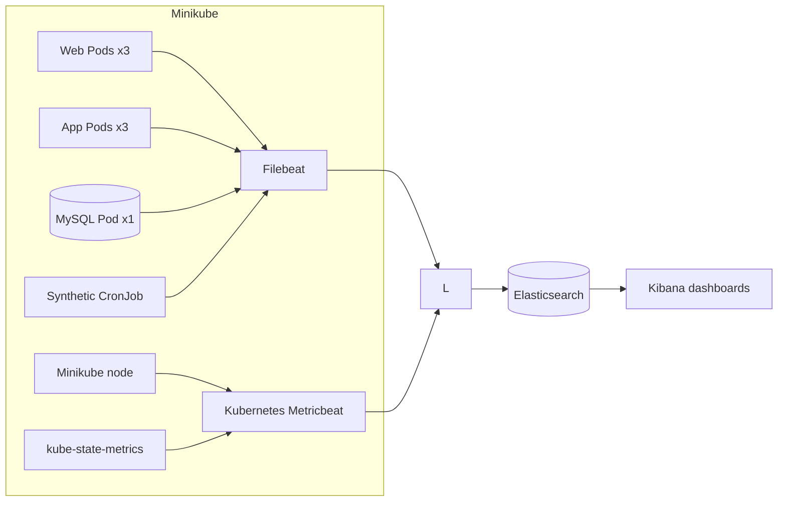

# Lab 6: Monitor the Three-Tier Application with ELK

## Duration

**4 hours**

In this standalone lab, you will deploy the same three-tier application used in Lab 5 and add Elastic observability. You will monitor Kubernetes, its Pods, the web/application/database tiers, RESTCONF activity, and a synthetic user journey. All required application files are included in the Lab 6 package.

The normal application capacity is three web Pods, three application Pods, and one MySQL Pod.

## Objectives

- Collect Kubernetes node, Pod, container, readiness, restart, and replica metrics.
- Display the number of running Pods for each application tier.
- Centralize NGINX, Flask, MySQL, and synthetic-monitor logs.
- Log each RESTCONF request and response without storing credentials or response payloads.
- Display synthetic HTTP status, availability, and response time.
- Correlate a failed or slow check with application and Kubernetes telemetry.

## How the components work



Kubernetes Metricbeat monitors the node, Pods, containers, and volumes inside Minikube. kube-state-metrics provides desired and current workload state, including Pod counts. Filebeat collects Pod logs and short RESTCONF request/response events from the application. The synthetic CronJob uses the real web interface and records the HTTP status and total response time.

## Before you begin: clean up Lab 5

Complete this section only if you performed Lab 5 on the same Minikube profile:

1. Open the Lab 5 project in GitLab.
2. Open **Build > Pipelines**.
3. Open the most recent successful pipeline for `main`.
4. Find the **cleanup** stage.
5. Select **Run** for the manual `cleanup-minikube` job.
6. Wait until the cleanup job succeeds.

Confirm that the Lab 5 namespace has been removed:

```bash
kubectl get namespace network-devops-lab05
```

The expected result is `NotFound`. Lab 6 creates and uses the separate `network-devops` namespace.

## Step 1: Create the Lab 6 repository

Create a private GitLab project named `netdevops-lab06-elk` and initialize it with a README.

Clone the new project and create the working branch:

```bash
mkdir -p ~/netdevops-labs
cd ~/netdevops-labs
git clone https://gitlab.com/YOUR-GITLAB-NAMESPACE/netdevops-lab06-elk.git
cd netdevops-lab06-elk
git switch -c feature/lab06-elk
```

Copy only the complete instructor-provided Lab 6 files into the new repository:

```bash
cp -R "/path/to/Lab 06 - Monitor with the Elastic Stack/." .
git status
```

Lab 6 has its own application source, tests, Dockerfiles, Kubernetes manifests, and namespace. It does not use the Lab 5 folder or deployment.

## Step 2: Prepare the Lab 6 configuration

Start the Minikube profile:

```bash
minikube start --profile network-devops --driver=docker
minikube profile network-devops
minikube status --profile network-devops
```

Generate values for the pipeline variables and keep the output available for Step 4:

```bash
openssl rand -hex 16
openssl rand -hex 16
openssl rand -hex 32
python3 -c "from cryptography.fernet import Fernet; print(Fernet.generate_key().decode())"
```

Choose a simple application username and password for the synthetic monitor. You will use the same values when creating the application administrator after deployment.

## Step 3: Start ELK

```bash
cd ~/course-platform/elastic
cp ~/netdevops-labs/netdevops-lab06-elk/elastic/compose.override.yaml .
cp ~/netdevops-labs/netdevops-lab06-elk/elastic/logstash/pipeline/logstash.conf pipeline/
export ELASTIC_INGEST_HOST=0.0.0.0
docker compose -f compose.yaml -f compose.override.yaml config --quiet
docker compose -f compose.yaml -f compose.override.yaml up -d
docker compose -f compose.yaml -f compose.override.yaml ps
curl -fsS http://127.0.0.1:9200/_cluster/health
```

The override exposes Logstash port `5044` to the Kubernetes collectors. Use the exposed ingestion port only on the isolated course workstation.

## Step 4: Determine the Logstash address

Use the Minikube gateway IP instead of a DNS hostname:

```bash
export LOGSTASH_IP=$(minikube ssh --profile network-devops -- \
  "ip route show default" | awk '{print $3; exit}')
export LOGSTASH_HOST="${LOGSTASH_IP}:5044"
echo "$LOGSTASH_HOST"
minikube ssh --profile network-devops -- "nc -zv ${LOGSTASH_IP} 5044"
```

Do not continue until the connection test reaches port `5044`.

In GitLab, open **Settings > CI/CD > Variables** and create:

| Key | Value |
|---|---|
| `MYSQL_PASSWORD` | First 16-byte hexadecimal value |
| `MYSQL_ROOT_PASSWORD` | Second 16-byte hexadecimal value |
| `FLASK_SECRET_KEY` | 32-byte hexadecimal value |
| `INVENTORY_ENCRYPTION_KEY` | Generated Fernet key |
| `LOGSTASH_HOST` | The value printed in Step 4 |
| `E2E_USERNAME` | Chosen application username |
| `E2E_PASSWORD` | Chosen application password |

Select **Masked and hidden** when GitLab accepts the value. Use environment scope `course/minikube` when that field is available.

## Step 5: Create and start the Lab 6 runner

In GitLab:

1. Open **Settings > CI/CD > Runners**.
2. Select **Create project runner**.
3. Select Linux.
4. Add the tags `lab6` and `minikube`.
5. Disable **Run untagged jobs**.
6. Create the runner and copy its `glrt-` authentication token.

Register the runner as the current Ubuntu user:

```bash
mkdir -p ~/.gitlab-runner-lab06
gitlab-runner register --config "$HOME/.gitlab-runner-lab06/config.toml"
```

Enter:

- GitLab URL: `https://gitlab.com`
- Token: the Lab 6 project runner token
- Description: `lab06-minikube-shell-runner`
- Tags: `lab6,minikube`
- Executor: `shell`

Start the runner in a separate terminal and keep it running:

```bash
gitlab-runner run --config "$HOME/.gitlab-runner-lab06/config.toml"
```

## Step 6: Deploy Lab 6 through CI/CD

Commit and push the supplied Lab 6 implementation:

```bash
git status
git add .
git diff --staged
git commit -m "Deploy Kubernetes monitoring with ELK"
git push -u origin feature/lab06-elk
```

The feature-branch push does not create a pipeline. In GitLab:

1. Open **Code > Merge requests**.
2. Create a merge request from `feature/lab06-elk` into `main`.
3. Review the changes and select **Merge**.
4. Open **Build > Pipelines** and select the new `main` pipeline.
5. Wait for `unit-test`, `build-images`, `deploy-minikube`, `verify-deployment`, and `post-deployment-web-test` to succeed.

The pipeline builds all three images and deploys the application, Filebeat, Metricbeat, kube-state-metrics, and the synthetic CronJob. Do not run `docker build`, `minikube image load`, or `kubectl apply` manually.

Verify the deployed capacity:

```bash
kubectl -n network-devops get deployment,statefulset,pods -o wide
```

The web and application Deployments must show `3/3`; the database StatefulSet must show `1/1`.

## Step 7: Configure and test the application

Open the application:

```bash
minikube service network-monitor-web \
  --namespace network-devops \
  --profile network-devops
```

Create the administrator with the same username and password stored in `E2E_USERNAME` and `E2E_PASSWORD`. Sign in and add the instructor-provided router in **Inventory management**.

Generate a router collection from the web interface, and then confirm that the application logged short RESTCONF request and response events:

```bash
kubectl -n network-devops logs deployment/network-monitor-app --since=2m \
  | grep RESTCONF
```

For each CPU and memory query, the log shows the request path followed by the response status and duration. It does not contain the username, password, authorization header, or RESTCONF response body.

```bash
kubectl -n network-devops get daemonset,deployment,cronjob,pods -o wide
kubectl -n network-devops logs daemonset/filebeat --tail=20
kubectl -n network-devops logs daemonset/metricbeat --tail=20
kubectl -n network-devops logs deployment/metricbeat-state --tail=20
export SYNTHETIC_JOB="synthetic-manual-$(date +%s)"
kubectl -n network-devops create job \
  --from=cronjob/network-monitor-synthetic "$SYNTHETIC_JOB"
kubectl -n network-devops wait --for=condition=complete \
  "job/$SYNTHETIC_JOB" --timeout=120s
kubectl -n network-devops logs "job/$SYNTHETIC_JOB" | jq
```

A successful result contains:

- `monitor.status: up`
- `event.outcome: success`
- `http.response.status_code: 200`
- `event.duration_ms`
- Router CPU and memory values returned through the application

The duration covers page access, sign-in, router selection, RESTCONF collection, and display of the result.

## Step 8: Confirm Elasticsearch data

Wait approximately 30 seconds, and then run:

```bash
curl -s 'http://127.0.0.1:9200/_cat/indices/kubernetes-metrics-*,kubernetes-logs-*,network-monitor-logs-*,network-monitor-synthetic-*?v'
curl -s 'http://127.0.0.1:9200/network-monitor-synthetic-*/_search?size=1&sort=@timestamp:desc' \
  | jq '.hits.hits[0]._source'
```

Do not create dashboards until all four index families contain recent documents.

## Step 9: Create Kibana data views

Open `http://127.0.0.1:5601`, then open **Stack Management > Data Views**. Create these data views using `@timestamp` as the time field:

| Data view | Index pattern |
|---|---|
| Kubernetes metrics | `kubernetes-metrics-*` |
| Kubernetes logs | `kubernetes-logs-*` |
| Application logs | `network-monitor-logs-*` |
| Synthetic service | `network-monitor-synthetic-*` |

Use **Discover** to confirm that each data view returns recent events.

## Step 10: Build the Kubernetes and application dashboard

Create **Network DevOps — Kubernetes and Application** and filter it with:

```text
kubernetes.namespace: "network-devops"
```

Add metric panels using a unique count of `kubernetes.pod.name`:

| Panel | Filter | Expected |
|---|---|---:|
| Running web Pods | `kubernetes.labels.tier: web AND kubernetes.pod.status.phase: running` | 3 |
| Running application Pods | `kubernetes.labels.tier: app AND kubernetes.pod.status.phase: running` | 3 |
| Running database Pods | `kubernetes.labels.tier: db AND kubernetes.pod.status.phase: running` | 1 |

Add these supporting panels:

1. Desired versus available replicas by Deployment.
2. Pod phase and restart count by tier.
3. Container CPU and memory by Pod and tier.
4. Kubernetes node CPU and memory.
5. NGINX and Flask HTTP status counts.
6. NGINX and Flask response time over time.
7. RESTCONF request and response events filtered by `event.action: restconf_request OR event.action: restconf_response`.
8. RESTCONF response status and duration by router and requested metric.
9. Recent warning and error logs.

The Pod-count panels use kube-state-metrics. Resource panels use kubelet metrics. Router CPU and memory fields must not be used for Kubernetes resource charts.

## Step 11: Build the synthetic-service dashboard

Create **Network DevOps — Synthetic Service** using the **Synthetic service** data view. Add:

1. Latest monitor status from `monitor.status`.
2. Latest HTTP code from `http.response.status_code`.
3. HTTP-code count over time.
4. Availability percentage using successful checks divided by all checks.
5. Average, 95th-percentile, and maximum `event.duration_ms`.
6. Response-time line chart over time.
7. Failure table with timestamp, HTTP code, error type, sanitized message, and duration.

Set the time range to **Last 30 minutes** and auto-refresh to **30 seconds**. The check runs every two minutes. Missing checks indicate a monitoring problem and do not prove that the application is healthy.

## Step 12: Scale the web and application tiers through CI/CD

Do not use `kubectl scale`. Change the desired replica counts in Git and let the pipeline update Kubernetes.

### Scale down to one replica

Create a feature branch from the latest `main`:

```bash
git switch main
git pull --ff-only
git switch -c feature/scale-down-web-app
```

In both `kubernetes/web.yaml` and `kubernetes/app.yaml`, change:

```yaml
replicas: 3
```

to:

```yaml
replicas: 1
```

Commit and push the change:

```bash
git diff -- kubernetes/web.yaml kubernetes/app.yaml
git add kubernetes/web.yaml kubernetes/app.yaml
git commit -m "Scale web and application tiers down to one replica"
git push -u origin feature/scale-down-web-app
```

In GitLab, create a merge request into `main`, review the two replica changes, and select **Merge**. Open **Build > Pipelines** and wait for the new `main` pipeline to succeed.

Confirm that the Kibana Pod-count panels change to:

```text
Web Pods          1
Application Pods  1
Database Pods     1
```

Use this read-only command to confirm the dashboard values:

```bash
kubectl -n network-devops get deployment network-monitor-web network-monitor-app
```

### Scale up to three replicas

Create another feature branch from the updated `main`:

```bash
git switch main
git pull --ff-only
git switch -c feature/scale-up-web-app
```

Change `replicas: 1` back to `replicas: 3` in both `kubernetes/web.yaml` and `kubernetes/app.yaml`, then commit and push:

```bash
git add kubernetes/web.yaml kubernetes/app.yaml
git commit -m "Scale web and application tiers up to three replicas"
git push -u origin feature/scale-up-web-app
```

Create and merge another merge request into `main`. Wait for the resulting `main` pipeline to succeed.

Confirm that Kibana updates in real time to show:

```text
Web Pods          3
Application Pods  3
Database Pods     1
```

The Pod-count panels may take up to one Metricbeat collection interval to reflect the new state. The MySQL tier remains at one replica throughout the exercise.

## Completion criteria

- Kubernetes node, Pod, container, readiness, restart, and replica metrics are visible.
- Pod-count panels show web `3`, application `3`, and database `1` during normal operation.
- NGINX, Flask, MySQL, and synthetic logs are searchable.
- Every RESTCONF CPU and memory query creates a short request event and response event without recording the payload.
- The synthetic CronJob runs every two minutes.
- The synthetic dashboard shows HTTP status codes, availability, and response time.
- Scaling changes are committed, merged, and deployed through GitLab CI/CD.
- Kibana reflects the web and application Pod counts changing from three to one and back to three.
- No password, cookie, authorization header, or router credential is stored in Elasticsearch.

## Troubleshooting

### Kubernetes collectors cannot reach Logstash

Repeat the gateway and port test from Step 4. Confirm that the Compose project publishes `0.0.0.0:5044` and that the workstation firewall permits traffic from the Minikube network.

### Pod counts are empty

```bash
kubectl -n network-devops get deployment kube-state-metrics metricbeat-state
kubectl -n network-devops logs deployment/metricbeat-state --tail=50
```

Use the `kubernetes-metrics-*` data view and a time range containing recent events.

### The synthetic check fails

Confirm the application credentials, router inventory, and router reachability. Then inspect the Job log:

```bash
kubectl -n network-devops get jobs,pods -l app=network-monitor-synthetic
kubectl -n network-devops logs "job/$SYNTHETIC_JOB"
```

## Cleanup

Suspend synthetic checks while retaining the collected data:

```bash
kubectl -n network-devops patch cronjob network-monitor-synthetic \
  --type=merge -p '{"spec":{"suspend":true}}'
```

Stop ELK without deleting its data:

```bash
cd ~/course-platform/elastic
docker compose -f compose.yaml -f compose.override.yaml stop
```
