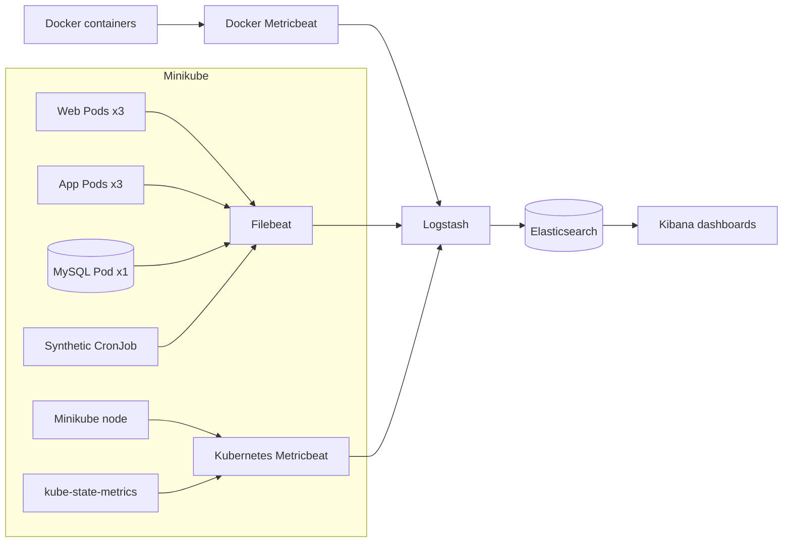

# Lab 6: Monitor the Three-Tier Application with ELK

## Duration

**4 hours**

In this standalone lab, you will deploy the same three-tier application used in Lab 5 and add Elastic observability. You will monitor the Minikube Docker container, Kubernetes, the web/application/database tiers, RESTCONF activity, and a synthetic user journey. All required application files are included in the Lab 6 package.

The normal application capacity is three web Pods, three application Pods, and one MySQL Pod.

## Objectives

- Collect Docker metrics for Minikube and the other Docker containers.
- Collect Kubernetes node, Pod, container, readiness, restart, and replica metrics.
- Display the number of running Pods for each application tier.
- Centralize NGINX, Flask, MySQL, and synthetic-monitor logs.
- Log each RESTCONF request and response without storing credentials or response payloads.
- Display synthetic HTTP status, availability, and response time.
- Correlate a failed or slow check with application and infrastructure telemetry.

## How the components work



Docker Metricbeat monitors the Minikube container and the other Docker containers. Kubernetes Metricbeat monitors resources inside Minikube. kube-state-metrics provides desired and current workload state, including Pod counts. Filebeat collects container logs and short RESTCONF request/response events from the application. The synthetic CronJob uses the real web interface and records the HTTP status and total response time.

## Before you begin: clean up Lab 5

Complete this section only if you performed Lab 5 on the same Minikube profile:

1. Open the Lab 5 project in GitLab.
2. Open **Build > Pipelines**.
3. Open the most recent successful pipeline for `main`.
4. Find the **cleanup** stage.
5. Select **Run** for the manual `cleanup-minikube` job.
6. Wait until the cleanup job succeeds.

Confirm that the Lab 5 namespace has been removed:

```bash
kubectl get namespace network-devops-lab05
```

The expected result is `NotFound`. Lab 6 creates and uses the separate `network-devops` namespace.

## Step 1: Create the Lab 6 repository

Create a private GitLab project named `netdevops-lab06-elk` and initialize it with a README.

Clone the new project and create the working branch:

```bash
mkdir -p ~/netdevops-labs
cd ~/netdevops-labs
git clone https://gitlab.com/YOUR-GITLAB-NAMESPACE/netdevops-lab06-elk.git
cd netdevops-lab06-elk
git switch -c feature/lab06-elk
```

Copy only the complete instructor-provided Lab 6 files into the new repository:

```bash
cp -R "/path/to/Lab 06 - Monitor with the Elastic Stack/." .
git status
```

Lab 6 has its own application source, tests, Dockerfiles, Kubernetes manifests, and namespace. It does not use the Lab 5 folder or deployment.

## Step 2: Prepare the Lab 6 configuration

Create `.env` and generate the required values:

```bash
cp .env.example .env
chmod 600 .env
openssl rand -hex 16
openssl rand -hex 16
openssl rand -hex 32
python3 -c "from cryptography.fernet import Fernet; print(Fernet.generate_key().decode())"
```

Open `.env` and replace every `replace-with-...` value. Use the same `MYSQL_PASSWORD` value inside `DATABASE_URL`.

Start the dedicated Minikube profile if it is not already running:

```bash
minikube start --profile network-devops --driver=docker
minikube profile network-devops
minikube status --profile network-devops
```

## Step 3: Start ELK and Docker-host monitoring

```bash
cd ~/course-platform/elastic
cp ~/netdevops-labs/netdevops-lab06-elk/elastic/compose.override.yaml .
cp ~/netdevops-labs/netdevops-lab06-elk/elastic/metricbeat-docker.yml .
cp ~/netdevops-labs/netdevops-lab06-elk/elastic/logstash/pipeline/logstash.conf pipeline/
export ELASTIC_INGEST_HOST=0.0.0.0
docker compose -f compose.yaml -f compose.override.yaml config --quiet
docker compose -f compose.yaml -f compose.override.yaml up -d
docker compose -f compose.yaml -f compose.override.yaml ps
curl -fsS http://127.0.0.1:9200/_cluster/health
```

The override exposes Logstash port `5044` to Minikube and starts `metricbeat-docker`. Only Docker-container metrics are collected by this service. Use the exposed ingestion port only on the isolated course workstation.

## Step 4: Determine the Logstash address

Use the Minikube gateway IP instead of a DNS hostname:

```bash
export LOGSTASH_IP=$(minikube ssh --profile network-devops -- \
  "ip route show default" | awk '{print $3; exit}')
export LOGSTASH_HOST="${LOGSTASH_IP}:5044"
echo "$LOGSTASH_HOST"
minikube ssh --profile network-devops -- "nc -zv ${LOGSTASH_IP} 5044"
```

Do not continue until the connection test reaches port `5044`.

## Step 5: Deploy the isolated three-tier application

```bash
cd ~/netdevops-labs/netdevops-lab06-elk
docker build -t network-monitor-app:lab06 -f app/Dockerfile .
docker build -t network-monitor-web:lab06 web
docker build -t network-monitor-synthetic:lab06 synthetic
minikube image load network-monitor-app:lab06 --profile network-devops
minikube image load network-monitor-web:lab06 --profile network-devops
minikube image load network-monitor-synthetic:lab06 --profile network-devops
```

Load `.env`, create the Kubernetes Secret, and deploy the three tiers:

```bash
set -a
source .env
set +a
kubectl apply -f kubernetes/namespace.yaml
kubectl -n network-devops create secret generic network-monitor-runtime \
  --from-literal=MYSQL_DATABASE="$MYSQL_DATABASE" \
  --from-literal=MYSQL_USER="$MYSQL_USER" \
  --from-literal=MYSQL_PASSWORD="$MYSQL_PASSWORD" \
  --from-literal=MYSQL_ROOT_PASSWORD="$MYSQL_ROOT_PASSWORD" \
  --from-literal=DATABASE_URL="$DATABASE_URL" \
  --from-literal=FLASK_SECRET_KEY="$FLASK_SECRET_KEY" \
  --from-literal=INVENTORY_ENCRYPTION_KEY="$INVENTORY_ENCRYPTION_KEY" \
  --from-literal=SESSION_COOKIE_SECURE="$SESSION_COOKIE_SECURE" \
  --dry-run=client -o yaml | kubectl apply -f -
kubectl apply -f kubernetes/mysql.yaml
kubectl apply -f kubernetes/app.yaml
kubectl apply -f kubernetes/web.yaml
kubectl -n network-devops rollout status statefulset/network-monitor-db --timeout=240s
kubectl -n network-devops rollout status deployment/network-monitor-app --timeout=180s
kubectl -n network-devops rollout status deployment/network-monitor-web --timeout=180s
kubectl -n network-devops get deployment,statefulset,pods -o wide
```

The web and application Deployments must show `3/3`; the database StatefulSet must show `1/1`.

Open the application:

```bash
minikube service network-monitor-web \
  --namespace network-devops \
  --profile network-devops
```

Create the administrator account, sign in, and add the instructor-provided router in **Inventory management**.

Generate a router collection from the web interface, and then confirm that the application logged short RESTCONF request and response events:

```bash
kubectl -n network-devops logs deployment/network-monitor-app --since=2m \
  | grep RESTCONF
```

For each CPU and memory query, the log shows the request path followed by the response status and duration. It does not contain the username, password, authorization header, or RESTCONF response body.

## Step 6: Deploy Kubernetes collectors

Use the application administrator account created in Step 5. The inventory must contain at least one router.

```bash
export KUBE_NAMESPACE=network-devops
export E2E_USERNAME='YOUR-APPLICATION-USERNAME'
export E2E_PASSWORD='YOUR-APPLICATION-PASSWORD'
bash scripts/deploy-observability.sh
```

Verify the collectors:

```bash
kubectl -n network-devops get daemonset,deployment,cronjob,pods -o wide
kubectl -n network-devops logs daemonset/filebeat --tail=20
kubectl -n network-devops logs daemonset/metricbeat --tail=20
kubectl -n network-devops logs deployment/metricbeat-state --tail=20
```

## Step 7: Run a synthetic check

```bash
export SYNTHETIC_JOB="synthetic-manual-$(date +%s)"
kubectl -n network-devops create job \
  --from=cronjob/network-monitor-synthetic "$SYNTHETIC_JOB"
kubectl -n network-devops wait --for=condition=complete \
  "job/$SYNTHETIC_JOB" --timeout=120s
kubectl -n network-devops logs "job/$SYNTHETIC_JOB" | jq
```

A successful result contains:

- `monitor.status: up`
- `event.outcome: success`
- `http.response.status_code: 200`
- `event.duration_ms`
- Router CPU and memory values returned through the application

The duration covers page access, sign-in, router selection, RESTCONF collection, and display of the result.

## Step 8: Confirm Elasticsearch data

Wait approximately 30 seconds, and then run:

```bash
curl -s 'http://127.0.0.1:9200/_cat/indices/infrastructure-metrics-*,kubernetes-metrics-*,kubernetes-logs-*,network-monitor-logs-*,network-monitor-synthetic-*?v'
curl -s 'http://127.0.0.1:9200/network-monitor-synthetic-*/_search?size=1&sort=@timestamp:desc' \
  | jq '.hits.hits[0]._source'
```

Do not create dashboards until all five index families contain recent documents.

## Step 9: Create Kibana data views

Open `http://127.0.0.1:5601`, then open **Stack Management > Data Views**. Create these data views using `@timestamp` as the time field:

| Data view | Index pattern |
|---|---|
| Infrastructure metrics | `infrastructure-metrics-*` |
| Kubernetes metrics | `kubernetes-metrics-*` |
| Kubernetes logs | `kubernetes-logs-*` |
| Application logs | `network-monitor-logs-*` |
| Synthetic service | `network-monitor-synthetic-*` |

Use **Discover** to confirm that each data view returns recent events.

## Step 10: Build the Minikube and Docker dashboard

Create **Network DevOps — Minikube and Docker** using `event.module: docker`. Add:

1. Current Docker container count.
2. Minikube container status.
3. Minikube container CPU and memory over time.
4. Docker container CPU and memory grouped by container name.
5. Docker container network receive and transmit rates.
6. Docker container disk I/O.
7. A table showing container name, image, status, CPU, memory, network, and restart information.

Filter the Minikube-specific panels by the Docker container name associated with the `network-devops` Minikube profile.

## Step 11: Build the Kubernetes and application dashboard

Create **Network DevOps — Kubernetes and Application** and filter it with:

```text
kubernetes.namespace: "network-devops"
```

Add metric panels using a unique count of `kubernetes.pod.name`:

| Panel | Filter | Expected |
|---|---|---:|
| Running web Pods | `kubernetes.labels.tier: web AND kubernetes.pod.status.phase: running` | 3 |
| Running application Pods | `kubernetes.labels.tier: app AND kubernetes.pod.status.phase: running` | 3 |
| Running database Pods | `kubernetes.labels.tier: db AND kubernetes.pod.status.phase: running` | 1 |

Add these supporting panels:

1. Desired versus available replicas by Deployment.
2. Pod phase and restart count by tier.
3. Container CPU and memory by Pod and tier.
4. Kubernetes node CPU and memory.
5. NGINX and Flask HTTP status counts.
6. NGINX and Flask response time over time.
7. RESTCONF request and response events filtered by `event.action: restconf_request OR event.action: restconf_response`.
8. RESTCONF response status and duration by router and requested metric.
9. Recent warning and error logs.

The Pod-count panels use kube-state-metrics. Resource panels use kubelet metrics. Router CPU and memory fields must not be used for Kubernetes resource charts.

## Step 12: Build the synthetic-service dashboard

Create **Network DevOps — Synthetic Service** using the **Synthetic service** data view. Add:

1. Latest monitor status from `monitor.status`.
2. Latest HTTP code from `http.response.status_code`.
3. HTTP-code count over time.
4. Availability percentage using successful checks divided by all checks.
5. Average, 95th-percentile, and maximum `event.duration_ms`.
6. Response-time line chart over time.
7. Failure table with timestamp, HTTP code, error type, sanitized message, and duration.

Set the time range to **Last 30 minutes** and auto-refresh to **30 seconds**. The check runs every two minutes. Missing checks indicate a monitoring problem and do not prove that the application is healthy.

## Step 13: Test Pod-count monitoring

Scale the web tier down temporarily:

```bash
kubectl -n network-devops scale deployment/network-monitor-web --replicas=2
kubectl -n network-devops rollout status deployment/network-monitor-web
```

Confirm that the dashboard changes from three running web Pods to two. Restore the Lab 6 baseline:

```bash
kubectl -n network-devops scale deployment/network-monitor-web --replicas=3
kubectl -n network-devops rollout status deployment/network-monitor-web
```

Run another manual synthetic check and confirm that its HTTP code and response time appear on the synthetic dashboard.

## Step 14: Commit and push

```bash
git status
git add .
git diff --staged
git commit -m "Add ELK infrastructure and synthetic monitoring"
git push -u origin feature/lab06-elk
```

Create a merge request into `main`, review the changes, and merge it.

## Completion criteria

- Minikube and Docker-container metrics are visible in Kibana.
- Kubernetes node, Pod, container, readiness, restart, and replica metrics are visible.
- Pod-count panels show web `3`, application `3`, and database `1` during normal operation.
- NGINX, Flask, MySQL, and synthetic logs are searchable.
- Every RESTCONF CPU and memory query creates a short request event and response event without recording the payload.
- The synthetic CronJob runs every two minutes.
- The synthetic dashboard shows HTTP status codes, availability, and response time.
- No password, cookie, authorization header, or router credential is stored in Elasticsearch.

## Troubleshooting

### Kubernetes collectors cannot reach Logstash

Repeat the gateway and port test from Step 4. Confirm that the Compose project publishes `0.0.0.0:5044` and that the workstation firewall permits traffic from the Minikube network.

### Pod counts are empty

```bash
kubectl -n network-devops get deployment kube-state-metrics metricbeat-state
kubectl -n network-devops logs deployment/metricbeat-state --tail=50
```

Use the `kubernetes-metrics-*` data view and a time range containing recent events.

### The synthetic check fails

Confirm the application credentials, router inventory, and router reachability. Then inspect the Job log:

```bash
kubectl -n network-devops get jobs,pods -l app=network-monitor-synthetic
kubectl -n network-devops logs "job/$SYNTHETIC_JOB"
```

### Docker metrics are empty

```bash
cd ~/course-platform/elastic
docker compose -f compose.yaml -f compose.override.yaml ps metricbeat-docker
docker compose -f compose.yaml -f compose.override.yaml logs --tail=50 metricbeat-docker
```

Confirm that Docker is running and `/var/run/docker.sock` exists.

## Cleanup

Suspend synthetic checks while retaining the collected data:

```bash
kubectl -n network-devops patch cronjob network-monitor-synthetic \
  --type=merge -p '{"spec":{"suspend":true}}'
```

Stop ELK without deleting its data:

```bash
cd ~/course-platform/elastic
docker compose -f compose.yaml -f compose.override.yaml stop
```
