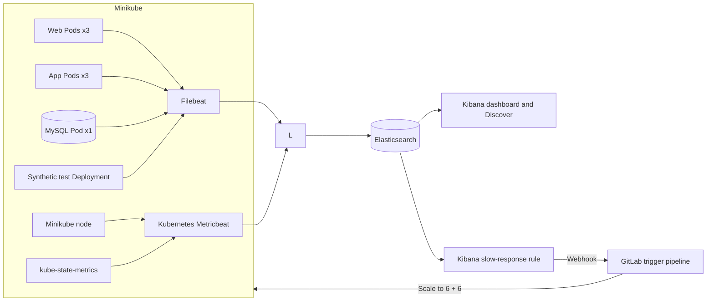

# Lab 7: Event-Driven Scaling with ELK and GitLab CI/CD

## Duration

**5 hours**

In this standalone lab, you will deploy the complete three-tier application and Elastic observability stack from Lab 6, then create an event-driven remediation workflow. A Kibana rule detects repeated slow synthetic web responses, sends a webhook to GitLab, and triggers a dedicated CI/CD job that scales the web and application tiers from three to six Pods. All application, monitoring, test, and pipeline files are included in the Lab 7 package; completing Lab 6 is not required.

The normal application capacity is three web Pods, three application Pods, and one MySQL Pod.

## Objectives

- Collect Kubernetes node, Pod, container, readiness, restart, and replica metrics.
- Display the number of running Pods for each application tier.
- Centralize NGINX, Flask, MySQL, and synthetic-monitor logs.
- Log each RESTCONF request and its complete response payload without storing credentials.
- Build a Kubernetes metrics dashboard for the Minikube node and application tiers.
- Explore Kubernetes, application, RESTCONF, and synthetic-monitor logs in Discover.
- Create an Elasticsearch query rule with learner-selected `x`, `y`, and `z` thresholds.
- Send an alert action through a Kibana webhook connector to a GitLab pipeline trigger.
- Scale the web and application tiers automatically from three to six replicas.

## How the components work



Kubernetes Metricbeat monitors the node, Pods, containers, and volumes inside Minikube. kube-state-metrics provides desired and current workload state, including Pod counts. Filebeat collects Pod logs and detailed RESTCONF request/response events from the application. The synthetic test Deployment uses the real web interface at the interval selected by the learner and records the HTTP status and web response time.

## Before you begin: clean up Lab 6

Complete this section only if you performed Lab 6 on the same Minikube profile:

1. Open the Lab 6 project in GitLab.
2. Open **Build > Pipelines**.
3. Open the most recent successful pipeline for `main`.
4. Find the **cleanup** stage.
5. Select **Run** for the manual `cleanup-minikube` job.
6. Wait until the cleanup job succeeds.

The Lab 6 cleanup first drops its application database, clearing all application accounts and records. It then removes its namespace, workloads, MySQL claim, and persistent volume. Its database data is permanently deleted, but its Minikube images are retained.

Confirm that the shared application namespace has been removed:

```bash
kubectl get namespace network-devops
```

The expected result is `NotFound`. Lab 7 creates and uses the separate `network-devops` namespace.

## Step 1: Create the Lab 7 repository

Create a private GitLab project named `netdevops-lab07-event-autoscaling` and initialize it with a README.

Clone the new project and create the working branch:

```bash
mkdir -p ~/netdevops-labs
cd ~/netdevops-labs
git clone https://gitlab.com/YOUR-GITLAB-NAMESPACE/netdevops-lab07-event-autoscaling.git
cd netdevops-lab07-event-autoscaling
git switch -c feature/lab07-event-autoscaling
```

Copy only the complete instructor-provided Lab 7 files into the new repository:

```bash
cp -R "/path/to/Lab 07 - Event-Driven Scaling with ELK and GitLab CI-CD/." .
git status
```

Lab 7 has its own application source, tests, Dockerfiles, Kubernetes manifests, monitoring configuration, and namespace. It does not depend on a Lab 6 repository or deployment.

## Step 2: Prepare the Lab 7 configuration

Start the Minikube profile:

```bash
minikube start --profile network-devops --driver=docker
minikube profile network-devops
minikube status --profile network-devops
```

Generate values for the pipeline variables and keep the output available for Step 4:

```bash
openssl rand -hex 16
openssl rand -hex 16
openssl rand -hex 32
python3 -c "from cryptography.fernet import Fernet; print(Fernet.generate_key().decode())"
```

## Step 3: Start ELK

Confirm that the Docker data filesystem has at least **10 GB of free space**:

```bash
df -h /var/lib/docker
```

The `Avail` column must show `10G` or more. Stop and free or expand disk space before continuing if the available space is lower. Insufficient disk space prevents Elasticsearch from allocating primary shards and leaves the cluster in `red` status.

```bash
cd ~/course-platform/elastic
cp ~/netdevops-labs/netdevops-lab07-elk/elastic/compose.override.yaml .
cp ~/netdevops-labs/netdevops-lab07-elk/elastic/logstash/pipeline/logstash.conf pipeline/
docker compose -f compose.yaml -f compose.override.yaml config --quiet
docker compose -f compose.yaml -f compose.override.yaml config \
  | grep -E 'XPACK_ENCRYPTEDSAVEDOBJECTS_ENCRYPTIONKEY|XPACK_ACTIONS_ALLOWEDHOSTS'
docker compose -f compose.yaml -f compose.override.yaml up -d
docker compose -f compose.yaml -f compose.override.yaml up -d --force-recreate kibana logstash
docker compose -f compose.yaml -f compose.override.yaml ps
docker compose -f compose.yaml -f compose.override.yaml exec kibana \
  printenv XPACK_ENCRYPTEDSAVEDOBJECTS_ENCRYPTIONKEY
curl -fsS 'http://127.0.0.1:9200/_cluster/health?wait_for_status=yellow&timeout=120s'
```

The merged configuration must display both `XPACK_` settings, and `printenv` must display `lab07-kibana-encrypted-objects-key-2026`. Do not continue if either check is empty. Recreating Logstash activates the Lab 7 index-routing pipeline even when the ELK containers were already running from Lab 1. Recreating Kibana applies the stable encrypted-saved-object key required by connectors and restricts outbound connector traffic to `gitlab.com`. The Logstash row must include `0.0.0.0:15044->5044/tcp`. Port `5044` remains available only on localhost for Lab 1, while port `15044` is the Lab 7 ingestion port for Kubernetes. Use this only on the isolated course workstation.

## Step 4: Determine the Logstash address

Use the Minikube gateway IP instead of a DNS hostname:

```bash
export LOGSTASH_IP=$(minikube ssh --profile network-devops -- \
  "ip route show default" | awk '{print $3; exit}')
export LOGSTASH_HOST="${LOGSTASH_IP}:15044"
echo "$LOGSTASH_HOST"
minikube ssh --profile network-devops -- "nc -zv ${LOGSTASH_IP} 15044"
```

Do not continue until the connection test reaches port `15044`.

In GitLab, open **Settings > CI/CD > Variables** and create:

| Key | Value |
|---|---|
| `MYSQL_PASSWORD` | First 16-byte hexadecimal value |
| `MYSQL_ROOT_PASSWORD` | Second 16-byte hexadecimal value |
| `FLASK_SECRET_KEY` | 32-byte hexadecimal value |
| `INVENTORY_ENCRYPTION_KEY` | Generated Fernet key |
| `LOGSTASH_HOST` | The value printed in Step 4 |

Select **Masked and hidden** when GitLab accepts the value. Use environment scope `course/minikube` when that field is available.

## Step 5: Create and start the Lab 7 runner

In GitLab:

1. Open **Settings > CI/CD > Runners**.
2. Select **Create project runner**.
3. Select Linux.
4. Add the tags `lab7` and `minikube`.
5. Disable **Run untagged jobs**.
6. Create the runner and copy its `glrt-` authentication token.

Register the runner as the current Ubuntu user:

```bash
mkdir -p ~/.gitlab-runner-lab07
gitlab-runner register --config "$HOME/.gitlab-runner-lab07/config.toml"
```

Enter:

- GitLab URL: `https://gitlab.com`
- Token: the Lab 7 project runner token
- Description: `lab07-minikube-shell-runner`
- Tags: `lab7,minikube`
- Executor: `shell`

Start the runner in a separate terminal and keep it running:

```bash
gitlab-runner run --config "$HOME/.gitlab-runner-lab07/config.toml"
```

## Step 6: Deploy Lab 7 through CI/CD

Commit and push the supplied Lab 7 implementation:

```bash
git status
git add .
git diff --staged
git commit -m "Deploy Kubernetes monitoring with ELK"
git push -u origin feature/lab07-event-autoscaling
```

The feature-branch push does not create a pipeline. In GitLab:

1. Open **Code > Merge requests**.
2. Create a merge request from `feature/lab07-event-autoscaling` into `main`.
3. Review the changes and select **Merge**.
4. Open **Build > Pipelines** and select the new `main` pipeline.
5. Wait for `unit-test`, `build-images`, `deploy-minikube`, `verify-deployment`, and `post-deployment-web-test` to succeed.

The pipeline builds all three images and deploys the application, Filebeat, Metricbeat, kube-state-metrics, and the synthetic test Deployment. Do not run `docker build`, `minikube image load`, or `kubectl apply` manually.

Verify the deployed capacity:

```bash
kubectl -n network-devops get deployment,statefulset,pods -o wide
```

The web and application Deployments must show `3/3`; the database StatefulSet must show `1/1`.

## Step 7: Configure and test the application

Open the application:

```bash
minikube service network-monitor-web \
  --namespace network-devops \
  --profile network-devops
```

On the first visit, create the administrator account and sign in. Add the instructor-provided router in **Inventory management**.

Open **Synthetic testing** and configure the test:

1. Enter a new username that is different from the administrator username.
2. Enter a password for this dedicated synthetic-test account.
3. Select an interval: **30 seconds**, **1 minute**, **2 minutes**, **5 minutes**, **10 minutes**, or **30 minutes**.
4. Select **Save and start testing**. The application creates the non-administrator account and stores the synthetic configuration.
5. Wait for the first check. The **Last synthetic test** panel changes to **Success** or **Failure** and shows the HTTP status, response time, and timestamp.
6. Confirm that the **Web response time** chart receives a point. This duration starts immediately before the synthetic client requests the network-monitor web page and stops when the initial web response finishes loading; it does not include login or RESTCONF collection time.

Generate a router collection from the web interface, and then confirm that the application logged RESTCONF request and response events:

```bash
kubectl -n network-devops logs deployment/network-monitor-app --since=2m \
  | grep RESTCONF
```

For each CPU and memory query, the request event contains `restconf.request.payload`, including the method, complete URL, Accept header, and an empty GET body. The response event contains the HTTP status, duration, and complete decoded RESTCONF payload in `restconf.response.payload`. The log does not contain the username, password, or authorization header.

To inspect the payloads directly, run:

```bash
kubectl -n network-devops logs deployment/network-monitor-app --since=10m \
  | jq 'select(."event.action" == "restconf_request" or ."event.action" == "restconf_response") | {
      timestamp: ."@timestamp",
      action: ."event.action",
      router: ."network.router.name",
      metric: ."network.router.metric",
      request: ."restconf.request.payload",
      status: ."http.response.status_code",
      response: ."restconf.response.payload"
    }'
```

```bash
kubectl -n network-devops get daemonset,deployment,pods -o wide
kubectl -n network-devops logs daemonset/filebeat --tail=20
kubectl -n network-devops logs daemonset/metricbeat --tail=20
kubectl -n network-devops logs deployment/metricbeat-state --tail=20
kubectl -n network-devops logs deployment/network-monitor-synthetic --tail=20
```

A successful result contains:

- `monitor.status: up`
- `event.outcome: success`
- `http.response.status_code: 200`
- `event.duration_ms`
- `event.duration_ms`, containing the network-monitor web response time

The synthetic Deployment checks for configuration changes every five seconds. A newly saved account or interval takes effect without redeploying the application.

## Step 8: Confirm Elasticsearch data

Use the web application, configure synthetic testing, wait for its first result, and then run:

```bash
for INDEX_PATTERN in \
  'kubernetes-metrics-*' \
  'kubernetes-logs-*' \
  'network-monitor-logs-*' \
  'network-monitor-synthetic-*'; do
  printf '\n%s\n' "$INDEX_PATTERN"
  curl -s "http://127.0.0.1:9200/_cat/indices/$INDEX_PATTERN?v"
done

curl -s 'http://127.0.0.1:9200/network-monitor-synthetic-*/_search?size=1&sort=@timestamp:desc' \
  | jq '.hits.hits[0]._source'
```

Do not continue to Step 9 until all four index families are listed. Kibana cannot create a data view for an index pattern that has not received any documents.

Filebeat mounts the Minikube node's `/var/log` tree and Docker's `/var/lib/docker/containers` directory read-only. Kubernetes container links resolve through `/var/log/pods` to the Docker runtime log, and Filebeat enriches each event with Pod metadata. Its fingerprint length is reduced to 64 bytes so short synthetic records are harvested. The Step 10 namespace filter keeps the dashboard scoped to this lab.

## Step 9: Create Kibana data views

Open `http://127.0.0.1:5601`, then open **Stack Management > Data Views**. Create these data views using `@timestamp` as the time field:

| Data view | Index pattern |
|---|---|
| Kubernetes metrics | `kubernetes-metrics-*` |
| Kubernetes logs | `kubernetes-logs-*` |
| Application logs | `network-monitor-logs-*` |
| Synthetic service | `network-monitor-synthetic-*` |

Confirm the data in **Discover**:

1. Open the main navigation menu in the upper-left corner.
2. Select **Discover**. If it is not visible, use the global search field at the top of Kibana, search for `Discover`, and select **Discover** from the results.
3. Alternatively, open `http://127.0.0.1:5601/app/discover` directly.
4. Open the data-view selector in the upper-left area of Discover.
5. Select each of the four data views and confirm that recent documents appear.
6. Set the time picker to **Last 24 hours** if no documents are initially displayed.

## Step 10: Build the Kubernetes metrics dashboard

Open the main navigation menu, select **Dashboards**, select **Create dashboard**, and save it as **Network DevOps — Kubernetes Metrics**.

Set the time picker to **Last 15 minutes**. To enable automatic refresh:

1. Select the calendar and down-arrow control immediately to the left of **Last 15 minutes**.
2. In the time-filter menu, open **Refresh every**.
3. Enter `30`, select **Seconds**, and enable or start the refresh interval.

The circular-arrow button to the right of the time range performs one manual refresh; it does not display the configured interval.

Leave the dashboard-level KQL query bar empty. Apply the namespace in the individual Pod, deployment, and container panel filters below. Node metric documents do not contain `kubernetes.namespace`, so a dashboard-wide namespace filter would hide the node panels.

Select **Add panel > New visualization** to open Lens. For every panel, first select the data view shown below, choose the visualization type, configure the fields, enter the panel filter, and select **Save and return**.

The Lens editor contains these controls:

- **Data view** is at the upper left and should show **Kubernetes metrics** for every dashboard panel.
- The KQL query bar runs across the top. Enter the panel filter here and press **Enter**.
- The visualization-type dropdown is the first control in the right pane. It initially displays **Bar**.
- **Horizontal axis**, **Vertical axis**, and **Breakdown** are field wells in the right pane.
- Select a configured field in a field well to change its operation, display name, value format, or other options.
- **Save and return** remains unavailable until the visualization has at least one metric.

Metricbeat writes a new document every 15 seconds. Therefore, **Count**, **Sum**, or a count of Pod documents over **Last 15 minutes** measures historical samples, not the current number of Pods. For the three current-value tiles, use **Last value** of the controller's ready or available replica gauge.

### Panel 1: Available web Pods

1. On the dashboard, select **Add > New visualization**.
2. Open the **Data view** selector and select **Kubernetes metrics**.
3. In the right pane, change the visualization type from **Bar** to **Metric**.
4. Enter the following filter in the KQL bar and press **Enter**:

   ```text
   kubernetes.namespace: "network-devops" AND event.dataset: kubernetes.deployment AND metricset.name: state_deployment AND kubernetes.deployment.name: "network-monitor-web"
   ```

5. Search for `kubernetes.deployment.replicas.available` in **Search field names**.
6. Drag `kubernetes.deployment.replicas.available` into **Primary metric**.
7. Select the added field and set **Operation** to **Last value**.
8. Set **Name** or **Display name** to `Available web Pods`.
9. Confirm that the preview displays `3` when the web tier has three available replicas.
10. Select **Save and return**.
11. Set the panel title to **Available web Pods**.

### Panel 2: Available application Pods

1. On the dashboard, select **Add > New visualization**.
2. Select the **Kubernetes metrics** data view.
3. Change the visualization type from **Bar** to **Metric**.
4. Enter the following filter in the KQL bar and press **Enter**:

   ```text
   kubernetes.namespace: "network-devops" AND event.dataset: kubernetes.deployment AND metricset.name: state_deployment AND kubernetes.deployment.name: "network-monitor-app"
   ```

5. Search for `kubernetes.deployment.replicas.available`.
6. Drag `kubernetes.deployment.replicas.available` into **Primary metric**.
7. Select the added field and set **Operation** to **Last value**.
8. Set **Name** or **Display name** to `Available application Pods`.
9. Confirm that the preview displays `3` when the application tier has three available replicas.
10. Select **Save and return**.
11. Set the panel title to **Available application Pods**.

### Panel 3: Ready database Pods

The database uses a StatefulSet rather than a Deployment. The Lab 7 Metricbeat manifest enables `state_statefulset` for this panel.

Before creating this panel, make sure the latest Lab 7 commit has been merged into `main` and that its pipeline has completed successfully. The deploy stage applies the updated Metricbeat ConfigMap and restarts `metricbeat-state`. Wait at least 30 seconds after the deployment, and then verify that StatefulSet documents are being collected:

```bash
kubectl -n network-devops get configmap metricbeat-state-config \
  -o jsonpath='{.data.metricbeat\.yml}' | grep state_statefulset

curl -s 'http://127.0.0.1:9200/kubernetes-metrics-*/_count' \
  -H 'Content-Type: application/json' \
  -d '{"query":{"term":{"metricset.name":"state_statefulset"}}}'
```

The first command must show `state_statefulset`, and the Elasticsearch response must show a `count` greater than zero. If the count is zero, confirm that `metricbeat-state` is running and check its recent logs:

```bash
kubectl -n network-devops get pods -l app=metricbeat,role=state
kubectl -n network-devops logs deployment/metricbeat-state --since=5m
```

Do not create the database visualization until Elasticsearch contains at least one `state_statefulset` document. Kibana can list mapped StatefulSet fields even when those fields do not yet contain data.

1. On the dashboard, select **Add > New visualization**.
2. Select the **Kubernetes metrics** data view.
3. Change the visualization type from **Bar** to **Metric**.
4. Enter the following filter in the KQL bar and press **Enter**:

   ```text
   kubernetes.namespace: "network-devops" AND event.dataset: kubernetes.statefulset AND metricset.name: state_statefulset AND kubernetes.statefulset.name: "network-monitor-db"
   ```

5. Search for `kubernetes.statefulset.replicas.ready`.
6. Drag `kubernetes.statefulset.replicas.ready` into **Primary metric**.
7. Select the added field and set **Operation** to **Last value**.
8. Set **Name** or **Display name** to `Ready database Pods`.
9. Confirm that the preview displays `1`.
10. Select **Save and return**.
11. Set the panel title to **Ready database Pods**.

Keep the dashboard at **Last 15 minutes** and auto-refresh every 30 seconds. **Last value** selects the newest gauge inside that time window, so scaling changes appear after the next 15-second Metricbeat collection. Do not use **Count**, **Sum**, or **Unique count** for these three tiles.

Add the Kubernetes charts with these Lens settings:

| Panel title | Visualization | Horizontal axis / Rows | Vertical axis / Metrics | Breakdown | Panel filter |
|---|---|---|---|---|---|
| Deployment replicas | Line | `@timestamp` date histogram | Last value of `kubernetes.deployment.replicas.desired`; last value of `kubernetes.deployment.replicas.available` | Top values of `kubernetes.deployment.name` | `kubernetes.namespace: "network-devops" AND event.dataset: kubernetes.deployment AND metricset.name: state_deployment` |
| Pod phase by tier | Bar, stacked | Top values of `kubernetes.labels.tier` | Unique count of `kubernetes.pod.name` | Top values of `kubernetes.pod.status.phase` | `kubernetes.namespace: "network-devops" AND event.dataset: kubernetes.pod AND metricset.name: state_pod` |
| Container restarts | Bar | Top values of `kubernetes.pod.name` | Maximum of `kubernetes.container.status.restarts` | Top values of `kubernetes.container.name` | `kubernetes.namespace: "network-devops" AND event.dataset: kubernetes.container AND metricset.name: state_container` |
| Pod CPU | Line | `@timestamp` date histogram | Average of `kubernetes.pod.cpu.usage.node.pct` | Top values of `kubernetes.pod.name` | `kubernetes.namespace: "network-devops" AND event.dataset: kubernetes.pod AND metricset.name: pod` |
| Pod memory | Line | `@timestamp` date histogram | Average of `kubernetes.pod.memory.usage.node.pct` | Top values of `kubernetes.pod.name` | `kubernetes.namespace: "network-devops" AND event.dataset: kubernetes.pod AND metricset.name: pod` |
| Minikube node CPU | Line | `@timestamp` date histogram | Average of `kubernetes.node.cpu.usage.nanocores` | Top values of `kubernetes.node.name` | `event.dataset: kubernetes.node AND metricset.name: node` |
| Minikube node memory | Line | `@timestamp` date histogram | Average of `kubernetes.node.memory.usage.bytes` | Top values of `kubernetes.node.name` | `event.dataset: kubernetes.node AND metricset.name: node` |

For percentage fields, open the metric dimension and set **Value format** to **Percent**. For byte fields, select **Bytes**. Give every panel the title shown in the table.

For each chart in the table:

1. Return to the dashboard and select **Add > New visualization**.
2. Confirm that the correct data view is selected.
3. Enter the full panel filter in the top KQL bar and press **Enter**.
4. Select **Bar** in the right pane and change it to the visualization listed in the table.
5. Select **Add or drag-and-drop a field** under each field well, search for the exact field name, and select it.
6. Select the added field to change its operation to **Average**, **Maximum**, **Last value**, **Unique count**, **Date histogram**, or **Top values**, as specified.
7. To add the second replica metric, select the plus control under **Vertical axis** and add `kubernetes.deployment.replicas.available` separately.
8. Use **Breakdown** only when the table specifies one. Leave it empty when the table says **None**.
9. Check the preview, select **Save and return**, open the panel actions menu, select **Edit panel settings**, and enter the panel title.

Arrange the three Pod-count metrics across the top and place the Kubernetes resource charts below them. Select **Save**.

The Pod-count panels use kube-state-metrics. Resource panels use kubelet metrics. Router CPU and memory fields must not be used for Kubernetes resource charts.

## Step 11: Explore logs in Discover

Do not create dashboards for the log data views. Use **Discover** to investigate Kubernetes logs, application and RESTCONF logs, and synthetic-monitor results.

### Explore Kubernetes Pod logs

1. Open the main navigation menu and select **Discover**.
2. Select the **Kubernetes logs** data view.
3. Set the time range to **Last 30 minutes**.
4. Enter this KQL query and press **Enter**:

   ```text
   kubernetes.namespace: "network-devops"
   ```

5. Add `@timestamp`, `kubernetes.pod.name`, `kubernetes.container.name`, `log.level`, and `message` as columns when those fields are available.
6. Sort `@timestamp` in descending order.
7. Select a document's expand control to inspect its complete JSON document.

### Explore application logs

1. Change the data view to **Application logs**.
2. Enter this KQL query and press **Enter**:

   ```text
   kubernetes.namespace: "network-devops"
   ```

3. Add `@timestamp`, `service.name`, `kubernetes.pod.name`, `log.level`, `event.action`, and `message` as columns.
4. Sort `@timestamp` in descending order.
5. To find warnings and errors, use:

   ```text
   kubernetes.namespace: "network-devops" AND log.level: (warning OR error)
   ```

### Explore RESTCONF requests and responses

1. Keep the **Application logs** data view selected.
2. Enter this KQL query and press **Enter**:

   ```text
   kubernetes.namespace: "network-devops" AND event.action: (restconf_request OR restconf_response)
   ```

3. Add `@timestamp`, `event.action`, `network.router.name`, `network.router.metric`, `http.response.status_code`, and `event.duration_ms` as columns.
4. Expand a `restconf_request` document and inspect `restconf.request.payload`.
5. Expand the corresponding `restconf_response` document and inspect the complete `restconf.response.payload`.
6. Confirm that no username, password, cookie, or authorization header is present.

### Explore synthetic-monitor results

1. Change the data view to **Synthetic service**.
2. Set the time range to **Last 30 minutes**.
3. Add `@timestamp`, `monitor.status`, `http.response.status_code`, `event.duration_ms`, `event.outcome`, `error.type`, and `error.message` as columns.
4. Sort `@timestamp` in descending order.
5. To display only failed checks, enter:

   ```text
   event.outcome: failure
   ```

6. Clear the query to display all checks again.

The synthetic check runs at the interval selected on the application's **Synthetic testing** page. Missing checks indicate a monitoring problem and do not prove that the application is healthy.

## Step 12: Create event-driven scaling with a Kibana rule

In this exercise, define three values and tune them during testing:

- `x`: number of slow synthetic results required to raise the alert
- `y`: lookback period, in minutes
- `z`: response-time threshold, in milliseconds

A useful starting point is `x = 3`, `y = 5`, and `z = 500`. Adjust `z` after observing the normal `event.duration_ms` values in Discover. The rule will alert when at least `x` synthetic results within the last `y` minutes are greater than `z` milliseconds.

### 12.1 Create a GitLab pipeline trigger

1. Open the Lab 7 project in GitLab.
2. Select **Settings > CI/CD** and expand **Pipeline trigger tokens**.
3. Select **Add new trigger**, name it `Elastic scale-out`, and create it.
4. Copy the trigger token immediately and record the project's numeric **Project ID** from the project overview page.
5. Construct this URL, replacing all three uppercase placeholders:

   ```text
   https://gitlab.com/api/v4/projects/PROJECT_ID/trigger/pipeline?token=TRIGGER_TOKEN&ref=BRANCH&variables%5BELASTIC_ACTION%5D=scale_out
   ```

   Use `main` for `BRANCH` unless your GitLab project uses another default branch. Keep the token secret and never add this URL to Git.

The supplied pipeline accepts trigger pipelines only when `ELASTIC_ACTION=scale_out`. Such a pipeline skips build, deployment, and cleanup jobs and runs only `elastic-alert-scale-out`.

### 12.2 Enable the Kibana connector license

1. In Kibana, open **Management > Stack Management > License Management**.
2. If **Webhook** is not available as a connector type, select **Start trial** and confirm the 30-day trial.
3. Return to **Stack Management** after the license update completes.

The trial is needed only when the installed license does not include the Webhook connector. The Lab 7 Compose override has already configured the stable encryption key required to store connector secrets.

### 12.3 Create and test the GitLab Webhook connector

1. Open **Stack Management > Connectors** and select **Create connector**.
2. Choose **Webhook**.
3. Enter `GitLab - scale network monitor to six` as the connector name.
4. Set **Method** to `POST`.
5. Paste the URL constructed in section 12.1.
6. Leave authentication disabled and, if a request body is requested, enter:

   ```json
   {}
   ```

7. Save the connector.
8. Select **Test**, send `{}`, and confirm that GitLab creates a pipeline.
9. In GitLab, open **Build > Pipelines**, open the trigger pipeline, and confirm that `elastic-alert-scale-out` succeeds.

Testing the connector performs a real scale-out. Verify the result, then restore the baseline before testing the rule:

```bash
kubectl -n network-devops get deployment network-monitor-web network-monitor-app
```

In the most recent successful `main` pipeline, run the manual `reset-capacity` job. Confirm that both deployments return to three replicas before continuing.

### 12.4 Create the repeated-slow-response rule

1. In Kibana, open **Stack Management > Rules** and select **Create rule**.
2. Choose **Elasticsearch query** as the rule type.
3. Name the rule `Repeated slow synthetic responses`.
4. Select the `network-monitor-synthetic-*` index and `@timestamp` as the time field.
5. Choose **KQL** and enter the following query, replacing `Z` with your chosen response-time threshold:

   ```text
   event.dataset: "network_monitor.synthetic" AND event.duration_ms > Z
   ```

6. Set the time window to the last `y` minutes.
7. Set the threshold to a document count **greater than or equal to** `x`. If your Kibana version offers only **is above**, enter `x - 1`; for example, use **above 2** to trigger on three matching results.
8. Run the rule every 30 seconds or every 1 minute. The check interval must be shorter than `y`.
9. Add an action and select `GitLab - scale network monitor to six`.
10. Configure the action to run only when the alert becomes active or when its status changes to active. Do not run the action after every rule evaluation.
11. Enter `{}` as the Webhook body if the action form requests one.
12. Save and enable the rule.

Kibana versions label some fields differently. The resulting rule must express the same condition: count documents matching the KQL query during the last `y` minutes and alert when the count is at least `x`.

### 12.5 Generate results and observe automatic scaling

1. Sign in to the network-monitor web application.
2. Open **Synthetic testing** and select a 30-second or 1-minute interval.
3. Confirm that the dedicated synthetic-test account is configured and the latest checks succeed.
4. Wait until at least `x` results whose `event.duration_ms` exceeds `z` fall inside the `y`-minute window. For a quick demonstration, temporarily choose `z` slightly below the normal response time you observed in Discover.
5. In Kibana, open the rule details and confirm that its state becomes active.
6. In GitLab, open **Build > Pipelines** and confirm that a pipeline with source **trigger** starts. Its `elastic-alert-scale-out` job must succeed.
7. Verify the live Kubernetes state:

   ```bash
   kubectl -n network-devops get deployment network-monitor-web network-monitor-app
   kubectl -n network-devops rollout status deployment/network-monitor-web --timeout=180s
   kubectl -n network-devops rollout status deployment/network-monitor-app --timeout=180s
   ```

Both deployments must show six desired and six available replicas. The database remains one Pod. After the next Metricbeat collection, the Kubernetes dashboard should show:

```text
Web Pods          6
Application Pods  6
Database Pods     1
```

### 12.6 Fine-tune and repeat the experiment

- Increase `z` if ordinary responses trigger the rule too easily.
- Increase `x` to ignore isolated slow checks.
- Increase `y` to detect sustained degradation over a longer period; decrease it to react faster.
- Let the rule recover before starting another trial. Running the action only when the alert becomes active prevents a new GitLab pipeline on every evaluation.
- To return to the three-replica baseline, run `reset-capacity` from a successful `main` pipeline. Do not edit the manifests: they intentionally retain the normal value of three replicas.

Revoke the GitLab pipeline trigger token after completing the lab if the project will no longer use this automation.

## Completion criteria

- Kubernetes node, Pod, container, readiness, restart, and replica metrics are visible.
- Pod-count panels show web `3`, application `3`, and database `1` during normal operation.
- NGINX, Flask, MySQL, and synthetic logs are searchable.
- Every RESTCONF CPU and memory query records a sanitized request object and the complete response payload without recording credentials.
- The synthetic test Deployment uses the dedicated learner-created account and selected interval.
- The application shows the last synthetic outcome and a chart of request-to-response time.
- Kubernetes logs, application logs, complete RESTCONF payloads, and synthetic results have been inspected in Discover.
- The only learner-created dashboard contains Kubernetes metrics.
- A learner-selected `x`, `y`, and `z` are configured in the repeated-slow-response Kibana rule.
- The Webhook connector starts a restricted GitLab trigger pipeline with `ELASTIC_ACTION=scale_out`.
- The trigger pipeline scales the web and application tiers to six replicas without rebuilding images or redeploying the database.
- Kibana reflects web `6`, application `6`, and database `1` after automatic scaling.
- No password, cookie, authorization header, or router credential is stored in Elasticsearch.

## Troubleshooting

### Kubernetes collectors cannot reach Logstash

Repeat the gateway and port test from Step 4. Confirm that the Compose project publishes `0.0.0.0:15044->5044/tcp` and that the workstation firewall permits traffic from the Minikube network.

If `docker compose ps` does not show the `15044` mapping, copy the supplied override again and recreate Logstash:

```bash
cd ~/course-platform/elastic
cp ~/netdevops-labs/netdevops-lab07-elk/elastic/compose.override.yaml .
docker compose -f compose.yaml -f compose.override.yaml up -d --force-recreate logstash
docker compose -f compose.yaml -f compose.override.yaml ps logstash
sudo ss -lntp | grep ':15044'
```

### Elasticsearch remains red

Check disk space first. Elasticsearch requires at least 10 GB free for this lab:

```bash
df -h /var/lib/docker
```

If less than 10 GB is available, free or expand the VM disk before retrying shard allocation.

Wait up to two minutes for primary shards to start:

```bash
curl -fsS 'http://127.0.0.1:9200/_cluster/health?wait_for_status=yellow&timeout=120s' | jq
```

If the status remains red, inspect Elasticsearch before continuing:

```bash
cd ~/course-platform/elastic
docker compose -f compose.yaml -f compose.override.yaml logs --tail=100 elasticsearch
curl -s 'http://127.0.0.1:9200/_cat/shards?v'
curl -s 'http://127.0.0.1:9200/_cluster/allocation/explain?pretty'
```

### Pod counts are empty

```bash
kubectl -n network-devops get deployment kube-state-metrics metricbeat-state
kubectl -n network-devops logs deployment/metricbeat-state --tail=50
```

Use the `kubernetes-metrics-*` data view and a time range containing recent events.

### Kibana cannot create `kubernetes-logs-*`

If Kibana lists `kubernetes-metrics-*` but rejects `kubernetes-logs-*`, Metricbeat is working but Filebeat has not published a Pod log event. Do not substitute the metrics index for the logs data view.

Confirm that Filebeat is ready and inspect its output:

```bash
kubectl -n network-devops get daemonset filebeat
kubectl -n network-devops get pods -l app=filebeat -o wide
kubectl -n network-devops logs daemonset/filebeat --tail=100 \
  | grep -Ei 'error|warn|logstash|publish|harvest' || true
```

Generate application activity by signing in to the web interface and opening the Monitoring tab. Wait 30 seconds, and then check again:

```bash
curl -s 'http://127.0.0.1:9200/_cat/indices/kubernetes-logs-*?v'
curl -s 'http://127.0.0.1:9200/_cat/indices/network-monitor-logs-*?v'
```

If neither index appears, commit and push the current Lab 7 files so the main-branch pipeline reapplies the Filebeat configuration and restarts the collector. Create the Kibana data views only after the indices appear.

### Only `kubernetes-logs-*` exists

This indicates that events are reaching Logstash but the Lab 7 routing pipeline is not active. Recopy the supplied pipeline and recreate only Logstash:

```bash
cd ~/course-platform/elastic
cp ~/netdevops-labs/netdevops-lab07-elk/elastic/logstash/pipeline/logstash.conf pipeline/
docker compose -f compose.yaml -f compose.override.yaml \
  up -d --force-recreate logstash
docker compose -f compose.yaml -f compose.override.yaml logs --tail=100 logstash
```

Use the application, configure the synthetic check from Step 7, wait for its first result, and verify the four index families again with the Step 8 commands. Existing events remain in `kubernetes-logs-*`; newly received events are routed to the appropriate indices.

### Only `kubernetes-metrics-*` exists

This means Metricbeat is publishing, but Filebeat is not publishing container logs. Confirm that the current pipeline deployed the supplied Filebeat configuration:

```bash
kubectl -n network-devops rollout status daemonset/filebeat --timeout=180s
kubectl -n network-devops get pods -l app=filebeat -o wide
kubectl -n network-devops logs daemonset/filebeat --tail=100
kubectl -n network-devops get configmap filebeat-config \
  -o jsonpath='{.data.filebeat\.yml}' | grep 'paths:'
kubectl -n network-devops exec daemonset/filebeat -- sh -c \
  'find -L /var/log/containers -type f -print -quit'
```

The configured path must be `/var/log/containers/*.log`, the fingerprint length must be `64`, and the metadata matcher must use `/var/log/pods/`. The final command must print a readable log-file path. No output means the container symlinks are broken inside the Filebeat Pod.

Commit and push the current Lab 7 files. The main-branch pipeline reapplies the configuration, mounts both the Kubernetes and Docker runtime log paths, restarts Filebeat, and verifies that at least one complete symlink chain is readable. After the pipeline succeeds, use the web application, configure synthetic testing, wait for a result, and repeat the Step 8 index check.

### The synthetic check fails

Confirm that the dedicated test account is configured on the **Synthetic testing** page. Then inspect the Deployment log:

```bash
kubectl -n network-devops get deployment,pods -l app=network-monitor-synthetic
kubectl -n network-devops logs deployment/network-monitor-synthetic --tail=100
```

### The synthetic test succeeds but its index is missing

Confirm that the Deployment log contains `"event.dataset":"network_monitor.synthetic"`. Then reinstall the supplied Logstash pipeline and recreate Logstash so the dedicated synthetic routing rule is active:

```bash
cd ~/course-platform/elastic
cp ~/netdevops-labs/netdevops-lab07-elk/elastic/logstash/pipeline/logstash.conf pipeline/
docker compose -f compose.yaml -f compose.override.yaml \
  up -d --force-recreate logstash
```

Wait for the next configured synthetic test and verify:

```bash
curl -s 'http://127.0.0.1:9200/_cat/indices/network-monitor-synthetic-*?v'
```

Previously collected synthetic events remain in `network-monitor-logs-*`; Logstash does not move historical documents when its routing pipeline changes.

### Webhook is not available as a connector type

Open **Stack Management > License Management** and activate the 30-day trial, or use an Elastic license that includes the Webhook connector. Then reload **Stack Management > Connectors**. If Kibana reports that encrypted saved objects are unavailable, recopy the Lab 7 override and recreate Kibana:

```bash
cd ~/course-platform/elastic
cp ~/netdevops-labs/netdevops-lab07-elk/elastic/compose.override.yaml .
docker compose -f compose.yaml -f compose.override.yaml \
  up -d --force-recreate kibana
docker compose -f compose.yaml -f compose.override.yaml logs --tail=100 kibana
```

Confirm that the running container received the key:

```bash
docker compose -f compose.yaml -f compose.override.yaml exec kibana \
  printenv XPACK_ENCRYPTEDSAVEDOBJECTS_ENCRYPTIONKEY
```

If the command prints nothing, the override was not included when Kibana was recreated. Run the commands from `~/course-platform/elastic` and include both `-f compose.yaml` and `-f compose.override.yaml`. When the command prints the Lab 7 key, wait for Kibana to become ready, reload the browser page, and then select **Create connector** again.

### The Webhook connector test fails

Confirm that the URL uses `https://gitlab.com`, the numeric Project ID, an active trigger token, the correct default branch, and the URL-encoded variable `variables%5BELASTIC_ACTION%5D=scale_out`. The Lab 7 override allows only `gitlab.com` for outbound Kibana actions. Inspect Kibana logs if the connector reports a networking or host-allowlist error.

### GitLab does not create a trigger pipeline

Use the connector's **Test** function and check its HTTP response. A successful GitLab trigger request returns pipeline data. A `400` response commonly indicates an invalid branch; `401` or `404` commonly indicates an invalid token or Project ID. Recreate a trigger token if its value was lost—the full token is shown only when it is created.

### A trigger pipeline is created but the scaling job is skipped

Confirm that the pipeline source is `trigger` and the request contains the exact variable `ELASTIC_ACTION=scale_out`. Do not use a normal project access token in place of a pipeline trigger token. Confirm that an online runner has both `lab7` and `minikube` tags.

### The rule starts too many pipelines

Edit the rule action frequency so the connector runs only when the alert becomes active or changes to active. Do not select an action frequency that runs on every evaluation. Before another test, wait for the query count to fall below `x` so the alert recovers.

### The scale-out job fails

Confirm that the local GitLab runner can access the `network-devops` Minikube profile and that the baseline deployment completed successfully:

```bash
minikube status --profile network-devops
kubectl -n network-devops get deployment network-monitor-web network-monitor-app
```

If either deployment is absent, run the normal `main` pipeline before testing the alert workflow.

## Cleanup

In GitLab, open the successful Lab 7 `main` pipeline and run the manual `cleanup-minikube` job. Wait until it succeeds. The job removes:

- The entire `network-devops` namespace and all Lab 7 workloads.
- All application records, including the administrator account, synthetic-test account and configuration, router inventory, and synthetic results. The job explicitly drops the application database before removing storage.
- The MySQL persistent volume claim and its associated persistent volume, permanently deleting the database storage.

The cleanup job verifies that the namespace and captured database PV no longer exist. It leaves Minikube images, the shared Minikube profile, and the external ELK installation intact.

In Kibana, delete the `Repeated slow synthetic responses` rule and the `GitLab - scale network monitor to six` connector. In GitLab, return to **Settings > CI/CD > Pipeline trigger tokens** and revoke `Elastic scale-out`. These external objects cannot be removed safely by the Kubernetes cleanup job.

Stop ELK without deleting its data:

```bash
cd ~/course-platform/elastic
docker compose -f compose.yaml -f compose.override.yaml stop
```
