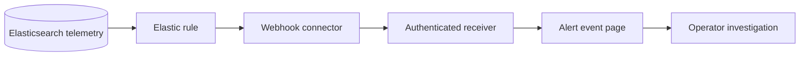

# Lab 7: Send Elastic Alerts to a Webhook

## Duration

**2 hours**

This standalone lab adds active notification to a supplied observability baseline. Elastic rules evaluate stored telemetry and send a webhook when web response time is high, a Kubernetes workload is unhealthy, or a container exceeds its CPU or memory threshold. The instructor-provided Lab 7 package includes the required sample telemetry and platform configuration; the Lab 6 folder and repository are not required.

You will build a small Flask receiver that authenticates webhook requests, retains a limited in-memory event history, and presents alert and recovery notifications in a simple web page. The receiver is deliberately small so the focus remains on rule quality, payload design, authentication, testing, and operational response.

## Objectives

- Build and deploy an authenticated webhook receiver.
- Configure Kibana encrypted saved-object support for connectors.
- Create and test an Elastic webhook connector.
- Alert on high synthetic response time.
- Alert on Kubernetes workload failure or missing expected data.
- Alert on high container CPU and memory utilization.
- Send distinct active and recovered notifications.
- Tune time windows and consecutive-check behavior to reduce noise.
- Verify the complete path with controlled threshold violations.

## Alert path



An alert is a prompt to investigate, not proof of root cause. Each notification should identify the rule, affected group, measured value, threshold, state, and reason without including credentials or sensitive application data.

## Supplied files

```text
Lab 07 - Send Elastic Alerts to a Webhook/
├── Lab7.md
├── webhook-receiver/
│   ├── app.py
│   ├── Dockerfile
│   ├── requirements.txt
│   ├── templates/index.html
│   ├── static/app.js
│   ├── static/style.css
│   └── tests/test_receiver.py
├── kubernetes/webhook-receiver.yaml
├── elastic/compose.alerting.override.yaml
├── scripts/deploy-webhook.sh
└── ci/lab07.gitlab-ci.yml
```

## Part 1: Create the Lab 7 workspace and repository

Use a separate folder and private GitLab project:

- Folder: `~/netdevops-labs/netdevops-lab07-elastic-alerts`
- GitLab project: `netdevops-lab07-elastic-alerts`

Do not reuse, delete, or copy files from another lab folder. Create a blank private project, initialize it with a README, clone it, and copy only the complete Lab 7 package.

```bash
mkdir -p ~/netdevops-labs
cd ~/netdevops-labs
git clone https://gitlab.com/YOUR-GITLAB-NAMESPACE/netdevops-lab07-elastic-alerts.git
cd netdevops-lab07-elastic-alerts
git status
git pull --ff-only
git switch -c feature/lab07-elastic-alerts
cp -R "/path/to/Lab 07 - Send Elastic Alerts to a Webhook/." \
  ~/netdevops-labs/netdevops-lab07-elastic-alerts/
python3 -m venv .venv
source .venv/bin/activate
```

## Part 2: Test the receiver

The receiver accepts `POST /webhook/elastic` only when `X-Webhook-Token` matches its configured token. It limits strings and copies only known fields into memory. This prevents an alert action from turning the receiver into an unrestricted data store.

```bash
source ~/netdevops-labs/netdevops-lab07-elastic-alerts/.venv/bin/activate
python -m pip install -r webhook-receiver/requirements.txt pytest==8.4.2
cd webhook-receiver
python -m pytest -q
cd ..
```

## Part 3: Build and deploy the receiver

Package the tested receiver and deploy it to the Lab 7 Minikube environment created from the supplied baseline.

```bash
docker build -t alert-webhook:lab07 webhook-receiver
docker run --rm alert-webhook:lab07 python -m compileall -q /app
minikube image load alert-webhook:lab07 --profile network-devops
read -rsp "Webhook token: " WEBHOOK_TOKEN
echo
export WEBHOOK_TOKEN
bash scripts/deploy-webhook.sh
```

The Service uses NodePort `30089`. Determine the URL:

```bash
export WEBHOOK_NODE_URL="http://$(minikube ip --profile network-devops):30089"
curl --fail "$WEBHOOK_NODE_URL/health"
```

Open `$WEBHOOK_NODE_URL` in a browser. The page refreshes every five seconds. Events are intentionally stored in memory and disappear when the Pod restarts; a production receiver would use authenticated persistent storage or forward to an incident-management system.

## Part 4: Test webhook authentication

Confirm an unauthenticated request fails:

```bash
curl -i -X POST "$WEBHOOK_NODE_URL/webhook/elastic" \
  -H 'Content-Type: application/json' -d '{"rule_name":"unauthorized"}'
```

Send a valid test:

```bash
curl --fail -X POST "$WEBHOOK_NODE_URL/webhook/elastic" \
  -H "X-Webhook-Token: $WEBHOOK_TOKEN" \
  -H 'Content-Type: application/json' \
  -d '{"rule_name":"Connector test","status":"active","severity":"info","reason":"Manual connectivity test","value":1,"threshold":1,"group":"lab"}'
```

The first request should return `401`; the second should return `202` and appear on the page.

## Part 5: Enable Kibana connector encryption

Kibana encrypts connector secrets with its encrypted-saved-objects key. Generate a value of at least 32 characters and store it in the Elastic Compose `.env` file, which must remain ignored by Git:

```bash
cd ~/course-platform/elastic
openssl rand -hex 32
# Set KIBANA_ENCRYPTION_KEY in .env without committing it.
cp "/path/to/Lab 07 - Send Elastic Alerts to a Webhook/elastic/compose.alerting.override.yaml" .
docker compose -f compose.yaml -f compose.override.yaml \
  -f compose.alerting.override.yaml up -d
docker compose ps
```

Keep the key stable. Changing or losing it prevents Kibana from decrypting previously stored connector secrets.

## Part 6: Create the webhook connector

From the Kibana container, use the Minikube node address and NodePort:

```bash
export WEBHOOK_CONNECTOR_URL="http://$(minikube ip --profile network-devops):30089/webhook/elastic"
```

In Kibana, open **Stack Management > Connectors**, create a **Webhook** connector named `course-alert-receiver`, and configure:

- Method: `POST`
- URL: the value of `WEBHOOK_CONNECTOR_URL`
- Header: `X-Webhook-Token` with the receiver token
- Content type: `application/json`

Use **Test connector** with the manual payload from Part 4. Confirm it appears on the receiver page. If the selected Elastic license does not make the Webhook connector available, stop here and ask the instructor to provide the licensed training environment; do not replace it with an unauthenticated workaround.

## Part 7: Create the high-response-time rule

Create an Elasticsearch query or index-threshold rule named **Monitoring web — high response time**:

- Data view/index: `network-monitor-synthetic-*`
- Filter: `event.dataset: "network_monitor.synthetic" AND monitor.status: "up"`
- Aggregation: average of `event.duration_ms`
- Group: `service.name`
- Threshold: above `3000` ms
- Evaluation window: five minutes
- Check interval: one minute
- Notify: after two consecutive evaluations when supported

Use this active-action body:

```json
{
  "rule_name": "{{rule.name}}",
  "status": "active",
  "severity": "warning",
  "reason": "{{context.reason}}",
  "value": "{{context.value}}",
  "threshold": "3000 ms",
  "group": "{{context.group}}"
}
```

Configure the recovered action with `status` set to `recovered`. Variable names differ slightly between Elastic rule types; use the action-variable browser in Kibana rather than guessing unavailable variables.

## Part 8: Create the Kubernetes-health rule

Create **Kubernetes — workload unavailable** against `kubernetes-metrics-*`. Use the deployment-state documents and alert when unavailable replicas are greater than zero for namespace `network-devops`. In the Lab 6 Metricbeat data, inspect Discover to confirm the exact field name before selecting it; it is commonly represented under `kubernetes.deployment.replicas.unavailable`.

Also enable **alert on no data** for a window longer than two collection intervals. A stopped collector and an empty cluster are operationally different from a healthy cluster, but both require investigation.

Group by deployment name and include namespace, deployment, unavailable count, and evaluation window in the webhook reason.

## Part 9: Create container CPU and memory rules

Build two rules against `kubernetes-metrics-*`:

| Rule | Metric | Starting threshold | Window |
|---|---|---:|---|
| Container high CPU | `kubernetes.container.cpu.usage.node.pct` | Above 80% | Five minutes |
| Container high memory | `kubernetes.container.memory.working_set.bytes` | Above 80% of its configured limit, or instructor-selected byte threshold | Five minutes |

Filter to namespace `network-devops` and group by container name plus Pod name. Require multiple evaluations before notification. CPU bursts lasting one sample and short image-startup memory spikes should not page an operator.

If the training data does not contain a calculated memory percentage, use Lens or a runtime field to divide working-set bytes by the configured limit. Do not compare unlike units.

## Part 10: Verify active and recovery notifications

Use controlled changes one at a time:

### Web response time

Temporarily lower the rule threshold below the current synthetic response time. Wait for the required evaluations, confirm an active webhook, restore `3000 ms`, and confirm recovery.

### Kubernetes availability

```bash
kubectl -n network-devops scale deployment/network-monitor-app --replicas=0
# Wait for the rule window and active notification.
kubectl -n network-devops scale deployment/network-monitor-app --replicas=1
kubectl -n network-devops rollout status deployment/network-monitor-app
```

### Container CPU or memory

Prefer temporarily lowering the rule threshold to the observed safe baseline. Do not run an uncontrolled stress workload on a shared workstation. Restore the intended threshold and confirm a recovered notification.

For each test, capture the rule state, webhook event, related dashboard interval, corrective action, and recovery event.

## Part 11: Verify rule behavior

For every rule, answer:

- Does the signal represent user impact, capacity risk, or component failure?
- Is the unit explicit?
- Is the threshold supported by a baseline?
- Does the time window suppress transient noise without delaying action excessively?
- Is grouping specific enough to identify the affected workload?
- Does no-data handling distinguish missing telemetry?
- Is there a recovery notification?
- Does the reason suggest the first diagnostic dashboard or query?

## Part 12: Add the pipeline jobs

Include `ci/lab07.gitlab-ci.yml` and add a protected, masked `WEBHOOK_TOKEN` variable. Extend the baseline image-build job supplied with Lab 7 to build and push:

```bash
docker build -t "$CI_REGISTRY_IMAGE/alert-webhook:$CI_COMMIT_SHA" webhook-receiver
docker push "$CI_REGISTRY_IMAGE/alert-webhook:$CI_COMMIT_SHA"
```

The supplied deployment job creates the Kubernetes Secret and updates the receiver image. Kibana connector and rule changes remain instructor-reviewed platform configuration unless your environment manages Kibana saved objects as code.

## Part 13: Commit and push the work

Publish the verified receiver and alert-delivery pipeline changes.

```bash
git status
git diff
git add .gitlab-ci.yml ci webhook-receiver kubernetes
git diff --staged
git commit -m "Add Elastic webhook alerting"
git push -u origin feature/lab07-elastic-alerts
```

## Completion criteria

- Receiver unit tests pass.
- Missing or incorrect webhook tokens return `401`.
- Valid JSON notifications return `202` and appear on the event page.
- Kibana encrypts the connector token with a stable saved-object key.
- High web response time produces active and recovered notifications.
- Kubernetes workload unavailability produces active and recovered notifications.
- Container CPU and memory rules identify the affected Pod and container.
- No-data behavior is configured and understood.
- Webhook payloads contain useful context but no credentials or sensitive telemetry.
- Learners can connect an alert to the appropriate supplied observability dashboard and first diagnostic action.

## Cleanup

Delete the receiver while retaining the Lab 7 monitoring baseline long enough to collect the required evidence:

```bash
kubectl -n network-devops delete deployment,service alert-webhook
kubectl -n network-devops delete secret alert-webhook-token
unset WEBHOOK_TOKEN WEBHOOK_NODE_URL WEBHOOK_CONNECTOR_URL
```

Disable or delete the laboratory rules and connector in Kibana. Retain the encryption key while any encrypted saved objects remain.
