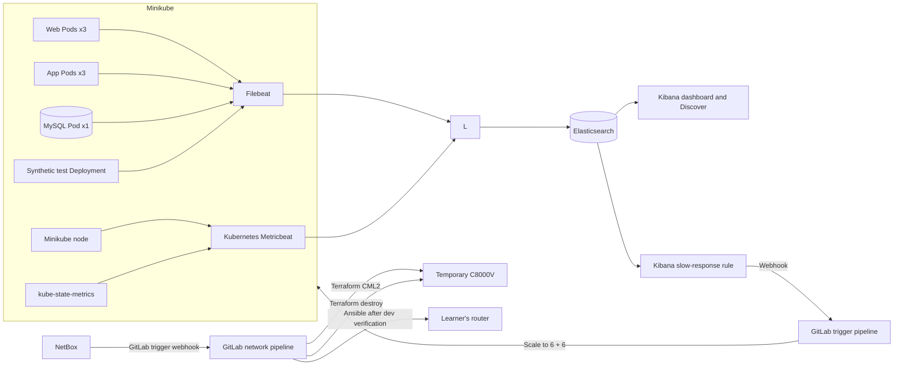

# Lab 8: NetBox-Driven Network Configuration

## Duration

**8 hours**

This standalone lab includes the complete application, Elastic observability, and alert-driven scaling capabilities from Lab 7. Each learner may choose a name for their authorized router in NetBox. When an IPv4 `/32` is assigned to a loopback interface, NetBox triggers a dedicated GitLab pipeline directly. The pipeline creates a temporary C8000V in Cisco Modeling Labs (CML), validates the intended configuration there, deploys it to the learner's authorized lab router, verifies production, and destroys the temporary CML lab.

All application, monitoring, configuration, Terraform, Ansible, test, Kubernetes, and pipeline files are included in the Lab 8 package. Completing an earlier lab is not required, although learners need access to the Lab 1 NetBox instance or an instructor-provided equivalent, CML 2.9 or newer, and the instructor-authorized IOS XE lab-router services described below.

The normal application capacity is three web Pods, three application Pods, and one MySQL Pod.

## Objectives

- Collect Kubernetes node, Pod, container, readiness, restart, and replica metrics.
- Display the number of running Pods for each application tier.
- Centralize NGINX, Flask, MySQL, and synthetic-monitor logs.
- Log each RESTCONF request and its complete response payload without storing credentials.
- Build a Kubernetes metrics dashboard for the Minikube node and application tiers.
- Explore Kubernetes, application, RESTCONF, and synthetic-monitor logs in Discover.
- Create an Elasticsearch query rule with learner-selected `x`, `y`, and `z` thresholds.
- Send an alert action through a Kibana webhook connector to a GitLab pipeline trigger.
- Scale the web and application tiers automatically from three to six replicas.
- Trigger the dedicated network-configuration pipeline directly from a NetBox IP-address event.
- Create and start a temporary C8000V development router with Terraform and the CML2 provider.
- Configure and verify all NetBox loopbacks on the development router with Ansible.
- Configure the authorized production lab router only after development verification succeeds.
- Verify that NetBox, development, and production contain the same number of loopbacks.
- Destroy the temporary CML development lab only after the development creation, configuration, and verification stages succeed.
- Display each inventory router's live loopback name, administrative status, protocol status, IP address, and mask.

## How the components work



Kubernetes Metricbeat monitors the node, Pods, containers, and volumes inside Minikube. kube-state-metrics provides desired and current workload state, including Pod counts. Filebeat collects Pod logs and detailed RESTCONF request/response events from the application. The synthetic test Deployment uses the real web interface at the interval selected by the learner and records the HTTP status and web response time.

## Before you begin: clean up the previous lab

Complete this section only if you performed Lab 7 on the same Minikube profile:

1. Open the Lab 7 project in GitLab.
2. Open **Build > Pipelines**.
3. Open the most recent successful pipeline for `main`.
4. Find the **cleanup** stage.
5. Select **Run** for the manual `cleanup-minikube` job.
6. Wait until the cleanup job succeeds.

The Lab 7 cleanup first drops its application database, clearing all application accounts and records. It then removes its namespace, workloads, MySQL claim, and persistent volume. Its database data is permanently deleted, but its Minikube images are retained.

Confirm that the shared application namespace has been removed:

```bash
kubectl get namespace network-devops
```

The expected result is `NotFound`. Lab 8 creates and uses the separate `network-devops` namespace.

### Required external lab services

Before starting, obtain instructor-authorized access to:

- The new NetBox instance installed in Lab 1, or an instructor-provided equivalent, with an administrator account for this isolated lab. Step 4 creates the catalog, learner-router record, management address, API token, custom field, event rule, and webhook from scratch. Each monitored device must be active and have a primary IPv4 address.
- CML 2.9 or newer with the `cat8000v` node definition, an installed C8000V image definition, and an external connector reachable from the GitLab runner.
- A learner's router, authorized by the instructor and available in NetBox, with SSH access for Ansible. Learners may choose its NetBox device name. Never target a production or shared device that the instructor has not explicitly authorized.
- A shell GitLab runner with `python3`, Python virtual-environment support, `curl`, `sha256sum`, `kubectl`, `minikube`, and `docker` available. The pipeline installs pinned Ansible and Terraform executables inside the project workspace and does not depend on the runner user's interactive environment or `PATH`.

## Step 1: Create the Lab 8 repository

Create a private GitLab project named `netdevops-lab08-netbox-cicd` and initialize it with a README.

Clone the new project and create the working branch:

```bash
mkdir -p ~/netdevops-labs
cd ~/netdevops-labs
git clone https://gitlab.com/YOUR-GITLAB-NAMESPACE/netdevops-lab08-netbox-cicd.git
cd netdevops-lab08-netbox-cicd
git switch -c feature/lab08-netbox-cicd
```

Copy only the complete instructor-provided Lab 8 files into the new repository:

```bash
cp -R "/path/to/Lab 08 - NetBox-Driven Network Configuration/." .
git status
```

Lab 8 has its own application source, tests, Dockerfiles, Kubernetes manifests, monitoring configuration, Terraform, Ansible, and namespace. Do not copy files from a Lab 7 learner repository.

## Step 2: Prepare the Lab 8 configuration

Start the Minikube profile:

```bash
minikube start --profile network-devops --driver=docker
minikube profile network-devops
minikube status --profile network-devops
```

Generate values for the pipeline variables and keep the output available for Step 4:

```bash
openssl rand -hex 16
openssl rand -hex 16
openssl rand -hex 32
python3 -c "from cryptography.fernet import Fernet; print(Fernet.generate_key().decode())"
```

## Step 3: Start ELK

Confirm that the Docker data filesystem has at least **10 GB of free space**:

```bash
df -h /var/lib/docker
```

The `Avail` column must show `10G` or more. Stop and free or expand disk space before continuing if the available space is lower. Insufficient disk space prevents Elasticsearch from allocating primary shards and leaves the cluster in `red` status.

```bash
cd ~/course-platform/elastic
cp ~/netdevops-labs/netdevops-lab08-netbox-cicd/elastic/compose.override.yaml .
cp ~/netdevops-labs/netdevops-lab08-netbox-cicd/elastic/logstash/pipeline/logstash.conf pipeline/
docker compose -f compose.yaml -f compose.override.yaml config --quiet
docker compose -f compose.yaml -f compose.override.yaml config \
  | grep -E 'XPACK_ENCRYPTEDSAVEDOBJECTS_ENCRYPTIONKEY|XPACK_ACTIONS_ALLOWEDHOSTS'
docker compose -f compose.yaml -f compose.override.yaml up -d
docker compose -f compose.yaml -f compose.override.yaml up -d --force-recreate kibana logstash
docker compose -f compose.yaml -f compose.override.yaml ps
docker compose -f compose.yaml -f compose.override.yaml exec kibana \
  printenv XPACK_ENCRYPTEDSAVEDOBJECTS_ENCRYPTIONKEY
curl -fsS 'http://127.0.0.1:9200/_cluster/health?wait_for_status=yellow&timeout=120s'
```

The merged configuration must display both `XPACK_` settings, and `printenv` must display `lab08-kibana-encrypted-objects-key-2026`. Do not continue if either check is empty. Recreating Logstash activates the Lab 8 index-routing pipeline even when the ELK containers were already running from Lab 1. Recreating Kibana applies the stable encrypted-saved-object key required by connectors and restricts outbound connector traffic to `gitlab.com`. The Logstash row must include `0.0.0.0:15044->5044/tcp`. Port `5044` remains available only on localhost for Lab 1, while port `15044` is the Lab 8 ingestion port for Kubernetes. Use this only on the isolated course workstation.

## Step 4: Determine the Logstash address

Use the Minikube gateway IP instead of a DNS hostname:

```bash
export LOGSTASH_IP=$(minikube ssh --profile network-devops -- \
  "ip route show default" | awk '{print $3; exit}')
export LOGSTASH_HOST="${LOGSTASH_IP}:15044"
echo "$LOGSTASH_HOST"
minikube ssh --profile network-devops -- "nc -zv ${LOGSTASH_IP} 15044"
```

Do not continue until the connection test reaches port `15044`.

### 4.1 Configure a new NetBox instance

Complete this section with the NetBox administrator account created during the NetBox installation. NetBox is the source of truth: create the learner's router in NetBox before deploying Lab 8. Names in this section are examples; learners may choose their own router name, but must use that exact case-sensitive name everywhere the guide says `NETBOX_ROUTER_NAME`.

#### A. Sign in and confirm the NetBox URL

1. Open the NetBox URL and sign in with the administrator account created during installation.
2. Copy only the base URL, for example `https://netbox.example.edu` or `http://192.0.2.20:8000`. Do not include `/api/`, a UI page path, or a trailing object ID.
3. Confirm that both the Ubuntu GitLab-runner host and the Minikube environment can reach this URL. Do not use `127.0.0.1` unless NetBox runs inside the same network namespace as the caller.

If NetBox was installed locally by Lab 1, Docker initially publishes it only on the Ubuntu loopback address. Inside an application Pod, `127.0.0.1` means that Pod—not the Ubuntu host—so it cannot reach host NetBox at `http://127.0.0.1:8000`.

Use the gateway that the Minikube node uses to reach the Ubuntu host. Publish NetBox on that host-side gateway address:

```bash
export MINIKUBE_HOST_IP=$(minikube ssh --profile network-devops -- \
  "ip route show default" | awk '{print $3; exit}')
cd ~/course-platform/netbox
sed -i "s/127.0.0.1:8000:8080/${MINIKUBE_HOST_IP}:8000:8080/" \
  docker-compose.override.yml
grep "${MINIKUBE_HOST_IP}:8000:8080" docker-compose.override.yml
docker compose config --quiet
docker compose up -d --force-recreate netbox
export NETBOX_URL="http://${MINIKUBE_HOST_IP}:8000"
echo "$NETBOX_URL"
ss -lnt | grep "${MINIKUBE_HOST_IP}:8000"
curl -fsS "$NETBOX_URL/api/status/" | jq
minikube ssh --profile network-devops -- \
  "curl -fsS '${NETBOX_URL}/api/status/'" | jq
```

The checks prove three different things: the Compose override contains the binding, Ubuntu is listening on the gateway address, and the Minikube node can reach the NetBox API. Do not continue unless all three succeed. If a host firewall blocks the final request, permit TCP port `8000` only from the Minikube profile's node address or subnet; do not open it to every network.

Record the printed URL. Enter this exact value in the application's **Inventory management** form. Never substitute `localhost` or `127.0.0.1` there. Do not create a `NETBOX_URL` GitLab variable.

This binding is for the isolated lab host; do not expose an unauthenticated HTTP NetBox service on a shared or public network. If the instructor provides a separate NetBox service, do not change its deployment—use its supplied URL instead.

For an instructor-provided NetBox service, set its supplied base URL and test the API endpoint from the Ubuntu host:

```bash
export NETBOX_URL="https://NETBOX-HOST"
curl -fsS "$NETBOX_URL/api/status/" | jq
```

For an isolated NetBox installation with a self-signed certificate, use `curl -k` only for this connectivity test and later set `NETBOX_SKIP_TLS_VERIFY=true`. Prefer a trusted certificate whenever available.

#### B. Create the minimum device catalog

Build the small device catalog used by this lab in the order below. A manufacturer must exist before its device type can be created. The platform is optional in NetBox, but this lab records it so the learner's router is clearly identified as IOS XE. Skip an object only if the instructor has already created the correct equivalent.

1. Open **Organization > Sites**, select **Add**, enter a name such as `Network DevOps Lab`, set **Status** to **Active**, and save.
2. Open **Devices > Manufacturers**, select **Add**, enter the router manufacturer (for example `Cisco`), and save.
3. Open **Devices > Device Types**, select **Add**, choose the manufacturer, enter the actual model of the learner's router, and save.
4. Open **Devices > Device Roles**, select **Add**, enter `Learner Router`, choose a color, and save.
5. Open **Devices > Platforms**, select **Add**, enter `IOS XE`, optionally select the manufacturer, and save.

Menu names can differ slightly between NetBox releases. Use the global search for **Sites**, **Manufacturers**, **Device Types**, **Device Roles**, or **Platforms** if an item is not under the stated menu.

#### C. Create the learner's router

1. Open **Devices > Devices** and select **Add**.
2. Enter a unique learner-selected name, for example `thandoan-router`. Record the spelling and capitalization; this becomes `NETBOX_ROUTER_NAME`.
3. Select the device type, role, site, and platform created above.
4. Set **Status** to **Active** and save.
5. In the left-side **Device Components** panel, locate **Interfaces** and select the **+ (Add)** icon on the same row.
6. Name the management interface exactly as it exists on the router, for example `GigabitEthernet1`.
7. Select the appropriate physical interface type, leave **Enabled** selected, optionally select **Management only**, and create the interface.
8. In the main left navigation, open **IPAM > IP Addresses**. This is a separate IPAM menu; do not look for an IP-address action inside the device or interface page.
9. Select **Add** in the IP Addresses page.
10. Enter the instructor-provided management address with its real prefix length, for example `192.0.2.10/24`, and set **Status** to **Active**.
11. In **Assignment**, select the **Device** tab. Use the **Interface** selector to choose the learner's router and then the management interface created above.
12. Select **Make this the primary IP for the device/VM**.
13. Save the IP address. NetBox assigns it to the selected interface and records it as the device's primary IPv4 address in the same operation.

The application ignores inactive devices and devices without a primary IPv4 address. Do not enter the RESTCONF TCP port as part of the IP address.

#### D. Add the optional RESTCONF-port field

The web application uses TCP port `443` when no custom value is set. If the learner's router uses another externally reachable RESTCONF port:

1. Open **Customization > Custom Fields** and select **Add**.
2. Set **Name** to exactly `restconf_port`. If the form shows a separate **Label** field, set it to `RESTCONF port`.
3. Set **Type** to **Integer**.
4. Under **Object types**, select **DCIM > Device**.
5. Make the field optional, then save.
6. Return to **Devices > Devices**, edit the learner's router, enter the externally reachable RESTCONF port in **RESTCONF port**, and save.

Use a value from `1` through `65535`. Leave the field empty when the router uses port `443`.

#### E. Create the NetBox API token

For this isolated learner lab, the simplest setup is to create a token for the learner account that owns the lab objects. In a shared environment, the instructor should instead provide a dedicated service account with view permission for devices, interfaces, and IP addresses.

1. Open the user profile menu and select **API Tokens**.
2. Select **Add a token**. The application supports both legacy tokens and NetBox v2 tokens.
3. Enter the description `Lab 8 inventory read access`.
4. Leave **Write enabled** disabled; Lab 8 reads NetBox through the API and creates new intent through the NetBox UI.
5. Set an expiration time if required by the course policy.
6. Create the token and copy its plaintext value immediately. NetBox may not display it again.
7. Keep the value ready for the application's **Inventory management** form; never commit it, create a GitLab variable for it, or paste it into screenshots.

Test the token from the Ubuntu runner host, replacing the placeholders without printing the token:

```bash
: "${NETBOX_URL:?Set NETBOX_URL to the reachable base URL from section A}"
read -rsp 'NetBox API token: ' NETBOX_API_TOKEN; echo
curl -fsS \
  -H "Authorization: Token $NETBOX_API_TOKEN" \
  -H 'Accept: application/json' \
  "$NETBOX_URL/api/dcim/devices/?name=YOUR-ROUTER-NAME" \
  | jq '{count, devices: [.results[] | {name, status: .status.value, primary_ip4: .primary_ip4.address}]}'
unset NETBOX_API_TOKEN
```

The result must show `count: 1`, status `active`, and the expected primary IPv4 address. Stop and correct NetBox before continuing if the result is empty or the primary address is `null`.

### 4.2 Create the GitLab CI/CD variables

In GitLab, open **Settings > CI/CD > Variables** and create:

| Key | Value |
|---|---|
| `MYSQL_PASSWORD` | First 16-byte hexadecimal value |
| `MYSQL_ROOT_PASSWORD` | Second 16-byte hexadecimal value |
| `FLASK_SECRET_KEY` | 32-byte hexadecimal value |
| `INVENTORY_ENCRYPTION_KEY` | Generated Fernet key |
| `LOGSTASH_HOST` | The value printed in Step 4 |
| `NETBOX_SKIP_TLS_VERIFY` | `false`; use `true` only for the instructor's isolated self-signed service |
| `NETBOX_ROUTER_USERNAME` | Shared IOS XE RESTCONF username stored separately from inventory data |
| `NETBOX_ROUTER_PASSWORD` | Shared IOS XE RESTCONF password stored separately from inventory data |

### 4.3 Create the GitLab pipeline trigger

Create a GitLab pipeline trigger token now:

1. Open **Settings > CI/CD > Pipeline trigger tokens**.
2. Create a token named `Lab 8 automation` and copy it immediately.
3. Return to the project's main page, open the top-right three-dot menu, and select **Copy project ID: NUMBER**.
4. Keep the trigger token and project ID available for Step 13.2. Do not add either value as a GitLab CI/CD variable; NetBox uses them in its direct webhook URL.
5. Add `NETBOX_ROUTER_NAME` as a GitLab CI/CD variable using the exact, case-sensitive learner-router name recorded in Step 4.1. Do not use a shared example name from another learner.

Select **Masked and hidden** for every secret when GitLab accepts the value. Keep the router variables available to trigger-token pipelines; do not restrict them to an environment scope that prevents those pipelines from reading them. `NETBOX_URL` and `NETBOX_API_TOKEN` are deliberately absent: learners enter them in the web application.

The normal `main` pipeline does not handle the GitLab trigger token or project ID. NetBox stores the direct webhook URL, including those values, and calls GitLab without an application-tier relay. NetBox API and router-variable validation belongs to the dedicated NetBox-triggered pipeline so the normal build and deployment workflow remains independent of NetBox automation readiness.

## Step 5: Create and start the Lab 8 runner

In GitLab:

1. Open **Settings > CI/CD > Runners**.
2. Select **Create project runner**.
3. Select Linux.
4. Add the tags `lab8` and `minikube`.
5. Disable **Run untagged jobs**.
6. Create the runner and copy its `glrt-` authentication token.

Build the supplied Lab 8 CI image. It contains Python, Docker CLI, `kubectl`, Minikube, Git, SSH, `curl`, `jq`, and `unzip`, so jobs do not depend on commands installed inside the runner container at runtime:

```bash
cd ~/netdevops-labs/netdevops-lab08-netbox-cicd
export LAB8_KUBECTL_VERSION="$(kubectl version --client -o json | jq -r '.clientVersion.gitVersion')"
export LAB8_MINIKUBE_VERSION="$(minikube version --short)"
docker build \
  --build-arg KUBECTL_VERSION="$LAB8_KUBECTL_VERSION" \
  --build-arg MINIKUBE_VERSION="$LAB8_MINIKUBE_VERSION" \
  -t lab8-ci-runner:latest \
  -f ci/Dockerfile .
docker run --rm lab8-ci-runner:latest bash -lc \
  'python3 --version && docker --version && kubectl version --client && minikube version'
```

Register a Docker executor as the current Ubuntu user:

```bash
mkdir -p ~/.gitlab-runner-lab08
gitlab-runner register \
  --config "$HOME/.gitlab-runner-lab08/config.toml" \
  --url https://gitlab.com \
  --token YOUR_LAB8_GLRT_TOKEN \
  --executor docker \
  --docker-image lab8-ci-runner:latest \
  --description lab08-minikube-docker-runner
```

Open `~/.gitlab-runner-lab08/config.toml`. Preserve the generated runner URL, ID, and token, then make its Docker-related settings match the following. These are TOML values; `$HOME` is not expanded inside the file, so use the literal Ubuntu home path shown.

```toml
[[runners]]
  executor = "docker"
  environment = ["HOME=/home/ubuntu"]

  [runners.docker]
    image = "lab8-ci-runner:latest"
    pull_policy = "if-not-present"
    network_mode = "host"
    privileged = true
    volumes = [
      "/cache",
      "/var/run/docker.sock:/var/run/docker.sock",
      "/home/ubuntu/.kube:/home/ubuntu/.kube:rw",
      "/home/ubuntu/.minikube:/home/ubuntu/.minikube:rw"
    ]
```

`network_mode = "host"` is required so the job container can reach CML and the temporary C8000V through the Ubuntu host's VPN and routes. The Docker socket lets image-build jobs use the host Docker daemon. Mounting the two Ubuntu directories at the same absolute paths preserves the certificate paths stored by Minikube and gives `kubectl` access to the existing `network-devops` profile. This trusted project runner is privileged and controls the host Docker daemon; never enable it for untrusted repositories.

Verify the executor before starting it:

```bash
gitlab-runner list --config "$HOME/.gitlab-runner-lab08/config.toml"
gitlab-runner verify --config "$HOME/.gitlab-runner-lab08/config.toml"
grep -E 'executor = "docker"|network_mode = "host"|image = "lab8-ci-runner:latest"' \
  "$HOME/.gitlab-runner-lab08/config.toml"
```

Start the runner in a separate terminal and keep it running:

```bash
gitlab-runner run --config "$HOME/.gitlab-runner-lab08/config.toml"
```

## Step 6: Deploy Lab 8 through CI/CD

Commit and push the supplied Lab 8 implementation:

```bash
git status
git add .
git diff --staged
git commit -m "Build NetBox-driven network automation"
git push -u origin feature/lab08-netbox-cicd
```

The feature-branch push does not create a pipeline. In GitLab:

1. Open **Code > Merge requests**.
2. Create a merge request from `feature/lab08-netbox-cicd` into `main`.
3. Review the changes and select **Merge**.
4. Open **Build > Pipelines** and select the new `main` pipeline.
5. Wait for `unit-test`, `build-images`, `deploy-minikube`, `verify-deployment`, and `post-deployment-web-test` to succeed.

The pipeline builds three images and deploys the web, application, and database tiers together with Filebeat, Metricbeat, kube-state-metrics, and the synthetic test Deployment. Do not run `docker build`, `minikube image load`, or `kubectl apply` manually.

Verify the deployed capacity:

```bash
kubectl -n network-devops get deployment,statefulset,pods -o wide
```

The web and application Deployments must show `3/3`; the configuration Deployment and database StatefulSet must show `1/1`.

## Step 7: Configure and test the application

Open the application:

```bash
minikube service network-monitor-web \
  --namespace network-devops \
  --profile network-devops
```

On the first visit, create the administrator account and sign in. Open **Inventory management**, enter the reachable **NetBox URL** and the read-only **NetBox API token** created in Step 4.1, then select **Retrieve inventory from NetBox**. The browser sends those values to the authenticated application-tier endpoint; the application tier—not the browser—calls the NetBox API. After a successful request, the application stores the URL and an encrypted token in its database so the NetBox-triggered pipeline can retrieve current loopback intent through the application. The plaintext token is never returned to the browser, and the token field is cleared after every attempt.

For host-installed NetBox, verify access from the actual application tier before retrieving inventory. Use the `NETBOX_URL` recorded in Step 4.1:

```bash
: "${NETBOX_URL:?Export the NetBox URL recorded in Step 4.1}"
kubectl -n network-devops exec deployment/network-monitor-app -- \
  python -c 'import sys,urllib.request; print(urllib.request.urlopen(sys.argv[1], timeout=10).status)' \
  "${NETBOX_URL}/api/status/"
```

The command must print `200`. It executes inside an application Pod, so success proves that the application tier—not merely the Ubuntu shell—can reach NetBox. Enter that same `NETBOX_URL` in the form.

Confirm that each retrieved row displays only:

- Device name
- Primary management IPv4 address
- Management RESTCONF port from the NetBox custom field `restconf_port`, or port `443` when that field is empty

Lab 8 intentionally provides no form or API route for manually creating or deleting devices. NetBox is the inventory source of truth. The dedicated NetBox-triggered pipeline requests sanitized loopback intent from the application and never receives the NetBox API token. RESTCONF credentials come from the masked `NETBOX_ROUTER_USERNAME` and `NETBOX_ROUTER_PASSWORD` GitLab variables and are never returned to the browser.

Open **Synthetic testing** and configure the test:

1. Enter a new username that is different from the administrator username.
2. Enter a password for this dedicated synthetic-test account.
3. Select an interval: **30 seconds**, **1 minute**, **2 minutes**, **5 minutes**, **10 minutes**, or **30 minutes**.
4. Select **Save and start testing**. The application creates the non-administrator account and stores the synthetic configuration.
5. Wait for the first check. The **Last synthetic test** panel changes to **Success** or **Failure** and shows the HTTP status, response time, and timestamp.
6. Confirm that the **Web response time** chart receives a point. This duration starts immediately before the synthetic client requests the network-monitor web page and stops when the initial web response finishes loading; it does not include login or RESTCONF collection time.

Generate a router collection from the web interface, and then confirm that the application logged RESTCONF request and response events:

```bash
kubectl -n network-devops logs deployment/network-monitor-app --since=2m \
  | grep RESTCONF
```

For each CPU and memory query, the request event contains `restconf.request.payload`, including the method, complete URL, Accept header, and an empty GET body. The response event contains the HTTP status, duration, and complete decoded RESTCONF payload in `restconf.response.payload`. The log does not contain the username, password, or authorization header.

To inspect the payloads directly, run:

```bash
kubectl -n network-devops logs deployment/network-monitor-app --since=10m \
  | jq 'select(."event.action" == "restconf_request" or ."event.action" == "restconf_response") | {
      timestamp: ."@timestamp",
      action: ."event.action",
      router: ."network.router.name",
      metric: ."network.router.metric",
      request: ."restconf.request.payload",
      status: ."http.response.status_code",
      response: ."restconf.response.payload"
    }'
```

```bash
kubectl -n network-devops get daemonset,deployment,pods -o wide
kubectl -n network-devops logs daemonset/filebeat --tail=20
kubectl -n network-devops logs daemonset/metricbeat --tail=20
kubectl -n network-devops logs deployment/metricbeat-state --tail=20
kubectl -n network-devops logs deployment/network-monitor-synthetic --tail=20
```

A successful result contains:

- `monitor.status: up`
- `event.outcome: success`
- `http.response.status_code: 200`
- `event.duration_ms`
- `event.duration_ms`, containing the network-monitor web response time

The synthetic Deployment checks for configuration changes every five seconds. A newly saved account or interval takes effect without redeploying the application.

## Step 8: Confirm Elasticsearch data

Use the web application, configure synthetic testing, wait for its first result, and then run:

```bash
for INDEX_PATTERN in \
  'kubernetes-metrics-*' \
  'kubernetes-logs-*' \
  'network-monitor-logs-*' \
  'network-monitor-synthetic-*'; do
  printf '\n%s\n' "$INDEX_PATTERN"
  curl -s "http://127.0.0.1:9200/_cat/indices/$INDEX_PATTERN?v"
done

curl -s 'http://127.0.0.1:9200/network-monitor-synthetic-*/_search?size=1&sort=@timestamp:desc' \
  | jq '.hits.hits[0]._source'
```

Do not continue to Step 9 until all four index families are listed. Kibana cannot create a data view for an index pattern that has not received any documents.

Filebeat mounts the Minikube node's `/var/log` tree and Docker's `/var/lib/docker/containers` directory read-only. Kubernetes container links resolve through `/var/log/pods` to the Docker runtime log, and Filebeat enriches each event with Pod metadata. Its fingerprint length is reduced to 64 bytes so short synthetic records are harvested. The Step 10 namespace filter keeps the dashboard scoped to this lab.

## Step 9: Create Kibana data views

Open `http://127.0.0.1:5601`, then open **Stack Management > Data Views**. Create these data views using `@timestamp` as the time field:

| Data view | Index pattern |
|---|---|
| Kubernetes metrics | `kubernetes-metrics-*` |
| Kubernetes logs | `kubernetes-logs-*` |
| Application logs | `network-monitor-logs-*` |
| Synthetic service | `network-monitor-synthetic-*` |

Confirm the data in **Discover**:

1. Open the main navigation menu in the upper-left corner.
2. Select **Discover**. If it is not visible, use the global search field at the top of Kibana, search for `Discover`, and select **Discover** from the results.
3. Alternatively, open `http://127.0.0.1:5601/app/discover` directly.
4. Open the data-view selector in the upper-left area of Discover.
5. Select each of the four data views and confirm that recent documents appear.
6. Set the time picker to **Last 24 hours** if no documents are initially displayed.

## Step 10: Build the Kubernetes metrics dashboard

Open the main navigation menu, select **Dashboards**, select **Create dashboard**, and save it as **Network DevOps — Kubernetes Metrics**.

Set the time picker to **Last 15 minutes**. To enable automatic refresh:

1. Select the calendar and down-arrow control immediately to the left of **Last 15 minutes**.
2. In the time-filter menu, open **Refresh every**.
3. Enter `30`, select **Seconds**, and enable or start the refresh interval.

The circular-arrow button to the right of the time range performs one manual refresh; it does not display the configured interval.

Leave the dashboard-level KQL query bar empty. Apply the namespace in the individual Pod, deployment, and container panel filters below. Node metric documents do not contain `kubernetes.namespace`, so a dashboard-wide namespace filter would hide the node panels.

Select **Add panel > New visualization** to open Lens. For every panel, first select the data view shown below, choose the visualization type, configure the fields, enter the panel filter, and select **Save and return**.

The Lens editor contains these controls:

- **Data view** is at the upper left and should show **Kubernetes metrics** for every dashboard panel.
- The KQL query bar runs across the top. Enter the panel filter here and press **Enter**.
- The visualization-type dropdown is the first control in the right pane. It initially displays **Bar**.
- **Horizontal axis**, **Vertical axis**, and **Breakdown** are field wells in the right pane.
- Select a configured field in a field well to change its operation, display name, value format, or other options.
- **Save and return** remains unavailable until the visualization has at least one metric.

Metricbeat writes a new document every 15 seconds. Therefore, **Count**, **Sum**, or a count of Pod documents over **Last 15 minutes** measures historical samples, not the current number of Pods. For the four current-value tiles, use **Last value** of the controller's ready or available replica gauge.

### Panel 1: Available web Pods

1. On the dashboard, select **Add > New visualization**.
2. Open the **Data view** selector and select **Kubernetes metrics**.
3. In the right pane, change the visualization type from **Bar** to **Metric**.
4. Enter the following filter in the KQL bar and press **Enter**:

   ```text
   kubernetes.namespace: "network-devops" AND event.dataset: kubernetes.deployment AND metricset.name: state_deployment AND kubernetes.deployment.name: "network-monitor-web"
   ```

5. Search for `kubernetes.deployment.replicas.available` in **Search field names**.
6. Drag `kubernetes.deployment.replicas.available` into **Primary metric**.
7. Select the added field and set **Operation** to **Last value**.
8. Set **Name** or **Display name** to `Available web Pods`.
9. Confirm that the preview displays `3` when the web tier has three available replicas.
10. Select **Save and return**.
11. Set the panel title to **Available web Pods**.

### Panel 2: Available application Pods

1. On the dashboard, select **Add > New visualization**.
2. Select the **Kubernetes metrics** data view.
3. Change the visualization type from **Bar** to **Metric**.
4. Enter the following filter in the KQL bar and press **Enter**:

   ```text
   kubernetes.namespace: "network-devops" AND event.dataset: kubernetes.deployment AND metricset.name: state_deployment AND kubernetes.deployment.name: "network-monitor-app"
   ```

5. Search for `kubernetes.deployment.replicas.available`.
6. Drag `kubernetes.deployment.replicas.available` into **Primary metric**.
7. Select the added field and set **Operation** to **Last value**.
8. Set **Name** or **Display name** to `Available application Pods`.
9. Confirm that the preview displays `3` when the application tier has three available replicas.
10. Select **Save and return**.
11. Set the panel title to **Available application Pods**.

### Panel 3: Ready database Pods

The database uses a StatefulSet rather than a Deployment. The Lab 8 Metricbeat manifest enables `state_statefulset` for this panel.

Before creating this panel, make sure the latest Lab 8 commit has been merged into `main` and that its pipeline has completed successfully. The deploy stage applies the updated Metricbeat ConfigMap and restarts `metricbeat-state`. Wait at least 30 seconds after the deployment, and then verify that StatefulSet documents are being collected:

```bash
kubectl -n network-devops get configmap metricbeat-state-config \
  -o jsonpath='{.data.metricbeat\.yml}' | grep state_statefulset

curl -s 'http://127.0.0.1:9200/kubernetes-metrics-*/_count' \
  -H 'Content-Type: application/json' \
  -d '{"query":{"term":{"metricset.name":"state_statefulset"}}}'
```

The first command must show `state_statefulset`, and the Elasticsearch response must show a `count` greater than zero. If the count is zero, confirm that `metricbeat-state` is running and check its recent logs:

```bash
kubectl -n network-devops get pods -l app=metricbeat,role=state
kubectl -n network-devops logs deployment/metricbeat-state --since=5m
```

Do not create the database visualization until Elasticsearch contains at least one `state_statefulset` document. Kibana can list mapped StatefulSet fields even when those fields do not yet contain data.

1. On the dashboard, select **Add > New visualization**.
2. Select the **Kubernetes metrics** data view.
3. Change the visualization type from **Bar** to **Metric**.
4. Enter the following filter in the KQL bar and press **Enter**:

   ```text
   kubernetes.namespace: "network-devops" AND event.dataset: kubernetes.statefulset AND metricset.name: state_statefulset AND kubernetes.statefulset.name: "network-monitor-db"
   ```

5. Search for `kubernetes.statefulset.replicas.ready`.
6. Drag `kubernetes.statefulset.replicas.ready` into **Primary metric**.
7. Select the added field and set **Operation** to **Last value**.
8. Set **Name** or **Display name** to `Ready database Pods`.
9. Confirm that the preview displays `1`.
10. Select **Save and return**.
11. Set the panel title to **Ready database Pods**.

Keep the dashboard at **Last 15 minutes** and auto-refresh every 30 seconds. **Last value** selects the newest gauge inside that time window, so scaling changes appear after the next 15-second Metricbeat collection. Do not use **Count**, **Sum**, or **Unique count** for these three tiles.

Add the Kubernetes charts with these Lens settings:

| Panel title | Visualization | Horizontal axis / Rows | Vertical axis / Metrics | Breakdown | Panel filter |
|---|---|---|---|---|---|
| Deployment replicas | Line | `@timestamp` date histogram | Last value of `kubernetes.deployment.replicas.desired`; last value of `kubernetes.deployment.replicas.available` | Top values of `kubernetes.deployment.name` | `kubernetes.namespace: "network-devops" AND event.dataset: kubernetes.deployment AND metricset.name: state_deployment` |
| Pod phase by tier | Bar, stacked | Top values of `kubernetes.labels.tier` | Unique count of `kubernetes.pod.name` | Top values of `kubernetes.pod.status.phase` | `kubernetes.namespace: "network-devops" AND event.dataset: kubernetes.pod AND metricset.name: state_pod` |
| Container restarts | Bar | Top values of `kubernetes.pod.name` | Maximum of `kubernetes.container.status.restarts` | Top values of `kubernetes.container.name` | `kubernetes.namespace: "network-devops" AND event.dataset: kubernetes.container AND metricset.name: state_container` |
| Pod CPU | Line | `@timestamp` date histogram | Average of `kubernetes.pod.cpu.usage.node.pct` | Top values of `kubernetes.pod.name` | `kubernetes.namespace: "network-devops" AND event.dataset: kubernetes.pod AND metricset.name: pod` |
| Pod memory | Line | `@timestamp` date histogram | Average of `kubernetes.pod.memory.usage.node.pct` | Top values of `kubernetes.pod.name` | `kubernetes.namespace: "network-devops" AND event.dataset: kubernetes.pod AND metricset.name: pod` |
| Minikube node CPU | Line | `@timestamp` date histogram | Average of `kubernetes.node.cpu.usage.nanocores` | Top values of `kubernetes.node.name` | `event.dataset: kubernetes.node AND metricset.name: node` |
| Minikube node memory | Line | `@timestamp` date histogram | Average of `kubernetes.node.memory.usage.bytes` | Top values of `kubernetes.node.name` | `event.dataset: kubernetes.node AND metricset.name: node` |

For percentage fields, open the metric dimension and set **Value format** to **Percent**. For byte fields, select **Bytes**. Give every panel the title shown in the table.

For each chart in the table:

1. Return to the dashboard and select **Add > New visualization**.
2. Confirm that the correct data view is selected.
3. Enter the full panel filter in the top KQL bar and press **Enter**.
4. Select **Bar** in the right pane and change it to the visualization listed in the table.
5. Select **Add or drag-and-drop a field** under each field well, search for the exact field name, and select it.
6. Select the added field to change its operation to **Average**, **Maximum**, **Last value**, **Unique count**, **Date histogram**, or **Top values**, as specified.
7. To add the second replica metric, select the plus control under **Vertical axis** and add `kubernetes.deployment.replicas.available` separately.
8. Use **Breakdown** only when the table specifies one. Leave it empty when the table says **None**.
9. Check the preview, select **Save and return**, open the panel actions menu, select **Edit panel settings**, and enter the panel title.

Arrange the three Pod-count metrics across the top and place the Kubernetes resource charts below them. Select **Save**.

The Pod-count panels use kube-state-metrics. Resource panels use kubelet metrics. Router CPU and memory fields must not be used for Kubernetes resource charts.

## Step 11: Explore logs in Discover

Do not create dashboards for the log data views. Use **Discover** to investigate Kubernetes logs, application and RESTCONF logs, and synthetic-monitor results.

### Explore Kubernetes Pod logs

1. Open the main navigation menu and select **Discover**.
2. Select the **Kubernetes logs** data view.
3. Set the time range to **Last 30 minutes**.
4. Enter this KQL query and press **Enter**:

   ```text
   kubernetes.namespace: "network-devops"
   ```

5. Add `@timestamp`, `kubernetes.pod.name`, `kubernetes.container.name`, `log.level`, and `message` as columns when those fields are available.
6. Sort `@timestamp` in descending order.
7. Select a document's expand control to inspect its complete JSON document.

### Explore application logs

1. Change the data view to **Application logs**.
2. Enter this KQL query and press **Enter**:

   ```text
   kubernetes.namespace: "network-devops"
   ```

3. Add `@timestamp`, `service.name`, `kubernetes.pod.name`, `log.level`, `event.action`, and `message` as columns.
4. Sort `@timestamp` in descending order.
5. To find warnings and errors, use:

   ```text
   kubernetes.namespace: "network-devops" AND log.level: (warning OR error)
   ```

### Explore RESTCONF requests and responses

1. Keep the **Application logs** data view selected.
2. Enter this KQL query and press **Enter**:

   ```text
   kubernetes.namespace: "network-devops" AND event.action: (restconf_request OR restconf_response)
   ```

3. Add `@timestamp`, `event.action`, `network.router.name`, `network.router.metric`, `http.response.status_code`, and `event.duration_ms` as columns.
4. Expand a `restconf_request` document and inspect `restconf.request.payload`.
5. Expand the corresponding `restconf_response` document and inspect the complete `restconf.response.payload`.
6. Confirm that no username, password, cookie, or authorization header is present.

### Explore synthetic-monitor results

1. Change the data view to **Synthetic service**.
2. Set the time range to **Last 30 minutes**.
3. Add `@timestamp`, `monitor.status`, `http.response.status_code`, `event.duration_ms`, `event.outcome`, `error.type`, and `error.message` as columns.
4. Sort `@timestamp` in descending order.
5. To display only failed checks, enter:

   ```text
   event.outcome: failure
   ```

6. Clear the query to display all checks again.

The synthetic check runs at the interval selected on the application's **Synthetic testing** page. Missing checks indicate a monitoring problem and do not prove that the application is healthy.

## Step 12: Create event-driven scaling with a Kibana rule

In this exercise, define three values and tune them during testing:

- `x`: number of slow synthetic results required to raise the alert
- `y`: lookback period, in minutes
- `z`: response-time threshold, in milliseconds

A useful starting point is `x = 3`, `y = 5`, and `z = 500`. Adjust `z` after observing the normal `event.duration_ms` values in Discover. The rule will alert when at least `x` synthetic results within the last `y` minutes are greater than `z` milliseconds.

### 12.1 Reuse the Lab 8 GitLab pipeline trigger

Reuse the `Lab 8 automation` trigger token and numeric Project ID created in Step 4. Construct this URL, replacing all three uppercase placeholders:

   ```text
   https://gitlab.com/api/v4/projects/PROJECT_ID/trigger/pipeline?token=TRIGGER_TOKEN&ref=BRANCH&variables%5BELASTIC_ACTION%5D=scale_out
   ```

   Use `main` for `BRANCH` unless your GitLab project uses another default branch. Keep the token secret and never add this URL to Git.

The root `.gitlab-ci.yml` conditionally loads one of three independent pipeline definitions. A normal push to `main` loads `.gitlab/main-pipeline.yml`; a trigger with `ELASTIC_ACTION=scale_out` loads `.gitlab/elastic-scale-out-pipeline.yml`; and a trigger with `NETBOX_ACTION=provision_loopback` loads `.gitlab/netbox-loopback-pipeline.yml`. Jobs from the other two definitions do not appear in each pipeline.

The Elastic-triggered pipeline has its own four stages:

1. `validate-alert` verifies the trigger source, action value, Minikube profile, and target deployments.
2. `scale-out` scales the web and application Deployments to six replicas and waits for both rollouts.
3. `verify-capacity` verifies six desired and six available replicas for both tiers.
4. `capacity-management` provides the manual `reset-capacity` job that restores both tiers to three replicas for another experiment.

### 12.2 Enable the Kibana connector license

The generic **Webhook** connector requires an Elastic Gold-capable license. The default Basic license does not enable it. For this lab, every learner must activate Elastic's free 30-day trial before creating the connector.

1. In Kibana, open the navigation menu.
2. Select **Management > Stack Management**.
3. Under **Stack**, select **License Management**.
4. Select **Start trial**.
5. Confirm **Start my trial** and wait for Kibana to report that the trial license is active.
6. Return to **Stack Management > Connectors**.
7. Select **Create connector** and confirm that the **Webhook** tile is enabled and no longer displays **This connector requires a Gold license**.

An Elastic cluster can start a trial only once. If License Management reports that a trial was previously activated, use an instructor-provided cluster with an active trial or another license that includes the Webhook connector. The Lab 8 Compose override separately configures the encryption key required to store connector secrets; activating the trial does not replace that configuration.

### 12.3 Create and test the GitLab Webhook connector

1. Open **Stack Management > Connectors** and select **Create connector**.
2. Choose **Webhook**.
3. Enter `GitLab - scale network monitor to six` as the connector name.
4. Set **Method** to `POST`.
5. Paste the URL constructed in section 12.1.
6. Under **Authentication**, select **None**. The GitLab pipeline trigger token is already contained in the connector URL, so do not configure Basic authentication, a username, or a password.
7. If a request body is requested, enter:

   ```json
   {}
   ```

8. Save the connector.
9. Select **Test**, send `{}`, and confirm that GitLab creates a pipeline.
10. In GitLab, open **Build > Pipelines** and open the pipeline marked **trigger token**. Confirm that its `validate-alert`, `scale-out`, and `verify-capacity` stages all succeed. Its final `capacity-management` stage contains the optional manual reset job. It must not contain the normal test, build, deploy, or cleanup stages.

Testing the connector performs a real scale-out. Verify the result, then restore the baseline before testing the rule:

```bash
kubectl -n network-devops get deployment network-monitor-web network-monitor-app
```

In the trigger-token pipeline created by the connector test, open the `capacity-management` stage and run the manual `reset-capacity` job. Confirm that both deployments return to three replicas before continuing.

### 12.4 Create the repeated-slow-response rule

1. In Kibana, open **Stack Management > Rules** and select **Create rule**.
2. Choose **Elasticsearch query** as the rule type.
3. Name the rule `Repeated slow synthetic responses`.
4. Select the `network-monitor-synthetic-*` index and `@timestamp` as the time field.
5. Choose **KQL** and enter the following query, replacing `Z` with your chosen response-time threshold:

   ```text
   event.dataset: "network_monitor.synthetic" AND event.duration_ms > Z
   ```

6. Set the time window to the last `y` minutes.
7. Set the threshold to a document count **greater than or equal to** `x`. If your Kibana version offers only **is above**, enter `x - 1`; for example, use **above 2** to trigger on three matching results.
8. Run the rule every 30 seconds or every 1 minute. The check interval must be shorter than `y`.
9. Add an action and select `GitLab - scale network monitor to six`.
10. Configure the action to run only when the alert becomes active or when its status changes to active. Do not run the action after every rule evaluation.
11. Enter `{}` as the Webhook body if the action form requests one.
12. Save and enable the rule.

Kibana versions label some fields differently. The resulting rule must express the same condition: count documents matching the KQL query during the last `y` minutes and alert when the count is at least `x`.

### 12.5 Generate results and observe automatic scaling

1. Sign in to the network-monitor web application.
2. Open **Synthetic testing** and select a 30-second or 1-minute interval.
3. Confirm that the dedicated synthetic-test account is configured and the latest checks succeed.
4. Wait until at least `x` results whose `event.duration_ms` exceeds `z` fall inside the `y`-minute window. For a quick demonstration, temporarily choose `z` slightly below the normal response time you observed in Discover.
5. In Kibana, open the rule details and confirm that its state becomes active.
6. In GitLab, open **Build > Pipelines** and confirm that a pipeline marked **trigger token** starts. Confirm that `validate-elastic-alert`, `scale-out-web-and-app`, and `verify-scaled-capacity` succeed in sequence.
7. Verify the live Kubernetes state:

   ```bash
   kubectl -n network-devops get deployment network-monitor-web network-monitor-app
   kubectl -n network-devops rollout status deployment/network-monitor-web --timeout=180s
   kubectl -n network-devops rollout status deployment/network-monitor-app --timeout=180s
   ```

Both deployments must show six desired and six available replicas. The database remains one Pod. After the next Metricbeat collection, the Kubernetes dashboard should show:

```text
Web Pods          6
Application Pods  6
Database Pods     1
Configuration Pods 1
```

### 12.6 Fine-tune and repeat the experiment

- Increase `z` if ordinary responses trigger the rule too easily.
- Increase `x` to ignore isolated slow checks.
- Increase `y` to detect sustained degradation over a longer period; decrease it to react faster.
- Let the rule recover before starting another trial. Running the action only when the alert becomes active prevents a new GitLab pipeline on every evaluation.
- To return to the three-replica baseline, run `reset-capacity` from the Elastic-triggered pipeline's `capacity-management` stage. Do not edit the manifests: they intentionally retain the normal value of three replicas.

Revoke the GitLab pipeline trigger token after completing the lab if the project will no longer use this automation.

## Step 13: Deliver NetBox loopback intent through development and production

Lab 8 adds a separate NetBox-triggered pipeline. It does not run the normal application or Elastic scaling jobs. Its enforced order is:

```text
validate NetBox event
  → create and start a temporary C8000V with Terraform CML2
  → configure C8000V loopbacks with Ansible
  → verify C8000V loopback count against NetBox
  → configure the learner's router with Ansible
  → verify the learner's router loopback count against NetBox
  → destroy the temporary CML lab with Terraform
```

The `validate-netbox-event` job checks `FLASK_SECRET_KEY`, `NETBOX_ROUTER_USERNAME`, `NETBOX_ROUTER_PASSWORD`, and `NETBOX_ROUTER_NAME`, resolves the running web service URL, and requests sanitized loopback intent from the application. It does not require `NETBOX_URL` or `NETBOX_API_TOKEN`; learners saved those through **Inventory management**. The production stage cannot begin unless variable validation and development verification succeed. The cleanup job uses GitLab's normal success behavior, so it is skipped when Terraform creation, development configuration, or development verification fails.

### 13.1 Create the required GitLab variables

Open **Settings > CI/CD > Variables** and add the following. Mark credentials and tokens **Masked and hidden**. Mark production and CML credentials **Protected** only if trigger-token pipelines on your default branch are allowed to read protected variables.

| Variable | Purpose |
|---|---|
| `CML2_ADDRESS` | CML controller URL |
| `CML2_TOKEN` | JWT copied from the CML user menu |
| `CML2_SKIP_VERIFY` | `false`; use `true` only for the isolated self-signed CML lab |
| `TF_VAR_c8000v_image_definition` | Exact installed C8000V image definition name |
| `TF_VAR_external_connector` | CML external connector label, normally `System Bridge` |
| `TF_VAR_dev_router_ip` | Unused static IPv4 address and prefix for C8000V `GigabitEthernet1`, for example `192.0.2.50/24` |
| `TF_VAR_dev_default_gateway` | IPv4 default gateway for that subnet, without a prefix |
| `TF_VAR_dev_username` | Temporary C8000V administrator username |
| `TF_VAR_dev_password` | Temporary C8000V administrator password |
| `PROD_ROUTER_HOST` | SSH address of the instructor-authorized learner router |
| `PROD_ROUTER_USERNAME` | Learner-router automation username |
| `PROD_ROUTER_PASSWORD` | Learner-router automation password |

Choose `TF_VAR_dev_router_ip` from the subnet connected to the selected CML external connector. It must be unused, reachable from the Ubuntu GitLab runner, and written in CIDR notation. Set `TF_VAR_dev_default_gateway` to the gateway on the same subnet. The pipeline rejects an invalid address or a gateway outside that subnet. During `terraform-dev`, Terraform supplies C8000V day-zero configuration that sets the hostname and domain name, creates the privilege-15 learner account with an explicitly clear-text input (`secret 0`) that IOS XE immediately hashes, enables AAA with the local user database for default login and EXEC authorization, enables SSH version 2, associates SSH with the `LAB8-SSH` key pair, applies the default AAA method to the VTY lines, configures the static address and mask on `GigabitEthernet1`, and adds `ip route 0.0.0.0 0.0.0.0 <gateway>`.

RSA key generation is an operational command and must not be placed directly in startup-config. The day-zero configuration therefore registers the `LAB8-GENERATE-SSH-KEY` EEM applet. Thirty seconds after boot, the applet checks whether `LAB8-SSH` exists and generates a labeled 2048-bit RSA general key only when it is absent. The `terraform-dev` job exports the configured address and waits up to ten minutes for TCP port 22; it cannot succeed and release `configure-dev` until SSH is listening.

The pipeline validates `CML2_ADDRESS`, `CML2_TOKEN`, and `CML2_SKIP_VERIFY`, then maps them explicitly to the Terraform variables `TF_VAR_address`, `TF_VAR_token`, and `TF_VAR_skip_verify`. The provider block consumes those variables directly; it does not depend on implicit provider environment discovery. Other Terraform inputs already use the `TF_VAR_` prefix. The pipeline stores Terraform state in GitLab's authenticated HTTP state backend named for the trigger pipeline; it does not upload state as a downloadable job artifact. Never place credentials in Terraform, Ansible, YAML, or Markdown files.

Each Ansible job creates `.ansible-venv` inside its clean Docker job container, installs the pinned version from `automation/requirements-python.txt`, installs the required collections from `automation/requirements.yml`, and calls `.ansible-venv/bin/ansible-playbook` explicitly. Do not rely on a learner-owned virtual environment or commands from the Ubuntu host.

Each Terraform job runs `automation/scripts/install_terraform.sh`, which downloads the pinned Linux build for the Docker job architecture, verifies it against HashiCorp's published SHA-256 checksum, and installs it as `.tools/terraform`. All Terraform commands use that explicit path. The `.tools/terraform` cache avoids downloading the same verified version for every job. Do not rely on Terraform installed on the Ubuntu host.

### 13.2 Build the direct GitLab trigger URL

Use the project ID and pipeline trigger token copied in Step 4.3. Replace all four placeholders below, but do not run or paste the completed URL into a shared terminal because it contains the trigger token:

```text
https://GITLAB-HOST/api/v4/projects/PROJECT-ID/trigger/pipeline?token=TRIGGER-TOKEN&ref=DEFAULT-BRANCH
```

For GitLab.com, `GITLAB-HOST` is `gitlab.com`. `PROJECT-ID` is the numeric project ID, `TRIGGER-TOKEN` is the Lab 8 pipeline trigger token, and `DEFAULT-BRANCH` is normally `main`. Keep the completed URL ready for the next section.

### 13.3 Create the NetBox webhook

1. Sign in to NetBox.
2. Open **Webhooks** from the NetBox navigation. If it is not visible in the expanded navigation, use NetBox's navigation search for `Webhooks`; do not use the browser's global page search.
3. Select **Add**.
4. Name the webhook `Lab 8 GitLab network pipeline`.
5. Set **URL** to the complete direct GitLab trigger URL from Step 13.2.
6. Set **HTTP method** to `POST` and **HTTP content type** to `application/json`.
7. Leave **Additional headers** empty.
8. Set **Body template** to this JSON. It supplies the variable that selects the dedicated NetBox pipeline:

   ```json
   {"variables":{"NETBOX_ACTION":"provision_loopback"}}
   ```

9. Keep SSL verification enabled.
10. Save the webhook.

Treat the webhook URL as a secret because it contains the GitLab trigger token. NetBox sends the POST request directly to GitLab; no application tier relays the webhook. The triggered pipeline uses `NETBOX_ROUTER_NAME` and the NetBox connection saved in **Inventory management** to retrieve and validate the learner router's complete current loopback intent.

### 13.4 Create the NetBox event rule

1. Open **Event Rules** from the NetBox navigation and select **Add**. If it is not visible in the expanded navigation, use NetBox's navigation search for `Event Rules`.
2. Name the rule `Learner router loopback assigned IPv4 address`.
3. Select object type **IPAM > IP Address**.
4. Enable the **Object created** and **Object updated** events. Enabling updated is necessary when an existing address is assigned to an interface after its creation.
5. Set **Action type** to **Webhook**, then set **Webhook** (the action choice) to `Lab 8 GitLab network pipeline`.
6. Save and enable the rule.

The event rule can start the pipeline for any created or updated IP-address object. The pipeline always retrieves the complete current IPv4 `/32` loopback intent for the device named by `NETBOX_ROUTER_NAME`; it does not trust event data as configuration input.

### 13.5 Create the learner-router loopback intent

1. In NetBox, open **Devices > Devices** and select the device whose name exactly matches your `NETBOX_ROUTER_NAME` value.
2. In the left-side **Device Components** panel, locate **Interfaces** and select the **+ (Add)** icon on the same row.
3. Enter an unused name such as `Loopback108`.
4. Select interface type **Virtual**, leave **Enabled** selected, and create the interface.
5. In the main left navigation, open **IPAM > IP Addresses** and select **Add**.
6. Enter an instructor-approved, unused IPv4 `/32`, for example `192.0.2.108/32` only when that documentation prefix is appropriate for the isolated lab.
7. Set **Status** to **Active** and, when the field is available, set **Role** to **Loopback**.
8. In **Assignment**, select the **Device** tab. Use the **Interface** selector to choose the learner's router and then the new loopback interface. Do not select **Make this the primary IP for the device/VM** for a test loopback.
9. Save the IP address. Creating this assigned IP-address object is the NetBox event that the Lab 8 event rule observes.

NetBox now sends the event directly to GitLab. Open the webhook's delivery/log view in NetBox and confirm that GitLab returned a successful `2xx` response. Do not copy a logged request URL into screenshots because it contains the trigger token.

### 13.6 Follow the dedicated GitLab pipeline

Open **Build > Pipelines** and select the new pipeline marked **trigger token**. It must show only these stages:

1. `validate-netbox-event`
2. `terraform-dev`
3. `configure-dev`
4. `verify-dev`
5. `configure-production`
6. `verify-production`
7. `cleanup-dev`

Confirm the following evidence in order:

- `validate-netbox-event` retrieves every virtual loopback with an IPv4 `/32` from the learner's NetBox device and writes `build/netbox-loopbacks.json`.
- `create-c8000v-development` creates and starts a temporary `cat8000v` node through the CML2 provider and obtains its management address.
- `configure-c8000v-development` applies all NetBox loopbacks idempotently.
- `verify-c8000v-development` succeeds only when the development C8000V loopback count equals the NetBox count.
- `configure-production-router` runs only after successful development verification and applies the same intent to the learner's router.
- `verify-production-router` succeeds only when the production count equals the NetBox count.
- `destroy-c8000v-development` runs only after the preceding development stages have succeeded and then destroys the temporary CML lab.

Do not retry only the production job after changing NetBox intent. Start a new event-driven pipeline so the current intent passes development validation first.

### 13.7 Display live loopbacks in the web application

1. Sign in to the Lab 8 web application.
2. Open **Inventory management**.
3. Locate your learner-named router and select **Loopbacks**.
4. Confirm that the table displays each loopback's **Name**, **Admin status**, **Protocol status**, **IP address**, and **Mask**.
5. Confirm that the new interface appears with the expected `/32` address and mask `255.255.255.255`.

The table is collected live from the learner's router through RESTCONF; it is not a copy of NetBox data. A mismatch therefore provides visible evidence that automation or verification needs investigation.

## Completion criteria

- Kubernetes node, Pod, container, readiness, restart, and replica metrics are visible.
- Pod-count panels show web `3`, application `3`, and database `1` during normal operation.
- Inventory management provides no manual device create or delete control.
- The application tier retrieves each active device's name, primary management IPv4 address, and RESTCONF port from NetBox, and the web tier displays those synchronized fields.
- NGINX, Flask, MySQL, and synthetic logs are searchable.
- Every RESTCONF CPU and memory query records a sanitized request object and the complete response payload without recording credentials.
- The synthetic test Deployment uses the dedicated learner-created account and selected interval.
- The application shows the last synthetic outcome and a chart of request-to-response time.
- Kubernetes logs, application logs, complete RESTCONF payloads, and synthetic results have been inspected in Discover.
- The only learner-created dashboard contains Kubernetes metrics.
- A learner-selected `x`, `y`, and `z` are configured in the repeated-slow-response Kibana rule.
- The Webhook connector starts the dedicated GitLab scale-out pipeline with `ELASTIC_ACTION=scale_out`.
- The dedicated trigger pipeline completes its validation, scale-out, and capacity-verification stages without loading the normal application pipeline or rebuilding images.
- Kibana reflects web `6`, application `6`, and database `1` after automatic scaling.
- NetBox sends its event webhook directly to the dedicated GitLab trigger pipeline.
- Terraform creates and later destroys a temporary C8000V lab through the CML2 provider.
- Development verification proves that the C8000V and NetBox loopback counts match before production configuration begins.
- Production verification proves that the learner's router and its NetBox device contain the same number of loopbacks.
- Inventory management displays live loopback name, administrative status, protocol status, IP address, and mask.
- No password, cookie, authorization header, or router credential is stored in Elasticsearch.

## Troubleshooting

### Application Pods enter `CrashLoopBackOff` during deployment

Inspect the current and previous application-container output first:

```bash
kubectl -n network-devops get pods -l app=network-monitor,tier=app
kubectl -n network-devops logs deployment/network-monitor-app --tail=100
kubectl -n network-devops logs deployment/network-monitor-app \
  --previous --tail=100
```

The deployment job now prints the Pod descriptions and the last 100 application log lines automatically when the application rollout fails. If the output contains MySQL `Access denied`, an existing database volume was initialized with different credentials. Restore the original `MYSQL_PASSWORD` and `MYSQL_ROOT_PASSWORD` GitLab variables, or run `cleanup-minikube` to permanently delete the Lab 8 database and volume before generating a new pair. Do not delete the volume if its records must be retained.

If the deployment reports `Unknown database 'network_monitor'`, authentication is working but an interrupted cleanup left the MySQL StatefulSet or volume after dropping the application database. The updated deployment checks credentials without selecting a database, then uses the verified root credential to run `CREATE DATABASE IF NOT EXISTS` and restore the application user's grant before deploying the app. Rerun the updated `main` pipeline; a manual database command is not required.

If the application reports that NetBox is not configured, sign in, open **Inventory management**, enter the NetBox URL and API token, and retrieve inventory successfully. The application Deployment maps only `NETBOX_SKIP_TLS_VERIFY`, `NETBOX_ROUTER_USERNAME`, and `NETBOX_ROUTER_PASSWORD` from `network-monitor-runtime`; the URL and token do not exist as GitLab or Kubernetes variables.

### Kubernetes collectors cannot reach Logstash

Repeat the gateway and port test from Step 4. Confirm that the Compose project publishes `0.0.0.0:15044->5044/tcp` and that the workstation firewall permits traffic from the Minikube network.

If `docker compose ps` does not show the `15044` mapping, copy the supplied override again and recreate Logstash:

```bash
cd ~/course-platform/elastic
cp ~/netdevops-labs/netdevops-lab08-netbox-cicd/elastic/compose.override.yaml .
docker compose -f compose.yaml -f compose.override.yaml up -d --force-recreate logstash
docker compose -f compose.yaml -f compose.override.yaml ps logstash
sudo ss -lntp | grep ':15044'
```

### Elasticsearch remains red

Check disk space first. Elasticsearch requires at least 10 GB free for this lab:

```bash
df -h /var/lib/docker
```

If less than 10 GB is available, free or expand the VM disk before retrying shard allocation.

Wait up to two minutes for primary shards to start:

```bash
curl -fsS 'http://127.0.0.1:9200/_cluster/health?wait_for_status=yellow&timeout=120s' | jq
```

If the status remains red, inspect Elasticsearch before continuing:

```bash
cd ~/course-platform/elastic
docker compose -f compose.yaml -f compose.override.yaml logs --tail=100 elasticsearch
curl -s 'http://127.0.0.1:9200/_cat/shards?v'
curl -s 'http://127.0.0.1:9200/_cluster/allocation/explain?pretty'
```

### Pod counts are empty

```bash
kubectl -n network-devops get deployment kube-state-metrics metricbeat-state
kubectl -n network-devops logs deployment/metricbeat-state --tail=50
```

Use the `kubernetes-metrics-*` data view and a time range containing recent events.

### Kibana cannot create `kubernetes-logs-*`

If Kibana lists `kubernetes-metrics-*` but rejects `kubernetes-logs-*`, Metricbeat is working but Filebeat has not published a Pod log event. Do not substitute the metrics index for the logs data view.

Confirm that Filebeat is ready and inspect its output:

```bash
kubectl -n network-devops get daemonset filebeat
kubectl -n network-devops get pods -l app=filebeat -o wide
kubectl -n network-devops logs daemonset/filebeat --tail=100 \
  | grep -Ei 'error|warn|logstash|publish|harvest' || true
```

Generate application activity by signing in to the web interface and opening the Monitoring tab. Wait 30 seconds, and then check again:

```bash
curl -s 'http://127.0.0.1:9200/_cat/indices/kubernetes-logs-*?v'
curl -s 'http://127.0.0.1:9200/_cat/indices/network-monitor-logs-*?v'
```

If neither index appears, commit and push the current Lab 8 files so the main-branch pipeline reapplies the Filebeat configuration and restarts the collector. Create the Kibana data views only after the indices appear.

### Only `kubernetes-logs-*` exists

This indicates that events are reaching Logstash but the Lab 8 routing pipeline is not active. Recopy the supplied pipeline and recreate only Logstash:

```bash
cd ~/course-platform/elastic
cp ~/netdevops-labs/netdevops-lab08-netbox-cicd/elastic/logstash/pipeline/logstash.conf pipeline/
docker compose -f compose.yaml -f compose.override.yaml \
  up -d --force-recreate logstash
docker compose -f compose.yaml -f compose.override.yaml logs --tail=100 logstash
```

Use the application, configure the synthetic check from Step 7, wait for its first result, and verify the four index families again with the Step 8 commands. Existing events remain in `kubernetes-logs-*`; newly received events are routed to the appropriate indices.

### Only `kubernetes-metrics-*` exists

This means Metricbeat is publishing, but Filebeat is not publishing container logs. Confirm that the current pipeline deployed the supplied Filebeat configuration:

```bash
kubectl -n network-devops rollout status daemonset/filebeat --timeout=180s
kubectl -n network-devops get pods -l app=filebeat -o wide
kubectl -n network-devops logs daemonset/filebeat --tail=100
kubectl -n network-devops get configmap filebeat-config \
  -o jsonpath='{.data.filebeat\.yml}' | grep 'paths:'
kubectl -n network-devops exec daemonset/filebeat -- sh -c \
  'find -L /var/log/containers -type f -print -quit'
```

The configured path must be `/var/log/containers/*.log`, the fingerprint length must be `64`, and the metadata matcher must use `/var/log/pods/`. The final command must print a readable log-file path. No output means the container symlinks are broken inside the Filebeat Pod.

Commit and push the current Lab 8 files. The main-branch pipeline reapplies the configuration, mounts both the Kubernetes and Docker runtime log paths, restarts Filebeat, and verifies that at least one complete symlink chain is readable. After the pipeline succeeds, use the web application, configure synthetic testing, wait for a result, and repeat the Step 8 index check.

### The synthetic check fails

Confirm that the dedicated test account is configured on the **Synthetic testing** page. Then inspect the Deployment log:

```bash
kubectl -n network-devops get deployment,pods -l app=network-monitor-synthetic
kubectl -n network-devops logs deployment/network-monitor-synthetic --tail=100
```

### The synthetic test succeeds but its index is missing

Confirm that the Deployment log contains `"event.dataset":"network_monitor.synthetic"`. Then reinstall the supplied Logstash pipeline and recreate Logstash so the dedicated synthetic routing rule is active:

```bash
cd ~/course-platform/elastic
cp ~/netdevops-labs/netdevops-lab08-netbox-cicd/elastic/logstash/pipeline/logstash.conf pipeline/
docker compose -f compose.yaml -f compose.override.yaml \
  up -d --force-recreate logstash
```

Wait for the next configured synthetic test and verify:

```bash
curl -s 'http://127.0.0.1:9200/_cat/indices/network-monitor-synthetic-*?v'
```

Previously collected synthetic events remain in `network-monitor-logs-*`; Logstash does not move historical documents when its routing pipeline changes.

### Webhook is not available as a connector type

If the Webhook tile displays **This connector requires a Gold license**, open **Stack Management > License Management** and activate the free 30-day trial as required in section 12.2. Then reload **Stack Management > Connectors**. If a trial has already been used on this cluster, ask the instructor for a cluster with an active trial or an eligible license.

If the license is active but Kibana instead reports that encrypted saved objects are unavailable, recopy the Lab 8 override and recreate Kibana:

```bash
cd ~/course-platform/elastic
cp ~/netdevops-labs/netdevops-lab08-netbox-cicd/elastic/compose.override.yaml .
docker compose -f compose.yaml -f compose.override.yaml \
  up -d --force-recreate kibana
docker compose -f compose.yaml -f compose.override.yaml logs --tail=100 kibana
```

Confirm that the running container received the key:

```bash
docker compose -f compose.yaml -f compose.override.yaml exec kibana \
  printenv XPACK_ENCRYPTEDSAVEDOBJECTS_ENCRYPTIONKEY
```

If the command prints nothing, the override was not included when Kibana was recreated. Run the commands from `~/course-platform/elastic` and include both `-f compose.yaml` and `-f compose.override.yaml`. When the command prints the Lab 8 key, wait for Kibana to become ready, reload the browser page, and then select **Create connector** again.

### The Webhook connector test fails

Confirm that the URL uses `https://gitlab.com`, the numeric Project ID, an active trigger token, the correct default branch, and the URL-encoded variable `variables%5BELASTIC_ACTION%5D=scale_out`. The Lab 8 override allows only `gitlab.com` for outbound Kibana actions. Inspect Kibana logs if the connector reports a networking or host-allowlist error.

### GitLab does not create a trigger pipeline

Use the connector's **Test** function and check its HTTP response. A successful GitLab trigger request returns pipeline data. A `400` response commonly indicates an invalid branch; `401` or `404` commonly indicates an invalid token or Project ID. Recreate a trigger token if its value was lost—the full token is shown only when it is created.

### A trigger pipeline is created but the scaling job is skipped

Confirm that the pipeline source is `trigger` and the request contains the exact variable `ELASTIC_ACTION=scale_out`. This condition causes the root configuration to load `.gitlab/elastic-scale-out-pipeline.yml`; any other value loads no scale-out jobs. Do not use a normal project access token in place of a pipeline trigger token. Confirm that an online runner has both `lab8` and `minikube` tags.

### The rule starts too many pipelines

Edit the rule action frequency so the connector runs only when the alert becomes active or changes to active. Do not select an action frequency that runs on every evaluation. Before another test, wait for the query count to fall below `x` so the alert recovers.

### The scale-out job fails

Confirm that the local GitLab runner can access the `network-devops` Minikube profile and that the baseline deployment completed successfully:

```bash
minikube status --profile network-devops
kubectl -n network-devops get deployment network-monitor-web network-monitor-app
```

If either deployment is absent, run the normal `main` pipeline before testing the alert workflow.

### NetBox reports a failed webhook

Open the NetBox webhook delivery/log entry and inspect the GitLab response code. Confirm that the URL uses the correct GitLab host, numeric project ID, unrevoked trigger token, and default branch. Confirm that the JSON body contains `"NETBOX_ACTION":"provision_loopback"`. A `401` indicates an invalid or revoked trigger token, `404` commonly indicates the wrong GitLab host or project ID, and a successful request returns `2xx`. Never place the complete URL in screenshots or shared logs because it contains the trigger token.

### Inventory retrieval from NetBox fails

Confirm that the learner entered the URL and token in **Inventory management** and completed a successful retrieval. Do not add `NETBOX_URL` or `NETBOX_API_TOKEN` to GitLab. The token must be permitted to read devices, interfaces, and IP addresses; each device that should appear must be active and have a primary IPv4 address. Also confirm that `NETBOX_ROUTER_USERNAME` and `NETBOX_ROUTER_PASSWORD` are configured in GitLab. If the optional `restconf_port` custom field is populated, its value must be an integer from `1` through `65535`; an empty field defaults to `443`.

When NetBox runs on the Ubuntu host, confirm that the URL uses the Minikube host-gateway address established in Step 4.1. `127.0.0.1` and `localhost` cannot work from the application Pod. Repeat both connectivity checks:

```bash
minikube ssh --profile network-devops -- \
  "curl -fsS '${NETBOX_URL}/api/status/'" | jq
kubectl -n network-devops exec deployment/network-monitor-app -- \
  python -c 'import sys,urllib.request; print(urllib.request.urlopen(sys.argv[1], timeout=10).status)' \
  "${NETBOX_URL}/api/status/"
```

Inspect the application tier without exposing the token:

```bash
kubectl -n network-devops logs deployment/network-monitor-app --tail=100
kubectl -n network-devops get secret network-monitor-runtime
```

Do not print or decode the Secret in shared output. For a NetBox instance using a lab certificate, set `NETBOX_SKIP_TLS_VERIFY` to `true`, rerun the normal `main` pipeline, and retry **Retrieve inventory from NetBox**. The browser never contacts NetBox directly; a browser-side request to the NetBox API indicates that the wrong application version is deployed.

### The NetBox trigger pipeline has no jobs

Confirm that the direct NetBox webhook body is valid JSON and contains `{"variables":{"NETBOX_ACTION":"provision_loopback"}}`. This value conditionally loads `.gitlab/netbox-loopback-pipeline.yml`. Confirm that the trigger token has not been revoked and that the URL's `ref` names the default branch containing that file.

### Terraform cannot create the C8000V

Confirm CML is version 2.9 or newer and check `CML2_ADDRESS`, `CML2_TOKEN`, `CML2_SKIP_VERIFY`, `TF_VAR_c8000v_image_definition`, `TF_VAR_external_connector`, `TF_VAR_dev_router_ip`, and `TF_VAR_dev_default_gateway`. `CML2_ADDRESS` must be the full controller URL beginning with `https://`; do not enter only an IP address. The development router value must include its prefix, its gateway must be in the same external-connector subnet, and the address must be reachable from the GitLab runner. The pipeline explicitly maps the CML values into the provider's required `address`, `token`, and `skip_verify` arguments. The image definition must already be installed and compatible with the `cat8000v` node definition. Check CML capacity before retrying; a C8000V requires substantial CPU and memory.

If the job reports that `terraform` is not found, confirm it is using the current pipeline definition. The log must show `automation/scripts/install_terraform.sh`, the pinned Terraform version, and commands executed through `$CI_PROJECT_DIR/.tools/terraform`. Confirm the job uses `lab8-ci-runner:latest`; a bare `terraform` command indicates an older pipeline file.

### Development Ansible cannot connect

Open the `create-c8000v-development` job and confirm `dev_router_ip` equals the host portion of `TF_VAR_dev_router_ip`. Confirm that the static address is unused, its gateway is reachable through the selected external connector, and TCP port 22 is allowed from the GitLab runner. The Terraform job waits up to ten minutes for an actual SSH protocol banner rather than treating an open TCP socket as sufficient. In the C8000V console, use `show event manager policy registered` and `show event manager history events` to inspect `LAB8-GENERATE-SSH-KEY`, `show ip ssh` to confirm SSH version 2 is enabled, and `show crypto key mypubkey rsa` to confirm the labeled 2048-bit RSA key exists.

If an Ansible job reports that `ansible-galaxy` or `ansible-playbook` is not found, confirm the job is using the current pipeline definition and that `python3 -m venv .ansible-venv` succeeded. The commands must appear as `.ansible-venv/bin/ansible-galaxy` and `.ansible-venv/bin/ansible-playbook` in the job log; a bare command indicates an older pipeline file.

If a job reports `paramiko is not installed`, the pipeline is using an older Python dependency list. The current job installs Paramiko inside `.ansible-venv`, verifies the import before running Ansible, sets `ANSIBLE_NETWORK_CLI_SSH_TYPE=paramiko`, and loads `automation/ansible/ansible.cfg`. In the `ansible-playbook --version` output, `config file` must show that file rather than `None`.

The slow Ansible `wait_for_connection` task is not used. Readiness belongs to `terraform-dev`, where `wait_for_ssh.py` waits until IOS XE returns a valid `SSH-` protocol banner. The following Ansible stage can therefore begin directly with its configuration or verification task.

**Linux performs SSH host-key checking independently of username/password authentication. Every temporary C8000V receives a newly generated SSH host key, even though the lab reuses the same development IP address. Linux therefore sees a legitimate replacement router as `REMOTE HOST IDENTIFICATION HAS CHANGED`.** For this isolated instructional lab, `ansible.cfg` and the pipeline variables disable SSH host-key checking and enable Paramiko host-key auto-add for all development and production Ansible jobs. Learners therefore do not have to maintain the runner user's `~/.ssh/known_hosts`. This lab-wide setting trades host identity verification for repeatable automation and must not be copied into a production environment.

If IOS XE reports `Authentication failed`, confirm `TF_VAR_dev_username` and `TF_VAR_dev_password` exactly match the username and password supplied to the temporary C8000V by Terraform. In GitLab, both entries must use **Type: Variable**, not **File**. Start a new NetBox-triggered pipeline after correcting either value, because changing a variable cannot change the credentials already embedded in an existing temporary router's day-zero configuration. The pipeline writes credentials to a mode-`0600` JSON inventory and never publishes it as an artifact. The day-zero configuration explicitly uses `secret 0`, `aaa authentication login default local`, and `aaa authorization exec default local`; this prevents a leading password digit from being misread as an IOS secret type and prevents image-default AAA behavior from overriding the local account.

### Loopback verification fails

Download `build/netbox-loopbacks.json` from the trigger pipeline and compare its non-secret intent with `show ip interface brief | include ^Loopback`. Correct NetBox or device drift and generate a new NetBox event. Never bypass `verify-dev` to run the production stage.

### CML cleanup fails

Do not delete the pipeline's GitLab-managed Terraform state before cleanup. If `destroy-c8000v-development` runs and fails, retry that job. If an earlier development stage fails, GitLab intentionally skips `cleanup-dev`; use the CML UI to locate the lab named `Lab 8 loopback validation`, confirm that it belongs to this learner pipeline, and delete only that temporary lab before retrying the workflow. If state is unavailable, the same instructor-authorized manual cleanup is required.

## Cleanup

In GitLab, open the successful Lab 8 `main` pipeline and run the manual `cleanup-minikube` job. Wait until it succeeds. The job removes:

- The entire `network-devops` namespace and all Lab 8 workloads.
- All application records, including the administrator account, synthetic-test account and configuration, router inventory, and synthetic results. The job explicitly drops the application database before removing storage.
- The MySQL persistent volume claim and its associated persistent volume, permanently deleting the database storage.

The cleanup job verifies that the namespace and captured database PV no longer exist. It leaves Minikube images, the shared Minikube profile, and the external ELK installation intact.

Confirm that the most recent NetBox-triggered pipeline completed `destroy-c8000v-development` and that the temporary `Lab 8 loopback validation` lab is absent from CML. In NetBox, disable and delete `Learner router loopback assigned IPv4 address`, then delete the `Lab 8 GitLab network pipeline` webhook. Remove only the loopback/IP objects that the instructor authorizes learners to remove.

In Kibana, delete the `Repeated slow synthetic responses` rule and the `GitLab - scale network monitor to six` connector. In GitLab, return to **Settings > CI/CD > Pipeline trigger tokens** and revoke `Lab 8 automation`. These external objects cannot be removed safely by the Kubernetes cleanup job.

Stop ELK without deleting its data:

```bash
cd ~/course-platform/elastic
docker compose -f compose.yaml -f compose.override.yaml stop
```
