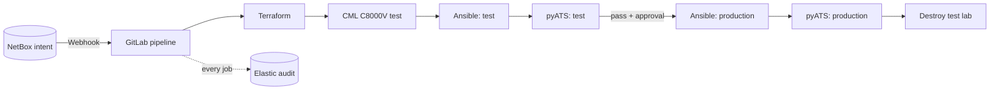

# Lab 8: Production-Grade Network CI/CD — From Intent to Validated Deployment

## Duration

**8 hours**

The final lab brings the course components together in a controlled network delivery workflow. NetBox records the intended loopback interface. Its webhook starts a dedicated GitLab pipeline, but the requested change is not sent directly to production. Terraform creates an isolated Cisco C8000V test router on demand on an instructor-provided Cisco Modeling Labs (CML) system. Ansible applies the intended loopback, and pyATS independently verifies its address and operational state. The pipeline then destroys the temporary CML lab and router immediately after the test gate finishes. Only a successful test and successful cleanup permit a reviewed production promotion. Ansible and pyATS then repeat the change and verification against the production router.

Every pipeline job produces two forms of evidence: the immutable GitLab job log and structured audit events in Elasticsearch. Audit records identify the intent, actor, source commit, pipeline, job, target environment, target device, image digest, action, outcome, duration, and error category without recording passwords or tokens.

## Objectives

After completing the lab, learners will be able to:

- Use NetBox as the source of truth for a loopback change.
- Trigger a purpose-specific GitLab pipeline from a NetBox Event Rule.
- Use the CiscoDevNet CML2 Terraform provider to create an ephemeral C8000V test environment.
- Retrieve CML, test-router, production-router, NetBox, and audit integration data from Vault.
- Build separate Ansible deployment and pyATS verification images.
- Deploy and validate the change in test before production becomes available.
- Protect production with a manual approval, protected environment, and serialized resource group.
- Destroy the temporary CML environment after the evidence has been collected.
- Investigate a complete pipeline audit trail in Kibana.

## Delivery architecture



The gates are deliberate. A pipeline cannot promote an untested revision, test evidence refers to the same NetBox intent and commit as production, and only a protected operator can authorize the production environment.

## Supplied files

```text
Lab 08 - Production-Grade Network CI-CD/
├── Lab8.md
├── app/ and lab04-web/              # read-only NetBox loopback page
├── terraform/cml-test/
│   ├── versions.tf
│   ├── variables.tf
│   ├── main.tf
│   └── outputs.tf
├── ansible/
│   ├── ansible.cfg
│   ├── deploy_loopback.yml
│   └── inventory_from_vault.py
├── automation/
│   ├── common.py
│   ├── verify_loopback.py
│   ├── Dockerfile.ansible
│   ├── Dockerfile.pyats
│   └── requirements-*.txt
├── ci/
│   ├── audit.py
│   ├── audit-job.sh
│   ├── render-cml-inputs.py
│   └── comprehensive-network-pipeline.yml
├── elastic/logstash.conf
├── platform/netbox/
├── scripts/
└── tests/
```

## 1. Prepare the cumulative project

Start from the repository completed in Lab 7:

```bash
cd ~/network-devops
git status
git pull --ff-only
git switch -c feature/lab08-comprehensive-delivery
cp -R "/path/to/Lab 08 - Production-Grade Network CI-CD/app/." app/
cp -R "/path/to/Lab 08 - Production-Grade Network CI-CD/lab04-web/." lab04-web/
cp -R "/path/to/Lab 08 - Production-Grade Network CI-CD/terraform" .
cp -R "/path/to/Lab 08 - Production-Grade Network CI-CD/ansible" .
cp -R "/path/to/Lab 08 - Production-Grade Network CI-CD/automation" .
cp -R "/path/to/Lab 08 - Production-Grade Network CI-CD/ci/." ci/
cp -R "/path/to/Lab 08 - Production-Grade Network CI-CD/scripts/." scripts/
cp -R "/path/to/Lab 08 - Production-Grade Network CI-CD/elastic/." elastic/
```

Review every file before committing it. The supplied values are examples, not authorization to access a router or CML system.

## 2. Prepare the instructor-provided CML environment

The instructor supplies a CML 2.9 or later system that the private GitLab runner can reach. Confirm the following before the lab:

- A C8000V node definition and image are installed and licensed for use in CML.
- Sufficient CPU, memory, and node licensing are available for each concurrent pipeline.
- An external connector exposes the test management subnet to the runner.
- The test subnet, gateway, and allocated address range do not overlap production.
- The CML API certificate is trusted by the runner, or the instructor has explicitly approved lab-only certificate verification settings.
- Each learner or group has a restricted CML token and an isolated address allocation.

The provider is currently beta and provider/CML compatibility matters. The supplied configuration pins `CiscoDevNet/cml2` to the instructor-tested version range. Run `terraform init -upgrade` only when intentionally testing an upgrade.

## 3. Store integrations and targets in Vault

Keep the following records in Vault. Do not place their values in Git, NetBox custom fields, Terraform variables committed to the repository, GitLab job commands, or screenshots.

| Vault path | Required fields | Purpose |
|---|---|---|
| `secret/integrations/netbox` | `url`, `token`, `verify_tls` | Resolve the NetBox IP-address event |
| `secret/integrations/cml` | `address`, `token`, `skip_verify`, `external_connector`, `node_definition`, `image_definition` | Create the test lab |
| `secret/network/test/c8000v` | `management_ip`, `prefix_length`, `gateway`, `username`, `password` | Bootstrap and access the ephemeral router |
| `secret/network/routers/<NetBox device>` | `host`, `port`, `username`, `password`, `ssh_host_key`, `platform`, `enabled` | Access the authorized production router and pin its SSH identity |
| `secret/integrations/elastic-audit` | `url`, `api_key`, `verify_tls` | Send structured audit events |

The test password is still sensitive even though the router is temporary. Use a per-class or per-pipeline credential, rotate it, and never reuse a production password.

Run the supplied policy helper after the records have been created:

```bash
kubectl apply -f kubernetes/automation-identity.yaml
export VAULT_BOOTSTRAP_TOKEN
bash scripts/configure-vault-netbox.sh
```

For GitLab Docker-runner jobs, configure a narrowly scoped Vault authentication method. In a production platform, use GitLab OpenID Connect ID tokens with Vault JWT authentication. The course fallback uses protected and masked `VAULT_ROLE_ID` and `VAULT_SECRET_ID` variables for a read-only AppRole. Never use the Vault root or bootstrap token in CI.

## 4. Model loopback intent in NetBox

Create or confirm the production device, its primary management IP, and a loopback interface. Assign the requested IPv4 prefix to the loopback. The IP-address object must be assigned to the interface; this completed association is what the webhook reports.

NetBox stores intent, not device credentials and not deployment status. The application’s **Loopbacks** page remains read-only and displays the intended device, interface, address, and prefix.

Create a read-only NetBox token and store it in Vault. Then test the page:

```bash
python -m pytest -q tests/test_netbox_loopbacks.py
docker build -t network-monitor-app:lab08 -f app/Dockerfile .
docker build -t network-monitor-web:lab08 lab04-web
```

## 5. Review the Terraform test environment

`terraform/cml-test/main.tf` creates a uniquely named lab, an instructor-selected external connector, an unmanaged switch, and one C8000V with a bootstrap configuration. The lifecycle resource starts the topology after its nodes and links exist. Terraform outputs the test management address and CML object IDs needed for audit and cleanup.

```bash
terraform -chdir=terraform/cml-test fmt -check
terraform -chdir=terraform/cml-test init -backend=false
terraform -chdir=terraform/cml-test validate
```

The CML token and generated bootstrap configuration are sensitive. The supplied CI helper uses GitLab's authenticated HTTP Terraform-state backend; it does not publish `terraform.tfstate` as a job artifact. Restrict state access, enable the platform's encryption and backup controls, and rotate the temporary test credential after class.

## 6. Deploy with Ansible

The deployment image uses `ansible.netcommon.network_cli` and `cisco.ios.ios_config`. `inventory_from_vault.py` resolves the NetBox event, selects test or production, and returns dynamic inventory without printing a password. The playbook validates the interface and address, applies the change idempotently, saves only when changed, and writes a sanitized result artifact.

```bash
docker build -t loopback-ansible:lab08 -f automation/Dockerfile.ansible .
docker build -t loopback-pyats:lab08 -f automation/Dockerfile.pyats .
docker image inspect loopback-ansible:lab08 loopback-pyats:lab08 \
  --format 'Image={{.RepoTags}} Digest={{.Id}} User={{.Config.User}}'
```

pyATS remains independent of Ansible. It reconnects to the selected target and proves that the exact interface and IP address appear with protocol and interface state `up/up`.

## 7. Configure comprehensive Elastic auditing

Expose a TLS-protected HTTP input for CI audit events. Use the supplied Logstash pipeline as a starting point and place authentication or a reverse proxy in front of it. Store the final endpoint and API key in Vault.

Each audit event includes, where applicable:

- UTC timestamp, event ID, schema version, action, category, type, outcome, and duration;
- GitLab project, pipeline, job, stage, source, ref, commit SHA, user ID, username, and runner ID;
- NetBox object ID, production device, loopback interface, intended prefix, and intent fingerprint;
- Terraform version, provider lock checksum, plan checksum, CML lab ID, node ID, and lifecycle result;
- container image name and immutable digest;
- target environment, management address, Ansible changed count, and play recap;
- pyATS test name, expected address, observed state, and assertion result;
- approval job and protected environment identity supplied by GitLab; and
- cleanup result and sanitized error type.

Never send passwords, tokens, authorization headers, Vault responses, raw environment dumps, complete device configurations, or unfiltered command output. More auditing means richer safe context, not secret collection.

```bash
python ci/audit.py emit --action audit_connectivity_test --outcome success \
  --category configuration --message "Lab 8 audit path verified"
```

Create a Kibana data view for `network-cicd-audit-*`.

## 8. Add the comprehensive pipeline

Use this include:

```yaml
include:
  - local: ci/comprehensive-network-pipeline.yml
```

Application-delivery jobs continue to run for pushes and merge requests. Network jobs run only for a trigger where `PIPELINE_PURPOSE=network_change` and `NETBOX_IP_ID` is a positive integer.

The jobs execute in this order:

1. Resolve and freeze the NetBox intent.
2. Validate Terraform, Ansible, and Python source.
3. Build and push Ansible and pyATS images.
4. Create and start the CML C8000V test environment.
5. Wait for test-router SSH readiness.
6. Apply the loopback to test with Ansible.
7. Verify test with pyATS.
8. Destroy the disposable CML test environment after its evidence is retained.
9. Request protected manual production approval.
10. Apply the identical intent to production with Ansible.
11. Verify production with pyATS.

`needs` relationships enforce the chain. `resource_group: production-network-change` serializes production changes. Configure `course/production-network` as a protected environment with required approvers.

## 9. Configure the NetBox trigger

Create a GitLab pipeline trigger token named `netbox-network-change`. Configure the NetBox webhook:

- Method: `POST`
- URL: `https://gitlab.com/api/v4/projects/<project-id>/trigger/pipeline?token=<trigger-token>&ref=main`
- Content type: `application/x-www-form-urlencoded`
- TLS verification: enabled
- Body:

```text
variables[PIPELINE_PURPOSE]=network_change&variables[NETBOX_IP_ID]={{ data['id'] }}
```

Create an Event Rule for **IPAM > IP address**, event **Object created**, using this webhook. Restrict the rule to the course scope where supported. Only trusted administrators should view the webhook because its URL contains a trigger token.

## 10. Execute the test deployment

Create a loopback interface in NetBox and assign a new IPv4 prefix. Follow the triggered pipeline, but do not approve production yet. Confirm this evidence sequence:

```text
intent -> validation -> images -> Terraform plan/apply -> CML ready
-> Ansible test change -> pyATS test pass
```

In CML, confirm a uniquely named lab and C8000V exist. In Kibana, filter:

```text
event.dataset : "network_cicd.audit" and ci.pipeline.id : "<pipeline-id>"
```

Sort by `@timestamp`. Every event through `test_validation` must report success.

## 11. Promote and verify production

Before approving, review the NetBox intent, commit SHA, Terraform plan, CML lab ID, Ansible recap, pyATS result, image digests, maintenance window, and authorization conditions.

An authorized learner or instructor selects **Play** on `approve-production`. GitLab records the approving identity. Production reuses the frozen `intent.json` artifact and immutable image digests; it does not retrieve a different intent.

After production verification succeeds, confirm the interface through an approved read-only method and review its Elastic events.

## 12. Confirm cleanup and evidence

The cleanup job uses the protected GitLab Terraform state and runs after the test path finishes, including when Ansible deployment or pyATS verification fails. It is non-interruptible, calls `terraform destroy`, checks that Terraform tracks no remaining CML resources, and emits an explicit deletion event. Cleanup failure blocks the production approval job. Confirm in CML that both the pipeline lab and C8000V are gone.

A defensible record should answer who initiated and approved the change, what intent and commit defined it, what images executed it, what test environment was created, what changed in each environment, what proved the outcome, when each task ran, and whether cleanup completed.

## 13. Controlled failure exercise

Repeat with an instructor-rejected address or temporarily unreachable test router. Verify that test fails closed, production approval is unavailable, no production deployment runs, the failure is auditable, and cleanup still removes the CML lab. Do not manufacture a failure against production.

## Verification checklist

- [ ] NetBox is authoritative for loopback intent.
- [ ] CML, router, NetBox, and Elastic data are read from Vault.
- [ ] Terraform creates a uniquely named C8000V test lab.
- [ ] Ansible performs the test and production deployments.
- [ ] pyATS verifies test before production is actionable.
- [ ] Production requires protected manual approval.
- [ ] The same frozen intent and image digests reach both environments.
- [ ] pyATS verifies production address and `up/up` state.
- [ ] Every job emits start and completion audit events.
- [ ] Task-level Terraform, Ansible, pyATS, approval, and cleanup evidence exists.
- [ ] No secret appears in logs, artifacts, or Elasticsearch.
- [ ] Terraform destroys the temporary CML lab.
- [ ] Production approval remains unavailable until CML cleanup succeeds.

## References

- [CiscoDevNet CML2 Terraform provider](https://registry.terraform.io/providers/CiscoDevNet/cml2/latest/docs)
- [Cisco Modeling Labs documentation](https://developer.cisco.com/docs/modeling-labs/)
- [GitLab pipeline triggers](https://docs.gitlab.com/ci/triggers/)
- [GitLab protected environments](https://docs.gitlab.com/ci/environments/protected_environments/)
- [NetBox webhooks](https://netboxlabs.com/docs/netbox/integrations/webhooks/)
- [Ansible Cisco IOS collection](https://docs.ansible.com/ansible/latest/collections/cisco/ios/)
- [Cisco pyATS documentation](https://developer.cisco.com/docs/pyats/)

## Summary

Terraform supplies a disposable CML test environment, Ansible performs repeatable deployment, pyATS supplies independent acceptance evidence, GitLab governs promotion, Vault protects secrets, NetBox carries intent, and Elastic preserves a correlated audit history. The result is a controlled and explainable network delivery system.
