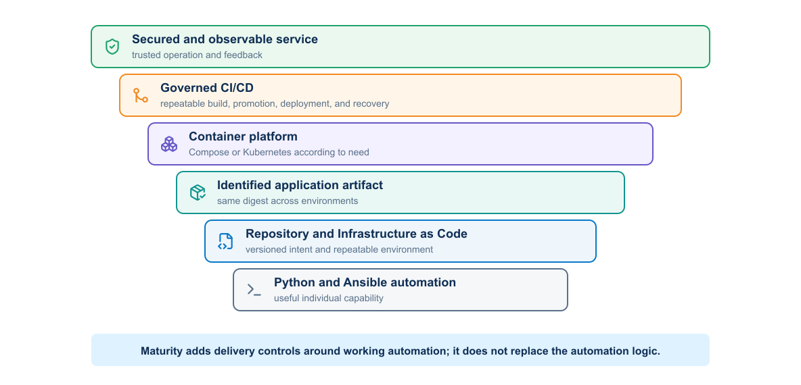

# Implementing DevOps Solutions and Practices using Cisco Platforms (DevOps) v1.0

## 1. Study guide purpose

This independent five-day study guide follows the scope and sequence of **Implementing DevOps Solutions and Practices using Cisco Platforms (DevOps) v1.0**. It is not an official Cisco publication. The subject is DevOps for software delivery: container packaging, multitier deployment, GitLab CI/CD, automated testing, Infrastructure as Code, on-demand environments, observability, security, multicloud design, and Kubernetes. A network automation application provides a familiar lab workload, but the practices apply to software applications generally.

The guide is intended for network and infrastructure professionals who can already automate technical work but have not yet turned that automation into a dependable software delivery system.

## 2. Prerequisite knowledge

Learners should have completed, or possess knowledge equivalent to:

- **Developing Applications and Automating Workflows Using Cisco Core Platforms (DEVASC)**
- **Developing Applications Using Cisco Core Platforms and APIs (DEVCOR)**

The course assumes that learners can write Python scripts, build Ansible playbooks, exchange JSON or YAML with APIs, use Git, and work from a Linux command line. Many learners will already have useful scripts and playbooks, but may run them individually from a laptop, pass files through chat or email, install dependencies by hand, and rely on the author to diagnose failures. That approach solves a local task; it does not yet provide repeatable software delivery.

DevOps closes that gap by applying practices that software teams have refined over many years: shared source control, peer review, reproducible builds, automated tests, immutable artifacts, controlled promotion, observability, security throughout the lifecycle, and rapid feedback from operation. The course does not reteach Python, Ansible, API, YANG, or network-programmability fundamentals. It teaches learners how to engineer, release, and operate the resulting software as a team.

## 3. Course outcome

Learners begin with an existing Python network automation application, allowing them to reuse their domain knowledge without rebuilding its core logic. They first examine the DevOps delivery model needed to move beyond individual execution. They then establish authoritative intent and inventory, express supporting infrastructure and on-demand test environments as controlled code, and assign clear ownership to Terraform and Ansible. Applications and job toolchains become reproducible images operated through Docker and Kubernetes where orchestration is justified. Only after artifact and runtime behavior are understood do learners automate event-driven testing, promotion, deployment, recovery, and cleanup through purpose-specific GitLab pipelines. Vault, security controls, and correlated observability apply across the complete system.

The application's internal network logic is treated as supplied functionality. The assessed work concerns the delivery system around the software: reproducibility, collaboration, flow, testing, artifact promotion, infrastructure, visibility, stability, and security. The same methods transfer to web services, data-processing workers, internal tools, and other Python applications.

Each module resolves a problem exposed by the preceding one. The automation review establishes how code, data, interfaces, and validation produce a network outcome. The DevOps model explains why technical automation needs shared ownership, controlled flow, feedback, and measurement. Infrastructure as Code then makes supporting and test environments declarative and repeatable. Application packaging creates the identified artifact and runtime contracts required for reliable Docker and Kubernetes deployment. The number of manual build, test, promotion, and verification steps establishes the need for CI/CD. Security and observability protect that automated delivery system and return trustworthy operational evidence to the next decision.

The technologies are therefore not independent destinations. Each one adds a control that the previous form of the system could not provide.

This is not a Terraform, Docker, Kubernetes, or GitLab product course. It is a course about engineering a dependable DevOps delivery system around network automation. Every technology appears because it solves one limitation, leaves a boundary unsolved, and exposes the requirement addressed next.

<p align="center">
  
</p>


## 4. Five-day progression and time distribution

The course allocates approximately 20 hours to theory and 20 hours to cumulative lab work. Module 0 is a prerequisite review and transition into the main course; it can be assigned as pre-reading or taught selectively at the start of Day 1. Installation occupies the first lab block.

| Day | Theory aligned to the DEVOPS outline | Reference system at the end of the day | Theory | Lab |
|---|---|---|---:|---:|
| 1 | Network automation review and the DevOps model | Automation foundations refreshed; shared delivery, flow, feedback, and evidence model established | 4 h | 4 h |
| 2 | Infrastructure as Code, container fundamentals, and secure image packaging | Terraform, Ansible, and validation ownership established; application packaged as a locked, non-root image | 4 h | 4 h |
| 3 | Multitier application operation, Kubernetes, and on-demand environment integration | Application deployed with explicit networks, health contracts, state, and an orchestration decision in a controlled environment | 4 h | 4 h |
| 4 | CI/CD, automated qualification, deployment validation, and recovery | GitLab pipeline that builds once, promotes by digest, controls protected execution, verifies operational outcomes, and retains evidence | 4 h | 4 h |
| 5 | Security and observability | Trust boundaries and short-lived identity applied; application, delivery, platform, and network signals correlated for detection, response, and improvement | 4 h | 4 h |

The repository grows with the system. Day 1 establishes application source, tests, and the shared delivery model; Day 2 adds infrastructure definitions, ownership boundaries, and container packaging; Day 3 adds Compose, optional Kubernetes definitions, and on-demand environment integration; Day 4 adds CI/CD, deployment, and evidence paths; and Day 5 adds security policy and observability configuration. Directories are introduced when they have an owner and a working purpose rather than created empty on the first day.

The practical work keeps two workflows distinct. The platform pipeline builds, tests, identifies, and deploys the automation application. The network-change workflow uses an approved platform version to process reviewed intent, perform prechecks, obtain authorization, execute a bounded operation, validate the outcome, and preserve evidence. Deploying software never grants automatic permission to change the network; the cumulative lab and final exercise must demonstrate both paths separately.

```text
network-devops/
├── automation/          # supplied Python and Ansible behavior
├── intended-state/      # schemas and safe examples
├── source-of-truth/     # authoritative intent contracts and integration definitions
├── templates/           # deterministic rendering
├── tests/               # unit, fixture, integration, and pyATS tests
├── docker/              # image construction
├── compose/             # local multitier deployment
├── terraform/           # disposable environment resources
├── observability/       # collectors, dashboards, and alert rules
├── policy/              # delivery and network guardrails
├── kubernetes/          # optional orchestrated deployment
├── docs/                # operation and recovery decisions
├── .gitlab-ci.yml
└── README.md
```

## 5. Modules

The modules follow the learning sequence: review the automation foundation, introduce the DevOps model, establish Infrastructure as Code, package and operate the application, control delivery through CI/CD, and finish with security and observability. The table summarizes the engineering focus of each stage.

| Module | Subject | Central engineering question |
|---|---|---|
| 0 | [Network Automation Review](module-00-network-automation-review.md) | Can we automate and verify the network outcome? |
| 1 | [Introducing the DevOps Model](module-01-devops-model.md) | Can a team own, deliver, measure, and improve the system? |
| 2 | [Infrastructure as Code and On-Demand Environments](module-02-infrastructure-as-code.md) | Can we recreate and govern the environment? |
| 3 | [Packaging and Operating Applications](module-03-packaging-applications.md) | Can we reproduce and operate the application runtime? |
| 4 | [Continuous Integration, Delivery, and Deployment Validation](module-04-cicd-delivery-validation.md) | Can we automate the delivery process safely? |
| 5 | [Security and Observability](module-05-security-observability.md) | Can we trust the system and explain what happened? |

## 6. Learning outcomes

After completing the guide and labs, learners should be able to:

- Relate existing Python, Ansible, API, structured-data, and network-validation knowledge to a controlled software delivery lifecycle.
- Apply DevOps principles to infrastructure and create on-demand test environments with Terraform and Ansible.
- Describe DevOps philosophy and practices and apply them to operational delivery challenges.
- Explain container architecture and use Docker tooling.
- Package an existing Python application into a secure container image.
- Use container networking and Compose to deploy a multitier application.
- Explain Kubernetes building blocks, APIs, manifests, deployment automation, multidata-center considerations, monitoring, and logging.
- Explain CI/CD concepts and implement a GitLab pipeline that builds, tests, and deploys applications.
- Automate build and deployment validation and improve the deployment flow with health checks, controlled promotion, and recovery.
- Implement metric and log collection, dashboards, analysis, alerts, and application instrumentation.
- Explain how telemetry, health monitoring, and controlled chaos experiments improve stability and reliability.
- Secure repositories, pipelines, runners, images, credentials, infrastructure access, and retained evidence.
- Compare modern application, microservices, public/private cloud, and multicloud deployment architectures.

## 7. Instructor delivery map

The delivery map identifies the normal live path and the visuals that can be reserved for self-study. The estimated times below total approximately 20 classroom theory hours; demonstrations and cumulative lab work use the remaining 20 hours.

| Module | Estimated theory | Core diagrams to present | Reference diagrams that may be skipped live |
|---|---:|---|---|
| 0 | 2 h | Automation system; three forms of network state | Structured-data normalization; interface selection; telemetry flow |
| 1 | 3 h | CALMS; lifecycle; evidence chain; value stream | Delivery-model comparison; feedback speeds; delivery architecture |
| 2 | 3 h | Tool ownership; Terraform–Ansible handoff; environment lifecycle | Terraform lifecycle; drift reconciliation |
| 3 | 4.5 h | Docker architecture; image/container lifecycle; Compose services; Kubernetes suitability; probes | Image layers; supply chain; failure boundaries; cluster architecture; platform comparison |
| 4 | 4.5 h | Pipeline gates; runner trust; platform vs network pipeline; change state; recovery decision | Artifact/cache; blast radius; deployment-strategy map |
| 5 | 3 h | Trust boundaries; observability architecture; change-aware feedback | Security lifecycle; incident response; signal categories; detailed correlation model |

Instructors can reserve the reference diagrams and deeper implementation sections for preparation or follow-up without breaking the cumulative engineering story.
