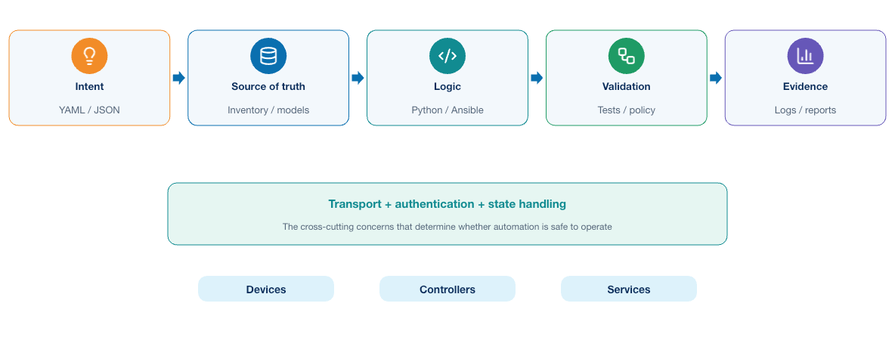
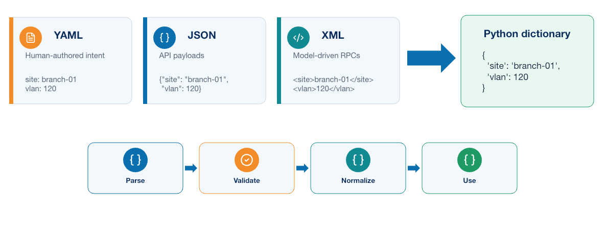
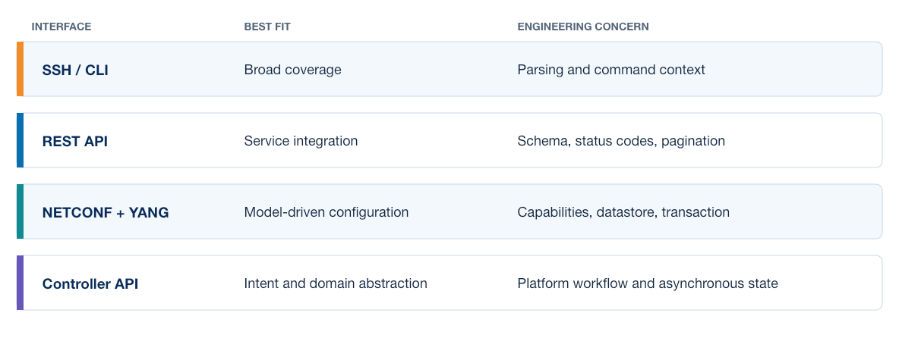
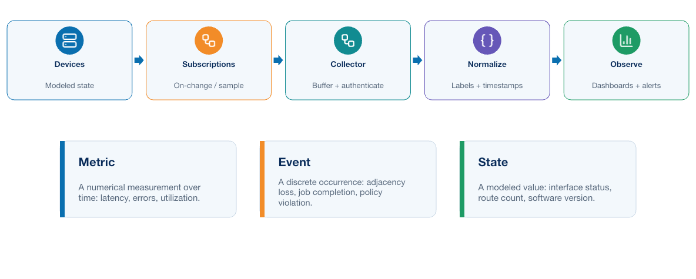
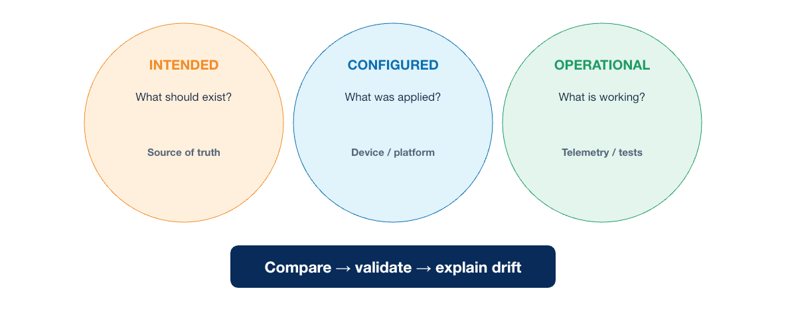

# Module 0: Network Automation Review

## 1. Purpose

This module reviews the network automation knowledge expected at the start of the course. It is not a replacement for CCNA Automation, DEVASC, or DEVCOR study. Its purpose is to restore a common technical model for building, operating, and troubleshooting network automation solutions.

Learners are expected to recognize Python, Ansible, Git, structured data, APIs, model-driven interfaces, authentication, and operational validation. The review concentrates on how these technologies exchange data, select targets, execute operations, handle failure, and verify network state.

The material follows automation from input to outcome. Intent and inventory become structured data; Python or Ansible applies logic; an interface changes or queries a target; validation compares intended, configured, and operational state; and telemetry records what happened.

## 2. Learning objectives

After completing this review, learners should be able to:

- Describe the main components of a network automation solution.
- Explain how Python, Ansible, APIs, models, inventory, and source control fit together.
- Parse equivalent YAML, JSON, and XML data into a normalized Python dictionary.
- Recognize appropriate uses and safety considerations for Netmiko, `ncclient`, `requests`, and Flask.
- Explain Ansible inventory, variables, playbooks, modules, templates, idempotence, and execution behavior.
- Explain model-driven telemetry subscriptions, collection, normalization, storage, and correlation.
- Distinguish intended state, configuration state, and operational state.
- Identify safety requirements for data validation, credentials, targeting, concurrency, and recovery.
- Recognize the limitations of scripts and playbooks operated by one engineer.
- Explain why successful command execution is not the same as a verified network outcome.

## 3. Network automation as a software system


Network automation is sometimes introduced as a faster way to execute commands. That description is incomplete. A useful automation solution is a software system that interprets intent, obtains trusted data, communicates with external systems, changes or observes state, handles failure, and produces evidence.

<p align="center">
  
</p>

A typical solution contains several responsibilities. The transport is only one stage; inventory, validation, policy, verification, and evidence determine whether the software can be trusted as an operational system.

| Responsibility | Typical implementation | Engineering question |
|---|---|---|
| Intent or request | YAML, JSON, form, ticket, source-of-truth record | What outcome is requested, and who authorized it? |
| Inventory | YAML, database, NetBox, controller inventory | Which objects are valid targets? |
| Validation | Python model, JSON Schema, policy function | Is the input complete, correctly typed, and permitted? |
| Transformation | Python, Jinja2, Ansible filters | How is platform-neutral data converted into an executable request? |
| Transport | SSH, NETCONF, RESTCONF, controller API | How does the application communicate with the target? |
| Orchestration | Python workflow, Ansible playbook, job worker | In what order should actions occur, and what happens on failure? |
| Verification | API read, structured parser, pyATS, service probe | Did the intended operational outcome occur? |
| Evidence | Structured logs, reports, diffs, metrics | Can another engineer explain what happened later? |

The implementation may be a small command-line program or a multitier service. The responsibilities still exist. When they are hidden inside one script, they become harder to test and govern independently.

## 4. Core review: foundation knowledge


Reliable delivery depends on several disciplines working together. Networking knowledge defines the intended behavior, programming and data models express it, and version control preserves both the implementation and the decisions behind it.

### 4.1 Networking remains the operational foundation

Automation does not remove the need to understand the system being automated. An engineer must still reason about addressing, routing, switching, DNS, transport protocols, management reachability, security policy, and failure domains.

For example, a Python HTTPS request can fail because of name resolution, routing, a firewall, TLS identity, authentication, rate limiting, or an application error. Repeating the request does not address all of those causes. Effective automation separates transport failure, authorization failure, invalid input, remote-system rejection, timeout, and uncertain completion.

The same principle applies after a change. A successful response means that an endpoint accepted or processed a request according to its contract. It does not prove that users can reach the service, that a routing protocol converged, or that an unrelated policy was left untouched.

### 4.2 Python provides application logic

At associate level, learners should be comfortable with variables, collections, conditions, loops, functions, exceptions, modules, packages, file handling, and virtual environments. At this stage, Python should be treated as application code rather than as a collection of copied snippets.

A maintainable automation program separates concerns. Input parsing should not open device sessions. Business policy should not be buried in a Jinja2 template. Reporting should not decide which targets are authorized. Small functions and modules make behavior easier to test and change.

The following function illustrates the expected style of thinking:

```python
def select_targets(inventory: dict, site: str, limit: int = 10) -> list[dict]:
    """Return enabled devices for one known site within an explicit limit."""
    if site not in inventory:
        raise ValueError(f"Unknown site: {site}")

    targets = [device for device in inventory[site] if device.get("enabled")]
    if not targets:
        raise ValueError(f"No enabled targets for site: {site}")
    if len(targets) > limit:
        raise ValueError(f"Target count {len(targets)} exceeds limit {limit}")
    return targets
```

The important features are not the Python syntax. The function has one responsibility, validates assumptions, fails explicitly, and enforces a scope limit. Unit tests can exercise unknown sites, empty groups, disabled devices, and an excessive target count without contacting a network.

### 4.3 Structured data forms a contract

JSON, YAML, XML, and CSV represent data; they do not automatically make the data valid. Parsing answers whether a document is syntactically readable. Schema validation answers whether required fields, types, ranges, and structures follow a contract. Policy validation answers whether the requested values are permitted in a particular organization or environment.

<p align="center">
  
</p>

Learners should recall the usual roles:

- JSON is common in REST API requests and responses.
- YAML is convenient for human-reviewed configuration and inventory.
- XML is important in NETCONF and XML-encoded YANG data.
- CSV is useful for simple tabular exchange but expresses nested relationships poorly.

Data should be normalized before it reaches templates or API clients. Addresses, prefixes, interface names, booleans, enumerated values, and identifiers should have one internal representation. This prevents each downstream component from interpreting the same input differently.

#### 4.3.1 One inventory represented in YAML, JSON, XML, and Python


The examples below describe the same two devices. Seeing the equivalent structures helps when an application reads one format, uses Python dictionaries internally, and sends another format to an API.

YAML emphasizes readability and is often used for inventory or reviewed intent:

```yaml
site: campus-west
devices:
  - name: distribution-01
    address: 192.0.2.11
    platform: network-os-a
    enabled: true
    tags: [distribution, production]
  - name: access-01
    address: 192.0.2.21
    platform: network-os-b
    enabled: false
    tags: [access, maintenance]
```

JSON uses objects and arrays and is common in REST APIs:

```json
{
  "site": "campus-west",
  "devices": [
    {
      "name": "distribution-01",
      "address": "192.0.2.11",
      "platform": "network-os-a",
      "enabled": true,
      "tags": ["distribution", "production"]
    },
    {
      "name": "access-01",
      "address": "192.0.2.21",
      "platform": "network-os-b",
      "enabled": false,
      "tags": ["access", "maintenance"]
    }
  ]
}
```

XML expresses the same hierarchy through elements and attributes:

```xml
<?xml version="1.0" encoding="UTF-8"?>
<inventory site="campus-west">
  <device enabled="true">
    <name>distribution-01</name>
    <address>192.0.2.11</address>
    <platform>network-os-a</platform>
    <tags>
      <tag>distribution</tag>
      <tag>production</tag>
    </tags>
  </device>
  <device enabled="false">
    <name>access-01</name>
    <address>192.0.2.21</address>
    <platform>network-os-b</platform>
    <tags>
      <tag>access</tag>
      <tag>maintenance</tag>
    </tags>
  </device>
</inventory>
```

The equivalent Python dictionary is:

```python
inventory = {
    "site": "campus-west",
    "devices": [
        {
            "name": "distribution-01",
            "address": "192.0.2.11",
            "platform": "network-os-a",
            "enabled": True,
            "tags": ["distribution", "production"],
        },
        {
            "name": "access-01",
            "address": "192.0.2.21",
            "platform": "network-os-b",
            "enabled": False,
            "tags": ["access", "maintenance"],
        },
    ],
}
```

#### 4.3.2 Parsing and normalizing the formats

Python uses a different parser for each external representation:

```python
import json, xml.etree.ElementTree as ET
import yaml

yaml_data = yaml.safe_load(yaml_text)
json_data = json.loads(json_text)
xml_root = ET.fromstring(xml_text)
```

Parsing only creates language objects. The application should then validate the expected schema and normalize values into one internal dictionary—for example, lowercase site names, canonical IP addresses, explicit booleans, and a consistent device-list structure. Use `yaml.safe_load()` for reviewed YAML and a hardened XML parser when XML is untrusted. Tests should cover missing fields, unexpected fields, invalid addresses, duplicates, and boundary values.

### 4.4 Git records source and decisions

Git stores versions of source code and supporting definitions. Learners should be able to create a branch, inspect a diff, stage deliberate changes, commit them with a useful message, resolve straightforward conflicts, and participate in review.

A basic local workflow uses a small set of commands:

```bash
git clone <repository-url>
git status
git switch -c feature/short-description
git diff
git add <file>
git diff --staged
git commit -m "Describe the reason for the change"
git fetch origin
git push -u origin feature/short-description
```

`git status` shows the current branch and file states. `git diff` reviews unstaged work; `git diff --staged` reviews exactly what the next commit will contain. `git add` selects changes for that commit, and `git commit` records the staged snapshot locally. `git fetch` updates knowledge of the remote without modifying the working branch. `git push` publishes the feature branch for review.

Useful inspection and correction commands include:

```bash
git log --oneline --graph --decorate -10
git show <commit>
git restore <file>             # discard an unstaged local edit
git restore --staged <file>    # unstage without deleting the edit
git branch --show-current
```

Before restoring or discarding anything, inspect `git status` and `git diff`. Pulling, rebasing, merging, resolving conflicts, or rewriting published history should follow the team's collaboration policy.

Four states are especially important when diagnosing a delivery problem. The working tree contains current local files; the index contains the exact changes selected for the next commit; a commit is an immutable snapshot with parent history and author metadata; and a remote-tracking reference records the last fetched view of a remote branch. `git status` and `git diff` answer different questions depending on which two states are compared. A clean working tree proves only that local files match the checked-out commit; it does not prove that the branch contains the latest reviewed change or that the commit was released.

Branches isolate proposed work, tags can identify release points, and merge requests add review and automated evidence around integration. For an automation repository, the review unit should be small enough that another engineer can understand the intent, generated difference, test effect, and recovery consequence. Generated configuration may be retained as pipeline evidence, but reviewed intent and source remain authoritative.

A network automation repository can contain:

- Python source and tests
- Ansible playbooks, roles, inventory structure, and collection requirements
- Schemas, templates, and safe example data
- Dependency declarations
- Documentation and runbooks
- Pipeline, container, infrastructure, and deployment definitions

It should not contain live credentials, private keys, tokens, uncontrolled state files, or sensitive device output. Git history is durable: deleting a secret in a later commit does not remove the earlier exposure.

Git provides useful history only when changes are committed with meaningful context, reviewed where appropriate, and tied to the inputs and results of an automation run.

## 5. Optional refresher and reference: automation interfaces


The available interfaces overlap, but they expose different control and failure semantics. The following visual provides a quick comparison before the detailed review.

<p align="center">
  
</p>

An automation application reaches infrastructure through an interface with its own data model, failure modes, and security properties. Choosing an interface therefore affects not only how code is written, but also how safely the resulting change can be validated and repeated.

### 5.1 CLI over SSH

SSH CLI automation remains useful when a required function lacks a suitable structured interface. Libraries such as Netmiko or Scrapli handle prompts, command timing, and platform behavior more reliably than a general-purpose interactive shell implementation.

CLI output is intended primarily for people and may vary by platform, release, privilege, width, localization, or command form. Structured parsing with TextFSM or Genie is preferable to fragile `split()` logic, but the parser and its expected data shape still require tests. Configuration workflows also need target verification, configuration preview, timeouts, failure classification, post-checks, and a recovery plan.

#### 5.1.1 Short Netmiko example

A short read-only call is sufficient for this review:

```python
from netmiko import ConnectHandler

with ConnectHandler(**device) as connection:
    output = connection.send_command("show interfaces", use_textfsm=True)
```

The device dictionary, command, parser availability, and returned data are platform-dependent. Production code still needs credentials from a protected source, explicit timeouts, authentication and transport error handling, target verification, and tests built from sanitized output fixtures.

### 5.2 REST APIs

Learners should recognize the parts of an HTTP request: method, URL, headers, authentication, query parameters, and optional body. They should interpret status codes and parse the response only after checking that its status and media type match expectations.

Reliable API clients address more than the successful `200` path. They use TLS verification, explicit timeouts, pagination, rate-limit handling, bounded retries, and clear error classification. They understand whether an operation is idempotent and whether a `202 Accepted` response represents completion or only the creation of an asynchronous job.

Retry behavior deserves particular care. A read request may be safe to retry after a transient connection failure. Repeating a create or change request after an uncertain timeout can duplicate work. The client may first need to query a request identifier or rediscover actual state.

#### 5.2.1 Short `requests` example

```python
import requests

response = requests.get(url, headers=headers, timeout=(5, 20), verify=ca_bundle)
response.raise_for_status()
data = response.json()
```

The client should verify TLS identity, check the returned media type and schema, handle pagination and rate limits, and classify failures. Automatic retry is normally safer for reads than for a change request whose earlier outcome is uncertain.

### 5.3 NETCONF, RESTCONF, and YANG

YANG defines structured configuration and operational data. NETCONF exchanges RPC messages and can provide datastores and transaction capabilities. RESTCONF exposes YANG-modeled resources through HTTP. Actual model and capability support varies across platforms and software releases.

A model-driven workflow should discover capabilities, identify the correct schema path, validate the payload, select the appropriate datastore or HTTP method, interpret protocol errors, and read the resulting state. A syntactically correct XML or JSON payload can still violate model constraints or business policy.

Model-driven does not mean risk-free. The application still needs authorization, target control, transaction handling, diff or preview, post-change validation, and evidence.

#### 5.3.1 Short `ncclient` example

```python
from ncclient import manager

with manager.connect(**connection_parameters) as session:
    reply = session.get(filter=("subtree", subtree_filter))
```

Connection parameters must enable host-key verification and define a timeout. Model namespaces, filters, datastore behavior, locking, confirmed commit, and error handling depend on the target's advertised capabilities. A successful RPC confirms protocol acceptance, not the final network outcome.

### 5.4 Controllers and platform APIs

Controllers provide higher-level inventory, policy, assurance, topology, or service abstractions. Their API often has a different consistency and task model from a device API. A request may create a background task, and several reads may be required before the final state becomes visible.

Before integrating with a controller, determine:

- Which system owns the object being changed
- How identity and authorization are applied
- Whether operations are synchronous or asynchronous
- How pagination and rate limits work
- What constitutes success, partial success, and failure
- How state is verified independently
- How changes made outside the controller create drift

### 5.5 Flask as an automation service interface

Flask can place an HTTP interface around existing Python logic. A small service may expose a liveness endpoint and accept a validated job request, but Flask does not automatically provide production authentication, authorization, rate limiting, durable job processing, TLS termination, or observability.

A production design should define request schemas, reject unsupported fields, authorize the requested target and operation, return a correlation or job identifier, move slow work to a durable worker, and provide a status resource. Run the application behind an appropriate production server rather than Flask's development server.

### 5.6 Model-driven telemetry review

Model-driven telemetry publishes structured operational data identified by model paths. Unlike periodic CLI scraping, the collector does not need to reconstruct meaning from human-formatted text. Unlike traditional polling, a subscription can stream updates at a requested interval or when state changes, subject to platform capability.

<p align="center">
  
</p>

A typical path is:

**Device or controller → subscription transport → collector → validation and enrichment → time-series or event storage → dashboard and alerting**

Common transport and subscription concepts include:

- **gNMI:** a gRPC-based interface using paths and typed values, commonly secured with TLS.
- **NETCONF notifications:** event notifications delivered over an established NETCONF session.
- **Dial-in:** the collector connects to the device and establishes the subscription.
- **Dial-out:** the device initiates a stream toward a configured receiver.
- **Periodic or sample:** values are sent at a defined interval.
- **On-change:** updates are sent when a subscribed value changes, when supported.
- **Once:** a finite snapshot is returned for the selected paths.

Model-driven telemetry and OpenTelemetry solve related but different problems. Model-driven network telemetry represents device or controller state through network data models. OpenTelemetry standardizes application traces, metrics, logs, and context propagation. An automation platform may use both: gNMI for interface and protocol state, and OpenTelemetry for the API request, queue delay, worker span, and database call.

The collector is not merely a forwarding process. It must authenticate endpoints, validate certificates, negotiate supported encodings, track subscription state, add stable device and site metadata, normalize timestamps and units, manage backpressure, expose its own health, and prevent unbounded label cardinality.

After decoding a telemetry message, the collector should validate required fields, reject unknown devices or paths, normalize timestamps and units, and add stable site and interface metadata. Keep transport-specific response objects behind an adapter so that collection code and business rules can be tested independently.

Counter interpretation requires more than storing values. Octet and packet counters normally increase monotonically and may reset after reboot or process restart. A collector calculates rates from successive samples only when timestamps are ordered and the counter has not reset or wrapped. Missing updates, duplicated timestamps, clock error, subscription loss, and collector backlog must be visible; otherwise a flat graph can be mistaken for a healthy interface when data collection has actually failed.

Telemetry is most useful when network observations can be correlated with collection time, target identity, software version, and the operation that preceded a change. This allows an engineer to distinguish an automation defect, a collector failure, and a genuine network-state change.

## 6. Core review: Ansible, orchestration, and tool ownership


Ansible provides inventories, variables, collections, modules, roles, handlers, conditions, and playbooks for describing ordered work across targets. Agentless operation is particularly familiar in network environments, although module behavior and platform support still depend on collection versions and device capabilities.

Learners should recall these principles:

- Use modules or resource modules instead of raw commands when they provide the required behavior.
- Keep inventory and environment values separate from reusable roles.
- Keep credentials outside committed inventory.
- Pin and test collection versions.
- Use `--limit`, groups, batching, and `serial` to control scope.
- Inspect check-mode or diff output where the module supports it reliably.
- Use handlers for dependent actions such as restarting a service.
- Design blocks and error handling so that failures remain visible.
- Verify operational results instead of relying only on an `ok` or `changed` count.

Idempotence means that repeated execution converges on the intended state without creating unnecessary additional changes. It does not mean that every task is automatically safe to retry. A playbook can contain a non-idempotent command, call an asynchronous API, or repeat an operation whose previous outcome is uncertain.

### 6.1 Example Ansible playbook

The following vendor-neutral pattern validates scope, collects a baseline, applies a role in small batches, and verifies the result. Concrete module names and returned data vary by collection and platform.

```yaml
---
- name: Validate and deploy an approved network service
  hosts: managed_network
  gather_facts: false
  serial: 2
  max_fail_percentage: 0

  vars:
    approved_change_id: "{{ lookup('env', 'CHANGE_ID') }}"

  pre_tasks:
    - name: Require an approved change identifier
      ansible.builtin.assert:
        that:
          - approved_change_id is match('^CHG-[0-9]{4}-[0-9]{4}$')
          - inventory_hostname in approved_targets
        fail_msg: "Change identity or target authorization is invalid"

    - name: Collect a read-only operational baseline
      ansible.netcommon.cli_command:
        command: show interfaces
      register: interface_baseline
      changed_when: false
      no_log: false

  roles:
    - role: network_service

  post_tasks:
    - name: Collect state after the role runs
      ansible.netcommon.cli_command:
        command: show interfaces
      register: interface_result
      changed_when: false

    - name: Run the project acceptance validator
      ansible.builtin.command:
        argv:
          - python
          - -m
          - automation.validate_result
          - --host
          - "{{ inventory_hostname }}"
          - --change-id
          - "{{ approved_change_id }}"
      delegate_to: localhost
      changed_when: false
```

The `network_service` role would contain platform-aware, preferably idempotent resource modules. The playbook does not embed credentials, limits concurrent targets with `serial`, stops after a failure, distinguishes collection from change, and delegates acceptance logic to testable application code. In a real pipeline, baseline and post-check results should be sanitized and retained as artifacts. `no_log: false` is shown only because the illustrative read command is nonsensitive; tasks handling credentials or sensitive payloads require deliberate log protection.

## 7. Source of truth, intent, and state


A source of truth is the authoritative record for a defined class of data. It may contain device identity, site membership, addressing, connections, services, or policy. Authority must be explicit. If a spreadsheet, controller, inventory file, and live device can all overwrite the same value, the organization has several competing sources rather than one source of truth.

NetBox is a common example of a network source of truth. It models objects such as sites, devices, platforms, interfaces, prefixes, IP addresses, connections, tenants, and services through related records rather than unrelated inventory variables. Its value is not that it automatically makes every record correct. Its value is that ownership, validation, relationships, and API access can be defined around one authoritative model.

A useful source of truth has several properties:

- **Defined authority:** the team knows which data NetBox owns and which data belongs to another system.
- **Stable identity:** devices and interfaces have durable identifiers rather than being inferred from display text.
- **Validated relationships:** an address is associated with the interface and device that use it.
- **Controlled mutation:** permissions and workflow determine who or what may change intent.
- **Machine-readable access:** applications retrieve the same records through an API instead of maintaining private copies.
- **Change visibility:** object history shows when intent changed and by whom.

NetBox should not become a password database or an unfiltered copy of live configuration. Device credentials belong in a secrets system. Operational facts belong in telemetry or device-state collection. The source of truth records what the organization intends and the metadata required to resolve the correct target.

### 7.1 Intent events and downstream consumers

An authoritative object change can be more useful than a scheduled poll. An event can tell a downstream consumer that a completed piece of intent is ready for evaluation. For example, an address assignment becomes meaningful only when the address, interface, and device relationship is complete. Emitting an event at that boundary avoids consumers guessing whether several partially edited records form one request.

The event is a notification, not unquestioned authority to make a change. A consumer should retrieve the current object through the authenticated API, validate its type and relationships, record an immutable fingerprint, and reject stale, incomplete, duplicated, or out-of-scope events. This preserves the source of truth as the origin of intent while allowing each consumer to apply its own authorization and safety policy.

<p align="center">
  
</p>

Three states should remain distinct:

| State | Question | Example evidence |
|---|---|---|
| Intended state | What should exist? | Reviewed data, approved policy, requested application version |
| Configured state | What has the managed system stored? | API read, configuration retrieval, controller object |
| Operational state | What is actually working now? | Reachability, protocol state, service health, telemetry |

Configuration can match intent while operation remains unhealthy. Operational state can appear healthy temporarily while configuration has drifted from policy. Reliable verification selects evidence appropriate to the requested outcome.

## 8. Safety and reliability fundamentals


Network automation can apply the same error consistently across many targets, so scale increases both value and risk. The following controls should already be familiar:

- Validate input before opening a privileged connection.
- Resolve requested targets through an approved inventory.
- Display or preserve the selected target set.
- Begin with read-only collection and a known baseline.
- Generate and review the proposed effect where possible.
- Limit concurrency and batch size according to system capacity and blast radius.
- Use authentication appropriate to a workload rather than embedding personal credentials.
- Set connection and operation timeouts.
- Classify retryable, permanent, and uncertain failures differently.
- Verify configuration and service behavior after execution.
- Preserve evidence and provide a tested recovery method.

Concurrency is not merely a performance setting. Fifty simultaneous sessions may overload a management plane, controller, authentication service, or WAN link. Operations touching the same device or shared service may require locking even when the worker platform can execute them in parallel.

## 9. Testing network automation


Tests should be selected according to the boundary they can prove:

| Test type | Suitable target | What it cannot prove alone |
|---|---|---|
| Unit test | Validation function, transformation, retry calculation | Live protocol or platform behavior |
| Schema and policy test | Input contract and organizational rules | Correct rendering or deployment |
| Fixture or parser test | Sanitized CLI/API response handling | Timing, scale, or current platform behavior |
| Mock integration test | Client authentication, error, pagination, task polling | Vendor implementation semantics |
| Virtual or sandbox test | Protocol, model, configuration, and topology interaction | Full production scale and hardware behavior |
| Production pre/post-check | Actual baseline and operational outcome | Elimination of all change risk |

Tests become more expensive and realistic toward the bottom of the table. A sound strategy runs many fast offline tests and a smaller number of controlled system tests. A live production target should not be the first place a predictable parser, validation, or error-handling defect is discovered.

## 10. Limits of individually operated automation

The capabilities added around an existing script remove different dependencies on the original author's workstation or memory. Containerization alone is not the destination. The result becomes a product when a team can review, release, operate, diagnose, and improve it through a documented delivery system.

An individual automation script can be technically correct and still be difficult to operate safely as team software. Common symptoms include:

- The author is the only person who knows the required execution order.
- Dependencies are installed manually and vary between workstations.
- Credentials are read from a personal file or shell history.
- The latest source is copied between directories rather than released.
- Tests run only when the author remembers to run them.
- A change is applied from whatever commit happens to be checked out.
- Logs are console text with no change, version, or request identifier.
- Failure leaves uncertain state and no recorded recovery decision.
- A second engineer cannot reproduce the result on a clean system.

These are delivery problems, not failures of Python, Ansible, or the API. Adding more application logic does not solve them. The team needs practices around the automation.

## 11. Readiness check

Learners should be able to answer these questions:

1. What is the difference between parsing data, validating its schema, and enforcing policy?
2. Why does a successful API response not necessarily prove the final service outcome?
3. When is retrying an operation unsafe?
4. How do intended, configured, and operational state differ?
5. What makes an Ansible task idempotent, and why can an idempotent-looking playbook still be unsafe to retry?
6. Which tests can run without network access, and what evidence requires a sandbox or authorized target?
7. Which files belong in Git, and which values must remain in a secret or protected runtime system?
8. What prevents a locally successful script from being reproducible by another engineer?
9. How do model-driven network telemetry and OpenTelemetry complement one another?
10. Which production controls must be added around a basic Flask API?

## 12. Summary

Network automation combines Python, structured data, Git, CLI and API interfaces, models, Ansible, telemetry, authentication, and operational verification. NetBox can provide authoritative, related intent and inventory without becoming a credential or telemetry store. Netmiko, `ncclient`, `requests`, and Flask address different application boundaries, while Ansible supplies reusable inventory, templating, orchestration, and network modules. Reliable automation depends on validated inputs, explicit targets, bounded operations, secure credentials, deterministic processing, structured evidence, and verification of actual network behavior.

**What the learner now has:** a refreshed model of automation inputs, execution, state, validation, and operational evidence.

**What is still missing:** a repeatable, governed environment in which the automation can be recreated and operated by a team.

**What the next module adds:** explicit ownership and lifecycle control for the supporting environment.

The automation logic works. The delivery system does not yet exist.
