# Module 1: Introducing the DevOps Model

## Purpose

DevOps is a way of organizing software and infrastructure delivery so that small changes move through a controlled, repeatable feedback loop. It combines shared responsibility, version control, automation, testing, operational evidence, and continuous improvement. A team has adopted DevOps only when these practices change how it delivers and operates a system. Installing a pipeline product alone does not achieve that result.

This module establishes the DevOps philosophy, CALMS model, flow, feedback, measurement, shared ownership, continuous integration, continuous delivery, and continuous deployment concepts used throughout the course. Network automation is the existing application domain, not a programming topic to relearn.

> **Reference-architecture focus:** the complete path from engineer and network intent through Git, validation, controlled execution, operational evidence, and feedback.

## DevOps and NetDevOps

DevOps emerged from software delivery, but its principles apply to network services. NetDevOps uses software engineering practices to control network intent, automation code, configuration, validation, and operational evidence.

Network delivery has several characteristics that affect the implementation:

- A single configuration error can affect many shared services.
- Devices are long-lived and mutable; teams rarely rebuild a production router for each change.
- Actual service behavior depends on protocol relationships among devices.
- Configuration acceptance does not prove forwarding or routing success.
- Multiple management interfaces and controllers may own overlapping state.
- Maintenance windows, approvals, and regulatory evidence may remain necessary.

NetDevOps therefore emphasizes scoped targets, intended state, pre-change facts, configuration diffs, post-change operational validation, and tested recovery.

## CALMS applied to network engineering

CALMS provides a useful assessment model:

| Dimension | Network engineering interpretation | Evidence in this course |
|---|---|---|
| Culture | Network, security, platform, and application teams share service outcomes | Merge-request review and joint acceptance criteria |
| Automation | Repeatable collection, rendering, testing, deployment, and recovery replace engineer-specific commands | Python, Ansible, pyATS, GitLab, and container jobs |
| Lean | Small network changes move through a visible flow with limited work in progress | One VLAN and routing change on a short-lived branch |
| Measurement | Delivery and network behavior produce usable measures | Pipeline duration, failure rate, OSPF state, reachability, and telemetry |
| Sharing | Code, intent, runbooks, findings, and reusable tests remain available to the team | One repository and retained pipeline evidence |

CALMS exposes an imbalance. A team may automate device commands while leaving review, measurement, or knowledge sharing unchanged. That is scripting at scale, not a mature NetDevOps system.

## Three network change models

<p align="center">
  
</p>

| Characteristic | Traditional change | Automated change | NetDevOps pipeline |
|---|---|---|---|
| Source of truth | Ticket and engineer notes | Script inputs or spreadsheet | Versioned, schema-validated intent |
| Execution | Manual CLI | Script or playbook | Controlled job using a reviewed artifact |
| Review | Command list | Code review may occur | Intent, code, rendered diff, policy, and evidence review |
| Validation | Engineer checks selected commands | Script may run checks | Required pre-check and post-check suites |
| Credentials | Personal account | Often local environment values | Short-lived or protected service identity |
| Target control | Human selection | Inventory argument | Protected environment, inventory fingerprint, explicit limit |
| Evidence | Screenshots or copied output | Script log | Structured artifacts tied to commit and pipeline |
| Recovery | Engineer reverses commands | Separate rollback script | Tested checkpoint, rollback, or remediation workflow |
| Feedback | Incident or ticket closure | Script result | Pipeline result plus operational telemetry |

Automation improves consistency, but NetDevOps connects automation to governance and operational truth.

## Complete NetDevOps lifecycle

Every gate answers a question. Schema validation asks whether the intent has the required shape. Policy asks whether the requested values follow engineering standards. Pre-checks ask whether the network is safe to change. The configuration diff asks what will change. Post-checks ask whether the network achieved the desired service outcome.

## Course-wide reference NetDevOps architecture

The course uses this logical architecture repeatedly. It is a responsibility model, not a requirement to buy or deploy every component.

- The Git repository stores intent, automation code, tests, policy, pipeline definitions, and operational documentation.
- An unprivileged validation runner parses and normalizes intent, applies schema and policy, renders candidates, executes offline tests, and performs supply-chain checks. It has no device route or deployment credential.
- An approval gate binds the reviewed commit, target inventory fingerprint, rendered difference, test evidence, and automation image digest.
- A protected network runner or restricted worker receives only the approved job, a short-lived identity, explicit targets, and the minimum management route.
- Devices or controllers expose SSH, NETCONF, RESTCONF, or platform APIs according to capability and transaction requirements.
- Post-checks and telemetry produce evidence about configuration, protocol, forwarding, and platform health.
- The final decision promotes the result, stops further rollout, rolls back safely, or initiates forward remediation.

Modules 2–4 expand the runtime and service-platform blocks. Modules 5–6 expand pipeline gates, protected execution, and recovery. Module 7 assigns tool ownership. Module 8 builds the feedback path. Module 9 secures every boundary. Module 10 evaluates one optional platform implementation.

## The delivery problem

Traditional delivery often separates development, testing, release, and operations into handoffs. Each group may optimize its own work while the complete delivery flow remains slow and fragile. Large batches accumulate because releases are difficult. Manual steps differ between people and environments. Problems appear late because testing and operational review happen near the release date.

DevOps reduces these risks by shortening the path between an idea and reliable evidence about it. A small change is easier to review, test, deploy, observe, and reverse than a large release containing many unrelated changes.

For an application that also configures network or cloud infrastructure, the delivery system must control two related forms of change:

- Application behavior, dependencies, and packaging
- Infrastructure intent, configuration, access, and operational policy

Both forms should use versioned definitions, automated validation, peer review, and auditable promotion.

## DevOps principles

### Shared ownership

The team that changes a service must understand how the change behaves in operation. Developers need production feedback, and operations engineers need influence over architecture and testability. Shared ownership does not remove specialist roles. It makes reliability, security, and operability design concerns from the beginning.

### Flow

Flow describes how quickly a useful change moves from request to operation. Long queues, approval delays, unstable environments, and manual deployment reduce flow. Teams improve flow by reducing batch size, keeping work visible, limiting work in progress, and automating repeatable steps.

### Feedback

Feedback reveals whether a change works as intended. Unit tests provide fast feedback about code behavior. Integration tests reveal interface problems. Deployment checks show whether a release is reachable and correctly configured. Metrics and logs show how it behaves under real conditions.

Fast feedback is valuable only when it is trustworthy. A test that passes despite a broken system produces false confidence. A noisy alert that everyone ignores does not protect reliability.

### Learning and improvement

Failures reveal weaknesses in design, automation, review, or operating assumptions. A useful review identifies the conditions that allowed a failure and improves the system. Blaming an individual discourages reporting and leaves the underlying weakness unchanged.

## DevOps practices

Common practices form a connected delivery system:

- Version control stores application, infrastructure, pipeline, and operational definitions.
- Continuous integration validates each proposed change.
- Continuous delivery keeps a validated release ready for promotion.
- Deployment automation performs the promotion consistently.
- Infrastructure as Code creates repeatable environments.
- Observability provides evidence about behavior after deployment.
- Security controls operate throughout the workflow.

Each practice supports the others. A pipeline cannot reproduce a deployment if the environment exists only as manual configuration. Monitoring cannot explain a release failure if logs lack version and request context.

## Continuous integration, delivery, and deployment

These terms describe different levels of automation.

**Continuous integration** means developers merge small changes frequently and automated checks validate the combined code. The goal is to find integration problems while the relevant change remains small and understandable.

**Continuous delivery** means the pipeline produces a validated release that the team can deploy through a controlled decision. Production promotion may require approval.

**Continuous deployment** means every change that passes the required controls proceeds automatically into production. This requires strong tests, reliable rollback or remediation, good observability, and confidence in the platform.

The lab progression begins with continuous integration, can add automated deployment to a training environment, and may finish with a controlled Kubernetes platform exercise. Production deployment remains a design decision rather than an assumption.

## Value stream and constraints

A value stream describes the work from request to operational outcome. Useful questions include:

- Where does work wait?
- Which steps depend on one person?
- Which actions are repeated manually?
- Where do defects first become visible?
- How quickly can the team restore service after a failed change?

Four delivery measures are especially helpful:

- Deployment frequency: how often the team releases successfully
- Lead time for changes: how long a committed change takes to reach operation
- Change failure rate: how often a release causes degradation or remediation
- Time to restore service: how long recovery takes after a failure

The measures should guide improvement, not reward artificial activity. Increasing deployment frequency by weakening tests would damage the complete system.

### DORA measures for network delivery

DORA measures require careful interpretation in a network context:

| Measure | Network interpretation | Example |
|---|---|---|
| Deployment frequency | Successful approved network changes delivered per period | Number of branch intent changes promoted each week |
| Lead time for changes | Time from reviewed intent commit to verified operational outcome | Merge of VLAN request to confirmed route and reachability |
| Change failure rate | Portion of changes requiring rollback, remediation, or incident response | OSPF adjacency failure after a deployed change |
| Time to restore service | Time from detected degradation to verified recovery | Alert to restored adjacency and reachability |

The team should also measure pipeline feedback time, percentage of changes with complete evidence, drift age, policy failure reasons, and automation job reliability. Do not compare teams without accounting for network scope, risk, and change type.

## Applying DevOps controls to existing network intent

DEVASC/DEVCOR-level knowledge of structured data, APIs, and network intent is assumed. The DevOps concern is how an existing intent contract becomes a controlled pipeline input. Depending on the application, YAML might describe interface addressing, a service, routing policy, compliance rules, or validation expectations. A JSON Schema or Python model validates structure and types before a build or deployment job receives privileged access.

YAML is convenient for human review but has traps: indentation controls structure, unquoted values can receive unexpected types, and duplicate keys may be accepted differently by parsers. The pipeline must parse with a controlled library and validate against a schema.

JSON has stricter syntax and maps naturally to REST payloads. XML remains important for NETCONF and many YANG-encoded operations. Jinja2 converts validated data into platform configuration when a structured API is unavailable or unsuitable.

The data path is:

The data path moves from reviewed intent through schema validation and a normalized model to a renderer or API payload. After deployment, the workflow collects device state and compares it with the same intent.

Templates must not contain business logic that belongs in validation or normalization. A rendered configuration is derived output; reviewed intent remains the source.

### Existing application input used by the pipeline

The following supplied application input is illustrative. Learners are not expected to design its schema or network logic during this course. They use it to implement linting, schema validation, policy checks, rendering tests, artifact handling, promotion, and operational evidence.

```yaml
---
schema_version: 1
scenario_id: S3
change_id: CHG-LAB-0042
site: branch01
device: edge01
platform: lab-nos
service:
  vlan:
    id: 120
    name: USERS
interface:
  name: Vlan120
  ipv4: 10.20.120.1/24
routing:
  protocol: ospf
  process_id: 100
  area: 0
  passive: true
validation:
  expected_neighbor_state: FULL
  expected_prefix: 10.20.120.0/24
  maximum_devices: 1
```

| Field group | Meaning | Validation responsibility |
|---|---|---|
| `schema_version`, `scenario_id`, `change_id` | Contract and traceability identity | Required, correctly formatted, and recognized |
| `site`, `device`, `platform` | Target selection context | Must resolve to an approved inventory object; never trust free text as authorization |
| `service.vlan` | Requested logical service | VLAN range, reserved identifiers, naming, and local uniqueness |
| `interface` | Platform-neutral gateway intent | Interface-name policy, valid prefix, address ownership, and overlap detection |
| `routing` | Required advertisement behavior | Approved protocol and process, valid area, safe passive-interface policy |
| `validation` | Observable acceptance criteria | Supported state vocabulary, derived network prefix, and explicit blast-radius ceiling |

The processing stages have different responsibilities:

1. YAML parsing determines whether the document is syntactically readable.
2. JSON Schema or a Pydantic model validates required fields, types, ranges, and allowed values.
3. Normalization converts the address into canonical interface and network objects, normalizes names, and rejects ambiguous values.
4. Business policy checks ownership, allocation, protocol standards, reserved resources, maintenance rules, and maximum scope.
5. A platform renderer produces reviewed device CLI, NETCONF XML, or a RESTCONF/controller payload. The chosen interface depends on discovered capabilities.
6. The device accepts or rejects the operation and exposes stored configuration state.
7. pyATS, Genie, modeled reads, and probes compare operational state with the validation contract.

Schema success does not grant authorization, policy success does not prove correct rendering, configuration acceptance does not prove service health, and an immediate post-check does not replace continued telemetry.

## Prerequisite automation decisions that affect DevOps design

| Interface | Strength | Limitation | Suitable network-automation use |
|---|---|---|---|
| SSH CLI | Broad platform familiarity and feature coverage | Text parsing, command order, weak transaction behavior | Baseline collection or controlled lab fallback |
| REST API | Common request model and tooling | Platform-specific resources and transaction rules | Controllers and automation service interfaces |
| RESTCONF | HTTP operations over YANG-modeled data | Model paths and support vary by release | Read or modify modeled network configuration |
| NETCONF | Datastores, structured RPCs, filters, and error detail | XML and capability handling add complexity | Candidate validation and transactional changes where supported |
| Ansible | Readable orchestration and reusable modules | Module behavior and collection versions matter | Multi-device configuration and workflow control |
| Python | Maximum control over logic and integrations | Team owns testing, error handling, and lifecycle | Normalization, custom policy, API clients, and evidence processing |

Interface selection is assumed network automation knowledge, but it changes pipeline safety and test design. Teams must discover device capabilities and validate models for the assigned platform and release. A DevOps pipeline should preserve capability evidence, test the selected client and transaction behavior, and avoid assuming that one resource path or rollback mechanism works everywhere.

## Mutable and immutable infrastructure

Container images and pipeline artifacts can be immutable: the team creates a new version instead of editing the artifact. Network devices are generally mutable infrastructure: automation changes the state of a long-lived system.

NetDevOps can still use immutable principles:

- Keep intended state and release artifacts versioned.
- Regenerate rather than hand-edit derived configuration.
- Promote a tested automation image digest.
- Treat pipeline definitions as code.
- Recreate disposable test environments.

Production devices require convergence, drift detection, and reconciliation rather than replacement after every change.

## Blast radius

Blast radius describes the possible impact of a failure. It depends on target count, network role, shared dependencies, privileges, command scope, protocol convergence, and recovery time.

Controls include a test environment, one-device canary, inventory limits, rate controls, maintenance conditions, explicit diff review, routing-policy validation, out-of-band access, and automatic stop conditions. Concurrency should increase only after the team understands device and network behavior.

## Version control as the system of record

The study repository records intended state examples and the history of decisions. It can contain source code, tests, dependency declarations, Docker definitions, pipeline configuration, infrastructure code, optional Kubernetes manifests, documentation, and safe example configuration.

It must not contain live credentials, tokens, private keys, generated state containing secrets, or uncontrolled build output.

### Branch and merge-request workflow

The course uses this change path:

1. Update the local `main` branch.
2. Create a short-lived feature branch.
3. Make one coherent change.
4. Test locally.
5. Commit with a clear description.
6. Push the branch and open a merge request.
7. Let the pipeline validate the change.
8. Review the code and evidence.
9. Merge into `main`.
10. Tag important course milestones.

Short-lived branches reduce divergence. Merge requests provide a place for review, automated results, discussion, and approval.

## Pipeline as executable delivery policy

A pipeline describes the conditions a change must satisfy. An introductory workflow may run syntax, schema, and unit tests. A more capable workflow can build a container, validate its security properties, provision a lab, perform network pre-checks, execute a protected change, and retain operational evidence. Kubernetes is optional.

Pipeline stages often include:

The pipeline progresses through validation, testing, build, inspection, deployment, verification, and promotion.

Stages express broad order. Jobs perform the actual work. Artifacts carry approved output or evidence between jobs. A runner executes jobs in a defined environment. Variables provide configuration, while protected variables restrict sensitive values to trusted branches or environments.

## Automation boundaries

Automation can reproduce mistakes quickly. Safe delivery requires boundaries:

- Limit credentials to the permissions required by the job.
- Separate read-only validation from change operations.
- Display a plan or diff before a significant infrastructure change.
- Restrict deployment jobs to trusted branches and environments.
- Use an explicit target identifier instead of a broad default.
- Make repeated execution safe where possible.
- Preserve logs and test reports as evidence.
- Provide a tested recovery path.

## DevOps and network platform environments

Network platforms may expose APIs, model-driven interfaces, controllers, sandboxes, and application-hosting capabilities that participate in a NetDevOps workflow. The examples use those interfaces to collect, model, deploy, and validate network state. Application delivery concepts appear when they support the automation platform.

Network changes require particular care because shared infrastructure can affect many consumers. Preview, scope validation, change windows, pre-checks, post-checks, and recovery plans remain important even when the configuration is automated.

## Lab progression

Learners install and verify the workstation, inspect the supplied network automation application, create the course repository, and interact with GitLab CI. They identify the application's entry point, dependencies, configuration, test hooks, external services, and operational outputs. The first commit contains documentation, `.gitignore`, a safe `.env.example`, dependency declarations, and the supplied source and tests.

Every later lab extends this repository. Learners do not create separate projects for Docker, Terraform, monitoring, or Kubernetes.

## Knowledge check

1. Why do small changes usually reduce delivery risk?
2. How does continuous delivery differ from continuous deployment?
3. Which network automation files belong in version control, and which sensitive values do not?
4. What evidence should a reviewer see before approving a merge request?
5. Why should a deployment job use more restricted credentials than a read-only validation job?

## Summary

DevOps improves the complete delivery system through shared responsibility, small controlled changes, automated feedback, operational evidence, and continuous learning. Git records intent and history. Merge requests combine peer review with automated evidence. Pipelines turn delivery policy into repeatable execution. The remaining modules add capabilities to this foundation.
