# Module 1: Introducing the DevOps Model

## 1. Purpose

DevOps is a way of organizing software and infrastructure delivery so that small changes move through a controlled, repeatable feedback loop. It combines shared responsibility, version control, automation, testing, operational evidence, and continuous improvement. A team has adopted DevOps only when these practices change how it delivers and operates a system. Installing a pipeline product alone does not achieve that result.

This module establishes the DevOps philosophy, CALMS model, flow, feedback, measurement, shared ownership, continuous integration, continuous delivery, and continuous deployment concepts used throughout the course. These practices came from software engineering and apply to any application. Network automation provides the primary engineering workload through which the practices are applied throughout the course.

[Module 0](module-00-network-automation-review.md) reviewed how the supplied application turns intent and inventory into controlled network operations. Module 1 changes the point of view: the subject is now how a team develops, tests, releases, operates, and improves that application. The delivery model established here supplies the reasoning used by every later module.

## 2. From ad hoc automation to DevOps

Task automation often begins with a Python script, an API integration, or an Ansible playbook created to meet an immediate operational need. This approach can be effective at small scale, but weaknesses emerge when the solution must be reviewed by a team, reproduced in a clean environment, released safely, diagnosed consistently, and supported independently of its original author.

DevOps addresses that delivery problem. It brings development and operational responsibilities into one feedback system and applies proven software practices to the complete path from source change to operating service. When the application automates infrastructure or networks, the same model is sometimes called infrastructure DevOps or NetDevOps; the underlying delivery principles do not change.

The contrast is important:

| Ad hoc automation | DevOps delivery |
|---|---|
| An engineer runs a local script | A versioned application runs in a defined environment |
| Dependencies are installed from memory | Dependencies are declared, locked, built, and scanned |
| Testing depends on the author | Automated tests run for every proposed change |
| Credentials live on a workstation | Workload identities and secrets are supplied at runtime |
| Success means the command completed | Acceptance checks prove the software and service outcome |
| Knowledge remains with an individual | Code, evidence, runbooks, and decisions are shared |

Network delivery has several characteristics that affect the implementation:

- A single configuration error can affect many shared services.
- Devices are long-lived and mutable; teams rarely rebuild a production router for each change.
- Actual service behavior depends on protocol relationships among devices.
- Configuration acceptance does not prove forwarding or routing success.
- Multiple management interfaces and controllers may own overlapping state.
- Maintenance windows, approvals, and regulatory evidence may remain necessary.

NetDevOps therefore emphasizes scoped targets, intended state, pre-change facts, configuration diffs, post-change operational validation, and tested recovery.

## 3. CALMS applied to software delivery

CALMS is a practical way to assess whether DevOps exists as an operating model rather than as a collection of tools. The letters represent **Culture, Automation, Lean, Measurement, and Sharing**. None of the dimensions is sufficient on its own. A pipeline without shared ownership can automate a poor handoff; extensive metrics without a learning culture can become surveillance; and a collaborative team without repeatable automation remains dependent on manual effort.

<p align="center">
  
</p>

| Dimension | Software-delivery interpretation | Evidence in this course |
|---|---|---|
| Culture | Developers, security, platform, and operations teams share service outcomes | Merge-request review and joint acceptance criteria |
| Automation | Repeatable building, testing, deployment, and recovery replace engineer-specific procedures | GitLab jobs, automated tests, containers, and deployment code |
| Lean | Small, independently reviewable changes move through a visible flow with limited work in progress | One application change on a short-lived branch |
| Measurement | Delivery and application behavior produce usable measures | Pipeline duration, failure rate, latency, availability, and telemetry |
| Sharing | Code, intent, runbooks, findings, and reusable tests remain available to the team | One repository and retained pipeline evidence |

### 3.1 Culture: shared responsibility for the outcome

Culture concerns incentives, responsibilities, and working relationships. In a handoff-oriented organization, one group writes software, another deploys it, and operations inherits the consequences. Each group can complete its assigned task while the service still fails. DevOps replaces the handoff with shared responsibility for delivery and operation.

Shared responsibility does not mean that every engineer has identical skills or unrestricted production access. Specialists remain important. It means that developers design for testability and supportability, operations engineers influence architecture and deployment, security engineers define controls early enough to automate them, and the team agrees on what constitutes a successful release.

Evidence of a healthy culture includes blameless incident reviews, cross-functional merge-request review, explicit service ownership, accessible runbooks, and time allocated to reduce recurring operational work. Warning signs include deployments that require one particular engineer, failures thrown “over the wall,” incentives based only on change volume, and incidents in which the first question is who caused the problem rather than which control failed.

For a network automation team, culture changes when the author of a playbook, the platform engineer operating the runner, and the network engineer responsible for the service agree on tests, release scope, observability, and recovery before deployment.

### 3.2 Automation: make the safe path repeatable

Automation converts a reviewed procedure into consistent execution. Useful targets include build, test, dependency checks, security scanning, environment creation, deployment, health verification, evidence collection, rollback, and cleanup. The objective is not to automate every action immediately. The objective is to remove variation from frequent, error-prone work while preserving deliberate decisions where risk justifies them.

Good automation is deterministic, versioned, testable, observable, and safe to retry where possible. It validates inputs, uses bounded timeouts, returns meaningful status, preserves failure evidence, and limits credentials and target scope. A long shell script that hides errors and can run only on its author's laptop is automated execution, but it is not yet dependable delivery automation.

Teams should automate a stable and understood process. Automating an ambiguous approval path or an unreliable manual procedure usually makes the weakness operate faster. Manual approval may remain appropriate for production, but the approval should refer to an exact commit, artifact digest, environment, test result, and proposed effect.

### 3.3 Lean: improve flow and reduce batch risk

Lean focuses on the flow of value and the removal of waste. In delivery work, waste appears as long queues, repeated manual setup, oversized releases, unused environments, duplicated approvals, late defect discovery, and work waiting for a specialist. Large batches increase risk because they contain more interactions, take longer to review, and are harder to reverse.

A lean delivery system favors small changes, short-lived branches, early validation, limited work in progress, reusable environments, and fast feedback. It makes queues visible and treats waiting time as part of lead time. Optimizing one job in a pipeline has little value if a release then waits three days for an unavailable test environment.

Lean does not mean removing necessary control. It means designing the control to supply evidence quickly and consistently. An automated policy check can provide stronger governance with less delay than a reviewer manually inspecting the same rule in every release.

### 3.4 Measurement: use evidence to guide improvement

Measurement connects engineering work to delivery and service outcomes. Pipeline duration, test reliability, deployment frequency, lead time, change failure rate, recovery time, availability, latency, error rate, and resource saturation answer different questions. No single metric represents DevOps maturity.

Measures must be defined precisely. For example, lead time could begin at the first commit, merge approval, or release request; the team must select one definition and use it consistently. A failed deployment should not disappear from change-failure data merely because it was repaired before customers opened a ticket.

Metrics should support decisions rather than rank individuals. Measuring commits per developer rewards activity, not value. Measuring deployment frequency without change failure rate may encourage unsafe releases. A balanced view connects delivery speed, quality, reliability, and recovery.

### 3.5 Sharing: make knowledge part of the system

Sharing prevents operational knowledge from remaining in private notes, terminal history, or one person's memory. Version-controlled code, review discussions, architecture decisions, test fixtures, dashboards, incident findings, and runbooks allow the team to reuse learning and challenge assumptions.

Sharing also requires usable context. A repository full of unexplained scripts is technically accessible but operationally opaque. A strong project explains how to build and test the software, who owns it, how a release is identified, what evidence is retained, which dependencies it requires, and how to recover from common failures.

Reusable knowledge shortens onboarding and recovery time. It also enables peer review: an assumption cannot be examined if it is never recorded.

### 3.6 How the CALMS dimensions reinforce one another

The dimensions work as a system. Culture creates the trust to expose failures. Sharing turns those failures into team knowledge. Automation embeds the improved procedure. Lean reduces the size and delay of the next change. Measurement shows whether the improvement actually helped.

Consider a Python automation service that is normally released by its author:

1. **Culture:** the application, platform, security, and operations owners agree on release and recovery responsibilities.
2. **Automation:** a pipeline builds a container, runs tests and scans, deploys the identified digest, and performs acceptance checks.
3. **Lean:** changes remain small, inexpensive checks run first, and an on-demand test environment removes waiting.
4. **Measurement:** the team tracks feedback time, failed deployments, recovery time, and application health after release.
5. **Sharing:** the repository contains the pipeline, dependency declarations, test evidence, operating notes, and incident improvements.

If only the automation step is implemented, the original dependency on one engineer may remain. CALMS exposes that imbalance and helps the team decide what to improve next.

### 3.7 CALMS assessment questions

An engineering team can use the following questions during a retrospective or maturity review:

| Dimension | Questions worth asking |
|---|---|
| Culture | Who owns the service after deployment? Can team members challenge an unsafe release? Are incidents used to improve the system? |
| Automation | Can a clean runner reproduce the build and tests? Are errors, retries, cleanup, and recovery automated safely? |
| Lean | Where does work wait? How large are release batches? Which manual approval or environment dependency is the current constraint? |
| Measurement | Do measures cover both delivery and runtime outcomes? Are definitions consistent? Does the team act on what it measures? |
| Sharing | Can another engineer build, release, troubleshoot, and recover the service from repository and operational records? |

The result should not be reduced to a vanity score. The most useful output is a small number of observable weaknesses and an improvement experiment—for example, declaring dependencies and building on a clean runner, adding one reliable acceptance test, or publishing a tested recovery runbook.

## 4. Three delivery models

DevOps is easier to understand when it is compared with the delivery models it replaces or improves. The following comparison shows how ownership, evidence, execution, and recovery change as work moves from manual delivery through isolated automation to an engineered pipeline.

| Characteristic | Manual delivery | Ad hoc automation | DevOps pipeline |
|---|---|---|---|
| Source of truth | Ticket and engineer notes | Script inputs or local files | Reviewed source in version control |
| Execution | Engineer follows a procedure | Author runs a script or playbook | Controlled job deploys an identified artifact |
| Review | Release checklist | Code review may occur | Source, tests, dependencies, policy, and evidence are reviewed |
| Validation | Engineer performs selected checks | Script may run checks | Required build, integration, security, and acceptance tests |
| Credentials | Personal account | Often local environment values | Short-lived or protected workload identity |
| Environment control | Manually prepared host | Author's workstation or shared server | Defined, reproducible, protected environment |
| Evidence | Screenshots or copied output | Console log | Structured artifacts tied to commit and pipeline |
| Recovery | Engineer reverses steps | Separate rollback script | Tested rollback or forward-remediation workflow |
| Feedback | Incident or ticket closure | Script result | Pipeline result plus application telemetry |

Automation improves consistency, but DevOps connects automation to collaboration, governance, and operational truth.

## 5. Complete DevOps lifecycle

The DevOps lifecycle connects an idea to an operating service and then returns production knowledge to the next decision. It is often drawn as a loop because deployment is not the end of the work. Software must be observed, supported, improved, patched, and eventually retired.

<p align="center">
  
</p>

Organizations use different labels, but a complete lifecycle normally includes:

**Plan → Design → Develop → Integrate → Build → Test → Release → Deploy → Operate → Observe → Learn**

The stages are logical responsibilities, not necessarily separate departments or long sequential phases. A small team may perform several stages in one workflow. Mature teams also move left and right through the lifecycle continuously: an operational finding may create a new test, a security finding may change design, and a failed build may send a developer directly back to the affected code.

### 5.1 Plan: define the problem and expected outcome

Planning establishes why a change is needed, who benefits, what is in scope, and how success will be judged. Useful inputs include a user story, defect, security finding, operational problem, compliance requirement, or improvement experiment.

A plan should identify both functional and nonfunctional expectations. “Add an endpoint that returns device inventory” is functional. “Return 95 percent of requests within 500 milliseconds, require an authorized role, and retain an audit record” describes quality and operating constraints.

Good planning produces testable acceptance criteria, ownership, risk, priority, and an initial recovery expectation. It avoids prescribing unnecessary implementation detail before the team has examined the design.

For the supplied automation application, a requirement might be to run validation jobs without depending on an engineer's workstation. The DevOps outcome is broader than making the Python function work: another engineer must be able to review, build, deploy, observe, and support it through a controlled process.

### 5.2 Design: decide how the change fits the system

Design translates requirements into components, interfaces, data flow, trust boundaries, failure behavior, and deployment assumptions. Decisions at this stage affect testability and operability later.

The team considers questions such as:

- Which component owns the data or state transition?
- Is the work synchronous, asynchronous, or scheduled?
- What happens when a dependency is slow or unavailable?
- Which credentials and network paths are required?
- Which parts can be tested without external systems?
- Does the change remain compatible with the previous release during rollout?
- How will an operator know that the new behavior is healthy?
- Can the previous version be restored safely if data has changed?

Important choices belong in a short architecture decision record. The purpose is not to predict every detail. It is to preserve the assumptions and trade-offs that reviewers and future maintainers will need.

### 5.3 Develop: implement a small, reviewable change

Development takes place in version control, normally on a short-lived branch. The change should be coherent and small enough for a reviewer to understand. Source code, tests, dependency declarations, configuration contracts, documentation, and infrastructure definitions should change together when they represent one behavior.

Developers run fast checks locally, but local success is only preliminary evidence. The shared pipeline must reproduce validation in a controlled environment. Secrets and environment-specific values remain outside the commit.

Code quality at this stage includes more than formatting. The implementation should expose clear boundaries, return meaningful errors, use timeouts, avoid unsafe defaults, and produce the context needed for diagnosis. Tests should cover failure paths as well as the expected path.

### 5.4 Integrate: combine work and obtain early feedback

Continuous integration validates every proposed change against the shared codebase. A merge-request pipeline commonly performs formatting, static analysis, type checks, schema checks, unit tests, dependency checks, secret detection, and selected integration tests.

The cheapest and fastest checks should run early. There is no value in provisioning a test environment for source that does not parse. Independent checks can run concurrently, while jobs that consume a generated artifact must declare that dependency explicitly.

Peer review and automated validation answer different questions. Automation detects known, executable conditions consistently. A reviewer evaluates intent, design, maintainability, risk, missing assumptions, and whether the tests prove the right behavior. A green pipeline does not make human judgment unnecessary.

### 5.5 Build: create an identifiable artifact

The build converts reviewed source into something that can be promoted, such as a container image, package, binary, or deployment bundle. A defensible build starts from declared inputs in a controlled environment and produces an immutable artifact.

The pipeline records at least the source commit, build job, dependency set, version, and artifact digest. Security controls may add an SBOM, vulnerability results, provenance, and a signature. These records establish artifact lineage: the team can determine exactly which source and process produced the bytes being deployed.

The artifact should be built once. Rebuilding separately for test and production creates two artifacts even when both use the same tag. The production artifact would then lack the evidence collected from the tested one.

### 5.6 Test: build confidence at several boundaries

No single test proves a release. A practical test strategy layers evidence:

| Test layer | Question answered | Typical environment |
|---|---|---|
| Static checks | Is the source structurally valid and free of selected defects? | CI runner |
| Unit tests | Does isolated application logic behave correctly? | CI runner |
| Component tests | Does the packaged component start and honor its runtime contract? | Container runtime |
| Integration tests | Do application, database, queue, and API boundaries work together? | Compose or ephemeral services |
| Security tests | Does the artifact meet dependency, secret, identity, and runtime policy? | Build and test environment |
| System tests | Does the assembled application perform its important workflows? | On-demand test environment |
| Acceptance tests | Does the release satisfy the user or operational outcome? | Representative environment |

Tests should be reliable enough that the team trusts failures. A flaky test increases delay and eventually teaches engineers to ignore the pipeline. Test data and mocks must also be maintained; a mock that always returns an ideal response can conceal incorrect production assumptions.

### 5.7 Release: make a version eligible for deployment

A release is a versioned artifact accompanied by enough evidence to support a promotion decision. Releasing and deploying are not identical. A team can publish version `2.4.0` to a registry without immediately running it in production.

Release controls may verify the artifact digest, test results, vulnerability policy, change record, approval, release notes, compatibility, and recovery plan. The decision must be bound to the exact artifact. Approving a tag such as `latest` is ambiguous because its target can change after review.

Continuous delivery means that a valid release is always deployable through a controlled decision. Continuous deployment goes further and automatically deploys every qualifying release. The required confidence and recovery capability are higher for continuous deployment.

### 5.8 Deploy: change the target environment safely

Deployment places the released artifact and configuration into an environment. The workflow first verifies the target, current health, required capacity, configuration, credentials, and artifact identity. It then uses an appropriate strategy, such as recreate, rolling, blue-green, or canary.

Deployment success means that the platform accepted the requested change. It does not yet prove that the application is usable. A container may start while its database migration is incompatible; a Kubernetes Deployment may become available while a background worker cannot process jobs.

The deployment should therefore have bounded timeouts, visible progress, stop conditions, and a defined response to uncertain outcomes. A timeout after a change request is not automatically safe to retry. The workflow may need to rediscover actual state first.

### 5.9 Operate: keep the service dependable

Operation includes availability, capacity, backup, patching, incident response, credential rotation, dependency maintenance, support, and recovery. Operational ownership begins during design, not after deployment.

Runbooks should explain common symptoms, diagnostic evidence, safe actions, escalation, and recovery. Service-level indicators and objectives define which behavior matters. Routine work should be automated when the process is understood, frequent, and measurable.

For an automation service, operation also includes queue health, worker concurrency, external API limits, credential availability, evidence retention, and protection against two workers acting on the same target simultaneously.

### 5.10 Observe: compare actual behavior with expectations

Observability combines metrics, logs, traces, health checks, events, and release context. These signals should identify the application version, environment, and relevant request or job so an operator can connect a symptom to a release.

Immediate post-deployment checks provide fast feedback, while an observation window can expose delayed failure, resource leakage, increasing queue delay, or a dependency problem. Alerts should represent actionable impact or loss of safety margin rather than every isolated error.

An application health endpoint proves only the behavior it actually checks. Liveness may confirm that a process is running; readiness may confirm that it can accept work; an acceptance test may prove that a complete user-visible transaction succeeds. These signals should not be treated as interchangeable.

### 5.11 Learn and improve: close the loop

Delivery and operational evidence should change future work. A failed release may reveal a missing test, an unclear interface, a fragile dependency, an unsafe retry, a capacity assumption, or an approval gap. The improvement belongs in the delivery system: add the test, update the runbook, change the design, strengthen policy, or remove the repeated manual step.

Incident reviews should examine contributing conditions and control failures rather than search for one person to blame. Useful findings have owners and measurable follow-up. If the same class of incident recurs, the organization collected information but did not complete the learning loop.

### 5.12 Retire: remove software and access deliberately

Retirement is often omitted from lifecycle diagrams, but abandoned software creates security and operational risk. Retirement includes stopping traffic and scheduled jobs, exporting or deleting data according to policy, revoking credentials, removing infrastructure, updating dependencies and documentation, preserving required audit evidence, and confirming that no consumer still relies on the service.

Infrastructure cleanup must prove ownership before deletion. A broad cleanup command is not an acceptable substitute for a recorded environment identifier and reviewed destruction plan.

### 5.13 Gates, evidence, and promotion

A gate is a decision point supported by evidence. It should answer a specific question rather than exist as an unexplained approval step.

<p align="center">
  
</p>

| Gate | Decision | Minimum useful evidence |
|---|---|---|
| Merge | Is this change suitable for the shared source branch? | Diff, review, required CI results |
| Build acceptance | Is the artifact identifiable and compliant? | Digest, tests, SBOM, scan and provenance results |
| Test promotion | Is the release suitable for a representative environment? | Artifact identity, configuration, test plan |
| Production promotion | Is the exact tested release acceptable at this time and scope? | Test evidence, target, risk, approval, recovery plan |
| Rollout continuation | Should exposure increase? | Readiness, acceptance, error and performance signals |
| Completion | Has the intended outcome been achieved? | Deployment record, acceptance result, observation evidence |
| Recovery | Is rollback safe, or is forward remediation required? | Actual state, data compatibility, failure classification |

Evidence must remain connected across stages. A reviewer should be able to follow one chain:

**requirement → source change → commit → pipeline → test results → artifact digest → approval → deployment → runtime evidence**

If a new commit, artifact, target, or configuration appears after approval, the earlier decision may no longer apply. Promotion should stop or require renewed validation.

### 5.14 Feedback loops at different speeds

The lifecycle contains several feedback loops:

Feedback is ordered below by typical response time. Faster is not always more important: production and architecture feedback answer questions that a unit test cannot reproduce. Each loop should have an owner and a path back into source, tests, policy, documentation, or design.

- **Seconds to minutes:** formatter, linter, schema validation, and unit tests guide the developer.
- **Minutes to hours:** integration, security, packaging, and system tests guide merge and release decisions.
- **Hours to days:** deployment and runtime signals reveal behavior under representative or real workloads.
- **Weeks to months:** delivery measures, incident patterns, dependency health, capacity, and architecture reviews guide investment.

Fast feedback reduces the cost of correction, but slower feedback remains essential because a test environment cannot reproduce every production condition. The objective is not to force every signal into one pipeline. It is to connect signals to ownership and ensure that important findings return to planning and development.

### 5.15 Applied example: from commit to operating automation service

Suppose a developer improves the error classification in a Python automation worker.

1. The requirement defines which errors are retryable, permanent, or uncertain and how each appears to an operator.
2. The developer changes the classifier, adds unit tests, and updates the operating note on uncertain completion.
3. The merge-request pipeline runs static checks, unit tests, API fixtures, and secret detection.
4. The build creates one non-root container image, generates an SBOM, scans it, and records its digest.
5. An integration environment starts the API, queue, database, and worker. Tests inject a timeout and confirm that the job becomes `unknown` rather than being repeated automatically.
6. Reviewers approve the exact commit and digest after examining the behavior and evidence.
7. A rolling deployment introduces the image while the previous version remains available.
8. Readiness and a representative job validate the service. Metrics compare queue delay, failure categories, and worker errors with the previous release.
9. If uncertain jobs increase, rollout stops. The team restores the compatible earlier image or applies forward remediation according to actual state.
10. The incident or release finding becomes a regression test and an updated runbook entry.

The Python change may be small. The complete lifecycle is what makes it safe for a team to deliver and support repeatedly.

## 6. A practical software delivery architecture

The following responsibilities appear in most mature delivery systems, although the products and team boundaries vary.

The reference architecture makes the most important trust transition visible: unprivileged validation produces an identified artifact before an approved protected runner receives management access.

> **DESIGN INSIGHT**
> A runner is not safe merely because the CI platform labels it protected. Its effective trust boundary is determined by which jobs it accepts, which identities it can obtain, and which endpoints it can reach.

<p align="center">
  
</p>

Operational evidence returns to the engineer and repository; it is not an isolated monitoring destination.

- The Git repository stores intent, automation code, tests, policy, pipeline definitions, and operational documentation.
- An unprivileged validation runner parses and normalizes intent, applies schema and policy, renders candidates, executes offline tests, and performs supply-chain checks. It has no device route or deployment credential.
- An approval gate binds the reviewed commit, target inventory fingerprint, rendered difference, test evidence, and automation image digest.
- A protected network runner or restricted worker receives only the approved job, a short-lived identity, explicit targets, and the minimum management route.
- Devices or controllers expose SSH, NETCONF, RESTCONF, or platform APIs according to capability and transaction requirements.
- Post-checks and telemetry produce evidence about configuration, protocol, forwarding, and platform health.
- The final decision promotes the result, stops further rollout, rolls back safely, or initiates forward remediation.

Modules 2–4 expand the runtime and service-platform blocks. Modules 5–6 expand pipeline gates, protected execution, and recovery. Module 7 assigns tool ownership. Module 8 builds the feedback path. Module 9 secures every boundary. Module 10 evaluates one optional platform implementation.

## 7. Continuous integration, delivery, and deployment

These terms describe different levels of automation.

**Continuous integration** means developers merge small changes frequently and automated checks validate the combined code. The goal is to find integration problems while the relevant change remains small and understandable.

**Continuous delivery** means the pipeline produces a validated release that the team can deploy through a controlled decision. Production promotion may require approval.

**Continuous deployment** means every change that passes the required controls proceeds automatically into production. This requires strong tests, reliable rollback or remediation, good observability, and confidence in the platform.

The course begins with continuous integration, adds automated deployment to a training environment, and may finish with a controlled Kubernetes platform exercise. Production deployment remains a design decision rather than an assumption.

## 8. Value stream and constraints

A value stream describes the work from request to operational outcome. Useful questions include:

- Where does work wait?
- Which steps depend on one person?
- Which actions are repeated manually?
- Where do defects first become visible?
- How quickly can the team restore service after a failed change?

Four delivery measures are especially helpful:

- Deployment frequency: how often the team releases successfully
- Lead time for changes: how long a committed change takes to reach operation
- Change failure rate: how often a release causes degradation or remediation
- Time to restore service: how long recovery takes after a failure

The measures should guide improvement, not reward artificial activity. Increasing deployment frequency by weakening tests would damage the complete system.

### 8.1 DORA measures for network delivery

DORA measures require careful interpretation in a network context:

| Measure | Network interpretation | Example |
|---|---|---|
| Deployment frequency | Successful approved changes delivered per period | Number of automation releases promoted each week |
| Lead time for changes | Time from reviewed commit to verified operational outcome | Merge of a policy update to confirmed enforcement |
| Change failure rate | Portion of changes requiring rollback, remediation, or incident response | A parser upgrade produces incomplete validation results |
| Time to restore service | Time from detected degradation to verified recovery | Alert to restored adjacency and reachability |

The team should also measure pipeline feedback time, percentage of changes with complete evidence, drift age, policy failure reasons, and automation job reliability. Do not compare teams without accounting for network scope, risk, and change type.

## 9. Applying DevOps controls to existing network intent

DEVASC/DEVCOR-level knowledge of structured data, APIs, and network intent is assumed. The DevOps concern is how an existing intent contract becomes a controlled pipeline input. Depending on the application, YAML might describe interface addressing, a service, routing policy, compliance rules, or validation expectations. A JSON Schema or Python model validates structure and types before a build or deployment job receives privileged access.

YAML is convenient for human review but has traps: indentation controls structure, unquoted values can receive unexpected types, and duplicate keys may be accepted differently by parsers. The pipeline must parse with a controlled library and validate against a schema.

JSON has stricter syntax and maps naturally to REST payloads. XML remains important for NETCONF and many YANG-encoded operations. Jinja2 converts validated data into platform configuration when a structured API is unavailable or unsuitable.

The data path moves from reviewed intent through schema validation and a normalized model to a renderer or API payload. After deployment, the workflow collects device state and compares it with the same intent.

Templates must not contain business logic that belongs in validation or normalization. A rendered configuration is derived output; reviewed intent remains the source.

### 9.1 Example input consumed by an existing application

The following supplied application input is illustrative. Learners are not expected to design its schema or network logic during this course. They use it to implement linting, schema validation, policy checks, rendering tests, artifact handling, promotion, and operational evidence.

```yaml
---
schema_version: 1
change_id: CHG-2026-0042
site: campus-west
device: distribution-01
platform: lab-nos
service:
  vlan:
    id: 120
    name: USERS
interface:
  name: Vlan120
  ipv4: 10.20.120.1/24
routing:
  protocol: ospf
  process_id: 100
  area: 0
  passive: true
validation:
  expected_neighbor_state: FULL
  expected_prefix: 10.20.120.0/24
  maximum_devices: 1
```

| Field group | Meaning | Validation responsibility |
|---|---|---|
| `schema_version`, `change_id` | Contract and traceability identity | Required, correctly formatted, and recognized |
| `site`, `device`, `platform` | Target selection context | Must resolve to an approved inventory object; never trust free text as authorization |
| `service.vlan` | Requested logical service | VLAN range, reserved identifiers, naming, and local uniqueness |
| `interface` | Platform-neutral gateway intent | Interface-name policy, valid prefix, address ownership, and overlap detection |
| `routing` | Required advertisement behavior | Approved protocol and process, valid area, safe passive-interface policy |
| `validation` | Observable acceptance criteria | Supported state vocabulary, derived network prefix, and explicit blast-radius ceiling |

The processing stages have different responsibilities:

1. YAML parsing determines whether the document is syntactically readable.
2. JSON Schema or a Pydantic model validates required fields, types, ranges, and allowed values.
3. Normalization converts the address into canonical interface and network objects, normalizes names, and rejects ambiguous values.
4. Business policy checks ownership, allocation, protocol standards, reserved resources, maintenance rules, and maximum scope.
5. A platform renderer produces reviewed device CLI, NETCONF XML, or a RESTCONF/controller payload. The chosen interface depends on discovered capabilities.
6. The device accepts or rejects the operation and exposes stored configuration state.
7. pyATS, Genie, modeled reads, and probes compare operational state with the validation contract.

Schema success does not grant authorization, policy success does not prove correct rendering, configuration acceptance does not prove service health, and an immediate post-check does not replace continued telemetry.

## 10. Where implementation depth belongs

Module 1 establishes the delivery model and the questions that each control must answer. Later chapters own the implementation detail: Modules 2–4 cover runtime and service architecture; Module 5 covers GitLab jobs, runners, artifacts, and promotion; Module 6 covers mutable network state, blast radius, convergence, and recovery; Module 7 covers infrastructure lifecycle and drift; Module 8 covers operational feedback; and Module 9 covers trust boundaries and credentials. This separation prevents the lifecycle overview from duplicating the engineering guidance where learners apply it.

## 11. Knowledge check

Use these questions to test whether you can connect DevOps principles to engineering decisions rather than recall definitions alone.

1. Why can extensive pipeline automation still represent weak DevOps maturity?
2. How do Culture and Sharing make Automation more sustainable?
3. How can a team apply Lean thinking without weakening release controls?
4. Which delivery and runtime measures should be evaluated together to avoid misleading conclusions?
5. How does continuous delivery differ from continuous deployment?
6. What evidence should a reviewer see before approving a release?
7. Why should an artifact be built once and promoted by digest through later lifecycle stages?
8. How do release, deployment, readiness, and acceptance represent different outcomes?
9. Why must a deployment workflow rediscover actual state before retrying an operation with an uncertain result?
10. How do fast CI feedback and slower production feedback contribute different knowledge?

## 12. Summary

DevOps changes the way a team makes and proves a change; it is not a synonym for scripting or CI software. CALMS provides a balanced way to examine that change: Culture creates shared responsibility, Automation makes the safe path repeatable, Lean improves flow, Measurement tests whether the system is improving, and Sharing makes knowledge reusable. The rest of the course applies these ideas to the delivery of an existing Python automation application.

**What the learner now has:** a lifecycle model based on CALMS, flow, feedback, evidence, measured outcomes, immutable promotion, and shared responsibility.

**What the next module adds:** Module 2 turns reproducibility from a principle into a runtime boundary by packaging the application and its dependencies with containers. Continue to [Introducing Containers](module-02-containers.md).
