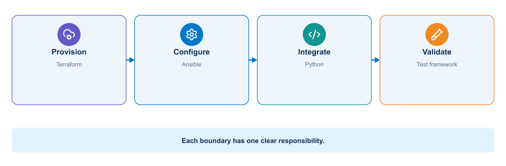
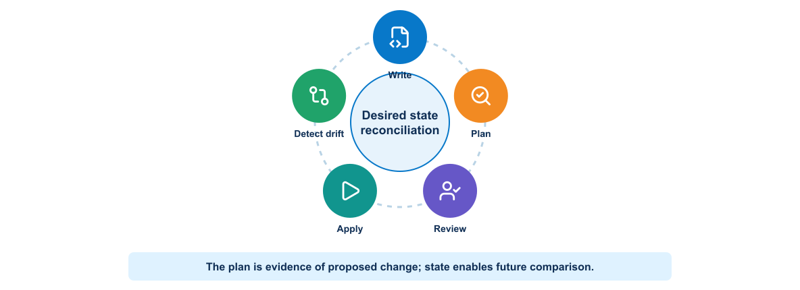
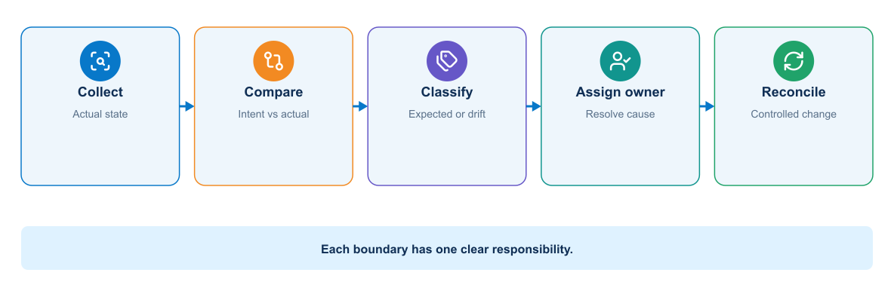
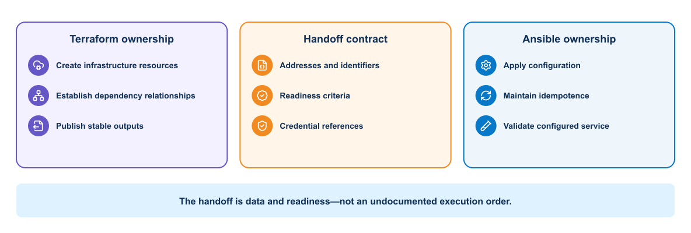
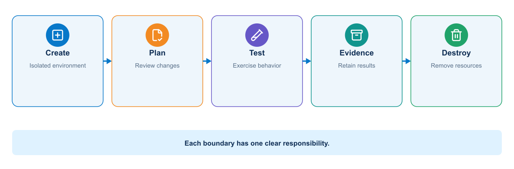

# Module 1: Infrastructure as Code and On-Demand Environments

## 1. Purpose

Module 0 ended with a state-management problem: automation can change infrastructure, but repeatability depends on knowing which definition is authoritative, which tool owns each attribute, and how actual state is compared with intent. Infrastructure as Code makes that problem concrete by treating infrastructure definitions, plans, state transitions, validation, and cleanup as engineered artifacts.

This module covers Terraform, Ansible, ownership boundaries, protected state, drift, on-demand test environments, pipeline integration, validation, and cleanup. The objective is not to promote one tool. It is to establish a controlled lifecycle in which a reviewer can understand what will change, an operator can determine what changed, and the system can be recreated or removed without relying on undocumented knowledge.

Module 0 reviewed the automation foundations used to describe intent, call APIs, configure systems, and verify operational state. Module 1 applies those capabilities to repeatable infrastructure lifecycle and on-demand environments. Terraform, Ansible, and Python receive explicit ownership boundaries so later delivery workflows can create, configure, test, and safely remove consistent environments.

### Reference System Before This Module

- Working Python and Ansible automation
- Versioned intent, inventory, tests, and evidence
- Known target-safety boundaries

### What This Module Adds

- Terraform-managed resource lifecycle
- Ansible-managed configuration and orchestration
- Python validation and pyATS/Genie operational verification
- Disposable test-environment creation and cleanup

### Reference System After This Module

- The supporting environment can be recreated and governed
- Tool ownership and handoffs are explicit
- The application runtime is not yet reproducible

## 2. Three automation responsibilities

> **CORE CONCEPT**

The ownership flow distinguishes resource lifecycle, ordered configuration, and custom application logic before a team selects Terraform, Ansible, or Python for a task.

<p align="center">
  
</p>

Infrastructure provisioning, device configuration, and custom workflow logic overlap, but they are not identical. The course assigns clear ownership:

| Need | Terraform | Ansible | Python |
|---|---|---|---|
| Create API-managed infrastructure resources | Strong fit | Possible with modules | Possible but more lifecycle code |
| Produce a proposed resource plan | Native strength | Limited and module-dependent | Must be designed |
| Track resource lifecycle and dependencies | State and dependency graph | Inventory and task order | Application must implement it |
| Configure many network devices | Provider-dependent | Strong fit with supported network collections | Strong for custom protocols and logic |
| Render Jinja2 configuration | Possible but not preferred here | Strong fit | Strong fit |
| Run custom schema and policy validation | External checks | Assertions and plugins | Strong fit |
| Implement RESTCONF or NETCONF workflow | Provider-dependent | Supported modules/collections | Maximum protocol control |
| Parse and correlate evidence | Outputs and state queries | Registered results | Strong fit |
| Manage idempotence | Provider/resource model | Module behavior | Team must implement |
| Best course role | Create disposable test environment | Configure and orchestrate devices | Normalize, validate, integrate, and analyze |

Select the tool that has the clearest ownership and most reliable model for the target. Do not call Terraform, Ansible, and Python against the same configuration object without an explicit handoff.

### 2.1 Practical tool-selection decisions

Tool choice should follow the type of resource, the available interface, and the operating model of the team. These guidelines highlight common strengths without treating any tool as a universal solution.

- Use **Terraform** when an API resource has a stable lifecycle, dependency relationships, and a provider that can plan and reconcile it reliably. Avoid it for procedural diagnostics, unsupported device features, or objects also owned by another controller.
- Use **Ansible** when the work is ordered, human-readable orchestration across inventories and supported network modules express the intended change. Validate module idempotence and check/diff behavior on the actual platform.
- Write **Python** when the workflow requires custom data normalization, policy, correlation, API pagination, transaction handling, or error logic that modules do not expose. Accept that the team owns tests, retries, idempotence, packaging, and maintenance.
- Use **pyATS/Genie** to verify operational outcomes with structured data; do not use parser success as proof that the expected state exists.

## 3. Infrastructure as Code

> **CORE CONCEPT**

Infrastructure as Code records intended infrastructure in machine-readable files. It provides reviewable change history and repeatable execution. The definition may describe resources declaratively or express a procedural workflow.

IaC benefits include:

- Repeatable environments
- Reviewable changes
- Automated validation
- Faster recovery and recreation
- Consistent tagging and policy
- Traceability between a release and its environment

IaC does not guarantee correctness. Incorrect code can reproduce an unsafe design consistently.

## 4. Desired state and orchestration

Declarative tools describe the desired result. The tool compares desired state with observed or recorded state and determines actions. Procedural automation specifies operations in order.

Most delivery systems use both. Terraform can create infrastructure resources, while Ansible configures operating systems, network devices, or application prerequisites. Shell and Python scripts may coordinate specialized checks.

Ownership must remain clear. Two tools attempting to control the same setting can create oscillation and drift.

## 5. Terraform model

Terraform configuration commonly contains:

- Providers that communicate with a platform API
- Resources that describe managed objects
- Data sources that read existing information
- Variables that accept inputs
- Local values that derive reusable expressions
- Outputs that expose selected results
- Modules that package related infrastructure

Terraform builds a dependency graph from references and can perform independent operations concurrently.

### 5.1 Network example

Terraform may create a controller-managed tenant policy, cloud network, virtual network-device instance, simulated lab definition through an available provider, or infrastructure supporting the automation platform. Provider maturity and platform API behavior determine suitability.

Illustrative resource relationships are:

The test environment contains a management network, a virtual network device, a test peer, scoped security policy, and temporary DNS or inventory output.

Terraform outputs can generate a sanitized inventory input, but credentials should come from a protected identity system.

## 6. Terraform lifecycle

Terraform uses a repeating desired-state lifecycle.

<p align="center">
  
</p>

The normal lifecycle includes:

1. `terraform fmt` for consistent format
2. `terraform init` for providers and modules
3. `terraform validate` for structural validation
4. `terraform plan` to compare configuration and state
5. Review of target, actions, replacements, and sensitive impact
6. `terraform apply` using an approved plan where possible
7. Output and independent operational verification
8. `terraform destroy` for an intentionally disposable environment

A plan can become stale when configuration, state, variables, credentials, or real infrastructure changes. Apply should use the reviewed plan artifact within a controlled window.

## 7. State

Terraform state maps configuration addresses to real resources and stores attributes used for planning. State can contain sensitive values even when configuration marks output as sensitive.

Team use requires a protected remote backend with access control, locking, encryption, versioning, and recovery. State files should not be committed to Git.

Before an unusual recovery or import action, inspect the configuration, state, and real platform. Guessing can cause replacement or loss.

## 8. Drift

The reconciliation flow asks who owns a changed attribute and whether the correct response is acceptance, controlled correction, or escalation rather than automatic overwrite.

<p align="center">
  
</p>

Drift occurs when real infrastructure differs from the controlled definition. It may result from manual changes, another tool, platform defaults, or failed operations.

A scheduled plan can detect drift. The response depends on ownership and intent: revert the manual change, update code to adopt it, import an existing resource, or investigate a provider difference. Automatically applying every detected change may be unsafe.

## 9. Ansible model

Ansible uses inventories, variables, playbooks, roles or collections, and modules. Network automation often connects through SSH or APIs without installing an agent on the managed device.

Ansible tasks should prefer purpose-built modules over free-form shell commands. Modules can understand current state, provide structured results, and support idempotent behavior.

Useful design practices include:

- Separate inventory from reusable automation logic.
- Keep secrets outside inventory files.
- Validate required variables.
- Use check or diff capabilities when trustworthy.
- Limit the target group explicitly.
- Capture before-and-after evidence.
- Use handlers for changes that require a restart.
- Make failure and rollback behavior visible.

### 9.1 Inventory and variables

An inventory identifies targets and groups. It should separate environment-specific addressing from reusable roles. Group variables can define platform defaults, while host variables define required exceptions.

```yaml
all:
  children:
    lab_routers:
      hosts:
        distribution-01:
          ansible_host: 192.0.2.11
          role_id: edge
          intended_state: examples/compliance-intent.yml
      vars:
        ansible_network_os: vendor.collection.network_os
        ansible_connection: ansible.netcommon.network_cli
```

Do not store the password in this file. The playbook receives a protected runtime credential or uses an approved credential plugin.

### 9.2 Playbooks, roles, and templates

A playbook connects targets and ordered outcomes. A role packages reusable tasks, handlers, templates, defaults, and tests. A Jinja2 template converts normalized intent into platform configuration.

Keep validation separate from rendering. Ansible should fail before device access when an intended object or prefix violates policy. Use `serial` or explicit batching for a controlled rollout. Use `--limit distribution-01` or an equivalent pipeline constraint and display the selected hosts before change.

## 10. Provisioning and configuration boundary

Terraform normally owns lifecycle-oriented infrastructure resources. Ansible normally owns configuration within reachable hosts or devices. The exact boundary depends on provider quality and team design.

<p align="center">
  
</p>

For an illustrative automation platform:

- Terraform creates the disposable test environment and exports connection information.
- Ansible configures the environment for application deployment.
- The application pipeline deploys the tested image.
- Validation scripts assess the running service.
- Terraform removes the environment after evidence collection.

## 11. On-demand test environments

> **LAB REQUIRED**

An ephemeral environment has a complete lifecycle, including evidence collection and controlled cleanup after failure.

<p align="center">
  
</p>

Cleanup retains the original failure and targets only resources whose ownership is proven.

An on-demand environment gives a branch or merge request an isolated place for integration and system testing. A useful design includes:

- Unique, validated naming
- Restricted network scope
- Short-lived credentials
- Resource and cost limits
- Automatic expiration
- Traceable ownership
- Repeatable initialization
- Reliable cleanup

The environment should resemble the target environment in the characteristics relevant to the test. It does not need production scale for every merge request.

## 12. Network test environment options

> **ADVANCED / REFERENCE**

Test environments trade speed and cost against behavioral fidelity. The table compares common choices so that an engineering team can match the environment to the risk and evidence required from a test.

| Platform | Strength | Limitation | Suitable course use |
|---|---|---|---|
| Vendor sandbox | Authorized access to hosted network platforms with low setup effort | Reservation, VPN, shared or reset behavior, Internet dependency | Real API and device capability exercises |
| Network simulator or emulator | Controlled multi-device topologies | Feature fidelity and compute requirements | Routing convergence, topology, and rollback tests |
| Virtual network appliance | High platform realism | Image access, compute, and licensing | Dedicated device and peer validation |
| Mock RESTCONF/API service | Fast, deterministic, safe, easy in CI | Cannot prove real YANG or protocol operation | Error handling, schema, pagination, and offline integration |
| Container-based test components | Rapid service and API testing | Network OS behavior is incomplete | Automation API, queue, database, and telemetry integration |
| Physical lab | Real interfaces and platform behavior | Cost, contention, reset, and blast radius | Advanced instructor-controlled validation |

The course must remain usable without production access. Offline checks and mocks run for every learner. Real-device jobs use an authorized sandbox, virtual lab, or instructor-provided environment.

## 13. Network drift and compliance

Configuration drift is a difference between controlled intent and actual configuration. Operational drift is a difference between the expected and observed service state. The two can occur independently.

Examples include:

- An engineer manually removes the passive-interface command.
- A controller overwrites an interface description.
- The configuration remains correct but an OSPF neighbor fails.
- A route appears through an unintended protocol or next hop.

A scheduled read-only pipeline can collect modeled configuration and operational state, normalize it, compare it with intent, and open a review item. Automatic reconciliation may suit low-risk objects, but shared routing changes should follow policy and approval.

Compliance rules should identify ownership, severity, tolerated exceptions, and remediation path. A permanent exception belongs in reviewed policy data, not a hidden `if` statement.

## 14. Pipeline integration

> **ADVANCED / REFERENCE**

This section describes only the future handoff: a delivery pipeline will consume reviewed plans, environment identifiers, validation results, and cleanup evidence. Pipeline jobs, runners, rules, and promotion are implemented in Module 4.

A safe infrastructure pipeline separates responsibilities:

The infrastructure pipeline formats and validates the definitions, applies policy, creates and reviews a plan, provisions the environment, configures it, deploys the automation components, runs tests, collects evidence, and destroys only the disposable resources it created.

Cleanup should run when tests fail, but it must target only the environment created for the pipeline. Store the exact environment identifier as an artifact. Avoid a wildcard cleanup operation.

### 14.1 Practical ownership boundary: Terraform hands off to Ansible

The handoff is a machine-readable inventory artifact, making the ownership boundary visible. Consider an on-demand test environment. Terraform creates the isolated network, compute instances, security rules, and DNS records, then exports a machine-readable inventory. Ansible consumes that inventory to install the container runtime, configure trust anchors, and start the application. Terraform should not run a long sequence of remote shell provisioners, and Ansible should not create cloud networks through ad hoc tasks. The handoff artifact lets the pipeline prove that configuration targeted only resources created by that run.

Before `apply`, a policy job can reject a plan that creates a public address or opens a management port to `0.0.0.0/0`. Before cleanup, the job compares the recorded environment identifier and ownership tags with current state. A missing or mismatched tag is a stop condition, not a reason to broaden the destroy command.

## 15. Secrets and access

Infrastructure jobs often hold powerful credentials. Use separate identities for planning, applying, configuration, and deployment when practical. Restrict each identity to the target environment and required operations.

Prefer short-lived credentials issued to the job. Protect state, plans, logs, and artifacts because they may expose addresses, identifiers, or sensitive values.

## 16. Infrastructure testing

Testing can include:

- Syntax and schema validation
- Policy evaluation
- Unit tests for modules or transformations
- Plan assertions
- Resource-count and target checks
- Configuration verification
- Connectivity and service tests
- Destruction and recreation tests
- Drift detection

Independent verification is valuable. A tool reporting successful apply confirms API operations, but it does not prove that users can reach the service or that the security policy works as intended.

## 17. Network platform considerations

Controllers and network devices may expose declarative APIs, model-driven interfaces, and Ansible or Terraform integrations. Before automation, determine object hierarchy, transaction behavior, eventual consistency, rate limits, and rollback capability.

Shared network infrastructure requires strict target validation and change scoping. A sandbox, simulator, or dedicated training environment is appropriate for learning destructive lifecycle operations.

## 18. Knowledge check

Use these questions to evaluate infrastructure state, test-environment selection, and the controls required for repeatable provisioning.

1. Why should Terraform state not be committed to Git?
2. What should a reviewer inspect in a Terraform plan?
3. How can Terraform and Ansible divide responsibility in a network automation workflow?
4. Why must cleanup use the exact environment identifier created by the pipeline?
5. What evidence proves more than a successful infrastructure API response?

## 19. Summary

Infrastructure delivery introduces the first complete delivery control chain in the guide: declared intent, authoritative ownership, a proposed plan, review, controlled execution, observed state, retained evidence, and reconciliation. Terraform is strongest at resource lifecycle; Ansible is strongest at configuration and orchestration. Their handoff must be explicit, state must be protected, and cleanup must prove ownership before destroying anything.

**What the learner now has:** repeatable infrastructure with explicit ownership among Terraform, Ansible, Python, and operational verification.

The system can now recreate its supporting environment, but it still cannot guarantee that the automation application behaves identically for every engineer and execution host. Infrastructure definitions do not lock the Python interpreter, Python packages, Ansible collections, system libraries, or application startup behavior. IaC solves environment lifecycle; it does not solve application runtime reproducibility.

**What is still missing:** a reproducible application runtime and a shared model for ownership, release flow, measurement, and improvement.

**What the next module adds:** Module 2 introduces the DevOps operating model; Module 3 then makes the application runtime reproducible. Continue to [Introducing the DevOps Model](module-02-devops-model.md).
