# Module 2: Introducing Containers

## Purpose

Containers package an existing application's code and user-space dependencies into a portable runtime unit. They allow engineers and CI runners to use the same runtime, libraries, clients, and validation logic. This module explains container architecture, Docker tooling, image and container lifecycle, storage, networking, configuration, and isolation.

## The application consistency problem

An engineer runs `app.py` successfully from a laptop. The GitLab job fails with a different Python package version. Another engineer has an older Ansible collection, and a system Python upgrade changes a parser. The team describes this as “works on my laptop,” but the underlying problem is an undefined application runtime.

A network automation container makes the runtime explicit:

The versioned automation image combines a fixed Python version, locked packages, controlled Ansible collections, pyATS and Genie parsers, NETCONF/RESTCONF/SSH clients, Jinja2 templates, validation code, certificate trust, and required utilities.

The same image can render the proposed configuration, execute offline tests, collect pre-checks, and run a controlled deployment. Environment-specific inventory and credentials remain outside the image.

## Why teams containerize applications

| Workload | Benefit of a container | Important boundary |
|---|---|---|
| Python API or SSH client | Reproducible interpreter and packages | Device addresses and credentials remain external |
| Ansible execution | Fixed Ansible and collection versions | Inventory and secrets are mounted or retrieved at runtime |
| pyATS validation | Consistent Genie parsers and test dependencies | Parser support must match device output and release |
| Configuration rendering | Stable Jinja2 and schema libraries | Reviewed intent is supplied as a controlled input |
| CI runner job | Disposable job runtime | Runner access still controls reachable networks |
| Automation API and worker | Independent service scaling and upgrades | Queue and result state require external services |
| Mock device API | Repeatable offline integration tests | Mock behavior cannot prove real protocol operation |

Containerization does not grant device reachability or make unsafe code safe. It standardizes the execution boundary.

## Why containers help delivery

An application may behave differently across hosts because language runtimes, libraries, files, environment values, and operating-system packages differ. A container image captures many of these dependencies in a versioned artifact. The pipeline can build the image once, test that exact artifact, and promote it without rebuilding.

Containers improve consistency, but they do not eliminate environmental differences. Kernel behavior, CPU architecture, network policy, storage, secrets, and external services remain outside the image.

## Containers and virtual machines

A virtual machine includes a guest operating system and runs through a hypervisor. A container normally shares the host kernel while receiving isolated process, network, filesystem, and resource views.

Containers usually start faster and use fewer resources than virtual machines. Virtual machines provide a stronger boundary and can run a different guest kernel. Many platforms run containers inside virtual machines to combine infrastructure isolation with application packaging efficiency.

## Linux foundations

Container isolation relies mainly on operating-system features:

- Namespaces provide separate views of processes, networking, mounts, hostnames, users, and other resources.
- Control groups account for and limit CPU, memory, and I/O use.
- Filesystem layers provide an efficient image and writable-container model.
- Capabilities divide privileged root operations into smaller units.
- Security profiles restrict system calls and resource access.

A container remains a process on the host. If it receives excessive privileges or access to the Docker socket, it can weaken the host boundary.

## Docker architecture

<p align="center">
  
</p>

The Docker client sends API requests to the Docker daemon. The daemon manages images, networks, volumes, and containers. A registry stores and distributes images.

The Docker client sends requests to the daemon. The daemon coordinates the container runtime and manages local images, networks, volumes, and registry interactions.

Important objects include:

- Image: immutable packaging template identified by content and metadata
- Container: runtime instance of an image with a writable layer
- Registry: service that stores repositories of images
- Volume: Docker-managed persistent data
- Bind mount: host path exposed inside a container
- Network: communication boundary connecting selected containers

For network automation, there are two distinct network planes:

- The Docker application network connects the automation API, worker, queue, database, and telemetry services.
- The management network connects an authorized worker or runner to network devices and controllers.

Joining a container to both planes creates a security boundary. The public API service does not need direct device access if it places an authorized job on a queue for a restricted worker.

## Image references and identity

An image reference commonly contains a registry, repository, and tag. Tags such as `latest` are mutable labels and do not guarantee identical content over time. A digest identifies image content cryptographically.

Development workflows may use readable version tags. Promotion and controlled deployment should preserve the immutable digest or another verifiable identity. The application version, source commit, and image identity should remain traceable to one another.

## Image layers and cache

<p align="center">
  
</p>

Most Dockerfile instructions create layers. Docker can reuse unchanged layers during later builds. Layer order therefore affects build speed. Stable dependency installation usually belongs before frequently changing application source.

The cache affects efficiency, not correctness. A build process must declare all inputs and should not depend on accidental files remaining from an earlier build.

## Container lifecycle

A container can be created, started, stopped, restarted, inspected, and removed. Stopping a container preserves its writable layer until removal, but important data should not depend on that layer. Deployment platforms replace containers routinely.

The application should respond predictably to termination signals, stop accepting new work when appropriate, finish or abandon work safely, and exit within the platform timeout.

## Configuration and secrets

An image should contain application code and fixed runtime dependencies. Environment-specific configuration belongs outside the image. Common inputs include environment variables, mounted configuration files, platform configuration objects, and secret stores.

Do not bake passwords, tokens, certificates, or private keys into image layers. Removing a secret in a later Dockerfile instruction does not remove it from earlier layers.

## Container storage

The writable container layer is temporary. Persistent data belongs in a volume, external database, object store, or another managed service.

Volumes offer Docker-managed storage and portability across container recreation on the same host. Bind mounts provide direct access to a host path and are useful for development, but they create a stronger host dependency and may expose sensitive files.

Applications should state clearly which data is persistent, which is cache, and which can disappear safely.

## Container networking

<p align="center">
  
</p>

Containers on a user-defined Docker network can normally resolve one another by service name. Applications should connect to the logical service name rather than a temporary container IP address.

Publishing a port maps a host address and port to a container port. Internal services such as databases normally do not need a public host port. Expose only the entry points that users or external systems require.

Network segmentation reduces unintended communication. The automation API, job worker, queue, database, dashboard, and telemetry collector do not all need identical reachability.

### Management-network choices

A container can reach network devices through several patterns:

- Bridge networking with routed host reachability
- Host networking in a controlled lab, with reduced isolation
- A dedicated container network attached to a management VLAN
- A runner located inside the management zone
- A VPN established on the host, subject to Docker routing behavior

The team must test source addressing, DNS, MTU, firewall policy, certificate identity, and return routing. `ping` success does not prove that SSH, NETCONF, or RESTCONF works.

Avoid host networking as an unexplained fix. It removes a useful boundary and can create port conflicts.

## Runtime inputs for network jobs

The image should not contain live inventory or device credentials. A job receives:

- A reviewed intended-state file from the repository
- An inventory selected for the target environment
- A change identifier and commit SHA
- Short-lived credentials or a Vault reference
- Trusted CA material required for HTTPS
- An evidence-output location

Mount input files read-only where practical. Give the job a dedicated writable location for generated configuration and evidence. Never mount the entire engineer home directory or Docker socket without a documented requirement.

## Persistent and ephemeral network data

Automation code and templates belong in the image or repository checkout. Generated candidate configuration, test reports, and backups are job artifacts. Job status, approval history, or scheduling data may belong in a database. Telemetry belongs in purpose-built storage.

Device backups can expose topology, usernames, addresses, and security configuration. Treat them as sensitive artifacts with controlled retention rather than ordinary container logs.

## Device connection behavior inside containers

Automation tools must handle interactive and model-driven protocols correctly:

- SSH host-key validation should use a controlled known-hosts file.
- NETCONF commonly uses TCP 830 and exchanges server capabilities before RPCs.
- RESTCONF uses HTTPS and should validate the device certificate and hostname.
- Controller REST APIs may use tokens, sessions, pagination, and rate limits.
- Long-running collection needs explicit connect, read, and operation timeouts.

Container clocks must remain accurate because TLS, token expiration, telemetry timestamps, and evidence correlation depend on time.

## Network automation container lifecycle

A pipeline job container should be disposable:

1. Receive immutable code and intended state.
2. Retrieve a scoped credential.
3. Confirm target identity.
4. Perform its one assigned operation.
5. Write structured evidence.
6. Revoke or release credentials.
7. Exit with a meaningful status.

Long-running API or worker containers follow service lifecycle rules and need readiness, graceful shutdown, queue handling, and durable result storage.

## Resource and health considerations

Without resource boundaries, one container can consume enough CPU or memory to affect others. Production platforms need requests, limits, quotas, or equivalent controls based on observed behavior.

A running process is not necessarily a healthy service. Health checks should test a meaningful but inexpensive behavior. They should distinguish startup delay from ongoing failure and avoid creating excessive load.

## Container tooling workflow

A disciplined Docker workflow includes:

1. Inspect the source and Dockerfile.
2. Build with an explicit version tag.
3. Review build output and base-image selection.
4. Inspect metadata and layer history.
5. Run with controlled configuration and networking.
6. Exercise the application.
7. Review logs, health, and resource behavior.
8. Stop and remove disposable resources.

Useful commands include `docker build`, `docker image inspect`, `docker history`, `docker run`, `docker ps`, `docker logs`, `docker exec`, `docker stats`, and `docker network inspect`.

### Practical run pattern

This example keeps configuration outside the image, mounts it read-only, limits resources, removes unnecessary Linux capabilities, and gives generated evidence a dedicated writable location:

```bash
docker run --rm --name automation-check \
  --env-file ./lab.env \
  --mount type=bind,src="$PWD/config",dst=/app/config,readonly \
  --mount type=volume,src=automation-evidence,dst=/evidence \
  --read-only --tmpfs /tmp:rw,noexec,nosuid,size=64m \
  --cap-drop ALL --memory 512m --cpus 1 \
  registry.example/automation@sha256:APPROVED_DIGEST validate
```

This is a pattern, not a command to copy unchanged into production. The environment file must contain no long-lived device password, the digest must resolve in the chosen registry, and the application must support a read-only root filesystem. Because `--rm` deletes the stopped container, durable logs and reports must reach the evidence volume or a collector before exit.

## Lab progression

Learners explore Docker CLI commands using the supplied application: inspect images, create and run containers, view logs, execute a diagnostic command, inspect mounts and networks, stop the container, and remove disposable resources. They identify which application inputs must remain external to the image.

## Knowledge check

1. Which dependencies does a container image control, and which remain part of the environment?
2. Why is an image digest stronger evidence than the `latest` tag?
3. Why should persistent application data not remain in the container writable layer?
4. When should a service port remain internal to a Docker network?
5. Why can access to the Docker socket create a serious security risk?

## Summary

Containers remove a major source of delivery drift by packaging the application and its runtime dependencies together. They do not remove host-kernel, routing, DNS, certificate, storage, or identity dependencies. A production-ready container is replaceable, runs with limited privilege, receives configuration at runtime, and leaves durable evidence outside its writable layer.
