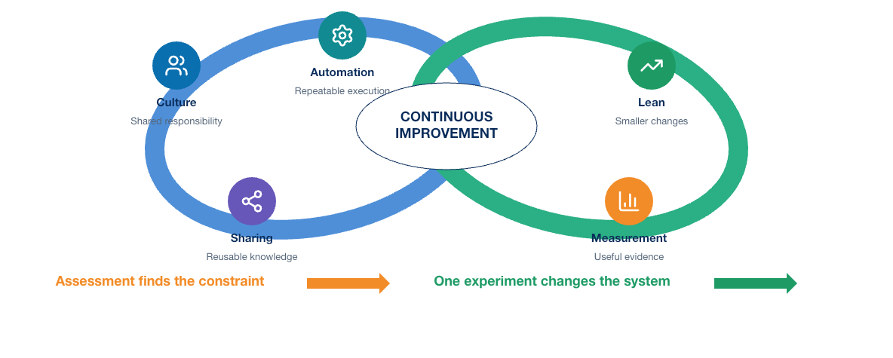
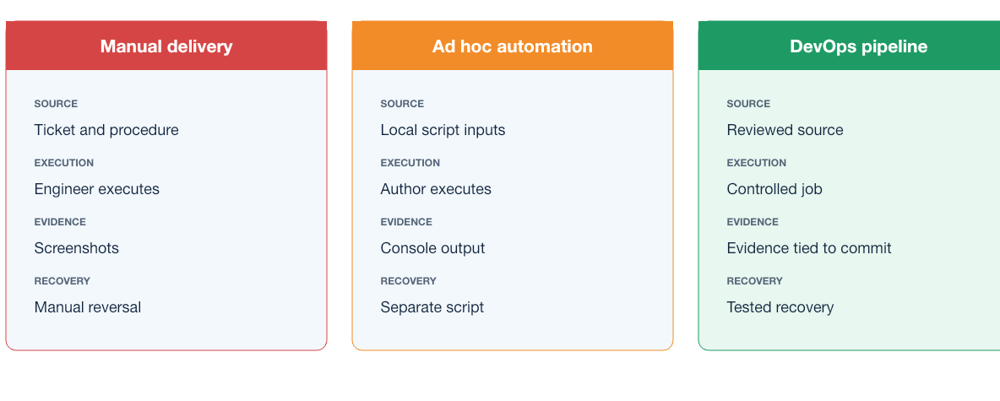
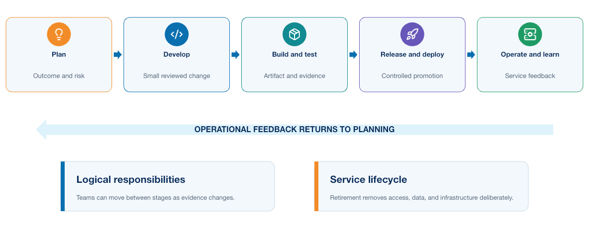
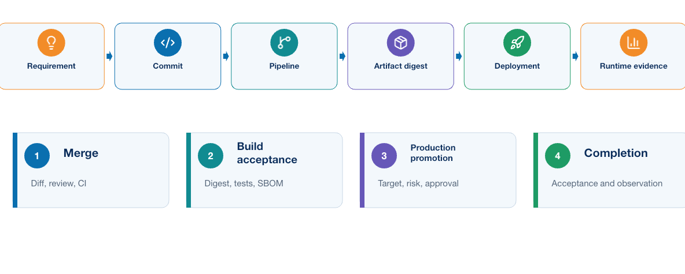
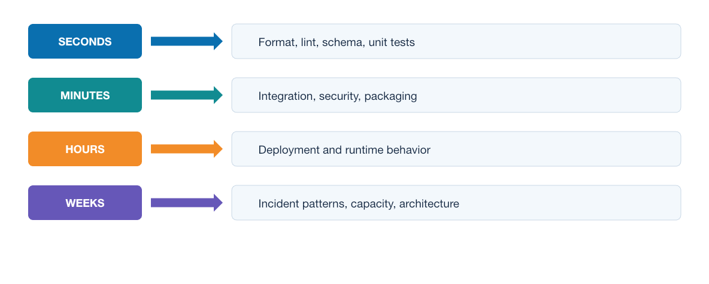
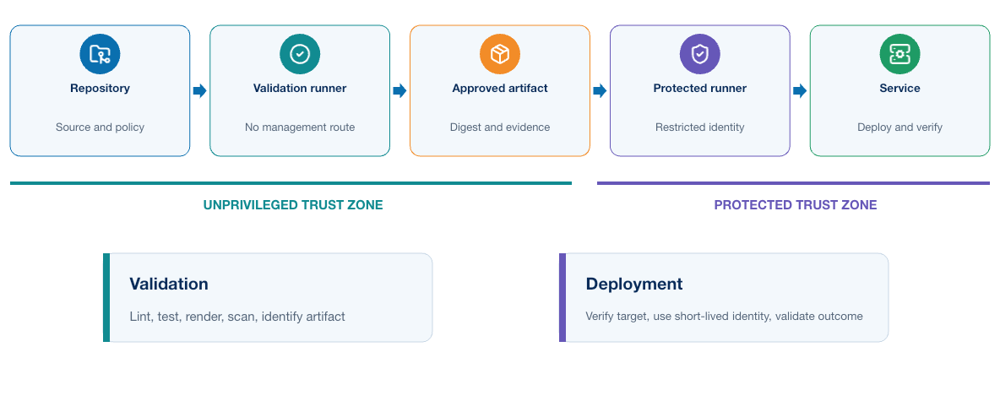
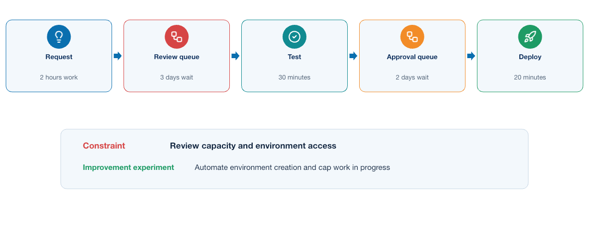

# Module 2: Introducing the DevOps Model

## 1. Purpose

Module 1 demonstrated a controlled technical lifecycle for infrastructure: declare intent, review a plan, apply it through an identified owner, verify actual state, and reconcile drift. DevOps expands that discipline from infrastructure tooling to the complete way a team develops and operates software and services.

DevOps organizes delivery so that small changes move through a controlled, repeatable feedback loop. It combines shared responsibility, version control, automation, testing, operational evidence, and continuous improvement. A team has adopted DevOps only when these practices change how it makes decisions and learns from operation. Installing a pipeline product alone does not achieve that result.

This module establishes the DevOps philosophy, CALMS model, flow, feedback, measurement, shared ownership, continuous integration, continuous delivery, and continuous deployment concepts used throughout the course. These practices came from software engineering and apply to any application. Network automation provides the primary engineering workload through which the practices are applied throughout the course.

The central question is practical: **How do we turn useful network automation into a dependable software system that a team can build, package, deploy, operate, secure, observe, and improve?** Module 2 supplies the operating model; later modules implement it.

[Module 0](module-00-network-automation-review.md) reviewed how the supplied application turns intent and inventory into controlled network operations, and Module 1 applied repeatability and desired-state practices to infrastructure. Module 2 now changes the point of view: the subject is how a team develops, tests, releases, operates, and improves the complete system. The delivery model established here supplies the reasoning used by every later module.

### Reference System Before This Module

- Verified Python and Ansible automation
- Git-based intent and evidence
- Reproducible, explicitly owned test infrastructure

### What This Module Adds

- CALMS, shared ownership, flow, feedback, and measurement
- Continuous integration, delivery, and deployment distinctions
- Value-stream and delivery-performance thinking
- Build-once, evidence, and promotion principles

### Reference System After This Module

- The team has a shared delivery and improvement model
- Release evidence and promotion expectations are explicit
- No reproducible application artifact exists yet

## 2. From ad hoc automation to DevOps

> **CORE CONCEPT**

Task automation often begins with a Python script, an API integration, or an Ansible playbook created to meet an immediate operational need. This approach can be effective at small scale, but weaknesses emerge when the solution must be reviewed by a team, reproduced in a clean environment, released safely, diagnosed consistently, and supported independently of its original author.

DevOps addresses that delivery problem. It brings development and operational responsibilities into one feedback system and applies proven software practices to the complete path from source change to operating service. When the application automates infrastructure or networks, the same model is sometimes called infrastructure DevOps or NetDevOps; the underlying delivery principles do not change.

The contrast is important:

| Ad hoc automation | DevOps delivery |
|---|---|
| An engineer runs a local script | A versioned application runs in a defined environment |
| Dependencies are installed from memory | Dependencies are declared, locked, built, and scanned |
| Testing depends on the author | Automated tests run for every proposed change |
| Credentials live on a workstation | Workload identities and secrets are supplied at runtime |
| Success means the command completed | Acceptance checks prove the software and service outcome |
| Knowledge remains with an individual | Code, evidence, runbooks, and decisions are shared |

Network delivery has several characteristics that affect the implementation:

- A single configuration error can affect many shared services.
- Devices are long-lived and mutable; teams rarely rebuild a production router for each change.
- Actual service behavior depends on protocol relationships among devices.
- Configuration acceptance does not prove forwarding or routing success.
- Multiple management interfaces and controllers may own overlapping state.
- Maintenance windows, approvals, and regulatory evidence may remain necessary.

NetDevOps therefore emphasizes scoped targets, intended state, pre-change facts, configuration diffs, post-change operational validation, and tested recovery.

## 3. CALMS applied to software delivery

> **CORE CONCEPT**

CALMS assesses DevOps as an operating model rather than a collection of tools. It represents **Culture, Automation, Lean, Measurement, and Sharing**. The dimensions work together: automation without ownership can accelerate a poor process, while collaboration without repeatable execution remains dependent on individuals.

<p align="center">
  
</p>

| Dimension | Software-delivery interpretation | Evidence in this course |
|---|---|---|
| Culture | Developers, security, platform, and operations teams share service outcomes | Merge-request review and joint acceptance criteria |
| Automation | Repeatable building, testing, deployment, and recovery replace engineer-specific procedures | GitLab jobs, automated tests, containers, and deployment code |
| Lean | Small, independently reviewable changes move through a visible flow with limited work in progress | One application change on a short-lived branch |
| Measurement | Delivery and application behavior produce usable measures | Pipeline duration, failure rate, latency, availability, and telemetry |
| Sharing | Code, intent, runbooks, findings, and reusable tests remain available to the team | One repository and retained pipeline evidence |

### 3.1 Culture: shared responsibility for the outcome

Culture replaces isolated handoffs with shared responsibility for delivery and operation. Specialists retain distinct roles and access, but application, platform, security, and operations owners agree on acceptance criteria, release scope, observability, and recovery before deployment. Useful evidence includes cross-functional review, explicit ownership, accessible runbooks, and incident reviews that improve controls rather than assign blame.

### 3.2 Automation: make the safe path repeatable

Automation makes reviewed work repeatable across build, test, security, deployment, verification, recovery, and cleanup. Dependable automation is versioned, testable, observable, bounded by timeouts and scope, and explicit about failure. Teams should first understand the process being automated; otherwise ambiguity and unsafe behavior merely execute faster. Manual approval may remain, but it should reference an exact commit, artifact, environment, proposed effect, and evidence.

### 3.3 Lean: improve flow and reduce batch risk

Lean improves the flow of small, reviewable changes. It exposes queues, repeated setup, oversized releases, late testing, and work waiting for a specialist. Short-lived branches, early checks, limited work in progress, and reusable test environments reduce delay and batch risk. Lean does not remove necessary controls; it designs them to provide evidence quickly and consistently.

### 3.4 Measurement: use evidence to guide improvement

Measurement connects delivery activity with service outcomes. Useful measures include feedback time, deployment frequency, lead time, change failure rate, recovery time, availability, latency, and error rate. Definitions must remain consistent, and the measures should guide improvement rather than rank individuals. A balanced view considers speed, quality, reliability, and recovery together.

### 3.5 Sharing: make knowledge part of the system

Sharing moves knowledge from private notes and memory into version-controlled code, reviews, decisions, tests, dashboards, incident findings, and runbooks. Access alone is insufficient: another engineer should be able to build, release, diagnose, and recover the service from the recorded context. Shared knowledge shortens onboarding and makes assumptions available for review.

### 3.6 How the CALMS dimensions reinforce one another

The dimensions form a feedback system. Culture makes failures discussable; Sharing preserves what was learned; Automation embeds the improved procedure; Lean reduces the delay and size of the next change; and Measurement shows whether the change helped. CALMS exposes imbalance—for example, a sophisticated pipeline that still depends on one engineer to approve, diagnose, and recover every release.

### 3.7 CALMS assessment questions

An engineering team can use the following questions during a retrospective or maturity review:

| Dimension | Questions worth asking |
|---|---|
| Culture | Who owns the service after deployment? Can team members challenge an unsafe release? Are incidents used to improve the system? |
| Automation | Can a clean runner reproduce the build and tests? Are errors, retries, cleanup, and recovery automated safely? |
| Lean | Where does work wait? How large are release batches? Which manual approval or environment dependency is the current constraint? |
| Measurement | Do measures cover both delivery and runtime outcomes? Are definitions consistent? Does the team act on what it measures? |
| Sharing | Can another engineer build, release, troubleshoot, and recover the service from repository and operational records? |

Do not reduce the result to a maturity score. Select an observable weakness and a small improvement experiment, such as building on a clean runner, adding one reliable acceptance test, or publishing a tested recovery procedure.

## 4. Three delivery models

DevOps is easier to understand when it is compared with the delivery models it replaces or improves. The following comparison shows how ownership, evidence, execution, and recovery change as work moves from manual delivery through isolated automation to an engineered pipeline.

<p align="center">
  
</p>

| Characteristic | Manual delivery | Ad hoc automation | DevOps pipeline |
|---|---|---|---|
| Source of truth | Ticket and engineer notes | Script inputs or local files | Reviewed source in version control |
| Execution | Engineer follows a procedure | Author runs a script or playbook | Controlled job deploys an identified artifact |
| Review | Release checklist | Code review may occur | Source, tests, dependencies, policy, and evidence are reviewed |
| Validation | Engineer performs selected checks | Script may run checks | Required build, integration, security, and acceptance tests |
| Credentials | Personal account | Often local environment values | Short-lived or protected workload identity |
| Environment control | Manually prepared host | Author's workstation or shared server | Defined, reproducible, protected environment |
| Evidence | Screenshots or copied output | Console log | Structured artifacts tied to commit and pipeline |
| Recovery | Engineer reverses steps | Separate rollback script | Tested rollback or forward-remediation workflow |
| Feedback | Incident or ticket closure | Script result | Pipeline result plus application telemetry |

Automation improves consistency, but DevOps connects automation to collaboration, governance, and operational truth.

## 5. Complete DevOps lifecycle

> **CORE CONCEPT**

The DevOps lifecycle connects an idea to an operating service and returns operational knowledge to the next decision. Deployment is therefore not the end: software must be operated, observed, improved, secured, and eventually retired.

<p align="center">
  
</p>

**Plan → Design → Develop → Integrate → Build → Test → Release → Deploy → Operate → Observe → Learn**

These are logical responsibilities, not separate departments or a rigid sequence. Teams move between them continuously: a runtime failure may create a test, a security finding may change the design, and a build failure returns directly to development.

### 5.1 Plan: define the problem and expected outcome

Planning defines the problem, scope, owner, risk, and measurable outcome. It includes functional behavior and operating constraints such as performance, authorization, evidence, and recovery. For the supplied application, success is not merely that a Python function works; another engineer must be able to review, release, observe, and support it through a controlled process.

### 5.2 Design: decide how the change fits the system

Design translates the requirement into components, interfaces, state ownership, trust boundaries, failure behavior, and deployment assumptions. The team decides how dependencies fail, which credentials and paths are required, what can be tested offline, how health is proven, and whether versions can overlap or be restored safely. Important assumptions and trade-offs belong in a short architecture decision record.

### 5.3 Develop: implement a small, reviewable change

Development occurs in version control on a small, reviewable branch. Code, tests, dependency declarations, contracts, and documentation change together when they describe one behavior. Local checks provide early feedback, but the shared pipeline must reproduce them. Secrets remain outside the commit, and implementation quality includes explicit errors, timeouts, safe defaults, and testable boundaries.

### 5.4 Integrate: combine work and obtain early feedback

Integration validates a proposed change against shared source. Fast checks run first, independent checks run concurrently, and expensive environments are created only after basic validation succeeds. Automation evaluates repeatable conditions; reviewers assess intent, design, risk, maintainability, and whether the tests prove the right outcome. Both are required.

### 5.5 Build: create an identifiable artifact

The build converts reviewed source and declared dependencies into an immutable artifact. The record connects its digest to the commit, build, dependencies, tests, SBOM, scan results, provenance, and signature where required. Build once and promote the same digest; rebuilding for production creates a different artifact without the evidence collected from the tested one.

### 5.6 Test: build confidence at several boundaries

No single test proves a release. A practical test strategy layers evidence:

| Test layer | Question answered | Typical environment |
|---|---|---|
| Static checks | Is the source structurally valid and free of selected defects? | CI runner |
| Unit tests | Does isolated application logic behave correctly? | CI runner |
| Component tests | Does the packaged component start and honor its runtime contract? | Container runtime |
| Integration tests | Do application, database, queue, and API boundaries work together? | Compose or ephemeral services |
| Security tests | Does the artifact meet dependency, secret, identity, and runtime policy? | Build and test environment |
| System tests | Does the assembled application perform its important workflows? | On-demand test environment |
| Acceptance tests | Does the release satisfy the user or operational outcome? | Representative environment |

No single test proves a release. Use the least expensive layer that can provide the required evidence, then advance toward representative environments. Flaky tests and unrealistic mocks weaken trust and must be treated as defects.

### 5.7 Release: make a version eligible for deployment

A release is a versioned artifact plus the evidence needed for promotion: digest, tests, vulnerability policy, compatibility, approval, and recovery plan. Release and deployment are different; an artifact can be eligible without running in production. Continuous delivery keeps a validated release deployable, whereas continuous deployment automatically promotes every qualifying release and therefore requires stronger confidence and recovery.

### 5.8 Deploy: change the target environment safely

Deployment verifies the artifact, target, baseline health, capacity, configuration, and credentials before changing an environment through an appropriate strategy. Platform acceptance does not prove service success. Use bounded timeouts, stop conditions, post-checks, and explicit handling for uncertain outcomes; after a timed-out change request, rediscover actual state before retrying.

### 5.9 Operate: keep the service dependable

Operation covers availability, capacity, backup, patching, incident response, credential rotation, dependency maintenance, and recovery. Runbooks define symptoms, evidence, safe actions, and escalation. For an automation service, operators also manage queue health, worker concurrency, API limits, credentials, evidence retention, and per-target locking.

### 5.10 Observe: compare actual behavior with expectations

Observation combines metrics, logs, traces, health checks, events, and release context. Signals must identify the version, environment, and request or job. Immediate checks reveal obvious failure; an observation window reveals delayed degradation. Liveness, readiness, and end-to-end acceptance prove different conditions and must not be treated as interchangeable.

### 5.11 Learn and improve: close the loop

Operational evidence should change future work. A failure may reveal a missing test, unsafe retry, fragile dependency, capacity assumption, or approval gap. Add the resulting improvement to code, tests, policy, design, or runbooks. Findings need owners and measurable follow-up; collecting incident information without changing the system does not complete the learning loop.

### 5.12 Retire: remove software and access deliberately

Retirement stops traffic and scheduled work, handles data according to policy, revokes credentials, removes owned infrastructure, updates documentation, and preserves required evidence. Before deletion, confirm that no consumer remains and prove ownership of every targeted resource.

### 5.13 Gates, evidence, and promotion

A gate is a decision supported by evidence, not an unexplained approval step.

<p align="center">
  
</p>

| Gate | Decision | Minimum useful evidence |
|---|---|---|
| Merge | Is this change suitable for the shared source branch? | Diff, review, required CI results |
| Build acceptance | Is the artifact identifiable and compliant? | Digest, tests, SBOM, scan and provenance results |
| Test promotion | Is the release suitable for a representative environment? | Artifact identity, configuration, test plan |
| Production promotion | Is the exact tested release acceptable at this time and scope? | Test evidence, target, risk, approval, recovery plan |
| Rollout continuation | Should exposure increase? | Readiness, acceptance, error and performance signals |
| Completion | Has the intended outcome been achieved? | Deployment record, acceptance result, observation evidence |
| Recovery | Is rollback safe, or is forward remediation required? | Actual state, data compatibility, failure classification |

**requirement → source change → commit → pipeline → test results → artifact digest → approval → deployment → runtime evidence**

Evidence must remain connected along this chain. A new commit, artifact, target, or configuration can invalidate an earlier approval and require renewed validation.

### 5.14 Feedback loops at different speeds

Feedback arrives at different speeds, and each loop needs an owner and a path back into source, tests, policy, documentation, or design:

<p align="center">
  
</p>

- **Seconds to minutes:** formatter, linter, schema validation, and unit tests guide the developer.
- **Minutes to hours:** integration, security, packaging, and system tests guide merge and release decisions.
- **Hours to days:** deployment and runtime signals reveal behavior under representative or real workloads.
- **Weeks to months:** delivery measures, incident patterns, dependency health, capacity, and architecture reviews guide investment.

Fast feedback reduces correction cost, but slower operational feedback remains essential because tests cannot reproduce every production condition.

### 5.15 Applied example: from commit to operating automation service

Suppose a developer improves error classification in the Python worker:

1. Planning defines retryable, permanent, and uncertain outcomes; design specifies safe retry behavior.
2. Development changes the classifier, tests, and operating guidance in one reviewed branch.
3. CI runs static, unit, fixture, and security checks; the build produces one scanned image and records its digest.
4. Integration tests inject a timeout and confirm that uncertain work is not repeated automatically.
5. Reviewers approve the commit, digest, and evidence; deployment introduces that digest and verifies readiness and a representative job.
6. If uncertain jobs increase, rollout stops and the team recovers according to actual state. The finding becomes a regression test and runbook improvement.

The code change may be small; the lifecycle makes it safe for a team to deliver and support repeatedly.

## 6. A practical software delivery architecture

> **ADVANCED / REFERENCE**

The following responsibilities appear in most mature delivery systems, although the products and team boundaries vary.

The reference architecture makes the most important trust transition visible: unprivileged validation produces an identified artifact before an approved protected runner receives management access.

> **DESIGN INSIGHT**
> A runner is not safe merely because the CI platform labels it protected. Its effective trust boundary is determined by which jobs it accepts, which identities it can obtain, and which endpoints it can reach.

<p align="center">
  
</p>

Operational evidence returns to the engineer and repository; it is not an isolated monitoring destination.

- The Git repository stores intent, automation code, tests, policy, pipeline definitions, and operational documentation.
- An unprivileged validation runner parses and normalizes intent, applies schema and policy, renders candidates, executes offline tests, and performs supply-chain checks. It has no device route or deployment credential.
- An approval gate binds the reviewed commit, target inventory fingerprint, rendered difference, test evidence, and automation image digest.
- A protected network runner or restricted worker receives only the approved job, a short-lived identity, explicit targets, and the minimum management route.
- Devices or controllers expose SSH, NETCONF, RESTCONF, or platform APIs according to capability and transaction requirements.
- Post-checks and telemetry produce evidence about configuration, protocol, forwarding, and platform health.
- The final decision promotes the result, stops further rollout, rolls back safely, or initiates forward remediation.

Module 1 assigns infrastructure ownership and lifecycle controls. Module 3 applies reproducibility to container packaging, multitier services, and Kubernetes. Module 4 implements CI/CD, protected execution, validation, and recovery. Module 5 secures every boundary and builds the operational feedback path.

## 7. Continuous integration, delivery, and deployment

> **CORE CONCEPT**

This section defines the three practices and their decision boundaries. Module 4 implements them through GitLab jobs, runners, artifacts, environments, rules, and protected deployment.

These terms describe different levels of automation.

**Continuous integration** means developers merge small changes frequently and automated checks validate the combined code. The goal is to find integration problems while the relevant change remains small and understandable.

**Continuous delivery** means the pipeline produces a validated release that the team can deploy through a controlled decision. Production promotion may require approval.

**Continuous deployment** means every change that passes the required controls proceeds automatically into production. This requires strong tests, reliable rollback or remediation, good observability, and confidence in the platform.

The course begins with continuous integration, adds automated deployment to a training environment, and may finish with a controlled Kubernetes platform exercise. Production deployment remains a design decision rather than an assumption.

## 8. Value stream and constraints

> **CORE CONCEPT**

A value stream describes the work from request to operational outcome. Useful questions include:

<p align="center">
  
</p>

- Where does work wait?
- Which steps depend on one person?
- Which actions are repeated manually?
- Where do defects first become visible?
- How quickly can the team restore service after a failed change?

Four delivery measures are especially helpful:

- Deployment frequency: how often the team releases successfully
- Lead time for changes: how long a committed change takes to reach operation
- Change failure rate: how often a release causes degradation or remediation
- Time to restore service: how long recovery takes after a failure

The measures should guide improvement, not reward artificial activity. Increasing deployment frequency by weakening tests would damage the complete system.

### 8.1 DORA measures for network delivery

DORA measures require careful interpretation in a network context:

| Measure | Network interpretation | Example |
|---|---|---|
| Deployment frequency | Successful approved changes delivered per period | Number of automation releases promoted each week |
| Lead time for changes | Time from reviewed commit to verified operational outcome | Merge of a policy update to confirmed enforcement |
| Change failure rate | Portion of changes requiring rollback, remediation, or incident response | A parser upgrade produces incomplete validation results |
| Time to restore service | Time from detected degradation to verified recovery | Alert to restored adjacency and reachability |

The team should also measure pipeline feedback time, percentage of changes with complete evidence, drift age, policy failure reasons, and automation job reliability. Do not compare teams without accounting for network scope, risk, and change type.

## 9. Applying DevOps controls to existing network intent

> **LAB REQUIRED**

DEVASC/DEVCOR-level knowledge of structured data, APIs, and network intent is assumed. The DevOps concern is how an existing intent contract becomes a controlled pipeline input. Depending on the application, YAML might describe interface addressing, a service, routing policy, compliance rules, or validation expectations. A JSON Schema or Python model validates structure and types before a build or deployment job receives privileged access.

YAML is convenient for human review but has traps: indentation controls structure, unquoted values can receive unexpected types, and duplicate keys may be accepted differently by parsers. The pipeline must parse with a controlled library and validate against a schema.

JSON has stricter syntax and maps naturally to REST payloads. XML remains important for NETCONF and many YANG-encoded operations. Jinja2 converts validated data into platform configuration when a structured API is unavailable or unsuitable.

The data path moves from reviewed intent through schema validation and a normalized model to a renderer or API payload. After deployment, the workflow collects device state and compares it with the same intent.

Templates must not contain business logic that belongs in validation or normalization. A rendered configuration is derived output; reviewed intent remains the source.

### 9.1 Example input consumed by an existing application

The following supplied application input is illustrative. Learners are not expected to design its schema or network logic during this course. They use it to implement linting, schema validation, policy checks, rendering tests, artifact handling, promotion, and operational evidence.

```yaml
---
schema_version: 1
change_id: CHG-2026-0042
site: campus-west
device: distribution-01
platform: lab-nos
service:
  vlan:
    id: 120
    name: USERS
interface:
  name: Vlan120
  ipv4: 10.20.120.1/24
routing:
  protocol: ospf
  process_id: 100
  area: 0
  passive: true
validation:
  expected_neighbor_state: FULL
  expected_prefix: 10.20.120.0/24
  maximum_devices: 1
```

| Field group | Meaning | Validation responsibility |
|---|---|---|
| `schema_version`, `change_id` | Contract and traceability identity | Required, correctly formatted, and recognized |
| `site`, `device`, `platform` | Target selection context | Must resolve to an approved inventory object; never trust free text as authorization |
| `service.vlan` | Requested logical service | VLAN range, reserved identifiers, naming, and local uniqueness |
| `interface` | Platform-neutral gateway intent | Interface-name policy, valid prefix, address ownership, and overlap detection |
| `routing` | Required advertisement behavior | Approved protocol and process, valid area, safe passive-interface policy |
| `validation` | Observable acceptance criteria | Supported state vocabulary, derived network prefix, and explicit blast-radius ceiling |

The processing stages have different responsibilities:

1. YAML parsing determines whether the document is syntactically readable.
2. JSON Schema or a Pydantic model validates required fields, types, ranges, and allowed values.
3. Normalization converts the address into canonical interface and network objects, normalizes names, and rejects ambiguous values.
4. Business policy checks ownership, allocation, protocol standards, reserved resources, maintenance rules, and maximum scope.
5. A platform renderer produces reviewed device CLI, NETCONF XML, or a RESTCONF/controller payload. The chosen interface depends on discovered capabilities.
6. The device accepts or rejects the operation and exposes stored configuration state.
7. pyATS, Genie, modeled reads, and probes compare operational state with the validation contract.

Schema success does not grant authorization, policy success does not prove correct rendering, configuration acceptance does not prove service health, and an immediate post-check does not replace continued telemetry.

## 10. Where implementation depth belongs

Module 2 establishes the delivery model and the questions that each control must answer. Module 1 introduced infrastructure lifecycle, state, drift, and tool ownership before this conceptual framework; later chapters apply the model in increasing operational depth. Module 3 covers containers, image construction, multitier services, and Kubernetes orchestration; Module 4 covers GitLab jobs, runners, artifacts, promotion, mutable state, blast radius, convergence, and recovery; and Module 5 covers trust boundaries, credentials, operational feedback, and stability.

## 11. Knowledge check

Use these questions to test whether you can connect DevOps principles to engineering decisions rather than recall definitions alone.

1. Why can extensive pipeline automation still represent weak DevOps maturity?
2. How do Culture and Sharing make Automation more sustainable?
3. How can a team apply Lean thinking without weakening release controls?
4. Which delivery and runtime measures should be evaluated together to avoid misleading conclusions?
5. How does continuous delivery differ from continuous deployment?
6. What evidence should a reviewer see before approving a release?
7. Why should an artifact be built once and promoted by digest through later lifecycle stages?
8. How do release, deployment, readiness, and acceptance represent different outcomes?
9. Why must a deployment workflow rediscover actual state before retrying an operation with an uncertain result?
10. How do fast CI feedback and slower production feedback contribute different knowledge?

## 12. Summary

DevOps changes the way a team makes and proves a change; it is not a synonym for scripting or CI software. CALMS provides a balanced way to examine that change: Culture creates shared responsibility, Automation makes the safe path repeatable, Lean improves flow, Measurement tests whether the system is improving, and Sharing makes knowledge reusable. The lifecycle connects those principles to concrete controls from planning through operation and retirement.

**What the learner now has:** a lifecycle model based on CALMS, flow, feedback, evidence, measurement, promotion, and shared responsibility.

**What is still missing:** an artifact that can move through the lifecycle without changing identity between environments. Source alone is insufficient if every engineer or execution host reconstructs the runtime differently.

**What the next module adds:** Module 3 turns reproducibility from a principle into an application runtime and packaging architecture using containers, secure images, multitier services, and Kubernetes. Continue to [Packaging and Operating Applications](module-03-packaging-applications.md).

The DevOps model requires an artifact whose identity does not change between environments.
