# Module 3: Packaging and Operating Applications

## 1. Purpose

Module 2 established that a release should promote one identified artifact through increasingly protected environments. Module 3 defines that artifact and the runtime system around it. A container image captures code and fixed dependencies, but a dependable application also needs external configuration, secrets, storage, networking, health behavior, service contracts, and an operating platform.

Module 1 established repeatable infrastructure lifecycle and Module 2 introduced the DevOps delivery model. Module 3 applies those foundations to the application runtime: first defining the container boundary, then producing a secure image, composing a multitier service, and finally evaluating Kubernetes for clustered operation. The same identified artifact moves through every stage; only configuration, identity, scale, and platform controls change.

### Reference System Before This Module

- Existing Python and Ansible automation
- Infrastructure-controlled test environment
- Git-based source and intent
- Shared DevOps lifecycle and promotion model

### What This Module Adds

- A reproducible, identified container image
- External configuration, secrets, storage, and runtime contracts
- Docker Compose services and verifiable readiness
- A Kubernetes deployment option when orchestration is justified

### Reference System After This Module

- The application can be deployed consistently by digest
- Multitier responsibilities and health contracts are explicit
- Build, test, deployment, and verification remain manually coordinated

## 2. Container runtime fundamentals


### 2.1 The application consistency problem

An engineer runs `app.py` successfully from a laptop. The GitLab job fails with a different Python package version. Another engineer has an older Ansible collection, and a system Python upgrade changes a parser. The team describes this as “works on my laptop,” but the underlying problem is an undefined application runtime.

A network automation container makes the runtime explicit:

The versioned automation image combines a fixed Python version, locked packages, controlled Ansible collections, pyATS and Genie parsers, NETCONF/RESTCONF/SSH clients, Jinja2 templates, validation code, certificate trust, and required utilities.

The same image can render the proposed configuration, execute offline tests, collect pre-checks, and run a controlled deployment. Environment-specific inventory and credentials remain outside the image.

### 2.2 Why teams containerize applications

Containerization creates a consistent unit of packaging and execution, but it does not remove every environmental dependency. The comparison below identifies where containers provide strong control and where platform or operational responsibilities remain.

| Workload | Benefit of a container | Important boundary |
|---|---|---|
| Python API or SSH client | Reproducible interpreter and packages | Device addresses and credentials remain external |
| Ansible execution | Fixed Ansible and collection versions | Inventory and secrets are mounted or retrieved at runtime |
| pyATS validation | Consistent Genie parsers and test dependencies | Parser support must match device output and release |
| Configuration rendering | Stable Jinja2 and schema libraries | Reviewed intent is supplied as a controlled input |
| CI runner job | Disposable job runtime | Runner access still controls reachable networks |
| Automation API and worker | Independent service scaling and upgrades | Queue and result state require external services |
| Mock device API | Repeatable offline integration tests | Mock behavior cannot prove real protocol operation |

Containerization does not grant device reachability or make unsafe code safe. It standardizes the execution boundary.

### 2.3 Why containers help delivery

An application may behave differently across hosts because language runtimes, libraries, files, environment values, and operating-system packages differ. A container image captures many of these dependencies in a versioned artifact. The pipeline can build the image once, test that exact artifact, and promote it without rebuilding.

Containers improve consistency, but they do not eliminate environmental differences. Kernel behavior, CPU architecture, network policy, storage, secrets, and external services remain outside the image.

### 2.4 Containers and virtual machines

A virtual machine includes a guest operating system and runs through a hypervisor. A container normally shares the host kernel while receiving isolated process, network, filesystem, and resource views.

<p align="center">
  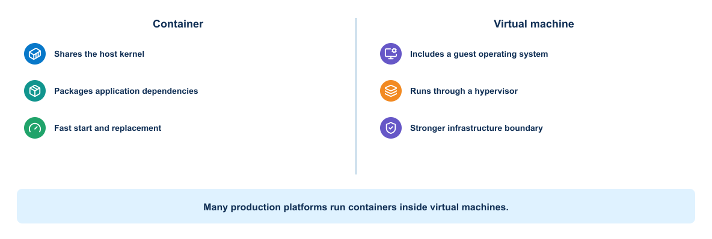
</p>

Containers usually start faster and use fewer resources than virtual machines. Virtual machines provide a stronger boundary and can run a different guest kernel. Many platforms run containers inside virtual machines to combine infrastructure isolation with application packaging efficiency.

### 2.5 Linux foundations

Container isolation relies mainly on operating-system features:

- Namespaces provide separate views of processes, networking, mounts, hostnames, users, and other resources.
- Control groups account for and limit CPU, memory, and I/O use.
- Filesystem layers provide an efficient image and writable-container model.
- Capabilities divide privileged root operations into smaller units.
- Security profiles restrict system calls and resource access.

A container remains a process on the host. If it receives excessive privileges or access to the Docker socket, it can weaken the host boundary.

### 2.6 Docker architecture

The Docker architecture diagram answers a practical control question: which component receives the engineer's command, which component holds host-level authority, and where image distribution, runtime isolation, networking, and storage enter the path?

<p align="center">
  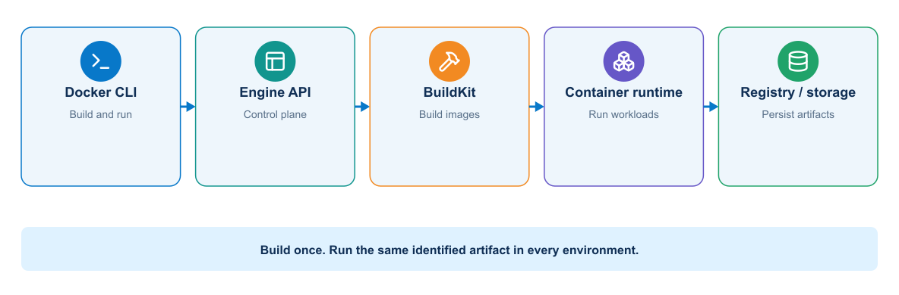
</p>

The Docker client sends API requests to the daemon. The daemon coordinates the container runtime; manages images, networks, volumes, and containers; and communicates with registries that store and distribute images.

Important objects include:

- Image: immutable packaging template identified by content and metadata
- Container: runtime instance of an image with a writable layer
- Registry: service that stores repositories of images
- Volume: Docker-managed persistent data
- Bind mount: host path exposed inside a container
- Network: communication boundary connecting selected containers

For network automation, there are two distinct network planes:

- The Docker application network connects the automation API, worker, queue, database, and telemetry services.
- The management network connects an authorized worker or runner to network devices and controllers.

Joining a container to both planes creates a security boundary. The public API service does not need direct device access if it places an authorized job on a queue for a restricted worker.

### 2.7 Image references and identity

An image reference commonly contains a registry, repository, and tag. Tags such as `latest` are mutable labels and do not guarantee identical content over time. A digest identifies image content cryptographically.

> **WHY THIS MATTERS TO A NETWORK ENGINEER**
> The image digest identifies the exact Python runtime, client libraries, parsers, and Ansible content that executed a network job. Without it, operational evidence cannot prove which automation behavior produced a change.

Development workflows may use readable version tags. Promotion and controlled deployment should preserve the immutable digest or another verifiable identity. The application version, source commit, and image identity should remain traceable to one another.

### 2.8 Image layers and cache

The image lifecycle distinguishes reusable build content from a disposable container instance and its writable runtime layer.

<p align="center">
  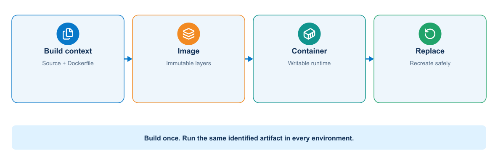
</p>

Most Dockerfile instructions create layers. Docker can reuse unchanged layers during later builds. Layer order therefore affects build speed. Stable dependency installation usually belongs before frequently changing application source.

<p align="center">
  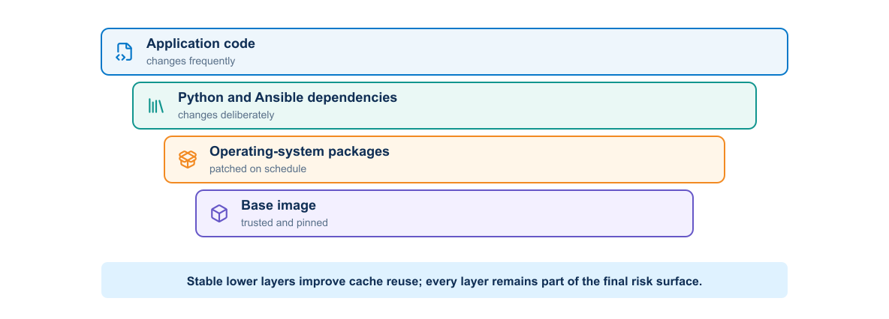
</p>

The cache affects efficiency, not correctness. A build process must declare all inputs and should not depend on accidental files remaining from an earlier build.

### 2.9 Container lifecycle

A container can be created, started, stopped, restarted, inspected, and removed. Stopping a container preserves its writable layer until removal, but important data should not depend on that layer. Deployment platforms replace containers routinely.

The application should respond predictably to termination signals, stop accepting new work when appropriate, finish or abandon work safely, and exit within the platform timeout.

### 2.10 Configuration and secrets

An image should contain application code and fixed runtime dependencies. Environment-specific configuration belongs outside the image. Common inputs include environment variables, mounted configuration files, platform configuration objects, and secret stores.

Do not bake passwords, tokens, certificates, or private keys into image layers. Removing a secret in a later Dockerfile instruction does not remove it from earlier layers.

### 2.11 Container storage

The writable container layer is temporary. Persistent data belongs in a volume, external database, object store, or another managed service.

Volumes offer Docker-managed storage and portability across container recreation on the same host. Bind mounts provide direct access to a host path and are useful for development, but they create a stronger host dependency and may expose sensitive files.

Applications should state clearly which data is persistent, which is cache, and which can disappear safely.

### 2.12 Container networking

The following boundary view explains why application-service connectivity and privileged management connectivity should not be treated as one undifferentiated container network.

<p align="center">
  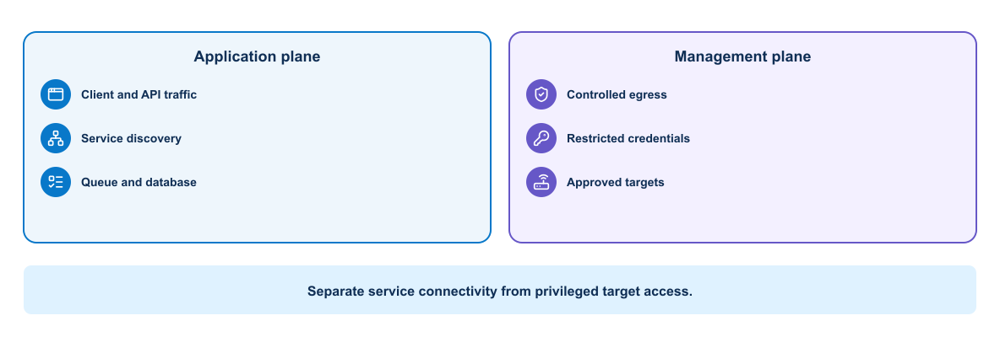
</p>

Containers on a user-defined Docker network can normally resolve one another by service name. Applications should connect to the logical service name rather than a temporary container IP address.

Publishing a port maps a host address and port to a container port. Internal services such as databases normally do not need a public host port. Expose only the entry points that users or external systems require.

Network segmentation reduces unintended communication. The automation API, job worker, queue, database, dashboard, and telemetry collector do not all need identical reachability.

#### 2.12.1 Management-network choices

A container can reach network devices through several patterns:

- Bridge networking with routed host reachability
- Host networking in a controlled lab, with reduced isolation
- A dedicated container network attached to a management VLAN
- A runner located inside the management zone
- A VPN established on the host, subject to Docker routing behavior

The team must test source addressing, DNS, MTU, firewall policy, certificate identity, and return routing. `ping` success does not prove that SSH, NETCONF, or RESTCONF works.

Avoid host networking as an unexplained fix. It removes a useful boundary and can create port conflicts.

### 2.13 Runtime inputs for network jobs

The container boundary is easiest to understand by separating fixed image content from values and state that must remain external.

<p align="center">
  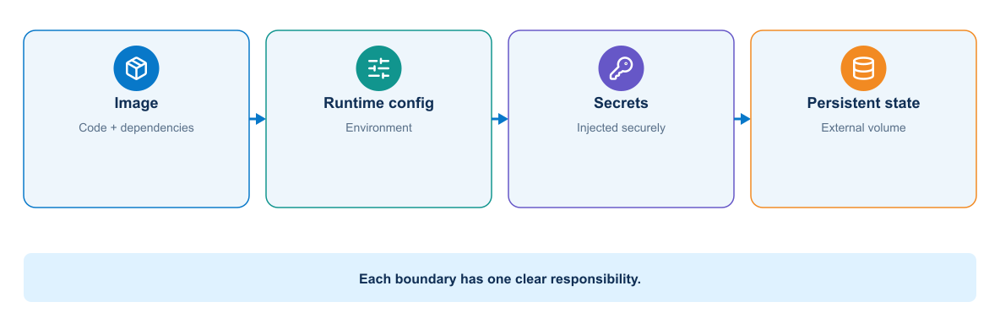
</p>

The container receives the minimum runtime inputs required for one job and writes durable results to an external destination. Rebuilding the image is not a configuration-management or secret-rotation mechanism.

The image should not contain live inventory or device credentials. A job receives:

- A reviewed intended-state file from the repository
- An inventory selected for the target environment
- A change identifier and commit SHA
- Short-lived credentials or a Vault reference
- Trusted CA material required for HTTPS
- An evidence-output location

Mount input files read-only where practical. Give the job a dedicated writable location for generated configuration and evidence. Never mount the entire engineer home directory or Docker socket without a documented requirement.

### 2.14 Persistent and ephemeral network data

Automation code and templates belong in the image or repository checkout. Generated candidate configuration, test reports, and backups are job artifacts. Job status, approval history, or scheduling data may belong in a database. Telemetry belongs in purpose-built storage.

Device backups can expose topology, usernames, addresses, and security configuration. Treat them as sensitive artifacts with controlled retention rather than ordinary container logs.

### 2.15 Device connection behavior inside containers

Automation tools must handle interactive and model-driven protocols correctly:

- SSH host-key validation should use a controlled known-hosts file.
- NETCONF commonly uses TCP 830 and exchanges server capabilities before RPCs.
- RESTCONF uses HTTPS and should validate the device certificate and hostname.
- Controller REST APIs may use tokens, sessions, pagination, and rate limits.
- Long-running collection needs explicit connect, read, and operation timeouts.

Container clocks must remain accurate because TLS, token expiration, telemetry timestamps, and evidence correlation depend on time.

### 2.16 Network automation container lifecycle

A pipeline job container should be disposable:

1. Receive immutable code and intended state.
2. Retrieve a scoped credential.
3. Confirm target identity.
4. Perform its one assigned operation.
5. Write structured evidence.
6. Revoke or release credentials.
7. Exit with a meaningful status.

Long-running API or worker containers follow service lifecycle rules and need readiness, graceful shutdown, queue handling, and durable result storage.

### 2.17 Resource and health considerations

Without resource boundaries, one container can consume enough CPU or memory to affect others. Production platforms need requests, limits, quotas, or equivalent controls based on observed behavior.

A running process is not necessarily a healthy service. Health checks should test a meaningful but inexpensive behavior. They should distinguish startup delay from ongoing failure and avoid creating excessive load.

### 2.18 Container tooling workflow

A disciplined Docker workflow includes:

1. Inspect the source and Dockerfile.
2. Build with an explicit version tag.
3. Review build output and base-image selection.
4. Inspect metadata and layer history.
5. Run with controlled configuration and networking.
6. Exercise the application.
7. Review logs, health, and resource behavior.
8. Stop and remove disposable resources.

Useful commands include `docker build`, `docker image inspect`, `docker history`, `docker run`, `docker ps`, `docker logs`, `docker exec`, `docker stats`, and `docker network inspect`.

#### 2.18.1 Practical run pattern


This example keeps configuration outside the image, mounts it read-only, limits resources, removes unnecessary Linux capabilities, and gives generated evidence a dedicated writable location:

```bash
docker run --rm --name automation-check \
  --env-file ./lab.env \
  --mount type=bind,src="$PWD/config",dst=/app/config,readonly \
  --mount type=volume,src=automation-evidence,dst=/evidence \
  --read-only --tmpfs /tmp:rw,noexec,nosuid,size=64m \
  --cap-drop ALL --memory 512m --cpus 1 \
  registry.example/automation@sha256:APPROVED_DIGEST validate
```

This is a pattern, not a command to copy unchanged into production. The environment file must contain no long-lived device password, the digest must resolve in the chosen registry, and the application must support a read-only root filesystem. Because `--rm` deletes the stopped container, durable logs and reports must reach the evidence volume or a collector before exit.

## 3. Secure image packaging


### 3.1 Application image contents

The image should contain only the runtime components required by the application. In this course, that may include:

| Component | Purpose |
|---|---|
| Python | Data normalization, API clients, policy, and evidence processing |
| `requests` or `httpx` | REST and RESTCONF requests |
| `ncclient` or another supported client | NETCONF capability discovery and RPCs |
| Netmiko or Scrapli | Controlled SSH CLI collection and fallback configuration |
| Ansible and selected collections | Multi-device orchestration and idempotent modules |
| pyATS and Genie | Structured parsing and operational validation |
| Jinja2 | Platform-specific configuration rendering |
| JSON Schema or typed models | Intended-state contract validation |
| CA certificates and SSH known-hosts tooling | Endpoint identity validation |

Tool selection should remain narrow. Installing every vendor collection and parser increases build time, image size, vulnerabilities, and dependency conflicts.

Complex delivery systems benefit from several purpose-built images rather than one oversized automation toolbox. A Terraform image can contain the CLI, approved providers, certificate trust, and state-backend client required for resource lifecycle. An Ansible image can contain `ansible-core`, explicitly versioned network collections, inventory logic, and SSH trust tools. A pyATS image can contain the parsers and acceptance code required for independent verification. Keeping them separate limits dependency conflicts and makes the image digest evidence of the exact capability that executed a job.

Environment data remains outside these images. The same Ansible image should be able to operate against an authorized test or production target selected at runtime, while the same pyATS image evaluates the same frozen intent independently. Credentials are obtained only after the container starts and must not be retained in a layer or published artifact.

### 3.2 Dockerfile responsibilities

A Dockerfile records how the builder creates an image. It should make the runtime dependency boundary understandable and repeatable.

<p align="center">
  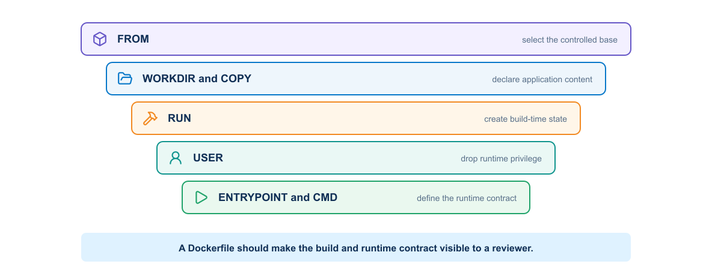
</p>

Common instructions include:

- `FROM` selects the base image.
- `WORKDIR` establishes a predictable directory.
- `COPY` adds declared files from the build context.
- `RUN` executes build-time commands.
- `ENV` defines non-sensitive default environment values.
- `USER` selects the runtime identity.
- `EXPOSE` documents an intended listening port.
- `HEALTHCHECK` can define container-level health behavior.
- `ENTRYPOINT` and `CMD` define the executable and default arguments.

The Dockerfile should reveal the runtime contract without requiring hidden manual changes.

### 3.3 Base-image selection

A good base image supports the required runtime, processor architecture, patch process, and operational tools while minimizing unnecessary software.

A very small image is not automatically the safest choice. The team must be able to patch, scan, troubleshoot, and support it. Pinning a digest improves reproducibility, but the team still needs a process to review and adopt patched base images.

Questions for base-image review include:

- Who maintains the image?
- How quickly does it receive security updates?
- Which operating-system packages does it include?
- Does it support the target architecture?
- Can the scanning and runtime platforms inspect it correctly?
- How will the project detect that the pinned base has become outdated?

### 3.4 Build context and `.dockerignore`

The build context contains files available to `COPY` and `ADD`. A broad context can send credentials, Git history, test output, local databases, or large development directories to the builder.

`.dockerignore` should exclude at least local environment files, `.git`, virtual environments, caches, logs, test artifacts, editor state, and private keys. The exact list depends on the project.

Exclusion protects both build efficiency and information security. A file does not need to appear in the final filesystem to create risk; build systems may preserve context or intermediate layers.

### 3.5 Dependency control

Reproducible builds need declared dependency versions. Loose ranges can cause identical source commits to produce different images at different times. Fully pinned dependencies improve repeatability but require an update process.

For Python, the project separates human-reviewed top-level requirements from a generated lock or constraints file. The pipeline should verify dependency integrity and report known vulnerabilities without silently changing versions during a release build.

Ansible collections also need controlled versions. A change in a vendor collection, `ansible.netcommon`, or a parser can alter commands, return data, or supported parameters. Record collection versions beside Python dependencies and test upgrades against representative device output.

Offline parser fixtures reduce risk. Store sanitized `show interfaces`, `show ip ospf neighbor`, and `show ip route` samples in tests so a dependency update can reveal changed structured output before a live device job.

### 3.6 Layer design

Layer design affects cache behavior, image size, and secret exposure. Copy dependency declarations and install dependencies before copying frequently changing application code. Remove package-manager caches in the same layer that creates them.

Do not combine unrelated actions merely to minimize the number of layers. Readability and predictable behavior matter more than a superficial layer count.

### 3.7 Multistage builds

A multistage Dockerfile separates build tools from the final runtime. The builder stage can compile code or install dependencies. The final stage receives only the artifacts required to run.

<p align="center">
  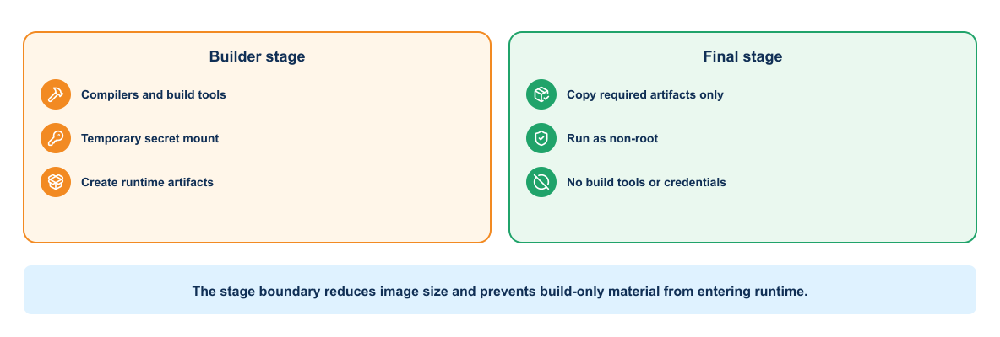
</p>

This approach can reduce size and attack surface. It also makes the boundary between build-time and runtime dependencies explicit. The final stage still needs certificates, timezone data, shared libraries, and other runtime components required by the application.

### 3.8 Runtime user and privileges

Applications should run as a non-root user unless a documented requirement prevents it. File ownership and port selection must support that user. Binding to high-numbered ports avoids unnecessary privilege.

At runtime, remove Linux capabilities that the application does not need, avoid privileged mode, use a read-only root filesystem when practical, and mount only required writable locations.

### 3.9 Secrets during builds

Passing a secret through `ARG`, copying it into the context, or embedding it in a `RUN` instruction can expose it through layers, build history, logs, or metadata.

When a private dependency requires authentication, use the builder's secret-mount capability or a short-lived credential mechanism that does not persist in the final image. The pipeline should mask secrets in output and avoid commands that print environment values.

Do not copy SSH private keys, NETCONF usernames, RESTCONF passwords, controller tokens, Vault tokens, GitLab deploy tokens, or lab `.env` files into the image. A later `RUN rm` cannot erase a value preserved in an earlier layer.

### 3.10 Image metadata and traceability

The evidence-lineage view asks whether an operator can trace a deployed runtime and its results back to the exact source, dependencies, build, tests, and approved digest.

<p align="center">
  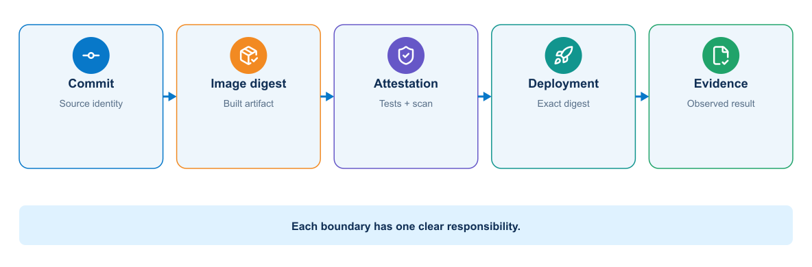
</p>

OCI labels can record the source repository, source revision, version, description, authorship, and license. The pipeline should apply a tag derived from the release version or commit and record the resulting digest.

This is the build-and-artifact portion of the delivery architecture introduced in Module 2. The protected worker should receive the resulting digest and evidence; it should not rebuild the application inside the management trust zone.

Traceability should answer:

- Which source commit produced this image?
- Which pipeline built and tested it?
- Which base image and dependencies were used?
- Which environments deployed this digest?

### 3.11 Testing an image


Testing should cover more than successful process startup. A build workflow can perform:

- Dockerfile linting
- Dependency and source tests
- Image build
- Vulnerability and secret scanning
- Metadata and configuration inspection
- Non-root execution check
- Health endpoint test
- Read-only filesystem or capability test where required
- Software bill of materials generation

A scanner finding requires interpretation. Severity, exploitability, exposure, available remediation, and application context influence the decision. Suppression should include an owner, justification, and expiration.

#### 3.11.1 Network-specific runtime tests

The pipeline should also verify that:

- The container runs as a non-root UID.
- The intended-state schema accepts the approved fixture and rejects invalid VLANs and prefixes.
- Jinja2 rendering is deterministic.
- The automation can parse sanitized fixtures from the supported network operating systems.
- Read-only mock RESTCONF and NETCONF tests succeed.
- Deployment modules are absent from untrusted validation images if the team uses separate images by privilege.
- The runtime trusts only approved CA material and SSH host keys.

Separating a validation image from a deployment image can reduce capability. The validation image needs schemas, linters, renderers, and offline tests. The deployment image also needs device clients and may run only on a protected runner.

### 3.12 Image signing and provenance


Signing allows a consumer to verify who approved an image. Build provenance records information about how the artifact was produced. These controls are most useful when the deployment platform enforces them. A signature stored but never verified provides limited protection.

The delivery process should retain and promote an already tested image digest. Rebuilding from the same source for another environment creates a different artifact and breaks the evidence chain.

### 3.13 Image supply-chain evidence


Each output has a purpose. The SBOM inventories components. The vulnerability scan compares those components with known findings. A signature binds an identity to the digest. Provenance describes how the build occurred. None of these controls substitutes for the others.

The supply chain below shows that evidence is attached to the immutable digest before it reaches a registry. The deployment verifies that identity rather than rebuilding or resolving a mutable tag.

<p align="center">
  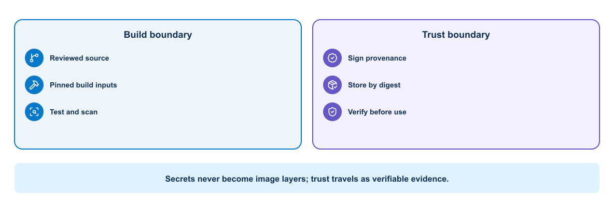
</p>

Secrets may be exposed temporarily through a supported build-secret mechanism when private dependencies require them, but they must not enter the build context, layer history, final image, or provenance output.

### 3.14 Compromised dependency scenario


Assume a new parsing package executes unexpected code during installation. If the build job can reach the management network or access deployment variables, the dependency can steal credentials before an image is created.

Build isolation therefore matters as much as runtime hardening. The untrusted dependency-resolution stage should not receive network device secrets or management-plane access. Protected deployment occurs later with the already scanned and identified image.

### 3.15 Registries and retention

A registry should enforce authentication, encrypted transport, access control, immutability where appropriate, scanning, and retention policy. Developer accounts may push to development repositories, while production promotion should use a controlled service identity.

A registry is not the same as a pipeline artifact store. The registry distributes versioned packages or OCI images to later environments; pipeline artifacts retain job outputs such as test reports, rendered candidates, SBOMs, and deployment evidence. An image digest belongs in both records so that a reviewer can connect the distributable runtime with the evidence that qualified it.

Promotion should normally copy or authorize the existing digest rather than rebuild it. Repository paths and tags can express release channels, but access policy must prevent an unreviewed job from overwriting or relabeling a production identity. Pull permissions should also be narrower than they first appear: a runner that can read every private image may expose embedded intellectual property or vulnerable historical releases even when it cannot push.

Retention must balance storage cost, investigation needs, and rollback. Removing every previous image immediately can make recovery impossible.

#### 3.15.1 Packaging failure patterns

The image review should connect a defect to its operational consequence rather than report only that a rule failed.

| Failure pattern | Why it matters | Control and evidence |
|---|---|---|
| Mutable base tag | A rebuild can change without a source commit | Pin and record the base digest; use a scheduled update workflow |
| Unlocked Python or collection dependency | Identical source can resolve to different behavior | Generate a reviewed lock or constraints file and test dependency updates |
| Secret copied during an early layer | Later deletion does not remove it from image history | Exclude it from context and use an ephemeral build-secret mechanism |
| Root runtime user | Application compromise gains unnecessary container privileges | Create a numeric non-root UID and test the effective identity |
| Build tools retained in the final stage | Attack surface and vulnerability count increase | Use a multistage build and inspect installed packages |
| Release rebuilt after testing | Production bytes are not the tested bytes | Promote the original digest and verify it at deployment |
| Scan exception without expiry | Temporary risk acceptance becomes permanent | Record owner, justification, affected digest, compensating control, and expiry |

These controls do not guarantee that the application behaves correctly. They establish that the team knows what it built, can reproduce the decision, and can reject an artifact whose identity or evidence changes.

### 3.16 Example network automation packaging pattern


The following Dockerfile brings the preceding controls together in a small packaging pattern. Read it as an example of deliberate build decisions—base image, dependency installation, ownership, and runtime identity—not as a production template that can be copied without review.

```dockerfile
FROM python:3.13-slim AS builder
WORKDIR /build
COPY requirements.txt .
RUN python -m venv /opt/venv \
    && /opt/venv/bin/pip install --no-cache-dir -r requirements.txt

FROM python:3.13-slim
ENV PATH="/opt/venv/bin:$PATH" \
    PYTHONUNBUFFERED=1
RUN useradd --create-home --uid 10001 appuser
COPY --from=builder /opt/venv /opt/venv
WORKDIR /app
COPY automation/ ./automation/
COPY intended-state/schema/ ./intended-state/schema/
COPY templates/ ./templates/
COPY validation/ ./validation/
USER 10001
ENTRYPOINT ["python", "-m", "automation.python.cli"]
CMD ["--help"]
```

This example illustrates separation of build and runtime stages, dependency caching, a non-root identity, and an explicit entry point. A real project should pin the base digest, control dependency versions, add health behavior, and validate the image in CI.

#### 3.16.1 Review example: a harmless-looking dependency change

Suppose a merge request changes only `requirements.txt`. Source tests pass, but the lock file now pulls a new transitive SSH library. The reviewer should ask three separate questions: did application behavior change, did the runtime inventory change, and does the new component alter the security boundary? A defensible pipeline rebuilds from a clean context, compares the SBOM with the previous release, runs connection and parser fixtures, scans the resulting digest, and records an approved exception if a finding cannot yet be fixed. Reusing an old scan report would miss the exact risk introduced by the dependency-only change.

## 4. Multitier application deployment


One container solves runtime reproducibility for one process. It does not define the relationships among an API, worker, queue, database, telemetry collector, and dashboard. The next engineering requirement is to describe those cooperating processes as one application while preserving separate responsibilities, failure boundaries, networks, and state.

### 4.1 Multitier service architecture

The architecture separates request handling from privileged execution so that only the worker crosses into the management network and every job retains durable state and evidence.

<p align="center">
  
</p>

Separating responsibilities allows each service to change, scale, recover, and receive access control independently. The course stack contains an automation API, job worker, queue, job database, telemetry collector, and dashboard.

The worker is the only service that needs direct management-plane access. The API accepts a reference to reviewed intent and an approved operation. It must not accept arbitrary CLI commands from callers.

### 4.2 Service contracts

This sequence highlights why the public API does not need a route or credential to a device. Privileged access begins only in the protected worker after a validated job reaches the queue.

<p align="center">
  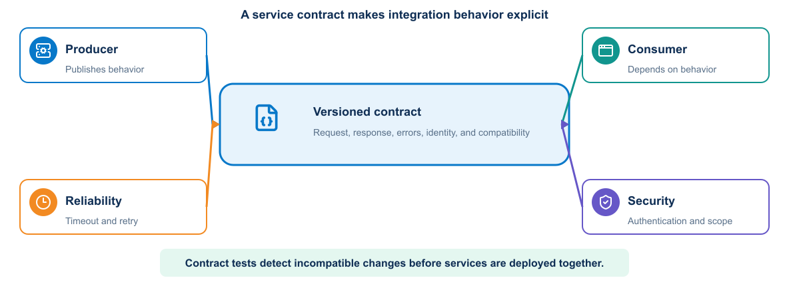
</p>

<p align="center">
  
</p>

The worker returns structured evidence and final status through the application boundary. The credential is scoped to the job and is never placed on the queue.

Each service needs an explicit contract:

- Protocol and port
- Addressing or discovery method
- Authentication and authorization requirements
- Request and response format
- Timeout and retry behavior
- Health behavior
- Version compatibility
- Data ownership

Containers change IP addresses when recreated. Consumers should use stable service names and declared ports rather than fixed container addresses.

#### 4.2.1 Job contract

A worker and its callers need an explicit agreement about the data exchanged between them. This compact JSON example illustrates a job request that can be validated, queued, processed, and correlated with later evidence.

```json
{
  "change_id": "CHG-2026-0042",
  "commit_sha": "0123456789abcdef",
  "intent_path": "requests/compliance-intent.yml",
  "inventory": "lab",
  "operation": "precheck",
  "requested_by": "gitlab-pipeline-1842"
}
```

The API rejects arbitrary local paths, unknown inventories, unsupported operations, or missing change identifiers. Deployment requires a protected pipeline claim or separate approval. The queue contains references and non-secret metadata, not device passwords.

### 4.3 Docker network model

Docker Compose normally creates a user-defined network for the project. Services on the network can resolve one another by service name. The application can connect to `database:5432`, for example, while clients reach the published frontend port.

Publishing a port makes a service reachable through the host. `EXPOSE` documents a container port but does not publish it. A database should normally remain on an internal network unless an authorized external consumer requires access.

Larger designs can use separate frontend and backend networks. The proxy joins the frontend and application networks. The application joins the application and data networks. The database joins only the data network.

### 4.4 Docker Compose model

A Compose file defines a related application stack. Main elements include:

- `services` for runtime components
- `networks` for communication boundaries
- `volumes` for persistent data
- `configs` and `secrets` where supported
- Environment values and mounted files
- Health checks and dependency conditions
- Resource and restart behavior

Compose is useful for development, integration testing, demonstrations, and smaller deployments. Kubernetes provides a broader orchestration model for clustered operation.

#### 4.4.1 Illustrative Compose structure


The following Compose definition shows how the application tiers can be declared as one system while retaining separate runtime responsibilities. The values are intentionally minimal so that the service relationships remain visible.

```yaml
services:
  automation-api:
    image: registry.example/network-devops:${AUTOMATION_IMAGE_TAG}
    command: ["serve-api"]
    networks: [api, services]
    ports: ["127.0.0.1:8080:8080"]
    depends_on:
      queue:
        condition: service_healthy

  worker:
    image: registry.example/network-devops:${AUTOMATION_IMAGE_TAG}
    command: ["run-worker"]
    networks: [services, management]
    read_only: true
    volumes:
      - evidence:/evidence
      - ./ssh/known_hosts:/etc/ssh/ssh_known_hosts:ro

  queue:
    image: redis:7-alpine
    networks: [services]
    volumes: [queue-data:/data]
    healthcheck:
      test: ["CMD", "redis-cli", "ping"]
      interval: 5s
      timeout: 3s
      retries: 10

  job-db:
    image: postgres:17-alpine
    networks: [services]
    volumes: [job-data:/var/lib/postgresql/data]

networks:
  api: {}
  services:
    internal: true
  management:
    external: true

volumes:
  queue-data: {}
  job-data: {}
  evidence: {}
```

This illustrates architecture rather than a complete production secret design. Live database credentials must come from a protected runtime source. The external management network must already exist and have an explicit security policy.

### 4.5 Configuration separation

The repository can contain safe defaults and `.env.example`, but it should not contain live secrets. Values vary by environment:

- External URL and listening port
- Database hostname and database name
- Log level
- Feature switches
- Credential references
- Monitoring endpoints

Configuration should be validated at startup. A service should fail clearly when a required value is missing instead of using an unsafe fallback.

Network-specific configuration includes inventory name, permitted device groups, protocol timeouts, concurrency limit, trusted CA path, SSH known-hosts path, evidence retention class, and read-only or change mode. A worker should not default to all devices or to change mode.

### 4.6 Persistent state

The database service needs a volume or external storage. Application containers should remain replaceable. Backup, restore, schema migration, and data ownership require explicit design.

A volume preserves data when a container is recreated, but it is not a backup. The same host failure can affect both the container and its local volume.

Schema changes must remain compatible with the deployment sequence. A destructive migration performed before new application instances become healthy can make rollback impossible.

The database does not replace Git as the source of intended state. It records runtime jobs and evidence relationships. Git stores reviewed intent and automation definitions. A queue holds temporary coordination state. Telemetry storage holds time-series observations.

### 4.7 Startup order and readiness

Process order does not prove service readiness. A database process may start before it accepts connections or completes recovery. The application should retry appropriate transient connections with a bounded policy.

Compose health checks can provide readiness evidence. Dependencies can wait for a healthy state, but the application still needs resilient connection behavior because services can fail after startup.

### 4.8 Timeouts and retries

Every remote call needs a timeout. An unlimited wait can exhaust threads or connections. Retrying can help with transient failures, but an aggressive retry loop can amplify overload.

Use bounded retries with delay and jitter where appropriate. Do not retry permanent failures such as invalid credentials or malformed requests without changing the input. Non-idempotent operations require special care because a repeated request might duplicate work.

### 4.9 Reverse proxy role

A reverse proxy can provide a stable client endpoint, TLS termination, request limits, static content, and routing. It should forward useful request identifiers and preserve client information according to the trust model.

The proxy health check and application health check answer different questions. Proxy availability does not prove that the application or database works.

In a production automation platform, the entry layer can terminate TLS and enforce authentication, request-size limits, and rate limits. It must not allow unauthenticated access to an endpoint that starts device changes.

### 4.10 Worker safety and concurrency

A worker processes network jobs. High concurrency can overwhelm device management planes or create conflicting changes. Use per-device locking and a low default concurrency. Jobs that touch the same routing domain may need a broader lock or ordered plan.

> **OPERATIONAL CONSIDERATION**
> Increasing worker replicas also increases potential device concurrency. Application scaling and network blast radius therefore require separate limits; queue depth alone is not a safe scaling signal.

The worker verifies the commit and image digest associated with the job, retrieves scoped credentials only when needed, and discards them after use. Queue redelivery requires idempotent design or a guard that prevents a partially completed deployment from running twice.

### 4.11 Mock and real targets

Compose can provide a mock REST API or recorded-response service for offline pipeline development. This supports schema, error handling, pagination, and evidence tests. It cannot prove device configuration semantics, control-plane convergence, or end-to-end forwarding.

The course progresses from mock validation to an authorized virtual or sandbox device. The pipeline labels evidence with the target type so reviewers do not confuse simulated success with real operational validation.

### 4.12 Health model

The readiness chain shows why a healthy API process does not prove that a queued network job can pass through every dependency and complete successfully.

<p align="center">
  
</p>

A multitier application benefits from several health views:

- Liveness: whether a process needs restart
- Readiness: whether it can accept traffic now
- Dependency status: whether required downstream services work
- Functional check: whether a small end-to-end action succeeds

Do not make liveness depend on every remote service. A database outage could cause every application container to restart continuously, adding load without repairing the database.

### 4.13 Logging across services

Services should write structured logs to standard output or another supported collection path. Include timestamp, severity, service, version, environment, and request or correlation identifier. Do not log passwords, tokens, private data, or full sensitive payloads.

A correlation identifier allows the team to follow one request from the proxy through the application and database interaction.

### 4.14 Failure analysis

The following view separates the main failure domains in the stack.

<p align="center">
  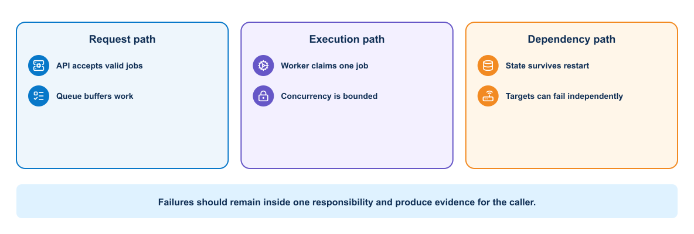
</p>

Troubleshoot the stack from boundaries inward:

1. Confirm the expected containers exist and inspect their state.
2. Check health status and recent logs.
3. Confirm network membership and name resolution.
4. Test the application inside its network before testing the published endpoint.
5. Verify configuration without displaying secrets.
6. Check storage permissions and database readiness.
7. Reproduce the failing request with a request identifier.

`docker compose ps`, `docker compose logs`, `docker inspect`, `docker network inspect`, and targeted `curl` requests provide useful evidence.

#### 4.14.1 Failure boundaries and controls

A multitier incident should be classified at the boundary that failed. Restarting the entire stack destroys useful evidence and may amplify the original problem.

| Symptom | Likely boundary | Evidence to collect | Appropriate control |
|---|---|---|---|
| API answers but jobs remain queued | API-to-queue or queue-to-worker | Request ID, queue depth, consumer state, worker logs | Contract test, queue health, bounded redelivery |
| Worker starts but cannot reach targets | Worker-to-management network | Worker route, DNS, firewall decision, endpoint TLS/SSH identity | Dedicated network attachment and explicit egress policy |
| Database container is running but API is unready | Application-to-database | Readiness result, connection error, migration status | Dependency-aware readiness and bounded connection retry |
| Job runs twice after worker restart | Queue acknowledgement and job-state ownership | Delivery count, job state transitions, operation identifier | Idempotency key, per-target lock, uncertain-state handling |
| Previous application cannot start after rollback | Application-to-schema compatibility | Migration version, application error, release history | Expand-and-contract migration or forward remediation |
| Published endpoint works locally but not remotely | Host publishing, firewall, or proxy | Bound address, port mapping, proxy and firewall logs | Explicit exposure and end-to-end health check |

The operating consequence determines severity. A failed dashboard query is different from a duplicated privileged job even when both appear as an HTTP error.

#### 4.14.2 Practical failure: the API is healthy but no job completes

An HTTP 200 response from the API proves only that the request-facing process can answer. If jobs remain in `queued`, follow the job identifier across boundaries: confirm that the API published the message, inspect queue depth, check that the worker subscribed to the expected queue, and test management reachability from the worker namespace. A common cause is attaching the API to the published network while forgetting to attach the worker to the external management network. Restarting every container may hide the symptom without correcting the topology. The durable fix is a correct Compose network declaration plus an integration test that exercises one queued, read-only job.

## 5. Kubernetes orchestration and multidata-center operation


Compose can describe and operate the complete application on a small platform. It does not by itself provide a multi-node scheduler, automatic workload replacement across nodes, standardized rolling updates, cluster-wide resource placement, or a broad policy API. When scale, availability, scheduling, and platform-governance requirements justify that operational cost, the team can introduce Kubernetes. A protected runner or Compose deployment remains valid when those requirements do not exist.

### 5.1 Platform architecture

The platform view identifies which Kubernetes workloads need ordinary service connectivity and which worker path requires tightly controlled access to managed infrastructure.

<p align="center">
  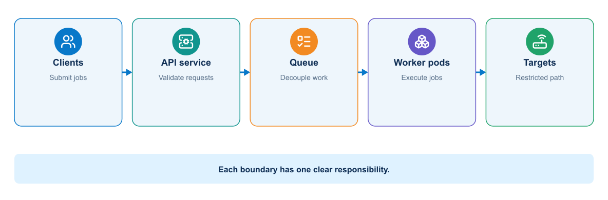
</p>

Only job workers need network-device access. API, dashboard, and general validation Pods should not share that route by default. Kubernetes NetworkPolicy, external firewalls, worker placement, and service-account policy work together to enforce the design.

### 5.2 Should the team use Kubernetes?

The decision flow tests whether orchestration capabilities solve an actual operating requirement or merely add a larger platform and security burden.

<p align="center">
  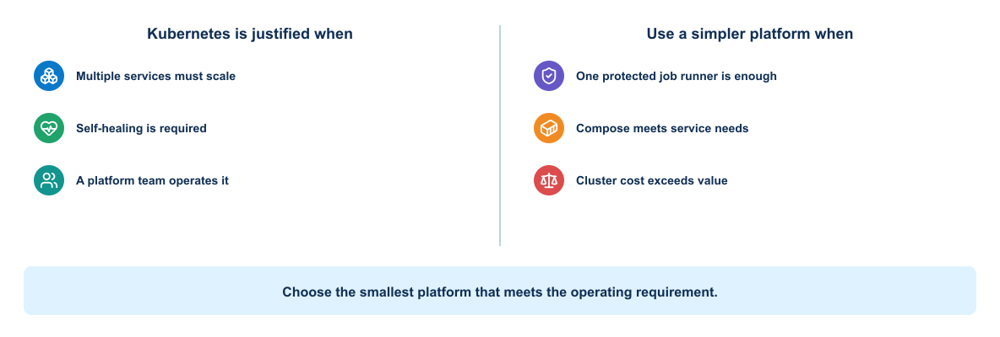
</p>

Kubernetes is useful when the platform needs several independently operated services, concurrent workers, declarative rollout, self-healing, workload scheduling, standardized observability, or integration with an existing organizational cluster platform.

It may be unjustified when:

- One team runs a small number of scheduled jobs.
- Docker Compose or a managed runner already meets availability needs.
- The team lacks cluster operations and security capability.
- Direct management-network routing from cluster workers is difficult to secure.
- Stateful queue, database, and evidence services would become less reliable.
- Platform complexity would exceed the value of automated scaling.

| Requirement | Compose or runner | Kubernetes |
|---|---|---|
| Single learning workstation | Strong fit | Useful only for learning Minikube concepts |
| Few sequential network jobs | Simple and sufficient | Often excessive |
| Many isolated workers | Manual orchestration required | Deployment and Job patterns can help |
| Rolling platform updates | Basic service recreation | Native Deployment behavior |
| Existing enterprise cluster platform | Integration work required | Can reuse platform controls |
| Strong network segmentation to device zones | Host/firewall design | Cluster networking plus external controls |
| Team operating burden | Lower | Higher control-plane and policy complexity |

The course uses Minikube to teach the model. It does not claim that the production network automation platform must use Kubernetes.

### 5.3 Three valid platform architectures

The comparison separates three legitimate operating models so that Kubernetes is evaluated against simpler alternatives rather than assumed to be the target state.

<p align="center">
  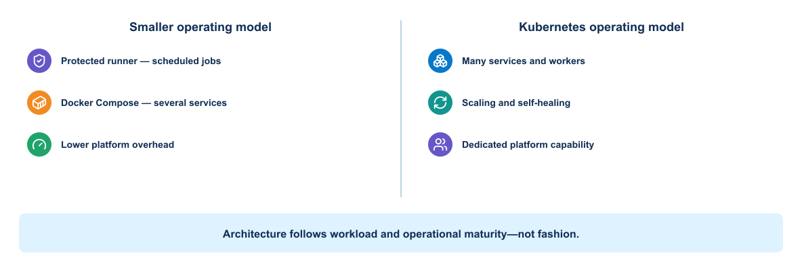
</p>

| Factor | Protected GitLab runner and scripts | Docker Compose platform | Kubernetes platform |
|---|---|---|---|
| Best fit | Few scheduled or approved jobs | Small always-on API and worker service | Multiple services/pools with established cluster operations |
| Scale | Limited by runner and explicit concurrency | Vertical scale and manually managed workers | Declarative replicas, Jobs, scheduling, and quotas |
| Availability | Runner recovery or replacement | Host-level design and service restart | Multi-node scheduling if dependencies are also resilient |
| Worker isolation | Host/process/container controls | Separate services and Docker networks | Namespace, node, Pod, identity, RBAC, policy, and external firewall controls |
| Device reachability | Directly designed on runner host | Restricted worker bridges service and management networks | Only selected worker nodes/Pods receive controlled egress |
| Security burden | Runner hardening and secret delivery | Adds API, queue, database, and service trust | Adds cluster API, admission, RBAC, node, supply-chain, and CNI policy |
| Operational burden | Lowest | Moderate | Highest |
| Team skills | GitLab, Linux, scripting | Container and service operations | Kubernetes platform, networking, security, storage, and incident response |

Kubernetes solves automation-platform scheduling and lifecycle problems. It does not validate network intent, discover the correct device, constrain a routing-domain blast radius, or prove forwarding health.

### 5.4 Kubernetes worker-to-device security


The security path shows the controls required between a validated queue item and an explicitly authorized device when a worker executes inside a cluster.

<p align="center">
  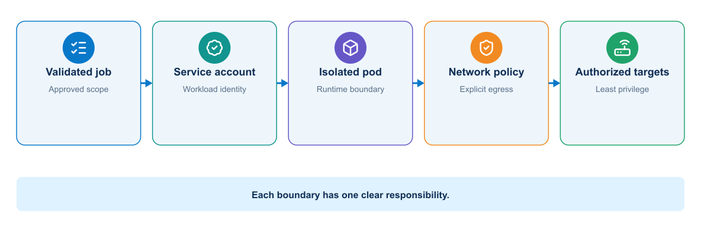
</p>

NetworkPolicy controls Pod traffic only when the cluster networking implementation enforces it; it does not replace the external management firewall or device AAA. General API, dashboard, and validation workloads should have no device route. A worker receives a validated job, signed image, dedicated service account, short-lived credential, narrow egress rule, explicit target list, and independent evidence destination.

### 5.5 Kubernetes model

Users submit desired state to the Kubernetes API. Controllers observe stored state and work to make actual state match it. This reconciliation loop is central to the platform.

Kubernetes does not simply run a list of commands. A Deployment declares the desired application image, replica count, selection labels, update behavior, and Pod template. Controllers continuously reconcile that declaration.

### 5.6 Cluster architecture

The architecture separates reconciliation responsibilities from workload execution.

<p align="center">
  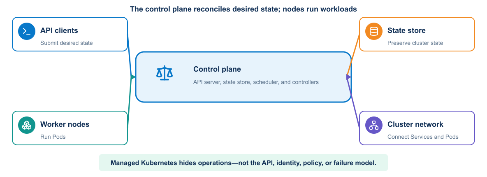
</p>

The control plane includes:

- API server, which provides the main management interface
- State store, which preserves cluster configuration and state
- Scheduler, which assigns unscheduled Pods to nodes
- Controllers, which reconcile resources

Worker nodes run:

- A node agent that manages Pod lifecycle
- A container runtime
- Networking components that implement Service and Pod connectivity

Managed services may hide control-plane operation, but users still need to understand API behavior, identity, quotas, networking, and failure boundaries.

### 5.7 Core objects

Kubernetes expresses application intent through a set of related API objects. Understanding the responsibility and lifecycle of each object is essential before combining them into a deployment design.

#### 5.7.1 Namespace

A Namespace groups resources and supports names, access control, quotas, and policy. It does not replace all security isolation.

#### 5.7.2 Pod

A Pod is the smallest schedulable unit. Its containers share a network identity and selected storage. Pods are replaceable; clients should not depend on a Pod IP remaining stable.

#### 5.7.3 Deployment and ReplicaSet

A Deployment manages stateless application replicas and controlled updates. It creates ReplicaSets, which maintain the requested number of matching Pods.

The automation API and validation service fit a Deployment. Long-running workers may also use a Deployment. A one-time change execution may fit a Kubernetes Job, but the platform must prevent job retry from repeating a partial network change.

#### 5.7.4 Service

A Service provides stable discovery and traffic distribution for selected Pods. Selectors and labels connect the Service to the intended workload.

#### 5.7.5 ConfigMap and Secret

A ConfigMap stores non-sensitive configuration. A Secret stores sensitive data in a Kubernetes object. Secret protection still requires encryption at rest, RBAC, careful mounting, and safe application behavior.

A deployment can use a ConfigMap for permitted inventory references, protocol timeouts, and feature settings. Network credentials should preferably arrive through workload identity or an external secret integration. Storing a long-lived device password in a manifest, even if base64-encoded, is unsafe.

#### 5.7.6 Ingress or gateway

An ingress or gateway layer routes external traffic according to platform-specific implementation. TLS, hostname, path, and policy configuration depend on the selected controller.

#### 5.7.7 PersistentVolume and claim

A PersistentVolume represents storage. A PersistentVolumeClaim requests storage with defined capacity and access behavior. Stateful applications also need backup, recovery, identity, and update design.

### 5.8 Manifests and API use

A manifest normally contains `apiVersion`, `kind`, `metadata`, and `spec`. Labels identify and group objects. Selectors create relationships and must remain consistent.

`kubectl` is a client for the Kubernetes API. It uses a context containing cluster, user, and optional namespace. Before any change, confirm the current context and namespace.

Declarative application with version-controlled manifests supports review and repeatability. Server-side defaults and admission policies can affect the stored object, so inspect the result.

### 5.9 Scheduling and resources

Resource requests influence scheduling and reserve capacity. Limits constrain use according to resource type and runtime behavior. Missing requests can cause poor placement. Unrealistic limits can create throttling or termination.

Placement can also use node selectors, affinity, anti-affinity, taints, tolerations, and topology constraints. These policies should express availability or hardware requirements without making workloads impossible to schedule.

Network workers may require nodes attached to a protected management zone. Label those nodes and use placement policy, but remember that anyone who can schedule an arbitrary Pod there may gain the same network path. Admission and RBAC must restrict workload creation.

### 5.10 Probes

Kubernetes assigns a different control decision to each probe type.

<p align="center">
  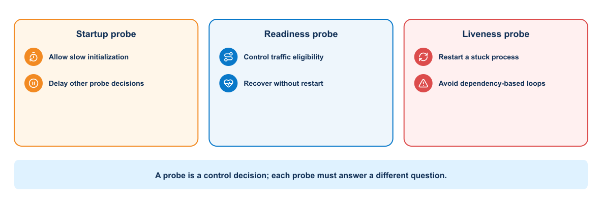
</p>

Kubernetes supports:

- Startup probes for slow initialization
- Readiness probes for traffic eligibility
- Liveness probes for process recovery

Probe timing and thresholds should reflect application behavior. A liveness probe that fires during normal startup can create a restart loop. Readiness should change when the instance cannot serve requests but might recover without restart.

#### 5.10.1 Compact deployment example


This fragment shows the controls that reviewers should look for rather than a complete production manifest:

```yaml
apiVersion: apps/v1
kind: Deployment
metadata:
  name: automation-api
spec:
  replicas: 2
  selector:
    matchLabels: {app: automation-api}
  template:
    metadata:
      labels: {app: automation-api}
    spec:
      serviceAccountName: automation-api
      containers:
        - name: api
          image: registry.example/automation@sha256:APPROVED_DIGEST
          ports: [{name: http, containerPort: 8080}]
          readinessProbe:
            httpGet: {path: /ready, port: http}
          livenessProbe:
            httpGet: {path: /live, port: http}
          resources:
            requests: {cpu: 100m, memory: 128Mi}
            limits: {cpu: 500m, memory: 512Mi}
          securityContext:
            runAsNonRoot: true
            allowPrivilegeEscalation: false
            readOnlyRootFilesystem: true
            capabilities: {drop: [ALL]}
```

The immutable digest preserves artifact identity. Separate readiness and liveness paths avoid restarting a recoverable instance merely because a dependency is temporarily unavailable. Resource values are hypotheses that must be adjusted from observed demand, and Pod security controls do not replace RBAC or network policy.

### 5.11 Scaling and self-healing

A Deployment replaces failed Pods and maintains replica count. This repairs instance loss, not application defects or failed dependencies.

Horizontal scaling can respond to metrics when resource requests and scaling signals are meaningful. Scaling an application cannot repair a saturated database or external rate limit. The team should understand which tier limits capacity.

Scaling workers increases simultaneous device sessions and change concurrency. Queue depth alone is not a safe scaling signal. Add per-device locks, global protocol limits, controller rate limits, and a maximum network blast-radius policy.

Self-healing restarts a failed Pod. It cannot determine whether a timed-out NETCONF commit partially changed a device. The replacement worker must inspect job and device state before retrying.

### 5.12 Rolling updates

A rolling update gradually replaces the old ReplicaSet. Readiness controls whether new Pods receive traffic. Update parameters control temporary excess capacity and allowed unavailability.

The release must support version overlap. API contracts, sessions, and database schemas must remain compatible during the rollout.

Kubernetes can pause, resume, and undo Deployment revisions, but rollback only changes the workload template. It does not reverse external database migrations or infrastructure side effects.

### 5.13 Advanced deployment patterns


Deployment patterns control how a new version is introduced and how risk is distributed during the transition. The appropriate pattern depends on capacity, compatibility, observability, and the speed at which traffic can be redirected or a release reversed.

#### 5.13.1 Blue-green

Two versions run separately, and a Service or routing layer changes the active destination after validation. This needs extra capacity and clear data compatibility.

#### 5.13.2 Canary

A routing mechanism sends limited traffic to a new version. Metrics compare the canary with the stable version. Promotion criteria must account for traffic volume and statistical confidence.

#### 5.13.3 GitOps

GitOps uses a repository as the reviewed desired state and a cluster-side reconciler to apply it. The pipeline updates a versioned environment definition rather than holding broad credentials and directly issuing every cluster change.

GitOps still requires repository security, reconciliation policy, secret handling, health assessment, and recovery design.

### 5.14 Kubernetes networking


Pods receive routable cluster addresses according to the cluster network implementation. Services provide stable virtual access. NetworkPolicy can restrict permitted connections when the cluster network plugin enforces it.

The automation platform should allow only the service paths its architecture requires. Other paths should be denied where the cluster network implementation supports policy enforcement.

For the network automation platform, allow:

- Authorized GitLab or engineer clients to the automation API
- API to queue and job database as required
- Worker to queue, secret service, evidence service, and approved device endpoints
- Telemetry collector to defined receivers and storage
- Dashboard to its data sources

Deny API and dashboard Pods from direct device-management access. Kubernetes NetworkPolicy applies only when the cluster network implementation enforces it and does not replace external firewalls.

### 5.15 RBAC and service accounts


Use separate service accounts for API, worker, validation, and telemetry components. The worker may need permission to read a narrow secret reference or create a job artifact. It should not list every Secret in the namespace or modify cluster-wide resources.

GitLab's deployment identity should update only the course namespace and approved object kinds. Human administrators retain a separate break-glass path with strong audit.

### 5.16 Configuration and secrets

Configuration changes can update mounted files or environment inputs differently. Applications may need restart or dynamic reload. Record which behavior the application supports.

Secrets should not appear in manifests committed to the repository. Options include an external secret operator, encrypted secret workflow, CSI integration, or pipeline-controlled injection. Each option has its own trust boundary.

### 5.17 Monitoring and logging

Kubernetes operational visibility includes:

- Application metrics and logs
- Pod restart and readiness state
- Deployment availability
- Resource requests, use, throttling, and termination
- Kubernetes events
- Node and control-plane health
- Network and storage behavior
- Deployment annotations and image identity

Container logs need collection before Pods disappear. Dashboards should connect application symptoms to workload version, namespace, node, and recent rollout.

An alert should focus on sustained impact or loss of safety margin. A single Pod restart may be normal, while repeated restart loops or insufficient ready replicas require attention.

Network automation dashboards should also show queue delay, worker concurrency, per-device lock contention, API and NETCONF latency, job failure category, rollback state, and the network signals developed in Module 5. Correlate Pod rollout events with changes in automation job behavior.

### 5.18 Troubleshooting workflow


Use a consistent sequence:

1. Confirm context, namespace, and intended object name.
2. Inspect Deployment, ReplicaSet, Pod, and Service status.
3. Review conditions and recent events.
4. Inspect current and previous container logs.
5. Check image identity, configuration, probes, and resource settings.
6. Test service discovery and network reachability from an appropriate Pod.
7. Compare behavior with the pipeline and deployment event.

Useful commands include `kubectl get`, `kubectl describe`, `kubectl logs`, `kubectl events`, `kubectl rollout status`, `kubectl rollout history`, and `kubectl exec` when policy allows it.

### 5.19 Multiple data-center deployments


Kubernetes clusters normally form separate failure and administration domains. A multicluster design must address traffic steering, identity, policy consistency, data replication, configuration promotion, observability, and recovery.

Stretching one control plane across distant failure domains can create latency and quorum risks. Many designs use independent clusters and coordinate application delivery above them.

Networking and policy platforms may connect data-center, cloud, and Kubernetes environments. The design must define which controller owns each policy and how operational evidence crosses domains.

Avoid allowing independent clusters to change the same device concurrently. Assign device or site ownership, use a shared coordination service, or route all change jobs through one control boundary. Disaster recovery should preserve job state and ensure that an uncertain in-flight change is inspected before another region retries it.

## 6. Knowledge check

### 6.1 Container runtime fundamentals

Use these questions to verify that you can distinguish image, container, host, and runtime responsibilities.

1. Which dependencies does a container image control, and which remain part of the environment?
2. Why is an image digest stronger evidence than the `latest` tag?
3. Why should persistent application data not remain in the container writable layer?
4. When should a service port remain internal to a Docker network?
5. Why can access to the Docker socket create a serious security risk?

### 6.2 Secure image packaging

Use these questions to evaluate whether an image build is reproducible, traceable, and appropriately hardened.

1. What risks arise from an overly broad Docker build context?
2. Why does deleting a copied secret in a later layer fail to protect it?
3. How does a multistage build reduce the final runtime boundary?
4. Why should the pipeline promote a digest instead of rebuilding for each environment?
5. What information should accompany an accepted scanner exception?

### 6.3 Multitier deployment

Use these questions to confirm that you can reason about service discovery, state, health, and failure isolation.

1. Why should the application connect to a service name rather than a container IP address?
2. What is the difference between starting a database process and proving database readiness?
3. Why should a database volume not be described as a backup?
4. Which services need published ports in a three-tier stack?
5. Why can a dependency-based liveness check cause a restart storm?

### 6.4 Kubernetes orchestration

Use these questions to assess whether you can relate Kubernetes reconciliation, workload identity, rollout behavior, and multidata-center design to DevOps delivery controls.

1. What does reconciliation mean in Kubernetes?
2. Why should clients use a Service rather than a Pod IP?
3. How do requests and limits affect workload operation?
4. Why can a successful Deployment rollback fail to restore application behavior?
5. Which evidence should the pipeline collect after a failed rollout?


## 7. Summary

A container establishes a repeatable process and dependency boundary. A controlled Dockerfile turns that boundary into an identifiable, testable, and defensible image. Compose demonstrates how the same image participates in a service with APIs, workers, queues, databases, networks, health contracts, and persistent state. Kubernetes extends the operating model with scheduling, reconciliation, scaling, policy, and clustered availability when those capabilities justify the additional platform responsibility.

Across every platform, the engineering invariants remain the same: build once, promote by digest, keep configuration and secrets outside the image, separate application traffic from privileged target access, verify readiness at the service boundary, constrain concurrency and blast radius, correlate execution with operational evidence, and recover from observed state rather than assuming a retry is safe. Module 1 supplies the environment; Module 2 supplies the delivery principles; Module 3 now supplies the deployable artifact and runtime contracts.

Two workflows must remain separate as the course continues. The **platform pipeline** will build, test, and deploy the automation software. The **network-change workflow** will use an approved platform version to validate intent, obtain approval, execute a bounded network operation, and retain evidence. Deploying a new application version must not automatically authorize a network change.

Executing all of these controls manually creates a new problem. Engineers must remember the correct build inputs, run tests in the correct order, preserve the digest, apply environment policy, wait for readiness, collect evidence, and make the same promotion decision every time. As the number of services and environments grows, a written checklist cannot provide consistent execution or rapid feedback. That unresolved delivery problem establishes the requirement for CI/CD.

**What the learner now has:** an identified application artifact and a deployable runtime platform.

**What is still missing:** a repeatable delivery process that coordinates qualification, promotion, deployment, validation, and recovery.

**What the next module adds:** Module 4 turns those manual steps into executable delivery policy while keeping software deployment separate from authorization of a network change. Continue to [Continuous Integration, Delivery, and Deployment Validation](module-04-cicd-delivery-validation.md).
