# Module 3: Packaging an Application Using Docker

## Purpose

This module packages the existing automation application into a reproducible and defensible Docker image. It covers Dockerfile responsibilities, build context, dependency control, layer design, multistage builds, non-root execution, metadata, testing, scanning, SBOMs, signing, provenance, and registry handling.

> **Reference-architecture focus:** the trusted artifact path from reviewed source and dependencies to a signed image digest accepted by a protected worker.

## Automation image contents

An automation image can support the complete network change workflow:

| Component | Purpose |
|---|---|
| Python | Data normalization, API clients, policy, and evidence processing |
| `requests` or `httpx` | REST and RESTCONF requests |
| `ncclient` or another supported client | NETCONF capability discovery and RPCs |
| Netmiko or Scrapli | Controlled SSH CLI collection and fallback configuration |
| Ansible and selected collections | Multi-device orchestration and idempotent modules |
| pyATS and Genie | Structured parsing and operational validation |
| Jinja2 | Platform-specific configuration rendering |
| JSON Schema or typed models | Intended-state contract validation |
| CA certificates and SSH known-hosts tooling | Endpoint identity validation |

Tool selection should remain narrow. Installing every vendor collection and parser increases build time, image size, vulnerabilities, and dependency conflicts.

## Dockerfile responsibilities

A Dockerfile records how the builder creates an image. It should make the runtime dependency boundary understandable and repeatable.

Common instructions include:

- `FROM` selects the base image.
- `WORKDIR` establishes a predictable directory.
- `COPY` adds declared files from the build context.
- `RUN` executes build-time commands.
- `ENV` defines non-sensitive default environment values.
- `USER` selects the runtime identity.
- `EXPOSE` documents an intended listening port.
- `HEALTHCHECK` can define container-level health behavior.
- `ENTRYPOINT` and `CMD` define the executable and default arguments.

The Dockerfile should reveal the runtime contract without requiring hidden manual changes.

## Base-image selection

A good base image supports the required runtime, processor architecture, patch process, and operational tools while minimizing unnecessary software.

A very small image is not automatically the safest choice. The team must be able to patch, scan, troubleshoot, and support it. Pinning a digest improves reproducibility, but the team still needs a process to review and adopt patched base images.

Questions for base-image review include:

- Who maintains the image?
- How quickly does it receive security updates?
- Which operating-system packages does it include?
- Does it support the target architecture?
- Can the scanning and runtime platforms inspect it correctly?
- How will the project detect that the pinned base has become outdated?

## Build context and `.dockerignore`

The build context contains files available to `COPY` and `ADD`. A broad context can send credentials, Git history, test output, local databases, or large development directories to the builder.

`.dockerignore` should exclude at least local environment files, `.git`, virtual environments, caches, logs, test artifacts, editor state, and private keys. The exact list depends on the project.

Exclusion protects both build efficiency and information security. A file does not need to appear in the final filesystem to create risk; build systems may preserve context or intermediate layers.

## Dependency control

Reproducible builds need declared dependency versions. Loose ranges can cause identical source commits to produce different images at different times. Fully pinned dependencies improve repeatability but require an update process.

For Python, the project separates human-reviewed top-level requirements from a generated lock or constraints file. The pipeline should verify dependency integrity and report known vulnerabilities without silently changing versions during a release build.

Ansible collections also need controlled versions. A change in a vendor collection, `ansible.netcommon`, or a parser can alter commands, return data, or supported parameters. Record collection versions beside Python dependencies and test upgrades against representative device output.

Offline parser fixtures reduce risk. Store sanitized `show interfaces`, `show ip ospf neighbor`, and `show ip route` samples in tests so a dependency update can reveal changed structured output before a live device job.

## Layer design

Layer design affects cache behavior, image size, and secret exposure. Copy dependency declarations and install dependencies before copying frequently changing application code. Remove package-manager caches in the same layer that creates them.

Do not combine unrelated actions merely to minimize the number of layers. Readability and predictable behavior matter more than a superficial layer count.

## Multistage builds

A multistage Dockerfile separates build tools from the final runtime. The builder stage can compile code or install dependencies. The final stage receives only the artifacts required to run.

This approach can reduce size and attack surface. It also makes the boundary between build-time and runtime dependencies explicit. The final stage still needs certificates, timezone data, shared libraries, and other runtime components required by the application.

## Runtime user and privileges

Applications should run as a non-root user unless a documented requirement prevents it. File ownership and port selection must support that user. Binding to high-numbered ports avoids unnecessary privilege.

At runtime, remove Linux capabilities that the application does not need, avoid privileged mode, use a read-only root filesystem when practical, and mount only required writable locations.

## Secrets during builds

Passing a secret through `ARG`, copying it into the context, or embedding it in a `RUN` instruction can expose it through layers, build history, logs, or metadata.

When a private dependency requires authentication, use the builder's secret-mount capability or a short-lived credential mechanism that does not persist in the final image. The pipeline should mask secrets in output and avoid commands that print environment values.

Do not copy SSH private keys, NETCONF usernames, RESTCONF passwords, controller tokens, Vault tokens, GitLab deploy tokens, or lab `.env` files into the image. A later `RUN rm` cannot erase a value preserved in an earlier layer.

## Image metadata and traceability

<p align="center">
  
</p>

OCI labels can record the source repository, source revision, version, description, authorship, and license. The pipeline should apply a tag derived from the release version or commit and record the resulting digest.

Traceability should answer:

- Which source commit produced this image?
- Which pipeline built and tested it?
- Which base image and dependencies were used?
- Which environments deployed this digest?

## Testing an image

Testing should cover more than successful process startup. A build workflow can perform:

- Dockerfile linting
- Dependency and source tests
- Image build
- Vulnerability and secret scanning
- Metadata and configuration inspection
- Non-root execution check
- Health endpoint test
- Read-only filesystem or capability test where required
- Software bill of materials generation

A scanner finding requires interpretation. Severity, exploitability, exposure, available remediation, and application context influence the decision. Suppression should include an owner, justification, and expiration.

### Network-specific runtime tests

The pipeline should also verify that:

- The container runs as a non-root UID.
- The intended-state schema accepts the approved fixture and rejects invalid VLANs and prefixes.
- Jinja2 rendering is deterministic.
- The automation can parse sanitized fixtures from the supported network operating systems.
- Read-only mock RESTCONF and NETCONF tests succeed.
- Deployment modules are absent from untrusted validation images if the team uses separate images by privilege.
- The runtime trusts only approved CA material and SSH host keys.

Separating a validation image from a deployment image can reduce capability. The validation image needs schemas, linters, renderers, and offline tests. The deployment image also needs device clients and may run only on a protected runner.

## Image signing and provenance

Signing allows a consumer to verify who approved an image. Build provenance records information about how the artifact was produced. These controls are most useful when the deployment platform enforces them. A signature stored but never verified provides limited protection.

The pipeline should promote an already tested image digest. Rebuilding from the same source for production creates a different artifact and breaks the evidence chain.

## Secure build pipeline

Each output has a purpose. The SBOM inventories components. The vulnerability scan compares those components with known findings. A signature binds an identity to the digest. Provenance describes how the build occurred. None of these controls substitutes for the others.

## Compromised dependency scenario

Assume a new parsing package executes unexpected code during installation. If the build job can reach the management network or access deployment variables, the dependency can steal credentials before an image is created.

Build isolation therefore matters as much as runtime hardening. The untrusted dependency-resolution stage should not receive network device secrets or management-plane access. Protected deployment occurs later with the already scanned and identified image.

## Registries and retention

A registry should enforce authentication, encrypted transport, access control, immutability where appropriate, scanning, and retention policy. Developer accounts may push to development repositories, while production promotion should use a controlled service identity.

Retention must balance storage cost, investigation needs, and rollback. Removing every previous image immediately can make recovery impossible.

## Example network automation packaging pattern

```dockerfile
FROM python:3.13-slim AS builder
WORKDIR /build
COPY requirements.txt .
RUN python -m venv /opt/venv \
    && /opt/venv/bin/pip install --no-cache-dir -r requirements.txt

FROM python:3.13-slim
ENV PATH="/opt/venv/bin:$PATH" \
    PYTHONUNBUFFERED=1
RUN useradd --create-home --uid 10001 appuser
COPY --from=builder /opt/venv /opt/venv
WORKDIR /app
COPY automation/ ./automation/
COPY intended-state/schema/ ./intended-state/schema/
COPY templates/ ./templates/
COPY validation/ ./validation/
USER 10001
ENTRYPOINT ["python", "-m", "automation.python.cli"]
CMD ["--help"]
```

This example illustrates separation of build and runtime stages, dependency caching, a non-root identity, and an explicit entry point. A real project should pin the base digest, control dependency versions, add health behavior, and validate the image in CI.

## Lab progression

Learners package and run the supplied application. They add a Dockerfile, `.dockerignore`, locked dependencies, OCI labels, non-root execution, a defined entry point, and image tests. They inspect layers, generate an SBOM, scan the image, record its digest, and prove that configuration and sensitive values remain external.

## Knowledge check

1. What risks arise from an overly broad Docker build context?
2. Why does deleting a copied secret in a later layer fail to protect it?
3. How does a multistage build reduce the final runtime boundary?
4. Why should the pipeline promote a digest instead of rebuilding for each environment?
5. What information should accompany an accepted scanner exception?

## Summary

Secure packaging treats the image as a controlled supply-chain artifact. Base selection, dependency locking, build context, runtime identity, secrets handling, tests, metadata, registry controls, and provenance all contribute to trust. The pipeline must connect the final image digest to the source and evidence that produced it.
