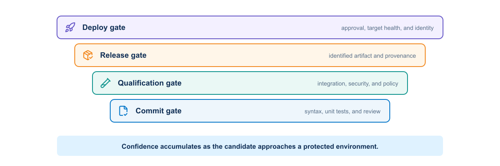
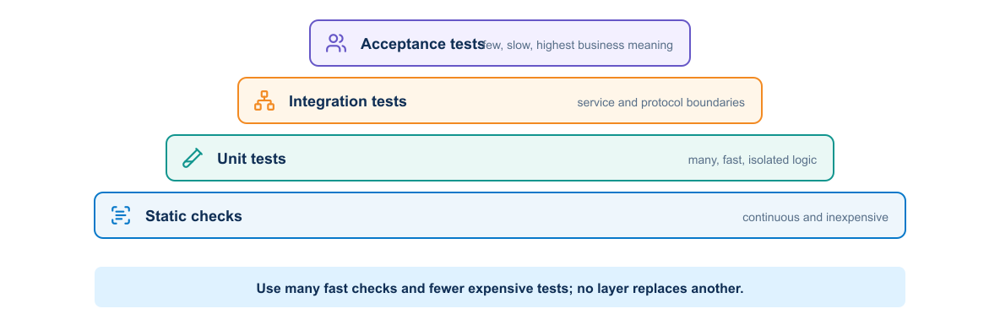
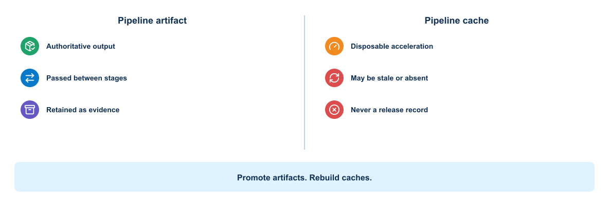
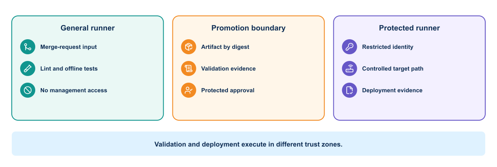
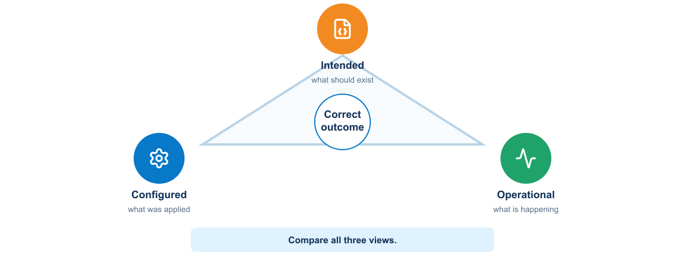
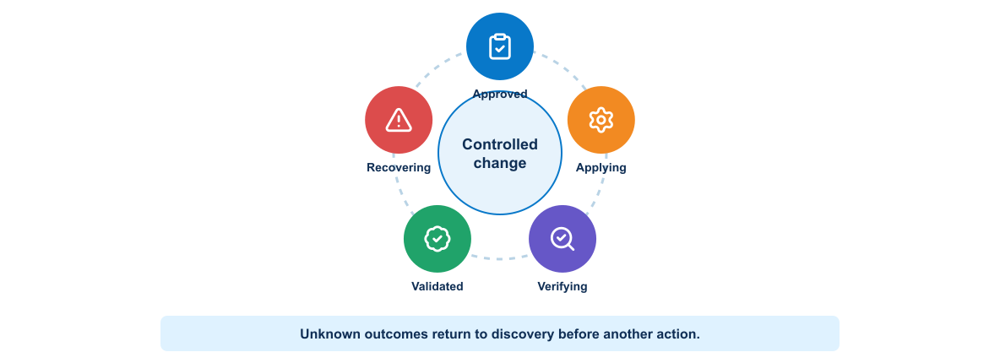
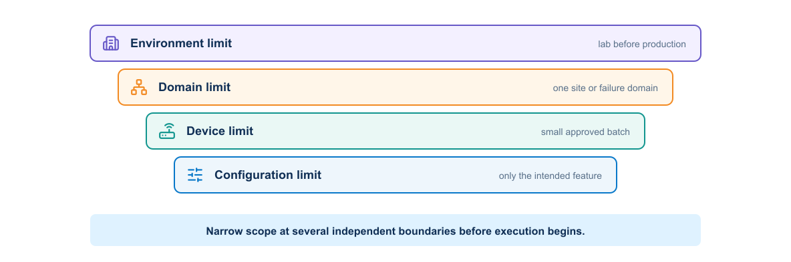
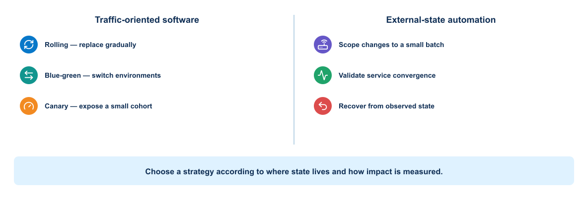
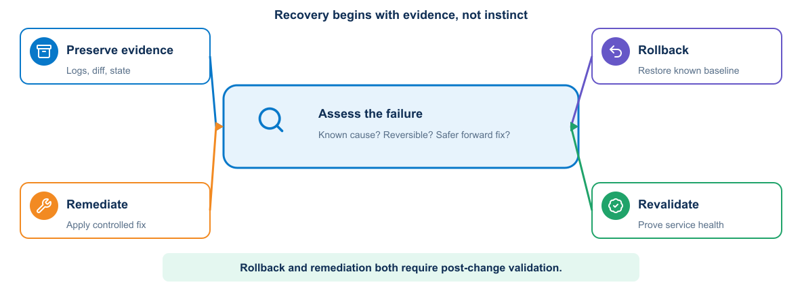

# Module 4: Continuous Integration, Delivery, and Deployment Validation

## 1. Purpose

A delivery pipeline must do more than run commands after a commit. It must convert reviewed source into an identified artifact, accumulate evidence, control promotion, constrain deployment, verify the resulting service, and support recovery when the outcome is uncertain. This module treats CI/CD and deployment validation as one continuous control system.

Module 2 produced the application artifact and runtime architecture, while Module 3 defined controlled infrastructure and test environments. Module 4 connects those foundations to GitLab jobs, runner trust zones, automated tests, release gates, pre-deployment checks, controlled rollout, post-deployment evidence, rollback, and remediation.

## 2. CI/CD delivery flow

### 2.1 Software delivery pipeline

A pipeline does not treat a successful command or API response as final proof. Build completion proves that an artifact was created; deployment completion proves that a platform accepted a request. Health and acceptance checks must still prove that users or downstream systems receive the intended outcome. For a network automation application, that may include an existing read-only network test.

### 2.2 Pipeline objectives

A useful pipeline should answer these questions:

- Does the change meet formatting and static-analysis rules?
- Does expected automation and network behavior still pass?
- Can the repository build the required immutable artifact?
- Does the artifact start and behave correctly?
- Does the change satisfy security policy?
- Which environment received the release?
- Can the team trace the deployment back to source and evidence?

The pipeline should fail early on inexpensive, high-value checks. Slow environment provisioning should not run when syntax or unit tests already fail.

### 2.3 GitLab pipeline model

GitLab reads `.gitlab-ci.yml` from the repository. A pipeline contains jobs organized into stages or a dependency graph. Runners execute jobs.

Important concepts include:

- Stage: broad ordering category
- Job: commands and execution settings for one responsibility
- Runner: agent that performs the job
- Artifact: output retained or passed to another job
- Cache: reusable data that improves speed but is not authoritative output
- Variable: configuration supplied to a job
- Environment: named deployment target with history
- Rule: condition controlling whether a job appears or runs

#### 2.3.1 GitLab concepts in network automation

GitLab combines source control, review, pipeline execution, and evidence management. The table maps its principal delivery concepts to the responsibilities they can support in an automation system.

| Concept | Network automation use |
|---|---|
| Pipeline | Complete evaluation of one commit and target context |
| Stage | Broad control point such as validate, render, precheck, deploy, or postcheck |
| Job | One bounded responsibility that produces a clear status and evidence |
| Runner | Execution agent placed according to trust and management reachability |
| Artifact | Rendered configuration, test report, plan, backup, diff, or sanitized evidence |
| Cache | Reusable package download that may disappear without affecting correctness |
| Variable | Environment name, image tag, timeout, or protected credential reference |
| Environment | Named test, staging, or production network context with deployment history |
| Rule | Condition that prevents change jobs on untrusted branches |
| Manual approval | Deliberate promotion decision after diff and evidence review |

#### 2.3.2 From issue to verified merge

A pipeline begins before `.gitlab-ci.yml` is evaluated. A work item or change record states the problem, scope, owner, risk, and acceptance criteria. A feature branch isolates the proposed source change. The merge request then becomes the review boundary that joins discussion, source difference, pipeline results, policy, and approval.

For the reference scenario, the merge request should let a reviewer answer five questions without reconstructing the author's workstation: What network outcome is requested? Which intent and application files changed? Which target and maximum scope are authorized? What candidate configuration and test evidence were produced? What conditions would stop or reverse deployment?

Approval applies to the reviewed commit and evidence. A new commit invalidates conclusions tied to the previous revision and should rerun required checks. Merging records integration into the protected branch; it does not itself authorize a live network change unless the environment policy explicitly defines that behavior.

### 2.4 Pipeline design

The complete pipeline can be read as two trust zones. General jobs interpret repository content and create evidence without management access. Protected jobs receive the approved digest, target, diff, and credential only after the gate. The handoff consists of immutable artifacts and approval context, not an instruction to rebuild the application on the protected runner. The compact reference architecture in Module 1 shows this separation.

<p align="center">
  
</p>

A typical stage sequence is validation, testing, build, inspection, integration, deployment, and verification.

Each job should have one clear outcome. A large script that builds, deploys, and tests without preserving intermediate evidence is difficult to diagnose and reuse.

Dependencies can express which artifacts a job actually needs. Independent jobs can run concurrently, reducing feedback time.

### 2.5 Validation and testing layers

No single test can establish that a change is safe. Effective pipelines build confidence progressively, starting with inexpensive source checks and advancing toward tests that require integrated services or representative environments.

<p align="center">
  
</p>

#### 2.5.1 Static validation

Static checks inspect files without running the complete application. Examples include YAML parsing, Dockerfile linting, formatting checks, type checks, Terraform validation, and Kubernetes schema validation.

#### 2.5.2 Unit testing

Unit tests isolate application behavior and should provide fast feedback. They should not require a live network, shared database, or production account.

#### 2.5.3 Integration testing

Integration tests examine boundaries such as application-to-database interaction or an HTTP request through the proxy. They need controlled dependencies and reliable cleanup.

#### 2.5.4 System and acceptance testing

These tests evaluate the assembled system and user-visible outcomes. They cost more to run, so teams select a focused set for each change and reserve broader suites for scheduled or release pipelines.

#### 2.5.5 Network policy validation

Policy checks examine intent and derived configuration before device access. Depending on the scenario, they can enforce:

- VLAN range and reserved-ID rules
- Site-specific address allocation
- Prefix-overlap prevention
- Required descriptions and change identifiers
- Approved routing protocols, processes, peers, or areas
- Passive-interface requirements where appropriate
- Prohibition of broad redistribution or default-route changes
- Maximum number of devices and configuration lines changed

Policy should report the exact object and rule. A vague `compliance failed` result wastes review time.

#### 2.5.6 Test environment and limitation matrix

Each validation layer answers a different question and depends on a different level of environmental realism. This matrix helps teams select the least expensive test that can provide meaningful evidence for a given risk.

| Test layer | Typical tools | Environment required | Detects | Important limitation |
|---|---|---|---|---|
| Static and schema | `yamllint`, JSON Schema, Pydantic, linters | No network | Syntax, type, required-field, and basic policy defects | Cannot prove renderer or device behavior |
| Unit and template | `pytest`, Jinja2 golden files | No network | Normalization, policy logic, rendered output, exception paths | Expected files can encode the same mistaken assumption as the code |
| Parser fixtures | `pytest`, Genie/TextFSM with sanitized output | No network | Parser regressions and missing-field handling | Recorded output does not reproduce timing or platform side effects |
| Mock API | `pytest`, HTTP/NETCONF mock | Mock network/service | Authentication branches, status codes, RPC errors, pagination, retry logic | A mock proves client behavior, not product semantics |
| Service integration | Compose, API/queue/database tests | Isolated local services | Contracts, persistence, worker state transitions, timeouts | Does not prove NOS configuration or protocol convergence |
| Virtual device | Virtual network appliance or simulator, pyATS | Disposable topology | Capabilities, command/model semantics, transactions, routing behavior | Images, scale, hardware, and timing can differ from production |
| Real lab or sandbox | pyATS, Ansible check/diff, probes | Dedicated equipment or authorized sandbox | Platform-specific behavior and end-to-end workflow | Availability, topology, and reset behavior constrain coverage |
| Production pre/post-check | Read-only APIs, pyATS, telemetry | Approved production read access | Actual baseline, scope, convergence, forwarding, and collateral effects | Observation must be bounded, safe, and cannot eliminate change risk |

A strong pipeline uses many cheap offline tests and a smaller number of increasingly realistic tests. Production telemetry closes the feedback loop; it must not become the first place a predictable defect is tested.

### 2.6 Build once and promote

The build job should produce a versioned, immutable artifact. Later jobs deploy the same artifact. Rebuilding separately for staging and production allows dependencies or build conditions to change and invalidates earlier evidence.

For a container release, record the source commit, human-readable tag, and image digest. Deploy by digest for strong identity.

### 2.7 Artifacts and caches

The diagram distinguishes data required for correctness from data used only to improve speed.

<p align="center">
  
</p>

A downstream job consumes an artifact deliberately. A cache may be missing or stale, so every job must remain correct without it.

Artifacts are outputs that the pipeline needs to retain, such as test reports, coverage results, deployment plans, an SBOM, or packaged configuration. They should have an appropriate expiration and access policy.

A cache accelerates work by reusing dependency downloads or build intermediates. Jobs must remain correct when the cache is empty. Never use a cache as the only copy of a release artifact or security report.

### 2.8 Runner design

GitLab coordinates pipelines, but it does not execute the shell commands in a job. That work occurs on runner infrastructure. Runner design therefore determines the operating system, tools, network paths, credentials, isolation, capacity, and residual state available to repository-controlled code.

This distinction matters in network automation. A validation job may need source code and a Python environment, while a deployment job may need a route to a management network and authority to request a short-lived device credential. Assigning both jobs to the same broadly trusted runner collapses two different security boundaries.

#### 2.8.1 Runner terminology and job flow

Several related components are often called a *runner*, but they have different responsibilities:

- **GitLab instance:** creates the pipeline, schedules jobs, issues job-scoped credentials, receives logs, and records status and artifacts.
- **Runner configuration:** the logical GitLab resource that defines scope, tags, protection, and other scheduling attributes.
- **Runner manager:** the installed GitLab Runner process that reads `config.toml`, requests work, prepares execution, and reports results.
- **Executor:** the mechanism used to run a job, such as Shell, Docker, Kubernetes, or a supported autoscaling executor.
- **Job environment:** the actual shell, container, Pod, or machine in which the job commands execute.

The runner manager authenticates to GitLab with a runner authentication token. After GitLab assigns a job, the runner uses job-scoped information to fetch the required source and artifacts, invokes the executor, streams output, and returns status and artifacts. The runner authentication token identifies the runner configuration; it is not a device credential and should never be passed into the automation application as one.

Current GitLab releases use the runner creation workflow and runner authentication tokens. Legacy registration tokens are deprecated and may be disabled. Installation procedures must therefore be checked against the deployed GitLab and GitLab Runner versions rather than copied from an older example.

#### 2.8.2 Scope, tags, and job selection

A project runner is available to assigned projects, a group runner to projects within its group hierarchy, and an instance runner more broadly across the GitLab instance. Wider scope improves reuse and capacity sharing but increases the number of repositories whose jobs may reach the runner. A privileged or management-connected runner should consequently have the narrowest practical scope.

Tags match jobs to runners with required capabilities. For example, `linux-container` may select an ordinary validation environment and `protected-network-runner` may select a restricted deployment environment. Tags describe scheduling capability; they are not an authorization control by themselves. Protection settings, branch and environment rules, repository permissions, runner scope, identity policy, and network enforcement must agree.

#### 2.8.3 Executor tradeoffs

Executor choice changes the isolation and reproducibility of the job environment. It does not change the trust of the pipeline source or automatically restrict network reachability.

| Executor | Useful characteristic | Important limitation | Appropriate course role |
|---|---|---|---|
| Shell | Direct access to host tools and network | Jobs share the host and can leave files or alter installed state | Small, tightly controlled deployment runner where host ownership is explicit |
| Docker | Reproducible job image and disposable container filesystem | Host kernel is shared; Docker socket or privileged mode can expose host control | General lint, unit-test, render, and packaging jobs |
| Kubernetes | Ephemeral Pods, scheduling, quotas, and scalable capacity | Adds cluster RBAC, admission, CNI, image, namespace, and node trust | Shared validation capacity when an established cluster platform exists |
| Autoscaling machine or instance | Clean machine boundary and elastic capacity | Startup time, image maintenance, cloud identity, and cost require control | Bursty builds or stronger per-job isolation |

The Shell executor is not inherently wrong, and the Docker executor is not inherently safe. A dedicated, patched Shell runner with a narrow network path can be more defensible for a protected deployment than a container runner that mounts the Docker socket and accepts untrusted projects.

#### 2.8.4 General and protected runners

The runner model identifies where repository-controlled commands execute and why general validation and management-plane deployment require different trust levels.

<p align="center">
  
</p>

As shown in Module 1, the protected runner is the first pipeline execution component with management-plane reachability. Earlier jobs pass an approved artifact and evidence across that boundary; they do not inherit the same access.

- A general validation runner has Internet or registry access but no production device route or deployment secret.
- A protected network runner reaches the management network and runs only protected-branch or approved-environment jobs.

The protected runner should accept only explicitly tagged jobs from approved refs or environments, verify the artifact digest and target context, request a scoped identity just in time, and write evidence to an independently protected destination. Its firewall path should reach only required management endpoints. Runner concurrency must also respect device and routing-domain locks; compute capacity is not permission to increase network blast radius.

If Docker builds require a privileged mechanism, isolate that builder from the network runner. Mounting `/var/run/docker.sock` gives a job powerful control over the Docker host. A job that can control the host can inspect other containers, mounts, credentials, and network paths, so container boundaries no longer provide meaningful protection.

> **VERIFICATION**
> Submit an untrusted-branch job with the protected runner's tag and confirm that it remains unscheduled. Then verify from the runner host and job environment that the general runner has no management route and that the protected runner can reach only the approved endpoints. A green pipeline is not evidence that runner isolation works; the denied paths must also be tested.

### 2.9 Variables and secrets

Non-sensitive configuration may live in the repository. Secrets should use protected and masked variables or an external secret manager. Masking only reduces accidental log display; it does not prevent a malicious job from transmitting an available secret.

Control secret exposure through job rules, protected branches, protected environments, short-lived credentials, narrow permissions, and runner isolation.

### 2.10 Pipeline rules

Different events need different work:

- Merge-request pipelines validate proposed changes.
- Default-branch pipelines create or update approved artifacts.
- Tag pipelines can create releases.
- Scheduled pipelines can perform broader scans or maintenance.
- Manual jobs can provide controlled promotion or cleanup.

Rules should be understandable and tested. A critical security job that silently disappears due to a complex rule creates a dangerous gap.

### 2.11 Environments and promotion

GitLab environments record deployments to targets such as review, test, staging, and production. A review environment can give each merge request an isolated endpoint. A stop job removes it when no longer needed.

Promotion policy may require successful checks, peer approval, change-window conditions, or an environment owner. The approval should act on the tested artifact identity.

### 2.12 Pipeline efficiency

Pipeline optimization should shorten the time to trustworthy feedback, not merely reduce elapsed minutes. A fast pipeline that omits a required control or tests a different artifact is inefficient because it creates rework and operational risk.

#### 2.12.1 Dependency graphs and safe concurrency

Stages provide an understandable broad order, while `needs` expresses the jobs and artifacts required by a particular consumer. This forms a directed acyclic graph: a job can start when its declared predecessors complete instead of waiting for unrelated work in an earlier stage.

Linting, schema validation, secret detection, and independent unit-test groups can often run concurrently. Rendering must wait for validated intent; deployment must wait for the approved artifact and pre-check evidence. Network jobs that affect the same device or routing domain remain serialized even when their software tests can run in parallel.

#### 2.12.2 Reuse and maintainability

Repeated YAML eventually diverges. Small local patterns can use hidden jobs and `extends`; shared organizational policy can use controlled `include` files or CI/CD components where supported. YAML anchors operate within YAML processing and are useful for limited repetition, but excessive indirection makes a pipeline harder to review.

Reusable definitions must be versioned. Referencing a mutable shared template allows pipeline behavior to change without a commit in the consuming repository. Pin an approved version or commit, define ownership, test compatibility, and provide a deliberate update path. Parent-child pipelines can separate components in a large repository, but they also require clear artifact, variable, status, and cancellation behavior across the boundary.

#### 2.12.3 Purpose-built job images

A job image should contain the toolchain required for one related class of work, with versions controlled and the image identified by digest. Installing Python, Ansible collections, scanners, and operating-system packages at the start of every job increases time and allows dependency resolution to change between runs.

The validation image should include only offline validation tools and trusted certificate material. It should not contain environment-specific inventory or credentials. A separate deployment image can include approved network clients while remaining unavailable to untrusted runners. Both images require patching, scanning, provenance, and an owner; a purpose-built image becomes technical debt if nobody maintains it.

Practical improvements include:

- Running independent jobs concurrently
- Reusing safe dependency caches
- Selecting tests based on affected components when confidence remains adequate
- Building a shared artifact once
- Avoiding unnecessary service startup
- Cancelling superseded pipelines

Efficiency must not remove evidence needed for safety.

### 2.13 Pipeline failure categories

A useful failure message separates:

- Source or test defect
- Dependency resolution failure
- Build failure
- Runner or platform problem
- Missing or unauthorized secret
- Environment provisioning failure
- Deployment failure
- Health or acceptance failure

Jobs should return a nonzero status on failure and preserve relevant evidence. Scripts that continue after a failed command can create false success.

### 2.14 Illustrative `.gitlab-ci.yml`

The pipeline below demonstrates how the validation layers can be ordered and how artifacts can pass evidence between jobs. It is deliberately illustrative: runners, credentials, approval rules, and deployment commands must be adapted to the target environment.

```yaml
stages: [validate, render, test, build, precheck, deploy, postcheck]

default:
  image: registry.example/network-devops/validator@sha256:VALIDATOR_DIGEST
  before_script:
    - python --version
    - test -n "$CI_COMMIT_SHA"

variables:
  INTENT_FILE: examples/service-intent.yml
  TARGET_LIMIT: distribution-01
  TARGET_PLATFORM: lab-nos
  EVIDENCE_DIR: evidence-output

validate_intent:
  stage: validate
  script:
    - python -m automation.python.validate_intent "$INTENT_FILE"
    - yamllint "$INTENT_FILE" inventory/lab.yml
  artifacts:
    when: always
    paths: [evidence-output/intent-validation.json]

render_network_config:
  stage: render
  needs: [validate_intent]
  script:
    - python -m automation.python.render --intent "$INTENT_FILE" --platform "$TARGET_PLATFORM"
  artifacts:
    paths: [evidence-output/rendered/]

offline_tests:
  stage: test
  needs: [render_network_config]
  script:
    - pytest --junitxml=evidence-output/junit.xml
    - ansible-playbook --syntax-check automation/ansible/playbooks/deploy.yml
  artifacts:
    when: always
    reports:
      junit: evidence-output/junit.xml

build_automation_image:
  stage: build
  needs: [offline_tests]
  script:
    - ./ci/build-image --commit "$CI_COMMIT_SHA" --metadata evidence-output/image.json
    - ./ci/create-sbom --metadata evidence-output/image.json --output evidence-output/sbom.cdx.json
    - ./ci/scan-image --metadata evidence-output/image.json --report evidence-output/image-scan.json
    - ./ci/export-digest --metadata evidence-output/image.json --dotenv evidence-output/image.env
  artifacts:
    paths:
      - evidence-output/image.json
      - evidence-output/sbom.cdx.json
      - evidence-output/image-scan.json
    reports:
      dotenv: evidence-output/image.env

network_precheck:
  stage: precheck
  needs:
    - job: render_network_config
      artifacts: true
    - job: build_automation_image
      artifacts: true
  tags: [protected-network-runner]
  resource_group: distribution-01
  rules:
    - if: '$CI_COMMIT_BRANCH == $CI_DEFAULT_BRANCH'
  script:
    - python -m automation.python.precheck --inventory lab --limit "$TARGET_LIMIT"
  artifacts:
    when: always
    paths: [evidence-output/precheck/]

deploy_lab_target:
  stage: deploy
  tags: [protected-network-runner]
  resource_group: distribution-01
  environment:
    name: lab/distribution-01
  when: manual
  allow_failure: false
  needs:
    - job: network_precheck
      artifacts: true
    - job: build_automation_image
      artifacts: true
  script:
    - test -n "$AUTOMATION_IMAGE_DIGEST"
    - python -m automation.python.verify_target --inventory lab --limit "$TARGET_LIMIT"
    - python -m automation.python.deploy --image-digest "$AUTOMATION_IMAGE_DIGEST" --approved-diff evidence-output/precheck/diff.json

network_postcheck:
  stage: postcheck
  tags: [protected-network-runner]
  resource_group: distribution-01
  needs: [deploy_lab_target]
  script:
    - pyats run job validation/pyats/service_validation_job.py --testbed-file inventory/lab.yml
  artifacts:
    when: always
    paths: [evidence-output/postcheck/, archive/]
```

This is a teaching example. Commands under `./ci/` are repository-owned wrappers, not GitLab or industry-standard commands; each must fail nonzero on policy violation and produce the named evidence. `export-digest` writes `AUTOMATION_IMAGE_DIGEST` to the dotenv report after the image has been pushed and its registry digest resolved. GitLab syntax and feature availability depend on the deployed GitLab version and tier. Validate the pipeline against the target instance.

### 2.15 Explanation of the pipeline blocks

Each block in the example has a distinct control purpose. Together they make the delivery path visible, preserve evidence, and prevent a later stage from running when an earlier assumption has failed.

- `stages` makes the network controls visible in order.
- `default.image` pins the validation runtime instead of using a mutable tag.
- `INTENT_FILE` selects one reviewed source document.
- `validate_intent` checks structure before rendering or network access.
- `artifacts.when: always` preserves failure evidence as well as successful output.
- `needs` allows a job to start only after its required evidence exists.
- `offline_tests` exercises code, fixtures, and playbook syntax without device credentials.
- `build_automation_image` creates the image once, resolves its registry digest, and retains the SBOM and scan reports with the build metadata.
- The dotenv report passes the resolved digest as data; deployment rejects an empty digest and does not resolve a mutable tag again.
- `tags` routes sensitive jobs to the protected network runner.
- `resource_group` prevents concurrent changes to the same target scope.
- `rules` excludes feature branches from live-device work.
- `when: manual` creates an approval point after the pre-check and diff.
- `verify_target` rechecks identity immediately before change.
- `pyats run job` validates structured operational outcomes after configuration.

Real pipelines should pass the exact image digest and evidence artifacts between jobs, verify that the approved diff belongs to the same commit and target, and define cleanup or recovery behavior.

#### 2.15.1 Practical review: passing jobs, wrong artifact

A staging test may pass while production receives a rebuilt image carrying the same tag. The dashboard looks green, yet the production bytes were never tested. To detect this class of error, the build job records the image digest; scan, integration, approval, and deployment jobs consume that digest as an artifact; and the deployment record reports the same value. If any stage resolves a mutable tag again, the evidence chain is broken and promotion should stop.

### 2.16 Why each gate exists

A gate is useful only when its failure has a defined meaning and response. The table relates each gate to the risk it controls and the action engineers should take when that control rejects a change.

| Gate | Why it exists | Example failure | Required response |
|---|---|---|---|
| Intent parsing | Reject unreadable source before interpreting it | Duplicate YAML key changes a value silently | Fail and correct source |
| Schema validation | Enforce the contract shape and types | VLAN ID is a string or validation criteria are missing | Fail before normalization |
| Normalization | Create one canonical representation | Host address is mistaken for the intended prefix | Fail with field-level detail |
| Policy validation | Enforce organizational constraints | Prefix overlaps an allocation or redistribution is prohibited | Block or obtain reviewed exception |
| Configuration rendering | Produce deterministic platform output | Undefined variable omits an interface control | Fail and preserve rendered artifact |
| Linting | Detect structural and unsafe implementation defects | Invalid playbook, Python error, or ambiguous YAML | Fail before network access |
| Unit and parser tests | Exercise logic and structured-output handling | Genie output structure changes after dependency update | Correct code, dependency, or fixture |
| Image validation | Bind execution to a known runtime | Critical dependency vulnerability or root runtime user | Block publication/promotion |
| Network pre-check | Prove correct target and healthy baseline | Serial number mismatch or required peer already down | Stop; do not attribute baseline failure to the change |
| Configuration diff | Reveal exact proposed effect | Template removes an unrelated routing statement | Reject and correct intent/renderer |
| Blast-radius evaluation | Limit shared-infrastructure exposure | Inventory selector expands from one device to 80 | Stop and require new review |
| Approval | Bind human decision to exact evidence | Commit, target, or diff changed after approval | Invalidate approval |
| Deployment | Apply only the approved transaction | Timeout leaves outcome uncertain | Stop writes and rediscover actual state |
| Protocol convergence | Wait for bounded control-plane stability | Neighbor remains in `EXSTART` or BGP prefix count drops | Stop rollout and diagnose |
| Post-check | Prove configuration and service outcome | Device accepts commands but route or path is absent | Roll back or remediate according to evidence |
| Telemetry observation | Detect delayed or collateral degradation | Packet loss rises after immediate checks pass | Halt promotion and invoke recovery policy |

## 3. Deployment validation and recovery

### 3.1 Three forms of state in an automation application

The automation application is assumed to know how to collect and interpret these states. This course uses them as deployment acceptance evidence and concentrates on when the pipeline collects them, how it evaluates them, and which result permits promotion or triggers recovery.

The loop below shows why stored configuration is an intermediate result. Operational observations must be compared with the original intent.

<p align="center">
  
</p>

| State | Meaning | Routing-service scenario |
|---|---|---|
| Intended state | Reviewed outcome the organization wants | Interface or service prefix, routing policy, and expected tests |
| Configuration state | Commands or modeled configuration stored by the device | Interface and routing configuration returned by the device |
| Operational state | Current protocol and forwarding behavior | Interface state, neighbor state, learned route, and reachability |

The three states can disagree. A template may correctly represent intent while the device rejects part of it. The device may accept every command while the SVI stays down. The SVI may come up while the test peer never learns the route. A complete pipeline compares all three.

### 3.2 Network change state machine

Timeout and partial outcomes leave the normal promotion path rather than being treated as safe failures.

<p align="center">
  
</p>

An `UNKNOWN/PARTIAL` state is important. A timeout after sending configuration does not prove that nothing changed. The workflow must collect current state before retrying.

### 3.3 Evidence chain

A release should accumulate evidence as it moves through the pipeline:

The evidence chain begins with source review and continues through static checks, unit tests, image inspection, integration tests, the infrastructure plan, pre-deployment checks, deployment, acceptance tests, and operational observation.

Each result should identify the source commit, artifact, pipeline, and target environment. This traceability supports approval, troubleshooting, and audit.

### 3.4 Build validation

Build validation confirms that the repository produces the expected artifact under controlled conditions. It may include:

- Dependency resolution and integrity
- Test execution and coverage
- Image creation
- Image metadata and runtime-user checks
- Vulnerability and secret scanning
- SBOM generation
- Artifact signature or provenance
- A minimal startup and health test

A successful build should not depend on files that exist only on a developer workstation.

### 3.5 Infrastructure validation

Infrastructure definitions need their own controls:

- Format and syntax checks
- Provider or module initialization
- Variable and schema validation
- Policy checks
- Plan generation
- Target and resource-count checks
- Cost or quota review when applicable
- Security review of network exposure and permissions

The plan is evidence, not approval by itself. Reviewers must understand the target and the meaning of the proposed actions.

### 3.6 Pre-deployment health checks

Before a release changes an environment, verify that the environment is safe to change. Useful checks include:

- Target identity and environment classification
- Current service health
- Available capacity
- Dependency reachability
- Credential validity without displaying the credential
- Required backups or snapshots
- Compatible database schema
- Absence of another conflicting deployment
- Availability of the previous known-good artifact

Deploying into an already degraded environment can make diagnosis and recovery harder.

#### 3.6.1 Example pre-check set for a routing-service scenario

Pre-checks should establish whether the target is the expected system and whether its present condition permits the approved change. The following set illustrates checks that can stop deployment before any configuration is modified.

| Check | Reason | Blocking condition |
|---|---|---|
| DNS, route, and management port | Prove the runner can reach the management interface | Target unreachable or wrong path |
| Device identity and serial/hostname | Prevent change to the wrong system | Inventory and device identity differ |
| Authentication and authorization | Prove the service identity can perform the intended method | Login fails or privilege is insufficient |
| CPU and memory | Avoid adding change load to an unstable device | Threshold or trend violates policy |
| Interface and line-protocol state | Record baseline and detect unrelated failure | Required uplink or peer link is down |
| OSPF neighbor state | Confirm routing is healthy before change | Required neighbor is not `FULL` |
| Routing table and reachability | Establish baseline forwarding | Required baseline route or probe fails |
| Existing VLAN, SVI, and prefix | Detect collision or unmanaged prior state | Conflicting configuration exists |
| Running configuration backup | Support investigation and recovery | Backup cannot be collected or protected |
| Configuration lock/checkpoint capability | Select transaction and recovery approach | Required safety capability unavailable |

Thresholds must be policy, not arbitrary constants hidden in code.

### 3.7 Configuration generation and diff

The pipeline loads the reviewed YAML intent, validates it, normalizes addresses, and renders platform-specific configuration. A Jinja2 fragment might be:

```jinja2
vlan {{ vlan.id }}
 name {{ vlan.name }}
!
interface {{ svi.name }}
 description {{ svi.description }}
 ip address {{ svi.ipv4_address | ipaddr('address') }} {{ svi.ipv4_address | ipaddr('netmask') }}
 no shutdown
!
router ospf {{ routing.process_id }}
 passive-interface {{ svi.name }}
 network {{ routing.advertise_prefix | ipaddr('network') }} {{ routing.advertise_prefix | ipaddr('hostmask') }} area {{ routing.area }}
```

Filters and exact syntax depend on the rendering environment and target network operating system. The pipeline tests rendered output with approved fixtures. It does not send a template containing undefined variables.

The proposed diff must identify additions, removals, replacements, and unexpected lines. Review should assess protocol effect, device count, configuration section, and recovery path rather than only line count.

### 3.8 Deployment interfaces and transactions

Deployment safety depends partly on the transaction semantics offered by the target interface. The following subsections compare common approaches and show why the same validation and recovery design cannot be assumed for every interface.

#### 3.8.1 SSH CLI

CLI automation may enter configuration commands and collect output. It needs prompt handling, timeouts, error-pattern detection, and post-write verification. Command echo does not prove configuration acceptance.

#### 3.8.2 NETCONF

NETCONF exchanges capabilities and structured RPCs. Where supported, candidate configuration and `validate`, confirmed commit, or rollback-on-error can improve transaction safety. Capabilities vary, so the client must inspect the server response rather than assume support.

#### 3.8.3 RESTCONF

RESTCONF exposes YANG-modeled data through HTTP. The client must construct the correct resource path, content type, method, and payload for the device release. It should validate TLS, distinguish HTTP errors from YANG errors, and read state back after modification.

#### 3.8.4 Ansible

Ansible can coordinate modules, templates, backups, and assertions across devices. Check and diff modes are useful only when the selected module and platform support them accurately. Review collection documentation and test behavior.

### 3.9 Scoped deployment controls

The change job should require an explicit environment, site, and device limit. It verifies inventory fingerprint, device identity, change ID, commit, approved diff hash, and automation image digest.

For multiple branches, use a canary and bounded batches. Stop when failure rate, protocol convergence, or telemetry crosses policy. Do not launch the maximum parallelism simply because the tool supports it.

#### 3.9.1 Network blast-radius framework

Blast radius is multidimensional. Count devices, but also identify routing domains, redundancy pairs, controller scopes, tenants, sites, services, and management dependencies. Changing two route reflectors in the same cluster can be riskier than changing ten independent access switches.

<p align="center">
  
</p>

- **Wrong-device prevention:** resolve a stable inventory identifier, connect through the expected management path, collect hostname/serial/platform, compare the inventory fingerprint, and display the final target set before approval.
- **Per-device locking:** prevent two jobs from writing to the same device. Treat an expired lock carefully because the earlier job may still be running.
- **Routing-domain locking:** serialize changes that touch the same adjacency, route-reflector cluster, redistribution boundary, or policy control point even when device names differ.
- **Bounded concurrency:** specify maximum parallel targets and maximum acceptable failures. A tool default is not a safety policy.
- **Rate limiting:** constrain API requests, login attempts, configuration operations, and controller jobs to avoid control-plane overload.
- **Maintenance windows:** enforce start and stop boundaries, required operators, and sufficient time for observation and recovery.
- **Credential scope:** bind identity to required methods, targets, configuration domains, and duration; read-only validation should not receive write privilege.
- **Out-of-band access:** verify recovery access before a change that can affect in-band management or routing reachability.

Stop conditions must be machine-readable where possible: identity mismatch, unhealthy baseline, unexpected diff, excessive target count, lost management access, convergence timeout, new critical logs, increased packet loss, or failure of an unaffected-service check.

### 3.10 Network post-checks

Post-checks should compare the new state with both intent and baseline:

- The requested interface or service object exists with the expected attributes.
- `Vlan120` has the correct description and address.
- Interface administrative and operational state match the lab expectation.
- OSPF process and passive-interface policy match intent.
- Required OSPF neighbor remains `FULL`.
- The peer routing table contains the scenario prefix through the expected protocol and next hop.
- The defined reachability probe succeeds with acceptable loss and latency.
- No required baseline neighbor, route, interface, or service disappeared.
- CPU, memory, errors, drops, and logs remain within policy.
- The running configuration contains no unexpected drift.

Some checks need a convergence window. Poll with a bounded timeout and preserve intermediate observations. A fixed long sleep wastes time and hides convergence behavior.

### 3.11 pyATS and Genie validation

pyATS provides a test framework, while Genie parsers convert supported device output into structured data. A testbed file defines devices and connection details, with secrets supplied externally.

Illustrative test logic follows. Parser commands and supported structured output depend on the target network OS, pyATS/Genie release, and installed parser packages.

```python
from pyats import aetest

class CommonSetup(aetest.CommonSetup):
    @aetest.subsection
    def connect(self, testbed):
        device = testbed.devices["distribution-01"]
        device.connect(log_stdout=False)
        self.parent.parameters["device"] = device

class VerifyRouting(aetest.Testcase):
    @aetest.test
    def ospf_neighbor_full(self, device):
        parsed = device.parse("show ip ospf neighbor")
        states = collect_neighbor_states(parsed)
        self.failed("Required OSPF neighbor is not FULL") if "FULL" not in states else self.passed()

    @aetest.test
    def branch_prefix_present(self, device):
        routes = device.parse("show ip route 10.20.120.0 255.255.255.0")
        assert_expected_ospf_route(routes, "10.20.120.0/24")
```

Production code needs robust structured traversal, explicit expected neighbor identity, meaningful failure evidence, and parser-error handling. Tests should distinguish unavailable parser support from an absent network state.

### 3.12 Applied failure scenario: configuration accepted, routing service fails

In the course reference scenario, the pipeline successfully creates VLAN 120 and its gateway on `distribution-01` and applies the approved OSPF intent. The device returns no configuration error, but post-checks show:

```text
Vlan120                 10.20.120.1    YES manual up   up
Required OSPF neighbor                 EXSTART/BDR
Expected route 10.20.120.0/24          absent on routing-peer-01
Reachability to 10.20.120.1            failed from routing-peer-01
```

> **FAILURE SCENARIO**
> A timeout after a configuration request creates an uncertain outcome: the device may have changed even though the client received no success response. The workflow must rediscover configured and operational state before retrying, rolling back, or declaring failure.

The pipeline must fail the release and stop promotion. Possible causes include MTU mismatch, authentication mismatch, network type mismatch, access policy, or an unrelated peer condition. Removing the newly advertised lab prefix may not fix an existing peer problem. The correct response is evidence-driven:

1. Compare the neighbor with the pre-check baseline.
2. Inspect OSPF and interface logs and telemetry.
3. Determine whether the change affected the adjacency.
4. Roll back when the change caused degradation and rollback is safe.
5. Otherwise preserve the change state, mark the environment unhealthy, and remediate the peer under a separate controlled action.
6. Run the full post-check suite again.

### 3.13 Deployment strategies

Application deployment names are useful only after translating them into network control mechanisms:

<p align="center">
  
</p>

| Application pattern | Network interpretation | Network-specific gate |
|---|---|---|
| Rolling update | Serial device or bounded-batch rollout | Stop between batches on convergence, error-rate, or service policy |
| Blue-green | Parallel policy, VRF, controller object, or alternate path with controlled cutover | Prove state synchronization, route preference, and reversal path |
| Canary | One device, site, tenant, or maintenance domain first | Compare protocol, path, packet-loss, latency, and incident signals |
| Feature flag | Pre-stage configuration and activate a controlled policy/object later | Prevent stale dormant configuration and audit activation ownership |
| Recreate | Remove and replace a disposable lab service or virtual appliance | Rarely appropriate for a shared physical router or switch |

#### 3.13.1 Recreate

Stop the old version and start the new version. This is simple but normally creates interruption. It may suit a training or low-criticality environment.

#### 3.13.2 Rolling update

Replace instances gradually while some old instances remain available. The application and schema must tolerate temporary version overlap.

#### 3.13.3 Blue-green

Run old and new environments in parallel, validate the new environment, then switch traffic. Recovery can be fast if the old environment remains intact. The approach needs additional capacity and careful data handling.

#### 3.13.4 Canary

Send a small portion of traffic to the new version and compare behavior before increasing exposure. Canary analysis needs reliable metrics and a clear decision policy.

#### 3.13.5 Feature control

Deploy code with a feature disabled, then enable it for selected users or environments. This separates deployment from feature exposure but adds configuration lifecycle and cleanup work.

No strategy removes risk. Database changes, external side effects, stateful protocols, and long-running work need special handling.

### 3.14 Post-deployment validation

Deployment success means more than a command returning zero. Validation should proceed from cheap technical checks to meaningful service behavior:

1. Confirm the expected artifact identity.
2. Confirm processes or workloads are ready.
3. Check application and dependency health.
4. Exercise a small functional transaction.
5. Review error rate, latency, saturation, and logs.
6. Confirm that rollback or remediation remains possible.

Synthetic transactions should use isolated test data and safe cleanup.

For a network change, replace an application-only `HTTP 200` test with layered evidence: confirm the stored configuration, interface state, protocol adjacency, expected and forbidden routes, next hop, forwarding path, loss and latency, device resources, new errors, and unaffected baseline services. The selected checks must derive from intent rather than from whatever commands are convenient to collect.

### 3.15 Smoke, integration, and acceptance checks

A smoke test answers whether basic critical behavior works. An integration check examines a component boundary. An acceptance test evaluates a user or business outcome.

The pipeline needs a compact set that completes quickly while detecting common release failures. Broader tests can run in the on-demand environment or on a schedule.

### 3.16 Idempotence and repeatability

An idempotent operation reaches the same intended state when repeated. It does not mean the operation performs no work or produces identical logs. Deployment scripts should inspect current state and change only what is required.

Repeatability matters when a job is retried after an uncertain failure. The workflow should avoid duplicating resources or corrupting state.

### 3.17 Failure handling

The pipeline should stop at the failing boundary and preserve evidence. Cleanup should remove disposable resources without hiding the original error.

Different failures need different responses:

- A deterministic test defect requires a source change.
- A transient registry timeout may justify a bounded retry.
- An authentication failure requires corrected access, not repeated attempts.
- A failed health check may require rollback or investigation.
- A partially applied infrastructure change requires state inspection before retry.

#### 3.17.1 Practical failure: a healthy container with an incompatible dependency

Assume the new API container starts and its liveness probe passes, but workers fail when reading jobs created by the previous version. The deployment platform sees a running process; users see stalled automation. The post-deployment check must therefore submit a representative job and verify its terminal state, not merely call `/health`. If the database change is backward compatible, shift traffic back to the previous image and investigate. If the migration is irreversible, rolling back the image may make matters worse; stop promotion, preserve the queue and schema evidence, and use the documented forward-remediation path.

### 3.18 Rollback and remediation

Recovery begins with causality and reversibility, not with an automatic rollback command.

<p align="center">
  
</p>

Both recovery paths end in renewed validation; reversing commands is not itself proof of restored service.

Rollback restores a prior artifact or configuration. It works best for stateless application changes with compatible data. Some database or infrastructure changes cannot be reversed safely.

Network recovery mechanisms have different guarantees:

- **Checkpoint or configuration replace:** restores a known device snapshot, but may overwrite legitimate concurrent changes unless locking and scope are correct.
- **NETCONF confirmed commit:** automatically reverts an unconfirmed transaction when supported and correctly timed; capability discovery and session behavior matter.
- **Controller transaction rollback:** uses the controller's ownership and transaction model; direct device edits may create unmanaged divergence.
- **Inverse intent:** removes or reverses only the intended delta, but must be generated and tested like any other change.
- **Forward remediation:** preserves valid new state and applies a new corrective action when reversal would be unsafe or the failure is unrelated.
- **Manual recovery:** uses a tested runbook and preferably out-of-band access when automation identity, reachability, or evidence cannot be trusted.

Forward remediation applies a new corrective change. Teams often need both options. The release plan should define the trigger, responsible role, required evidence, and data implications.

Test recovery before an incident. An undocumented rollback command that no one has exercised is only a hypothesis.

### 3.19 Improved deployment flow

An improved flow uses an on-demand environment, immutable artifact, automatic health checks, and controlled promotion:

The improved flow validates the merge request, builds the image once, creates a test environment, deploys the image digest, runs system tests, collects evidence, and removes the test environment. Approval then promotes the same digest for final verification and observation.

## 4. Knowledge check

### 4.1 CI/CD delivery flow

Use these questions to test your understanding of pipeline structure, evidence flow, and the boundaries between build, test, and deployment.

1. How does an artifact differ from a cache?
2. Why should untrusted branches not use a privileged deployment runner?
3. Why should the pipeline build a release artifact only once?
4. Which checks should run before an expensive test environment is created?
5. Why is a masked variable insufficient protection against a malicious job?
6. How do runner scope, tags, protection, executor, and network policy control different parts of job execution?
7. When does `needs` improve feedback time, and why must network-change concurrency still be controlled separately?
8. What risk is introduced when a pipeline includes a mutable shared template?

### 4.2 Deployment validation and recovery

Use these questions to assess whether you can connect an approved artifact to controlled deployment, post-change evidence, and recovery decisions.

1. What information connects a post-deployment test to the source change it validates?
2. Why should a pipeline inspect environment health before changing it?
3. Which deployment strategy requires the application to tolerate old and new versions at the same time?
4. Why might database migration prevent a simple rollback?
5. When is retrying a failed operation unsafe?

## 5. Summary

CI/CD converts delivery policy into an executable and reviewable workflow. Fast source checks, layered tests, protected runners, immutable artifacts, environment approvals, scoped credentials, pre-checks, controlled deployment, post-checks, and retained evidence work together. Pipeline success is not the final objective; the release is complete only when the deployed service produces the expected operational outcome and recovery remains possible.

**What the next module adds:** Module 5 applies security and observability across the complete delivery and operating system. Continue to [Security and Observability](module-05-security-observability.md).
