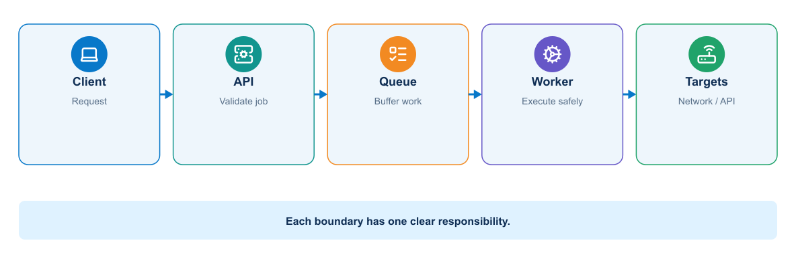
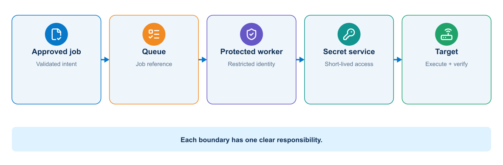
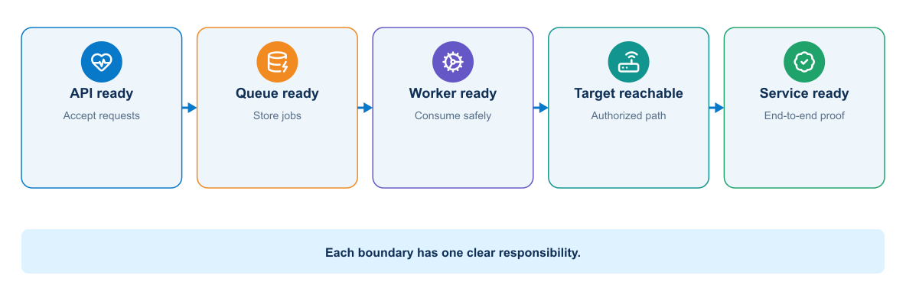

# Module 4: Deploying a Multitier Application

## 1. Purpose

The supplied Python application is expanded into a multitier service containing an API, worker, queue, data store, and monitoring components. This is a conventional software architecture: the worker's network-automation task is domain logic, while Docker networking, service contracts, persistence, readiness, timeouts, and failure handling are general application-delivery concerns.

Module 3 produced a secure image. Module 4 asks what happens when that image must cooperate with other services and survive dependency failure. The resulting Compose stack becomes the first complete deployment target for the CI/CD pipeline introduced in Module 5.

## 2. Multitier service architecture

The architecture separates request handling from privileged execution so that only the worker crosses into the management network and every job retains durable state and evidence.

<p align="center">
  
</p>

Separating responsibilities allows each service to change, scale, recover, and receive access control independently. The course stack contains an automation API, job worker, queue, job database, telemetry collector, and dashboard.

The worker is the only service that needs direct management-plane access. The API accepts a reference to reviewed intent and an approved operation. It must not accept arbitrary CLI commands from callers.

## 3. Service contracts

This sequence highlights why the public API does not need a route or credential to a device. Privileged access begins only in the protected worker after a validated job reaches the queue.

<p align="center">
  
</p>

The worker returns structured evidence and final status through the application boundary. The credential is scoped to the job and is never placed on the queue.

Each service needs an explicit contract:

- Protocol and port
- Addressing or discovery method
- Authentication and authorization requirements
- Request and response format
- Timeout and retry behavior
- Health behavior
- Version compatibility
- Data ownership

Containers change IP addresses when recreated. Consumers should use stable service names and declared ports rather than fixed container addresses.

### 3.1 Job contract

A worker and its callers need an explicit agreement about the data exchanged between them. This compact JSON example illustrates a job request that can be validated, queued, processed, and correlated with later evidence.

```json
{
  "change_id": "CHG-2026-0042",
  "commit_sha": "0123456789abcdef",
  "intent_path": "requests/compliance-intent.yml",
  "inventory": "lab",
  "operation": "precheck",
  "requested_by": "gitlab-pipeline-1842"
}
```

The API rejects arbitrary local paths, unknown inventories, unsupported operations, or missing change identifiers. Deployment requires a protected pipeline claim or separate approval. The queue contains references and non-secret metadata, not device passwords.

## 4. Docker network model

Docker Compose normally creates a user-defined network for the project. Services on the network can resolve one another by service name. The application can connect to `database:5432`, for example, while clients reach the published frontend port.

Publishing a port makes a service reachable through the host. `EXPOSE` documents a container port but does not publish it. A database should normally remain on an internal network unless an authorized external consumer requires access.

Larger designs can use separate frontend and backend networks. The proxy joins the frontend and application networks. The application joins the application and data networks. The database joins only the data network.

## 5. Docker Compose model

A Compose file defines a related application stack. Main elements include:

- `services` for runtime components
- `networks` for communication boundaries
- `volumes` for persistent data
- `configs` and `secrets` where supported
- Environment values and mounted files
- Health checks and dependency conditions
- Resource and restart behavior

Compose is useful for development, integration testing, demonstrations, and smaller deployments. Kubernetes provides a broader orchestration model for clustered operation.

### 5.1 Illustrative Compose structure

The following Compose definition shows how the application tiers can be declared as one system while retaining separate runtime responsibilities. The values are intentionally minimal so that the service relationships remain visible.

```yaml
services:
  automation-api:
    image: registry.example/network-devops:${AUTOMATION_IMAGE_TAG}
    command: ["serve-api"]
    networks: [api, services]
    ports: ["127.0.0.1:8080:8080"]
    depends_on:
      queue:
        condition: service_healthy

  worker:
    image: registry.example/network-devops:${AUTOMATION_IMAGE_TAG}
    command: ["run-worker"]
    networks: [services, management]
    read_only: true
    volumes:
      - evidence:/evidence
      - ./ssh/known_hosts:/etc/ssh/ssh_known_hosts:ro

  queue:
    image: redis:7-alpine
    networks: [services]
    volumes: [queue-data:/data]
    healthcheck:
      test: ["CMD", "redis-cli", "ping"]
      interval: 5s
      timeout: 3s
      retries: 10

  job-db:
    image: postgres:17-alpine
    networks: [services]
    volumes: [job-data:/var/lib/postgresql/data]

networks:
  api: {}
  services:
    internal: true
  management:
    external: true

volumes:
  queue-data: {}
  job-data: {}
  evidence: {}
```

This illustrates architecture rather than a complete production secret design. Live database credentials must come from a protected runtime source. The external management network must already exist and have an explicit security policy.

## 6. Configuration separation

The repository can contain safe defaults and `.env.example`, but it should not contain live secrets. Values vary by environment:

- External URL and listening port
- Database hostname and database name
- Log level
- Feature switches
- Credential references
- Monitoring endpoints

Configuration should be validated at startup. A service should fail clearly when a required value is missing instead of using an unsafe fallback.

Network-specific configuration includes inventory name, permitted device groups, protocol timeouts, concurrency limit, trusted CA path, SSH known-hosts path, evidence retention class, and read-only or change mode. A worker should not default to all devices or to change mode.

## 7. Persistent state

The database service needs a volume or external storage. Application containers should remain replaceable. Backup, restore, schema migration, and data ownership require explicit design.

A volume preserves data when a container is recreated, but it is not a backup. The same host failure can affect both the container and its local volume.

Schema changes must remain compatible with the deployment sequence. A destructive migration performed before new application instances become healthy can make rollback impossible.

The database does not replace Git as the source of intended state. It records runtime jobs and evidence relationships. Git stores reviewed intent and automation definitions. A queue holds temporary coordination state. Telemetry storage holds time-series observations.

## 8. Startup order and readiness

Process order does not prove service readiness. A database process may start before it accepts connections or completes recovery. The application should retry appropriate transient connections with a bounded policy.

Compose health checks can provide readiness evidence. Dependencies can wait for a healthy state, but the application still needs resilient connection behavior because services can fail after startup.

## 9. Timeouts and retries

Every remote call needs a timeout. An unlimited wait can exhaust threads or connections. Retrying can help with transient failures, but an aggressive retry loop can amplify overload.

Use bounded retries with delay and jitter where appropriate. Do not retry permanent failures such as invalid credentials or malformed requests without changing the input. Non-idempotent operations require special care because a repeated request might duplicate work.

## 10. Reverse proxy role

A reverse proxy can provide a stable client endpoint, TLS termination, request limits, static content, and routing. It should forward useful request identifiers and preserve client information according to the trust model.

The proxy health check and application health check answer different questions. Proxy availability does not prove that the application or database works.

In a production automation platform, the entry layer can terminate TLS and enforce authentication, request-size limits, and rate limits. It must not allow unauthenticated access to an endpoint that starts device changes.

## 11. Worker safety and concurrency

A worker processes network jobs. High concurrency can overwhelm device management planes or create conflicting changes. Use per-device locking and a low default concurrency. Jobs that touch the same routing domain may need a broader lock or ordered plan.

> **OPERATIONAL CONSIDERATION**
> Increasing worker replicas also increases potential device concurrency. Application scaling and network blast radius therefore require separate limits; queue depth alone is not a safe scaling signal.

The worker verifies the commit and image digest associated with the job, retrieves scoped credentials only when needed, and discards them after use. Queue redelivery requires idempotent design or a guard that prevents a partially completed deployment from running twice.

## 12. Mock and real targets

Compose can provide a mock REST API or recorded-response service for offline pipeline development. This supports schema, error handling, pagination, and evidence tests. It cannot prove device configuration semantics, control-plane convergence, or end-to-end forwarding.

The course progresses from mock validation to an authorized virtual or sandbox device. The pipeline labels evidence with the target type so reviewers do not confuse simulated success with real operational validation.

## 13. Health model

The readiness chain shows why a healthy API process does not prove that a queued network job can pass through every dependency and complete successfully.

<p align="center">
  
</p>

A multitier application benefits from several health views:

- Liveness: whether a process needs restart
- Readiness: whether it can accept traffic now
- Dependency status: whether required downstream services work
- Functional check: whether a small end-to-end action succeeds

Do not make liveness depend on every remote service. A database outage could cause every application container to restart continuously, adding load without repairing the database.

## 14. Logging across services

Services should write structured logs to standard output or another supported collection path. Include timestamp, severity, service, version, environment, and request or correlation identifier. Do not log passwords, tokens, private data, or full sensitive payloads.

A correlation identifier allows the team to follow one request from the proxy through the application and database interaction.

## 15. Failure analysis

Troubleshoot the stack from boundaries inward:

1. Confirm the expected containers exist and inspect their state.
2. Check health status and recent logs.
3. Confirm network membership and name resolution.
4. Test the application inside its network before testing the published endpoint.
5. Verify configuration without displaying secrets.
6. Check storage permissions and database readiness.
7. Reproduce the failing request with a request identifier.

`docker compose ps`, `docker compose logs`, `docker inspect`, `docker network inspect`, and targeted `curl` requests provide useful evidence.

### 15.1 Failure boundaries and controls

A multitier incident should be classified at the boundary that failed. Restarting the entire stack destroys useful evidence and may amplify the original problem.

| Symptom | Likely boundary | Evidence to collect | Appropriate control |
|---|---|---|---|
| API answers but jobs remain queued | API-to-queue or queue-to-worker | Request ID, queue depth, consumer state, worker logs | Contract test, queue health, bounded redelivery |
| Worker starts but cannot reach targets | Worker-to-management network | Worker route, DNS, firewall decision, endpoint TLS/SSH identity | Dedicated network attachment and explicit egress policy |
| Database container is running but API is unready | Application-to-database | Readiness result, connection error, migration status | Dependency-aware readiness and bounded connection retry |
| Job runs twice after worker restart | Queue acknowledgement and job-state ownership | Delivery count, job state transitions, operation identifier | Idempotency key, per-target lock, uncertain-state handling |
| Previous application cannot start after rollback | Application-to-schema compatibility | Migration version, application error, release history | Expand-and-contract migration or forward remediation |
| Published endpoint works locally but not remotely | Host publishing, firewall, or proxy | Bound address, port mapping, proxy and firewall logs | Explicit exposure and end-to-end health check |

The operating consequence determines severity. A failed dashboard query is different from a duplicated privileged job even when both appear as an HTTP error.

### 15.2 Practical failure: the API is healthy but no job completes

An HTTP 200 response from the API proves only that the request-facing process can answer. If jobs remain in `queued`, follow the job identifier across boundaries: confirm that the API published the message, inspect queue depth, check that the worker subscribed to the expected queue, and test management reachability from the worker namespace. A common cause is attaching the API to the published network while forgetting to attach the worker to the external management network. Restarting every container may hide the symptom without correcting the topology. The durable fix is a correct Compose network declaration plus an integration test that exercises one queued, read-only job.

## 16. Knowledge check

Use these questions to confirm that you can reason about service discovery, state, health, and failure isolation in a multitier deployment.

1. Why should the application connect to a service name rather than a container IP address?
2. What is the difference between starting a database process and proving database readiness?
3. Why should a database volume not be described as a backup?
4. Which services need published ports in a three-tier stack?
5. Why can a dependency-based liveness check cause a restart storm?

## 17. Summary

A multitier service is easier to secure and scale only when its contracts are explicit. Compose makes those contracts inspectable: service names, networks, storage, configuration, health, and startup dependencies. The operator still has to reason across boundaries—especially queue redelivery, database migrations, worker reachability, and the difference between a live process and a completed job.

**What the learner now has:** a Compose-based API, queue, worker, database, and health model with explicit contracts, protected reachability, durable job state, and bounded concurrency.

**What the next module adds:** Module 5 adds merge-request validation, automated tests, immutable artifacts, runner separation, approval, and traceable promotion. Continue to [Introducing CI/CD and Building the DevOps Flow](module-05-cicd.md).
