# Module 5: Introducing CI/CD and Building the DevOps Flow

## Purpose

A CI/CD pipeline converts a reviewed application change into tested, traceable artifacts and a controlled deployment. This module explains GitLab CI concepts, pipeline stages and dependencies, runners, variables, artifacts, caches, test automation, build-once promotion, environments, approvals, and failure handling. Network-specific validation is integrated as an application responsibility rather than taught from first principles.

> **Reference-architecture focus:** the unprivileged validation path, artifact lineage, protected promotion gate, and handoff to the network runner.

## Network change pipeline

The pipeline never treats a successful SSH, NETCONF, or RESTCONF response as final proof. Operational checks determine whether the service outcome exists.

## Pipeline objectives

A useful pipeline should answer these questions:

- Does the change meet formatting and static-analysis rules?
- Does expected automation and network behavior still pass?
- Can the repository build the required immutable artifact?
- Does the artifact start and behave correctly?
- Does the change satisfy security policy?
- Which environment received the release?
- Can the team trace the deployment back to source and evidence?

The pipeline should fail early on inexpensive, high-value checks. Slow environment provisioning should not run when syntax or unit tests already fail.

## GitLab pipeline model

GitLab reads `.gitlab-ci.yml` from the repository. A pipeline contains jobs organized into stages or a dependency graph. Runners execute jobs.

Important concepts include:

- Stage: broad ordering category
- Job: commands and execution settings for one responsibility
- Runner: agent that performs the job
- Artifact: output retained or passed to another job
- Cache: reusable data that improves speed but is not authoritative output
- Variable: configuration supplied to a job
- Environment: named deployment target with history
- Rule: condition controlling whether a job appears or runs

### GitLab concepts in network automation

| Concept | Network automation use |
|---|---|
| Pipeline | Complete evaluation of one commit and target context |
| Stage | Broad control point such as validate, render, precheck, deploy, or postcheck |
| Job | One bounded responsibility that produces a clear status and evidence |
| Runner | Execution agent placed according to trust and management reachability |
| Artifact | Rendered configuration, test report, plan, backup, diff, or sanitized evidence |
| Cache | Reusable package download that may disappear without affecting correctness |
| Variable | Environment name, image tag, timeout, or protected credential reference |
| Environment | Named test, staging, or production network context with deployment history |
| Rule | Condition that prevents change jobs on untrusted branches |
| Manual approval | Deliberate promotion decision after diff and evidence review |

## Pipeline design

One possible progression is:

A typical stage sequence is validation, testing, build, inspection, integration, deployment, and verification.

Each job should have one clear outcome. A large script that builds, deploys, and tests without preserving intermediate evidence is difficult to diagnose and reuse.

Dependencies can express which artifacts a job actually needs. Independent jobs can run concurrently, reducing feedback time.

## Validation and testing layers

### Static validation

Static checks inspect files without running the complete application. Examples include YAML parsing, Dockerfile linting, formatting checks, type checks, Terraform validation, and Kubernetes schema validation.

### Unit testing

Unit tests isolate application behavior and should provide fast feedback. They should not require a live network, shared database, or production account.

### Integration testing

Integration tests examine boundaries such as application-to-database interaction or an HTTP request through the proxy. They need controlled dependencies and reliable cleanup.

### System and acceptance testing

These tests evaluate the assembled system and user-visible outcomes. They cost more to run, so teams select a focused set for each change and reserve broader suites for scheduled or release pipelines.

### Network policy validation

Policy checks examine intent and derived configuration before device access. Depending on the scenario, they can enforce:

- VLAN range and reserved-ID rules
- Site-specific address allocation
- Prefix-overlap prevention
- Required descriptions and change identifiers
- Approved routing protocols, processes, peers, or areas
- Passive-interface requirements where appropriate
- Prohibition of broad redistribution or default-route changes
- Maximum number of devices and configuration lines changed

Policy should report the exact object and rule. A vague `compliance failed` result wastes review time.

### Test environment and limitation matrix

| Test layer | Typical tools | Environment required | Detects | Important limitation |
|---|---|---|---|---|
| Static and schema | `yamllint`, JSON Schema, Pydantic, linters | No network | Syntax, type, required-field, and basic policy defects | Cannot prove renderer or device behavior |
| Unit and template | `pytest`, Jinja2 golden files | No network | Normalization, policy logic, rendered output, exception paths | Expected files can encode the same mistaken assumption as the code |
| Parser fixtures | `pytest`, Genie/TextFSM with sanitized output | No network | Parser regressions and missing-field handling | Recorded output does not reproduce timing or platform side effects |
| Mock API | `pytest`, HTTP/NETCONF mock | Mock network/service | Authentication branches, status codes, RPC errors, pagination, retry logic | A mock proves client behavior, not product semantics |
| Service integration | Compose, API/queue/database tests | Isolated local services | Contracts, persistence, worker state transitions, timeouts | Does not prove NOS configuration or protocol convergence |
| Virtual device | Virtual network appliance or simulator, pyATS | Disposable topology | Capabilities, command/model semantics, transactions, routing behavior | Images, scale, hardware, and timing can differ from production |
| Real lab or sandbox | pyATS, Ansible check/diff, probes | Dedicated equipment or authorized sandbox | Platform-specific behavior and end-to-end workflow | Availability, topology, and reset behavior constrain coverage |
| Production pre/post-check | Read-only APIs, pyATS, telemetry | Approved production read access | Actual baseline, scope, convergence, forwarding, and collateral effects | Observation must be bounded, safe, and cannot eliminate change risk |

A strong pipeline uses many cheap offline tests and a smaller number of increasingly realistic tests. Production telemetry closes the feedback loop; it must not become the first place a predictable defect is tested.

## Build once and promote

The build job should produce a versioned, immutable artifact. Later jobs deploy the same artifact. Rebuilding separately for staging and production allows dependencies or build conditions to change and invalidates earlier evidence.

For a container release, record the source commit, human-readable tag, and image digest. Deploy by digest for strong identity.

## Artifacts and caches

Artifacts are outputs that the pipeline needs to retain, such as test reports, coverage results, deployment plans, an SBOM, or packaged configuration. They should have an appropriate expiration and access policy.

A cache accelerates work by reusing dependency downloads or build intermediates. Jobs must remain correct when the cache is empty. Never use a cache as the only copy of a release artifact or security report.

## Runner design

<p align="center">
  
</p>

A runner executes repository-controlled commands, so its trust boundary matters. A runner with access to the Docker daemon, internal network, deployment credentials, or host filesystem can affect more than one job.

Use dedicated or protected runners for sensitive deployment work. Avoid allowing untrusted branches to use privileged runners. Keep the runner patched and limit its credentials and network access.

The reference architecture uses at least two trust levels:

- A general validation runner has Internet or registry access but no production device route or deployment secret.
- A protected network runner reaches the management network and runs only protected-branch or approved-environment jobs.

If Docker builds require a privileged mechanism, isolate that builder from the network runner. Mounting `/var/run/docker.sock` gives a job control over the Docker host and is equivalent to a powerful host capability.

## Variables and secrets

Non-sensitive configuration may live in the repository. Secrets should use protected and masked variables or an external secret manager. Masking only reduces accidental log display; it does not prevent a malicious job from transmitting an available secret.

Control secret exposure through job rules, protected branches, protected environments, short-lived credentials, narrow permissions, and runner isolation.

## Pipeline rules

Different events need different work:

- Merge-request pipelines validate proposed changes.
- Default-branch pipelines create or update approved artifacts.
- Tag pipelines can create releases.
- Scheduled pipelines can perform broader scans or maintenance.
- Manual jobs can provide controlled promotion or cleanup.

Rules should be understandable and tested. A critical security job that silently disappears due to a complex rule creates a dangerous gap.

## Environments and promotion

GitLab environments record deployments to targets such as review, test, staging, and production. A review environment can give each merge request an isolated endpoint. A stop job removes it when no longer needed.

Promotion policy may require successful checks, peer approval, change-window conditions, or an environment owner. The approval should act on the tested artifact identity.

## Pipeline efficiency

Improve feedback time by:

- Running independent jobs concurrently
- Reusing safe dependency caches
- Selecting tests based on affected components when confidence remains adequate
- Building a shared artifact once
- Avoiding unnecessary service startup
- Cancelling superseded pipelines

Efficiency must not remove evidence needed for safety.

## Pipeline failure categories

A useful failure message separates:

- Source or test defect
- Dependency resolution failure
- Build failure
- Runner or platform problem
- Missing or unauthorized secret
- Environment provisioning failure
- Deployment failure
- Health or acceptance failure

Jobs should return a nonzero status on failure and preserve relevant evidence. Scripts that continue after a failed command can create false success.

## Illustrative `.gitlab-ci.yml`

```yaml
stages: [validate, render, test, build, precheck, deploy, postcheck, observe]

default:
  image: registry.example/network-devops/validator@sha256:VALIDATOR_DIGEST
  before_script:
    - python --version
    - test -n "$CI_COMMIT_SHA"

variables:
  INTENT_FILE: examples/scenario-s3/service-intent.yml
  TARGET_LIMIT: lab-edge-01
  TARGET_PLATFORM: lab-nos
  EVIDENCE_DIR: evidence-output

validate_intent:
  stage: validate
  script:
    - python -m automation.python.validate_intent "$INTENT_FILE"
    - yamllint "$INTENT_FILE" inventory/lab.yml
  artifacts:
    when: always
    paths: [evidence-output/intent-validation.json]

render_network_config:
  stage: render
  needs: [validate_intent]
  script:
    - python -m automation.python.render --intent "$INTENT_FILE" --platform "$TARGET_PLATFORM"
  artifacts:
    paths: [evidence-output/rendered/]

offline_tests:
  stage: test
  needs: [render_network_config]
  script:
    - pytest --junitxml=evidence-output/junit.xml
    - ansible-playbook --syntax-check automation/ansible/playbooks/deploy.yml
  artifacts:
    when: always
    reports:
      junit: evidence-output/junit.xml

network_precheck:
  stage: precheck
  tags: [protected-network-runner]
  resource_group: lab-edge-01
  rules:
    - if: '$CI_COMMIT_BRANCH == $CI_DEFAULT_BRANCH'
  script:
    - python -m automation.python.precheck --inventory lab --limit "$TARGET_LIMIT"
  artifacts:
    when: always
    paths: [evidence-output/precheck/]

deploy_lab_target:
  stage: deploy
  tags: [protected-network-runner]
  resource_group: lab-edge-01
  environment:
    name: lab/edge-01
  when: manual
  allow_failure: false
  needs: [network_precheck]
  script:
    - python -m automation.python.verify_target --inventory lab --limit "$TARGET_LIMIT"
    - python -m automation.python.deploy --approved-diff evidence-output/precheck/diff.json

network_postcheck:
  stage: postcheck
  tags: [protected-network-runner]
  resource_group: lab-edge-01
  needs: [deploy_lab_target]
  script:
    - pyats run job validation/pyats/service_validation_job.py --testbed-file inventory/lab.yml
  artifacts:
    when: always
    paths: [evidence-output/postcheck/, archive/]
```

This is a teaching example. GitLab syntax and feature availability depend on the deployed GitLab version and tier. Validate it against the target instance.

## Explanation of the pipeline blocks

- `stages` makes the network controls visible in order.
- `default.image` pins the validation runtime instead of using a mutable tag.
- `INTENT_FILE` selects one reviewed source document.
- `validate_intent` checks structure before rendering or network access.
- `artifacts.when: always` preserves failure evidence as well as successful output.
- `needs` allows a job to start only after its required evidence exists.
- `offline_tests` exercises code, fixtures, and playbook syntax without device credentials.
- `tags` routes sensitive jobs to the protected network runner.
- `resource_group` prevents concurrent changes to the same target scope.
- `rules` excludes feature branches from live-device work.
- `when: manual` creates an approval point after the pre-check and diff.
- `verify_target` rechecks identity immediately before change.
- `pyats run job` validates structured operational outcomes after configuration.

Real pipelines should pass the exact image digest and evidence artifacts between jobs, verify that the approved diff belongs to the same commit and target, and define cleanup or recovery behavior.

## Why each gate exists

| Gate | Why it exists | Example failure | Required response |
|---|---|---|---|
| Intent parsing | Reject unreadable source before interpreting it | Duplicate YAML key changes a value silently | Fail and correct source |
| Schema validation | Enforce the contract shape and types | VLAN ID is a string or validation criteria are missing | Fail before normalization |
| Normalization | Create one canonical representation | Host address is mistaken for the intended prefix | Fail with field-level detail |
| Policy validation | Enforce organizational constraints | Prefix overlaps an allocation or redistribution is prohibited | Block or obtain reviewed exception |
| Configuration rendering | Produce deterministic platform output | Undefined variable omits an interface control | Fail and preserve rendered artifact |
| Linting | Detect structural and unsafe implementation defects | Invalid playbook, Python error, or ambiguous YAML | Fail before network access |
| Unit and parser tests | Exercise logic and structured-output handling | Genie output structure changes after dependency update | Correct code, dependency, or fixture |
| Image validation | Bind execution to a known runtime | Critical dependency vulnerability or root runtime user | Block publication/promotion |
| Network pre-check | Prove correct target and healthy baseline | Serial number mismatch or required peer already down | Stop; do not attribute baseline failure to the change |
| Configuration diff | Reveal exact proposed effect | Template removes an unrelated routing statement | Reject and correct intent/renderer |
| Blast-radius evaluation | Limit shared-infrastructure exposure | Inventory selector expands from one device to 80 | Stop and require new review |
| Approval | Bind human decision to exact evidence | Commit, target, or diff changed after approval | Invalidate approval |
| Deployment | Apply only the approved transaction | Timeout leaves outcome uncertain | Stop writes and rediscover actual state |
| Protocol convergence | Wait for bounded control-plane stability | Neighbor remains in `EXSTART` or BGP prefix count drops | Stop rollout and diagnose |
| Post-check | Prove configuration and service outcome | Device accepts commands but route or path is absent | Roll back or remediate according to evidence |
| Telemetry observation | Detect delayed or collateral degradation | Packet loss rises after immediate checks pass | Halt promotion and invoke recovery policy |

## Lab progression

Learners implement `.gitlab-ci.yml` for the supplied application. The pipeline validates source and configuration, runs unit and integration tests, builds and scans the image, records its digest, publishes artifacts, deploys the Compose application to a controlled environment, and retains test and deployment evidence. Sensitive jobs use protected runners, variables, environments, and approval rules.

## Knowledge check

1. How does an artifact differ from a cache?
2. Why should untrusted branches not use a privileged deployment runner?
3. Why should the pipeline build a release artifact only once?
4. Which checks should run before an expensive test environment is created?
5. Why is a masked variable insufficient protection against a malicious job?

## Summary

A pipeline is executable delivery policy. It validates small changes, produces an immutable artifact, preserves evidence, and controls promotion. Reliable design separates job responsibilities, protects runners and secrets, uses artifacts and caches correctly, and makes failures easy to classify.
