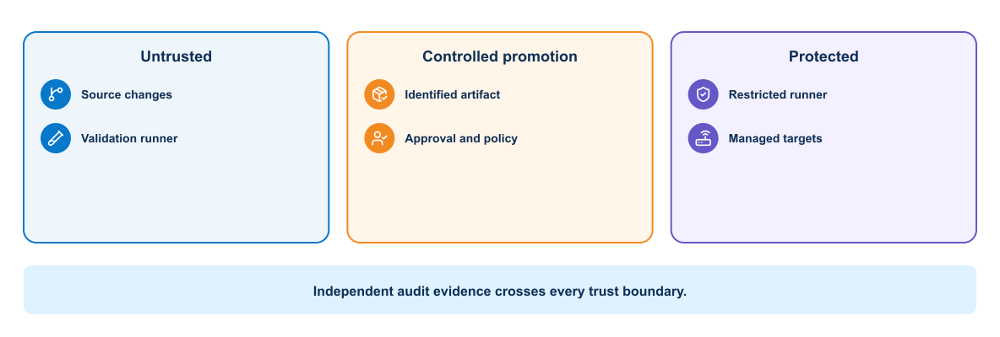
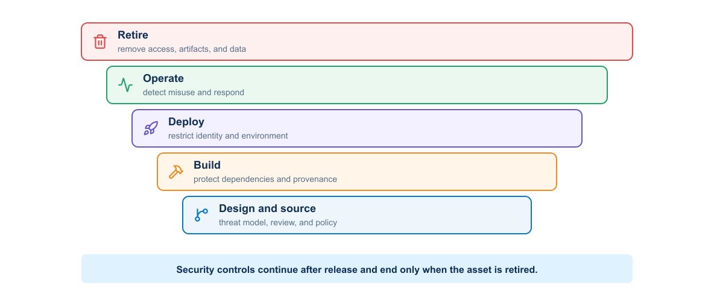
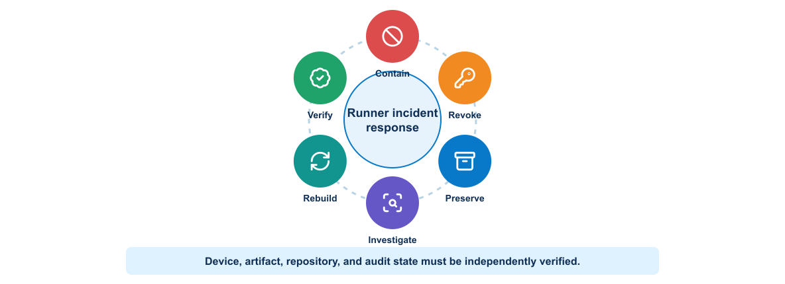
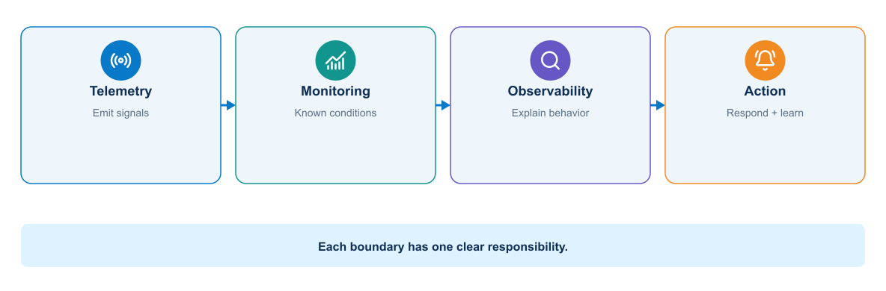
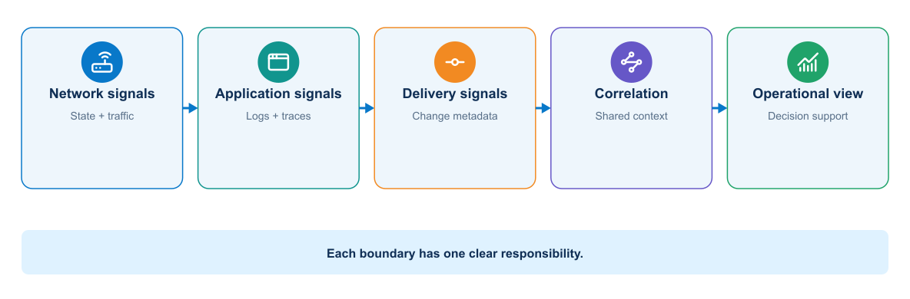
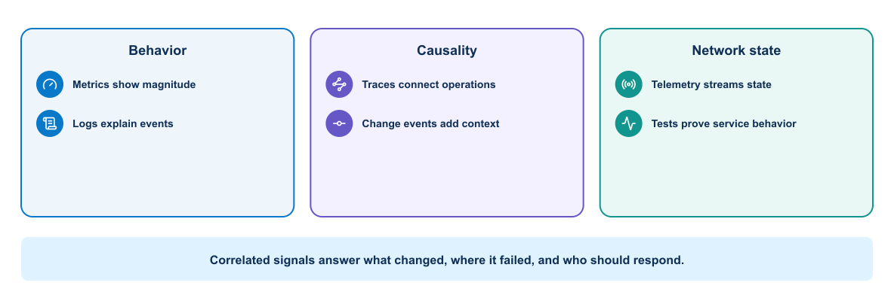
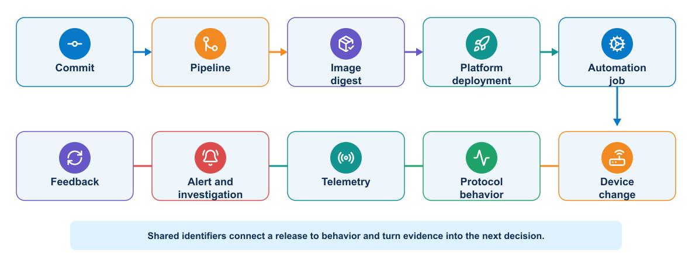
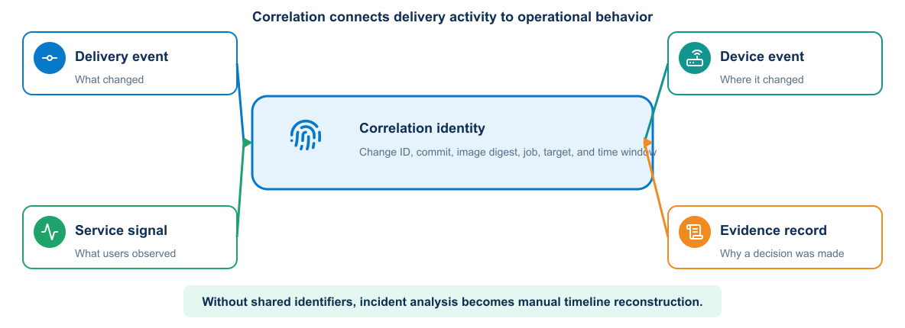

# Module 5: Security and Observability

## 1. Purpose

Module 4 produced a working delivery control system: reviewed source becomes an identified artifact, protected execution changes an environment, and validation records an immediate result. Module 5 addresses the controls that must remain effective before, during, and after that pipeline run.

A dependable delivery system must protect every trust boundary and make its behavior visible. Security limits who and what may act; observability supplies the evidence needed to understand what happened, detect unsafe behavior, evaluate service health, and improve the system. These responsibilities belong together because controls without visibility are difficult to verify, while telemetry without protection can expose sensitive data or provide misleading evidence.

Module 4 created a controlled CI/CD and deployment workflow. Module 5 secures its repositories, dependencies, artifacts, runners, credentials, management paths, application components, and infrastructure, then correlates logs, metrics, traces, events, network telemetry, and release identities into operational feedback.

The automated system creates two critical questions:

1. **Can we trust it?** Security must protect source, dependencies, artifacts, identities, runners, platforms, targets, and evidence.
2. **Can we understand what it is doing?** Observability must connect delivery activity with application behavior and network outcomes.

## 2. Security across the delivery system


### 2.1 DevOps trust boundaries

The architecture separates repository-controlled validation from privileged deployment and preserves an independent audit path.

This view extends the Module 1 delivery architecture rather than replacing it: the same validation, artifact, approval, protected execution, and evidence components are shown with their trust boundaries and permitted crossings made explicit.

<p align="center">
  
</p>

Crossing a boundary requires authenticated identity, authorized purpose, encrypted transport, input validation, controlled output, and audit evidence.

### 2.2 Security throughout delivery

Security operates across the complete delivery lifetime.

<p align="center">
  
</p>

The lifecycle controls include:

- Threat modelling identifies assets, trust boundaries, attackers, and misuse cases.
- Source controls protect branches, reviews, and repository access.
- Build controls protect dependencies, runners, and artifacts.
- Deployment controls restrict credentials and environments.
- Runtime controls limit privileges, network paths, and data access.
- Monitoring detects suspicious or unsafe behavior.
- Retirement removes credentials, artifacts, data, and infrastructure safely.

Moving a final security review earlier can find defects sooner, but early checks do not replace runtime protection and operational response.

### 2.3 Threat modelling a NetDevOps workflow

Typical network automation workflows contain several trust boundaries:

- Developer workstation to GitLab
- GitLab to runner
- Runner to registry and deployment environment
- Frontend to application
- Application to database
- Pipeline to Terraform, Ansible, Vault, Docker, and Kubernetes APIs
- Monitoring system to notification destination

For each boundary, identify authentication, authorization, encryption, input validation, logging, failure behavior, and credential scope.

#### 2.3.1 Assets and threats

Security design begins by identifying what must be protected and how it could be misused or exposed. The table connects representative delivery assets with threats and the direction of an appropriate control.

| Asset | Example threat | Control direction |
|---|---|---|
| Intended-state repository | Unauthorized VLAN, prefix, or routing-policy change | Protected branch, review, signed commits where required, policy checks |
| Pipeline definition | Job modified to extract secrets or bypass validation | Required ownership review and protected `main` |
| Runner | Host compromise or untrusted job execution | Dedicated runner, patching, isolation, restricted tags and network |
| Automation image | Dependency substitution or registry overwrite | Locked dependencies, scanning, digest pinning, signing, provenance |
| SSH key or API credential | Theft and reuse outside the pipeline | Short lifetime, scoped identity, source restrictions, rotation |
| Network management plane | Unauthorized access or lateral movement | Firewall, AAA, RBAC, protocol security, audit |
| Evidence | Exposure or alteration of configuration and topology | Encryption, access control, integrity, retention policy |

### 2.4 Secrets management

Short-lived credentials have a lifecycle tied to workload identity and job scope: establish identity, authorize a specific purpose, issue the credential, use and audit it, and then revoke or allow it to expire. A secret is sensitive information used to authenticate or protect another asset. Examples include passwords, API tokens, private keys, signing keys, and database credentials.

Good secret handling includes:

- Store secrets outside source and image layers.
- Grant access to the smallest required identity and environment.
- Prefer short-lived credentials.
- Rotate and revoke credentials.
- Record access without recording secret values.
- Prevent command traces and debug output from exposing values.
- Scan repositories and images for accidental disclosure.

Vault can issue or store training credentials, while GitLab protected variables can supply selected jobs. Kubernetes Secrets provide an API object and distribution mechanism, but their confidentiality depends on cluster encryption, RBAC, node security, and application handling.

Vault is most valuable when the workload proves its identity and receives only the material required for its current purpose. A validation job should not obtain a production device password. An infrastructure job may need a CML API token but no production route. A production deployment job may need one device credential but no authority to administer Vault.

A mature design separates secret paths and policies for source-of-truth access, test-platform lifecycle, ephemeral test devices, production devices, registry and signing operations, and audit delivery. Prefer workload identity or GitLab OIDC-to-Vault authentication over reusable bootstrap credentials. Where AppRole is necessary, limit SecretID lifetime and uses, issue a narrowly scoped token, and keep token lifetime shorter than the job. Vault audit logs record access decisions, never returned values.

#### 2.4.1 Network credential types

Automation workflows may require several forms of authentication material, each with different storage, rotation, and exposure risks. Common examples include:

- SSH private keys and known-hosts trust
- Device usernames and passwords
- TACACS+ or RADIUS-backed service identities
- NETCONF credentials
- RESTCONF basic, token, or certificate credentials
- Controller API tokens and session cookies
- Vault AppRole, OIDC, or workload identity credentials
- Registry and artifact-signing credentials

Host-key and TLS validation protect endpoint identity. A secret sent to an impostor is still compromised even when the secret itself is strong.

Prefer a dedicated automation identity with command authorization or API permissions limited to the intended configuration domain. A read-only collector should use a separate identity from the deployment worker.

### 2.5 Pipeline security


The runner trust zones introduced in Module 4 are now evaluated as security boundaries rather than repeated as pipeline mechanics.

The pipeline is a privileged software system. Threats include a malicious dependency, compromised runner, altered pipeline file, exposed variable, poisoned cache, substituted image, or unauthorized promotion.

Controls include:

- Protected branches and required review
- CODEOWNERS or designated review for pipeline and infrastructure files
- Isolated runners for trusted work
- Pinned dependencies and verified sources
- Immutable artifacts and digests
- SBOM generation and vulnerability scanning
- Artifact signing and provenance
- Protected environments and deployment approvals
- Least-privilege service identities
- Tamper-resistant audit records

Scan results need policy. The team should define which findings block a merge, which require review, and how a temporary exception expires.

#### 2.5.1 Git security

Protect the default branch, require merge requests, restrict force pushes, and require successful pipelines. Changes to `.gitlab-ci.yml`, container definitions, credential integrations, inventory, and deployment roles deserve designated reviewers.

A reviewer should inspect semantic intent, not merely approve a familiar author. A small YAML change can advertise the wrong prefix to the entire routing domain.

#### 2.5.2 Runner security

The protected runner should:

- Run only projects and branches explicitly allowed.
- Avoid shared use by untrusted workloads.
- Use ephemeral job execution where practical.
- Reach only required management endpoints and ports.
- Retrieve credentials just in time.
- Prevent jobs from reading other job workspaces or caches.
- Send audit and host logs to a separate system.
- Receive timely operating-system and runtime updates.
- Avoid exposing the Docker socket unless the architecture explicitly accepts host-level control.

Runner registration and authentication tokens are sensitive. Rotating device credentials does not repair a runner that remains compromised.

#### 2.5.3 Security tests and their boundaries

Security testing is a set of complementary controls rather than one scanner. Each control inspects a different representation of the system and therefore misses different problems.

| Control | Primary question | Useful network-automation target | Important limitation |
|---|---|---|---|
| Static application security testing | Does source contain a recognizable insecure code pattern? | Python API, worker, validation and credential-handling code | Cannot prove runtime exploitability or correct authorization design |
| Dependency scanning | Do declared third-party components match known vulnerabilities? | Python packages and Ansible collections where supported | Findings depend on accurate inventory and vulnerability data |
| Secret detection | Does repository content resemble a credential or private key? | Source, history, examples, playbooks, and pipeline files | A miss does not prove that no secret exists; a hit still requires revocation analysis |
| Container scanning | Do operating-system packages and other supported image contents contain known findings or policy violations? | Validation and deployment images | Coverage varies by scanner and image contents; it does not assess the host, runner, runtime identity, or management firewall |
| Infrastructure-as-Code scanning | Does a declarative resource violate a known security rule? | Terraform, Compose, and Kubernetes definitions | Cannot prove that deployed state matches the reviewed definition |
| Dynamic application security testing | Does a running HTTP service expose detectable behavior? | Automation API in an isolated environment | Requires a safe target and does not examine device protocols or internal code paths |
| License policy | Are component licenses compatible with distribution policy? | Packaged libraries and container contents | Legal interpretation and exceptions still require organizational review |

Run inexpensive source and dependency controls early, then apply runtime tests to an isolated deployed service. A finding must retain scanner version, rule, affected component, evidence, severity, exploit context, and artifact digest. Otherwise a later reviewer cannot determine whether a rebuilt image still contains the same problem.

Security results need a triage workflow. Confirm the component is present and reachable, determine whether the vulnerable path is used, assign an owner and deadline, and choose remediation, compensating control, or a time-limited accepted exception. Suppression without a reason and expiry date converts a visible risk into invisible debt.

> **KEY POINT**
> Passing every configured scanner does not establish that a release is secure. Scanners find selected known patterns; architecture review, least privilege, endpoint verification, runtime evidence, and incident readiness address risks outside those patterns.

### 2.6 Compromised-runner scenario

Contain access before rebuilding the execution environment. The affected period remains untrusted until job history and managed state are independently verified.

<p align="center">
  
</p>

Assume an attacker gains code execution on the protected GitLab runner. The incident review must answer:

| Question | Architectural consequence | Control |
|---|---|---|
| What credentials can it access? | Static secrets can be copied and reused | Short-lived issuance, narrow scope, no shared administrator credential, rapid revocation |
| Which devices and ports can it reach? | Broad management routing enables lateral movement | Explicit egress allowlists, management firewall, separate worker zones |
| Can it modify approved configuration? | Cached artifacts or mutable tags may bypass review | Bind approval to commit, target, diff hash, and signed image digest |
| Can it falsify evidence? | Local logs cannot be trusted after host compromise | Stream AAA, runner, pipeline, and device evidence to an independent protected sink |
| Can it sign an image? | Online signing keys can legitimize malicious artifacts | Keyless/OIDC signing or isolated signer with policy and transparency evidence |
| Can it pivot into the management network? | A runner becomes a general-purpose foothold | No interactive user path, network segmentation, device command authorization, monitoring |

Containment disables the runner, blocks new jobs, removes its network route, revokes runner registration and every reachable credential, and preserves forensic evidence. Recovery rebuilds from a trusted source, issues new identities, verifies device and repository state, and restores service under explicit approval.

No pipeline setting makes a privileged runner harmless. Architecture must assume that a boundary can fail.

### 2.7 Secure protocol use

Encryption alone does not make an automation channel trustworthy. Client configuration must also authenticate the endpoint, constrain credentials, handle errors safely, and preserve enough evidence for investigation.

#### 2.7.1 SSH

Use modern algorithms supported by organizational policy, validate host keys, restrict service-account commands, and protect private keys. Do not automatically trust a new key during a deployment job.

#### 2.7.2 NETCONF

NETCONF over SSH inherits SSH authentication and host identity requirements. Validate capabilities and RPC errors. Limit the account to required datastores or configuration domains where the platform supports it.

#### 2.7.3 RESTCONF and controller APIs

Validate TLS certificates and hostnames. Limit tokens by scope and lifetime. Do not place tokens in URLs. Handle redirect, proxy, and debug logging behavior carefully. Rate-limit clients and distinguish authorization failure from a transient platform error.

### 2.8 Application security

The application should validate untrusted input, encode output for its context, use parameterized database operations, enforce authorization on the server, and protect sessions or tokens.

TLS protects data in transit when certificate identity and trust are validated. Disabling certificate verification may simplify a lab test but destroys authentication of the endpoint. Training environments should establish a safe trust path rather than normalize insecure flags.

Logs and error responses should provide enough context for support without exposing internal secrets or sensitive data.

### 2.9 Container and orchestrator security

Module 3 established the mechanics of building and running container images. This section revisits those mechanics as security boundaries: which source and base image can be trusted, what the workload may do at runtime, which identities it receives, and which systems it may reach.

The Kubernetes worker model from Module 3 is now evaluated through workload identity, RBAC, secret access, and restricted egress. These controls secure the platform; they do not merge the platform-release and network-change approval paths established in Module 4.

Container controls include trusted base images, non-root execution, removed capabilities, read-only filesystems, controlled mounts, resource limits, and restricted network access.

Kubernetes adds RBAC, service accounts, namespaces, network policy, security context, admission policy, secret handling, audit, and node security. A namespace is an organizational and policy boundary, but it is not a complete hostile-tenant isolation mechanism by itself.

The Kubernetes deployment worker should use a service account with only the required secret reference and job permissions. NetworkPolicy should permit the worker to reach approved management endpoints while blocking the API and dashboard services from direct device access.

### 2.10 Advanced architecture reference


Sections 2.10–2.16 are optional architecture reference material. They may be skipped during the main classroom path, which continues at Section 3 with observability.

#### 2.10.1 Modern application architecture

A modern application often separates user interface, APIs, background processing, data services, and platform integrations. It may use containers and managed services, but the architecture should follow requirements rather than fashion.

Important qualities include:

- Clear component responsibilities
- Explicit API and data contracts
- Replaceable runtime instances
- External configuration
- Automated deployment and recovery
- Operational instrumentation
- Security boundaries
- Tolerance of expected dependency failure

The twelve-factor application principles provide useful guidance for configuration, backing services, build and run separation, disposable processes, environment parity, logs, and administrative tasks. Teams should apply the principles according to the system's actual needs.

#### 2.10.2 Microservices

Microservices divide a system into independently deployable services aligned with bounded responsibilities. Potential benefits include independent release, targeted scaling, fault isolation, and team ownership.

Costs include distributed transactions, network failure, version compatibility, more deployment units, more telemetry, duplicated platform work, and harder local testing. A modular monolith may offer a better starting point when independent scale or release is not required.

Service boundaries should follow ownership and data behavior. Splitting code into containers without independent responsibility creates a distributed monolith.

#### 2.10.3 Synchronous and asynchronous interaction

Synchronous APIs provide immediate responses but couple availability and latency between services. Asynchronous messaging can absorb bursts and reduce temporal coupling, but it introduces eventual consistency, duplicate delivery, ordering questions, and message lifecycle management.

Consumers should handle duplicate messages safely. Producers and consumers need compatible schema evolution. Operational evidence should expose queue delay and failed-message behavior.

#### 2.10.4 Public, private, and hybrid deployments

A private environment can provide direct control, locality, and integration with existing systems. Public cloud can provide rapid provisioning, managed services, geographic options, and consumption-based scaling. Neither model is inherently safer or cheaper in every case.

A mixed deployment may be described as hybrid or multicloud depending on whether it combines private and public environments or uses services from multiple public providers. The design should state the actual placement and dependency model rather than rely on the label.

#### 2.10.5 Multicloud design considerations

Evaluate:

- Application and data portability
- Identity federation and authorization
- Network connectivity, latency, and failure domains
- Data residency and regulatory obligations
- Key and secret management
- Logging and operational visibility
- Service differences and provider-specific APIs
- Cost, quotas, and egress charges
- Backup, recovery, and exit strategy
- Team skills and operating complexity

Using only common-denominator services can reduce provider dependence but may sacrifice valuable managed capabilities. An abstraction layer also becomes software that the team must own.

#### 2.10.6 Network platform role

Networking, security, observability, and controller platforms can connect application and infrastructure domains. APIs and policy systems can participate in controlled workflows, while telemetry can supply network context for application behavior.

Automation must respect controller ownership and transactional behavior. Direct device changes that bypass the system of record can create conflict and drift.

#### 2.10.7 Architecture decision records

An architecture decision record captures the decision, context, considered options, consequences, and status. Useful project decisions include:

- Why the lab uses one evolving repository for reusable learning artifacts
- Why the application begins with Compose and later uses Kubernetes
- Which tool owns infrastructure and which owns configuration
- How secrets reach pipeline jobs
- Which artifact identity is promoted
- Which telemetry signals control rollback or alerting

Recording decisions prevents future maintainers from treating deliberate constraints as accidental choices.

##### 2.10.7.1 Practical control chain for a protected deployment

A merge request that changes `.gitlab-ci.yml`, deployment policy, or secret-retrieval code requires review from the platform or security owner. After merge, an unprivileged runner builds and scans the image without a route to managed infrastructure. A protected job exchanges its workload identity for a short-lived credential, verifies the approved image digest, runs on a restricted runner, and loses the credential when the job ends. Repository approval, artifact signature, workload identity, network segmentation, and audit logging protect different boundaries; none is a substitute for the others.

This design also narrows incident response. If the general runner is compromised, revoke its registry and source access without rotating every device credential. If the protected runner is compromised, stop deployment jobs, revoke the workload identity, preserve runner and secret-service audit logs, and treat any job executed during the exposure window as untrusted.

## 3. Observability and stability engineering


### 3.1 Monitoring, observability, and telemetry

Telemetry supplies data; monitoring evaluates known conditions; observability combines signals and context to explain unfamiliar behavior.

<p align="center">
  
</p>

| Term | Meaning | Network example |
|---|---|---|
| Monitoring | Evaluate known conditions against expected behavior | Alert when a required OSPF neighbor is not `FULL` for five minutes |
| Observability | Ability to explain internal behavior from available outputs | Correlate a route loss with interface errors, a config change, and OSPF events |
| Telemetry | Data emitted or collected from systems | Interface counters, YANG-modeled streams, syslog, traces, and job metrics |

Telemetry is the data. Monitoring evaluates selected signals. Observability is a property of the complete system, including instrumentation, context, retention, and investigation workflows.

### 3.2 Feedback architecture requirements

Device signals, application signals, and deployment events need a common correlation path. This expands the feedback path in the Module 1 delivery architecture rather than creating a separate monitoring destination.

<p align="center">
  
</p>

Shared identifiers and timestamps allow several storage systems to present one operational narrative.

Every record should carry enough dimensions to identify environment, site, device, interface or protocol instance, collection method, and time. Change and pipeline identifiers connect delivery events to operational effects.

### 3.3 Monitoring and observability

Monitoring evaluates known conditions. It asks questions such as whether an endpoint is reachable, error rate exceeds a threshold, or disk space is low.

Observability describes how well a team can understand internal behavior from system outputs. It supports investigation of conditions that the team did not predict in advance.

The two reinforce each other. Monitoring detects important known failures. Rich, connected telemetry helps explain them.

### 3.4 Operational signals

Observability draws on several complementary forms of evidence. Metrics reveal patterns, logs preserve discrete events, traces connect work across components, and external checks confirm the service outcome visible to a consumer.

<p align="center">
  
</p>

#### 3.4.1 Metrics

Metrics are numeric measurements associated with time and labels. They support aggregation, comparison, trends, dashboards, and alerts. Common application signals include request rate, error rate, latency, queue depth, resource use, and dependency behavior.

Labels must remain controlled. User identifiers, request identifiers, or arbitrary URLs can create excessive cardinality and storage cost.

#### 3.4.2 Logs

Logs record discrete events. Structured logs make fields searchable and reduce parsing ambiguity. A useful application event may contain timestamp, severity, service, version, environment, event name, and correlation identifier.

Logs should provide diagnostic context without exposing credentials, session tokens, personal information, or sensitive payloads.

#### 3.4.3 Traces

Distributed traces follow a request across service boundaries. Spans describe work performed by each component and show timing, errors, and relationships. Trace and correlation identifiers can connect traces with logs.

#### 3.4.4 Events and changes

Deployment, configuration, scaling, and infrastructure events add essential context. A dashboard should make it possible to compare a behavior change with a deployment or platform event.

### 3.5 Network data collection methods


No collection method supplies every signal. The following sections distinguish event streams, counters, polled state, modeled subscriptions, and application instrumentation so that each is used for evidence it can actually provide.

#### 3.5.1 Syslog

Syslog provides event-oriented messages from network devices. It is valuable for interface transitions, routing changes, authentication events, configuration actions, and system faults. Configure accurate time, consistent severity policy, protected transport where supported, and centralized retention.

Text varies by platform and release. Parse important messages into structured fields while preserving the original record. Do not treat absence of a syslog message as proof that a condition did not occur.

#### 3.5.2 SNMP

SNMP remains useful for widely supported counters and status. Prefer SNMPv3 with authentication and privacy when available. Counter semantics, polling interval, rollover, discontinuity, and interface identity affect interpretation.

Polling every interface at a very short interval can load devices and collectors. Select intervals based on the operational question.

#### 3.5.3 REST API and CLI polling

Controller APIs, RESTCONF, NETCONF, and structured CLI collection can answer targeted questions. Polling offers explicit control but consumes management-plane capacity and produces snapshots. Apply timeouts, rate limits, and caching where appropriate.

#### 3.5.4 Model-driven telemetry

Model-driven telemetry streams YANG-addressed data using a supported transport and encoding. Dial-out has the device initiate a subscription toward a collector. Dial-in has the collector establish and manage the subscription.

Before deployment, confirm the network operating-system release, model path, subscription mode, encoding, transport, update policy, and receiver compatibility. A syntactically valid sensor path can still produce no data if the platform does not support it operationally.

#### 3.5.5 OpenTelemetry

OpenTelemetry provides common APIs, SDKs, semantic conventions, and collector components for application metrics, logs, and traces. It is particularly useful for the automation API and workers. Device telemetry does not automatically become OpenTelemetry data; a collector or translation layer may normalize network observations into the chosen model.

Use a trace to follow a job from API request to queue, worker, credential lookup, device RPC, validation, and evidence write. Do not include secret values or full configurations in span attributes.

### 3.6 Health checks

Health checks serve different consumers:

- Liveness tells the platform whether the process is stuck and should restart.
- Readiness tells the load balancer whether the instance can receive traffic.
- Startup health gives a slow application time to initialize before ongoing checks begin.
- Synthetic health exercises a user-visible behavior from outside the service.

Checks should be fast, deterministic, and inexpensive. A check that always returns success protects nothing. A check that depends on every external system may create false restarts.

### 3.7 Service objectives

A service-level indicator measures behavior that matters to consumers, such as successful request ratio or response latency. A service-level objective defines the desired target over a period.

Error budget is the allowed amount of unreliability within the objective. It provides a way to balance feature delivery and reliability work. When the service consumes the budget too quickly, the team may slow releases and address stability.

An internal component metric can help diagnosis but does not automatically represent user experience.

### 3.8 Metrics collection architecture

A metrics system usually contains:

- Instrumented application or exporter
- Collection agent or scraper
- Time-series storage
- Query and visualization layer
- Alert evaluation and notification path

The scenario environment exports automation-service metrics and collects selected device or simulated data. Useful measures include:

| Domain | Metrics |
|---|---|
| Interfaces | Utilization, errors, discards, drops, status transitions |
| Routing | OSPF/BGP neighbor state, route count, convergence time, flap count |
| Device resources | CPU, memory, environmental state, process health |
| Service path | Latency, packet loss, reachability, DNS or application probe result |
| Device API | Connection time, RPC duration, HTTP status, timeout and rate-limit count |
| Automation | Queue depth, job duration, success rate, retry count, devices changed |
| Delivery | Pipeline duration, gate failures, rollback rate, evidence completeness |

### 3.9 Log collection architecture

Application and platform logs flow through a collector or agent into searchable storage and a visualization interface. Traditional ELK terminology refers to Elasticsearch, Logstash, and Kibana, although modern deployments may use other shippers and compatible storage components.

The architecture must account for parsing, buffering, backpressure, retention, access control, time synchronization, and index or field design.

If the logging platform fails, the application should avoid blocking indefinitely. It may buffer a controlled amount, degrade logging, or use local output collected by the platform.

### 3.10 Dashboards

A dashboard should answer an operational question. A service overview might show traffic, failures, latency, saturation, dependency health, and recent deployments.

Avoid displaying many unrelated metrics without context. Provide units, useful time ranges, thresholds, environment and version filters, and links to relevant logs or traces.

Different audiences need different views. A service owner needs diagnostic detail, while a course demonstration dashboard should clearly show the effect of a deployment or failure.

#### 3.10.1 Network change dashboard scenario

For a routing-service example, a dashboard can display:

- Current service-interface state and most recent transition
- Required OSPF neighbor state and flap history
- Presence and next hop of the expected lab prefix at the test peer
- Reachability loss, latency, and packet loss
- Device CPU and memory during the change window
- Interface errors and drops on the path
- Automation job duration and result
- Git commit, pipeline, change ID, image digest, and deployment timestamp
- Relevant syslog events and links to protected evidence

The dashboard should distinguish `no data` from zero and identify whether a signal comes from a real device, simulator, or mock.

### 3.11 Alert design

An alert should indicate a condition that requires timely action. It needs:

- A meaningful signal connected to impact or impending impact
- A threshold and duration that limit transient noise
- Clear environment and service identity
- Severity and ownership
- A concise description
- A runbook or first diagnostic steps
- Notification routing and escalation

Alerting on symptoms such as sustained user-facing failures is often more actionable than alerting on every low-level fluctuation.

Example routing alert:

```text
Condition: required routing neighbor for distribution-01 is not healthy for 5 minutes
AND service reachability probe fails
Severity: high
Context: device, neighbor, last known state, change ID, latest deployment
Owner: network operations
Runbook: verify management reachability, link state, MTU, authentication, logs, and recent diff
```

Combining state and impact can reduce noise, but the team may still retain a lower-severity event for a neighbor transition that recovers quickly.

### 3.12 Webhook notifications

Alert systems can notify a webhook listener, collaboration platform, or incident-management system. Protect the destination token, validate TLS, restrict message content, and handle delivery failure.

A notification should include what failed, where, when, current value, relevant threshold, and a link to evidence. It should not include secrets or a full sensitive log record.

### 3.13 Application instrumentation

Instrumentation should begin with a small, stable set of signals:

- Request count by route class, method, and result class
- Request duration distribution
- In-progress work
- Dependency failures and latency
- Build version and environment information

Business or workflow metrics can show whether the service produces its intended outcome. Their meaning and privacy requirements must be documented.

For the automation platform, instrument request and job count, queue delay, device connection duration, RPC or command duration, validation failure category, configuration lines changed, rollback outcome, and evidence-write result. Never use a device password, token, full command output, or unbounded job identifier as a metric label.

### 3.14 Change-aware observability and correlation


An investigation follows commit SHA → pipeline ID → image digest → deployment event → automation job → change ID → target device → protocol or forwarding behavior → telemetry → alert → investigation → feedback. Correlation narrows the search; it does not by itself prove causality. The objective is not merely to detect that a routing neighbor or application process is unhealthy. It is to determine whether behavior changed during or after a particular software release or approved network operation, and to assemble enough evidence to evaluate that relationship.

<p align="center">
  
</p>

<p align="center">
  
</p>

Correlation turns separate data into a delivery feedback loop:

For example, a commit starts a pipeline with a recorded automation image digest and change identifier. The deployment timestamp, worker activity, device event, and acceptance result form one ordered timeline. The exact network signals depend on the operation being delivered.

The pipeline emits a change event before and after deployment. Dashboards annotate the event, and evidence records the telemetry window. This supports both successful convergence analysis and failure investigation.

A useful correlation view should let an engineer answer, without manually joining several systems:

- What changed, who approved it, and which exact commit and image executed?
- Which devices, interfaces, routing processes, tenants, or controller objects were touched?
- Did the routing protocol converge within the expected window?
- Did route selection or the forwarding path change beyond the approved scope?
- Did packet loss, latency, drops, or errors increase?
- Which pipeline introduced the change, and did later jobs touch the same domain?
- Was the automation platform healthy, or did queue delay, worker failure, clock skew, or missing telemetry distort the result?

Join records with shared identifiers: `commit`, `pipeline`, `digest`, `change_id`, `target`, `environment`, and `timestamp`. These values belong in event, log, trace, and evidence records; only bounded dimensions should become metric labels. Credentials, full command output, and unbounded request strings are never metric labels.

#### 3.14.1 Pipeline audit events

Console logs help diagnosis but are weak as the only audit record. They are formatted for humans, vary by tool, may be truncated, and often require broad CI-platform access. A structured audit event should be sent at job start and completion and at each privileged or decision-bearing task.

| Context | Useful audit fields |
|---|---|
| Source | Project, ref, commit, pipeline source, intent identifier and fingerprint |
| Actor | Trigger identity, job identity, runner identity and production approver |
| Execution | Pipeline, job, stage, action, timestamps, duration and exit status |
| Artifact | Image, immutable digest, provenance reference and plan fingerprint |
| Environment | Test or production, resource owner, environment identifier and cleanup status |
| Target | Device identity, endpoint, interface, requested prefix and authorized scope |
| Result | Changed status, assertion, observed state, outcome and sanitized error category |

Audit every material transition: intent resolution, policy decision, resource plan, resource creation, endpoint readiness, configuration task, validation assertion, environment deletion, approval, production change, and final verification. A shared schema allows one timeline to join Terraform, Ansible, pyATS, GitLab, Vault, NetBox, Kubernetes, and application events.

More detail does not justify secret collection. Never forward tokens, passwords, authorization headers, private keys, Vault responses, complete configurations, unrestricted environment dumps, or raw command output without classification and filtering. The audit path should fail visibly; loss of required evidence can be a release-blocking condition for privileged work.

#### 3.14.2 Practical incident trace

At 10:04 a deployment finishes, at 10:05 queue delay rises, and at 10:06 the first job times out. CPU and memory are normal. A structured worker log shows `dependency=job-db`, `error=connection_pool_exhausted`, together with the image digest and pipeline ID. The team can now separate an application-release problem from device reachability. The alert should point to the correlated timeline and runbook; it should not page merely because one request was slow.

```json
{"timestamp":"2026-09-11T10:06:14Z","service":"worker","release":"sha256:7ab...","pipeline_id":"1842","change_id":"CHG-2026-0042","dependency":"job-db","outcome":"timeout","duration_ms":5000}
```

The same values do not all belong in metric labels. `service`, `outcome`, and a bounded dependency name are useful dimensions. A unique change identifier belongs in logs or traces, because using it as a time-series label creates unbounded cardinality.

### 3.15 Telemetry quality

Operational data can be missing, delayed, duplicated, mislabelled, or out of order. Collection success does not guarantee correct interpretation.

Time synchronization matters across application hosts, containers, network devices, and pipeline systems. Retention and sampling policies should preserve enough evidence for expected investigations.

### 3.16 Stability engineering

Reliability improves when the design anticipates failure:

- Timeouts prevent indefinite waits.
- Retries address selected transient faults.
- Circuit breakers limit repeated calls to a failing dependency.
- Bulkheads isolate resource pools.
- Backpressure prevents uncontrolled queues.
- Rate limits protect shared capacity.
- Graceful degradation preserves essential behavior.

Every mechanism has tradeoffs. Retries increase load. Circuit breakers can reject work after a dependency recovers until their state changes. Operational signals must show what the mechanism is doing.

### 3.17 Chaos engineering

Chaos engineering uses controlled experiments to test a specific resilience hypothesis. It is not random destruction.

A responsible experiment defines:

1. Expected steady behavior.
2. A limited failure condition.
3. Scope and safety boundaries.
4. Abort conditions.
5. Observations and success criteria.
6. Recovery and cleanup.

In a training environment, deleting one disposable application instance or temporarily blocking one dependency can demonstrate self-healing or alert behavior. The experiment must stay within the assigned environment.

## 4. Knowledge check

### 4.1 Security across the delivery system

Use these questions to test whether you can apply least privilege, secret protection, trust verification, and architectural isolation to a delivery workflow.

1. Why does masking a pipeline variable not provide complete secret protection?
2. Which repository changes deserve stricter ownership or review?
3. What costs accompany a microservices architecture?
4. Which factors influence workload placement across private and public environments?
5. Why should the team document tool ownership of infrastructure settings?
6. Why do SAST, dependency scanning, container scanning, and DAST provide different evidence?
7. Which information must accompany a temporary vulnerability exception?

### 4.2 Observability and stability engineering

Use these questions to verify that you can turn operational signals into service understanding and actionable delivery feedback.

1. How does observability differ from monitoring?
2. Why should request identifiers not become unrestricted metric labels?
3. What is the difference between liveness and readiness?
4. Which information makes an alert actionable?
5. What separates a chaos experiment from uncontrolled failure injection?

## 5. Summary

Security and observability form the operating control plane of DevOps. Vault policies separate source-of-truth, test-platform, test-device, production, registry, and audit privileges. Protected source, identified artifacts, isolated runners, short-lived credentials, restricted paths, runtime hardening, and independent audit reduce misuse. Structured events join NetBox intent, GitLab execution, Terraform resources, Ansible tasks, validation, approval, production outcome, and cleanup into one defensible timeline. Together they return trustworthy operational evidence to the next controlled decision.

**What the learner now has:** a production-style delivery system with protected trust boundaries and change-aware operational evidence.

**What is still missing:** nothing in the course control chain; further work is environment-specific hardening, scale, and operational maturity.

**What the next module adds:** there is no further theory module; the final capstone uses trustworthy release and network-change feedback to drive the next controlled improvement.
