# Module 8: Monitoring DevOps and Engineering Visibility and Stability

## 1. Purpose

A pipeline can prove that a deployment passed immediate checks, but the team also needs evidence about the application and its supporting infrastructure over time. This module covers metrics, logs, traces, telemetry, dashboards, alerting, application instrumentation, health monitoring, stability engineering, and controlled chaos experiments. Network signals appear where they help evaluate the supplied application's output; they are not the primary monitoring subject.

Modules 5–7 created a traceable release, validated it, and deployed it into controlled infrastructure. Module 8 closes the operational feedback loop by correlating application, platform, pipeline, and network signals. Module 9 will use those same identities, boundaries, and records to protect the workflow and investigate misuse.

## 2. Monitoring, observability, and telemetry

Telemetry supplies data; monitoring evaluates known conditions; observability combines signals and context to explain unfamiliar behavior.

<p align="center">
  
</p>

| Term | Meaning | Network example |
|---|---|---|
| Monitoring | Evaluate known conditions against expected behavior | Alert when a required OSPF neighbor is not `FULL` for five minutes |
| Observability | Ability to explain internal behavior from available outputs | Correlate a route loss with interface errors, a config change, and OSPF events |
| Telemetry | Data emitted or collected from systems | Interface counters, YANG-modeled streams, syslog, traces, and job metrics |

Telemetry is the data. Monitoring evaluates selected signals. Observability is a property of the complete system, including instrumentation, context, retention, and investigation workflows.

## 3. Feedback architecture requirements

Device signals, application signals, and deployment events need a common correlation path. This expands the feedback path in the Module 1 reference architecture rather than creating a separate monitoring destination.

<p align="center">
  
</p>

Shared identifiers and timestamps allow several storage systems to present one operational narrative.

Every record should carry enough dimensions to identify environment, site, device, interface or protocol instance, collection method, and time. Change and pipeline identifiers connect delivery events to operational effects.

## 4. Monitoring and observability

Monitoring evaluates known conditions. It asks questions such as whether an endpoint is reachable, error rate exceeds a threshold, or disk space is low.

Observability describes how well a team can understand internal behavior from system outputs. It supports investigation of conditions that the team did not predict in advance.

The two reinforce each other. Monitoring detects important known failures. Rich, connected telemetry helps explain them.

## 5. Operational signals

Observability draws on several complementary forms of evidence. Metrics reveal patterns, logs preserve discrete events, traces connect work across components, and external checks confirm the service outcome visible to a consumer.

### 5.1 Metrics

Metrics are numeric measurements associated with time and labels. They support aggregation, comparison, trends, dashboards, and alerts. Common application signals include request rate, error rate, latency, queue depth, resource use, and dependency behavior.

Labels must remain controlled. User identifiers, request identifiers, or arbitrary URLs can create excessive cardinality and storage cost.

### 5.2 Logs

Logs record discrete events. Structured logs make fields searchable and reduce parsing ambiguity. A useful application event may contain timestamp, severity, service, version, environment, event name, and correlation identifier.

Logs should provide diagnostic context without exposing credentials, session tokens, personal information, or sensitive payloads.

### 5.3 Traces

Distributed traces follow a request across service boundaries. Spans describe work performed by each component and show timing, errors, and relationships. Trace and correlation identifiers can connect traces with logs.

### 5.4 Events and changes

Deployment, configuration, scaling, and infrastructure events add essential context. A dashboard should make it possible to compare a behavior change with a deployment or platform event.

## 6. Network data collection methods

No collection method supplies every signal. The following sections distinguish event streams, counters, polled state, modeled subscriptions, and application instrumentation so that each is used for evidence it can actually provide.

### 6.1 Syslog

Syslog provides event-oriented messages from network devices. It is valuable for interface transitions, routing changes, authentication events, configuration actions, and system faults. Configure accurate time, consistent severity policy, protected transport where supported, and centralized retention.

Text varies by platform and release. Parse important messages into structured fields while preserving the original record. Do not treat absence of a syslog message as proof that a condition did not occur.

### 6.2 SNMP

SNMP remains useful for widely supported counters and status. Prefer SNMPv3 with authentication and privacy when available. Counter semantics, polling interval, rollover, discontinuity, and interface identity affect interpretation.

Polling every interface at a very short interval can load devices and collectors. Select intervals based on the operational question.

### 6.3 REST API and CLI polling

Controller APIs, RESTCONF, NETCONF, and structured CLI collection can answer targeted questions. Polling offers explicit control but consumes management-plane capacity and produces snapshots. Apply timeouts, rate limits, and caching where appropriate.

### 6.4 Model-driven telemetry

Model-driven telemetry streams YANG-addressed data using a supported transport and encoding. Dial-out has the device initiate a subscription toward a collector. Dial-in has the collector establish and manage the subscription.

Before deployment, confirm the network operating-system release, model path, subscription mode, encoding, transport, update policy, and receiver compatibility. A syntactically valid sensor path can still produce no data if the platform does not support it operationally.

### 6.5 OpenTelemetry

OpenTelemetry provides common APIs, SDKs, semantic conventions, and collector components for application metrics, logs, and traces. It is particularly useful for the automation API and workers. Device telemetry does not automatically become OpenTelemetry data; a collector or translation layer may normalize network observations into the chosen model.

Use a trace to follow a job from API request to queue, worker, credential lookup, device RPC, validation, and evidence write. Do not include secret values or full configurations in span attributes.

## 7. Health checks

Health checks serve different consumers:

- Liveness tells the platform whether the process is stuck and should restart.
- Readiness tells the load balancer whether the instance can receive traffic.
- Startup health gives a slow application time to initialize before ongoing checks begin.
- Synthetic health exercises a user-visible behavior from outside the service.

Checks should be fast, deterministic, and inexpensive. A check that always returns success protects nothing. A check that depends on every external system may create false restarts.

## 8. Service objectives

A service-level indicator measures behavior that matters to consumers, such as successful request ratio or response latency. A service-level objective defines the desired target over a period.

Error budget is the allowed amount of unreliability within the objective. It provides a way to balance feature delivery and reliability work. When the service consumes the budget too quickly, the team may slow releases and address stability.

An internal component metric can help diagnosis but does not automatically represent user experience.

## 9. Metrics collection architecture

A metrics system usually contains:

- Instrumented application or exporter
- Collection agent or scraper
- Time-series storage
- Query and visualization layer
- Alert evaluation and notification path

The scenario environment exports automation-service metrics and collects selected device or simulated data. Useful measures include:

| Domain | Metrics |
|---|---|
| Interfaces | Utilization, errors, discards, drops, status transitions |
| Routing | OSPF/BGP neighbor state, route count, convergence time, flap count |
| Device resources | CPU, memory, environmental state, process health |
| Service path | Latency, packet loss, reachability, DNS or application probe result |
| Device API | Connection time, RPC duration, HTTP status, timeout and rate-limit count |
| Automation | Queue depth, job duration, success rate, retry count, devices changed |
| Delivery | Pipeline duration, gate failures, rollback rate, evidence completeness |

## 10. Log collection architecture

Application and platform logs flow through a collector or agent into searchable storage and a visualization interface. Traditional ELK terminology refers to Elasticsearch, Logstash, and Kibana, although modern deployments may use other shippers and compatible storage components.

The architecture must account for parsing, buffering, backpressure, retention, access control, time synchronization, and index or field design.

If the logging platform fails, the application should avoid blocking indefinitely. It may buffer a controlled amount, degrade logging, or use local output collected by the platform.

## 11. Dashboards

A dashboard should answer an operational question. A service overview might show traffic, failures, latency, saturation, dependency health, and recent deployments.

Avoid displaying many unrelated metrics without context. Provide units, useful time ranges, thresholds, environment and version filters, and links to relevant logs or traces.

Different audiences need different views. A service owner needs diagnostic detail, while a course demonstration dashboard should clearly show the effect of a deployment or failure.

### 11.1 Network change dashboard scenario

For a routing-service example, a dashboard can display:

- Current service-interface state and most recent transition
- Required OSPF neighbor state and flap history
- Presence and next hop of the expected lab prefix at the test peer
- Reachability loss, latency, and packet loss
- Device CPU and memory during the change window
- Interface errors and drops on the path
- Automation job duration and result
- Git commit, pipeline, change ID, image digest, and deployment timestamp
- Relevant syslog events and links to protected evidence

The dashboard should distinguish `no data` from zero and identify whether a signal comes from a real device, simulator, or mock.

## 12. Alert design

An alert should indicate a condition that requires timely action. It needs:

- A meaningful signal connected to impact or impending impact
- A threshold and duration that limit transient noise
- Clear environment and service identity
- Severity and ownership
- A concise description
- A runbook or first diagnostic steps
- Notification routing and escalation

Alerting on symptoms such as sustained user-facing failures is often more actionable than alerting on every low-level fluctuation.

Example routing alert:

```text
Condition: required routing neighbor for distribution-01 is not healthy for 5 minutes
AND service reachability probe fails
Severity: high
Context: device, neighbor, last known state, change ID, latest deployment
Owner: network operations
Runbook: verify management reachability, link state, MTU, authentication, logs, and recent diff
```

Combining state and impact can reduce noise, but the team may still retain a lower-severity event for a neighbor transition that recovers quickly.

## 13. Webhook notifications

Alert systems can notify a webhook listener, collaboration platform, or incident-management system. Protect the destination token, validate TLS, restrict message content, and handle delivery failure.

A notification should include what failed, where, when, current value, relevant threshold, and a link to evidence. It should not include secrets or a full sensitive log record.

## 14. Application instrumentation

Instrumentation should begin with a small, stable set of signals:

- Request count by route class, method, and result class
- Request duration distribution
- In-progress work
- Dependency failures and latency
- Build version and environment information

Business or workflow metrics can show whether the service produces its intended outcome. Their meaning and privacy requirements must be documented.

For the automation platform, instrument request and job count, queue delay, device connection duration, RPC or command duration, validation failure category, configuration lines changed, rollback outcome, and evidence-write result. Never use a device password, token, full command output, or unbounded job identifier as a metric label.

## 15. Change correlation

An investigation follows the release through device events and telemetry using shared identifiers. Correlation narrows the search; it does not by itself prove causality.

Correlation turns separate data into a delivery feedback loop:

For example, a commit starts a pipeline with a recorded automation image digest and change identifier. The deployment timestamp, worker activity, device event, and acceptance result form one ordered timeline. The exact network signals depend on the operation being delivered.

The pipeline emits a change event before and after deployment. Dashboards annotate the event, and evidence records the telemetry window. This supports both successful convergence analysis and failure investigation.

A useful correlation view should let an engineer answer, without manually joining several systems:

- What changed, who approved it, and which exact commit and image executed?
- Which devices, interfaces, routing processes, tenants, or controller objects were touched?
- Did the routing protocol converge within the expected window?
- Did route selection or the forwarding path change beyond the approved scope?
- Did packet loss, latency, drops, or errors increase?
- Which pipeline introduced the change, and did later jobs touch the same domain?
- Was the automation platform healthy, or did queue delay, worker failure, clock skew, or missing telemetry distort the result?

Join records with stable identifiers and bounded-cardinality labels. Commit SHA, pipeline ID, change ID, device identity, interface, and routing process are useful correlation fields; credentials, full command output, and unbounded request strings are not metric labels.

### 15.1 Practical incident trace

At 10:04 a deployment finishes, at 10:05 queue delay rises, and at 10:06 the first job times out. CPU and memory are normal. A structured worker log shows `dependency=job-db`, `error=connection_pool_exhausted`, together with the image digest and pipeline ID. The team can now separate an application-release problem from device reachability. The alert should point to the correlated timeline and runbook; it should not page merely because one request was slow.

```json
{"timestamp":"2026-09-11T10:06:14Z","service":"worker","release":"sha256:7ab...","pipeline_id":"1842","change_id":"CHG-2026-0042","dependency":"job-db","outcome":"timeout","duration_ms":5000}
```

The same values do not all belong in metric labels. `service`, `outcome`, and a bounded dependency name are useful dimensions. A unique change identifier belongs in logs or traces, because using it as a time-series label creates unbounded cardinality.

## 16. Telemetry quality

Operational data can be missing, delayed, duplicated, mislabelled, or out of order. Collection success does not guarantee correct interpretation.

Time synchronization matters across application hosts, containers, network devices, and pipeline systems. Retention and sampling policies should preserve enough evidence for expected investigations.

## 17. Stability engineering

Reliability improves when the design anticipates failure:

- Timeouts prevent indefinite waits.
- Retries address selected transient faults.
- Circuit breakers limit repeated calls to a failing dependency.
- Bulkheads isolate resource pools.
- Backpressure prevents uncontrolled queues.
- Rate limits protect shared capacity.
- Graceful degradation preserves essential behavior.

Every mechanism has tradeoffs. Retries increase load. Circuit breakers can reject work after a dependency recovers until their state changes. Operational signals must show what the mechanism is doing.

## 18. Chaos engineering

Chaos engineering uses controlled experiments to test a specific resilience hypothesis. It is not random destruction.

A responsible experiment defines:

1. Expected steady behavior.
2. A limited failure condition.
3. Scope and safety boundaries.
4. Abort conditions.
5. Observations and success criteria.
6. Recovery and cleanup.

In a training environment, deleting one disposable application instance or temporarily blocking one dependency can demonstrate self-healing or alert behavior. The experiment must stay within the assigned environment.

## 19. Knowledge check

Use these questions to verify that you can turn operational signals into service understanding and actionable delivery feedback.

1. How does observability differ from monitoring?
2. Why should request identifiers not become unrestricted metric labels?
3. What is the difference between liveness and readiness?
4. Which information makes an alert actionable?
5. What separates a chaos experiment from uncontrolled failure injection?

## 20. Summary

Observability is useful when an operator can move from a symptom to the affected release, dependency, and change without guessing. Metrics show patterns, logs explain individual events, traces connect service calls, and deployment annotations supply change context. Good alerts describe sustained impact and a response; good resilience tests verify a stated hypothesis within an explicit safety boundary.

**What the learner now has:** correlated application, pipeline, and network signals; service objectives; actionable alerts; and an evidence path from release to operational behavior.

**What the next module adds:** Module 9 protects who may change the system and identifies which components and boundaries must be trusted. Continue to [Securing DevOps Workflows and Examining Deployment Architectures](module-09-security-architecture.md).
