# Module 9: Securing DevOps Workflows and Examining Deployment Architectures

## Purpose

This module secures the complete DevOps workflow and examines the architecture choices around it. It covers repository and pipeline security, secrets, runners, application and container controls, supply-chain integrity, audit, microservices, synchronous and asynchronous interaction, and public, private, hybrid, and multicloud deployment considerations.

Module 8 showed how identities and correlation data connect an operational event to a release. Module 9 applies that traceability to trust: source, runner, artifact, credential, management path, runtime, and evidence all require protection. The architecture choices examined here prepare the decision about whether Kubernetes is justified in Module 10.

## DevOps trust boundaries

The architecture separates repository-controlled validation from privileged deployment and preserves an independent audit path.

  

Crossing a boundary requires authenticated identity, authorized purpose, encrypted transport, input validation, controlled output, and audit evidence.

## Security throughout delivery

Security should operate from design through retirement:

- Threat modelling identifies assets, trust boundaries, attackers, and misuse cases.
- Source controls protect branches, reviews, and repository access.
- Build controls protect dependencies, runners, and artifacts.
- Deployment controls restrict credentials and environments.
- Runtime controls limit privileges, network paths, and data access.
- Monitoring detects suspicious or unsafe behavior.
- Retirement removes credentials, artifacts, data, and infrastructure safely.

Moving a final security review earlier can find defects sooner, but early checks do not replace runtime protection and operational response.

## Threat modelling a NetDevOps workflow

Typical network automation workflows contain several trust boundaries:

- Developer workstation to GitLab
- GitLab to runner
- Runner to registry and deployment environment
- Frontend to application
- Application to database
- Pipeline to Terraform, Ansible, Vault, Docker, and Kubernetes APIs
- Monitoring system to notification destination

For each boundary, identify authentication, authorization, encryption, input validation, logging, failure behavior, and credential scope.

### Assets and threats

| Asset | Example threat | Control direction |
|---|---|---|
| Intended-state repository | Unauthorized VLAN, prefix, or routing-policy change | Protected branch, review, signed commits where required, policy checks |
| Pipeline definition | Job modified to extract secrets or bypass validation | Required ownership review and protected `main` |
| Runner | Host compromise or untrusted job execution | Dedicated runner, patching, isolation, restricted tags and network |
| Automation image | Dependency substitution or registry overwrite | Locked dependencies, scanning, digest pinning, signing, provenance |
| SSH key or API credential | Theft and reuse outside the pipeline | Short lifetime, scoped identity, source restrictions, rotation |
| Network management plane | Unauthorized access or lateral movement | Firewall, AAA, RBAC, protocol security, audit |
| Evidence | Exposure or alteration of configuration and topology | Encryption, access control, integrity, retention policy |

## Secrets management

Short-lived credentials have a lifecycle tied to workload identity and job scope.

  

A secret is sensitive information used to authenticate or protect another asset. Examples include passwords, API tokens, private keys, signing keys, and database credentials.

Good secret handling includes:

- Store secrets outside source and image layers.
- Grant access to the smallest required identity and environment.
- Prefer short-lived credentials.
- Rotate and revoke credentials.
- Record access without recording secret values.
- Prevent command traces and debug output from exposing values.
- Scan repositories and images for accidental disclosure.

Vault can issue or store training credentials, while GitLab protected variables can supply selected jobs. Kubernetes Secrets provide an API object and distribution mechanism, but their confidentiality depends on cluster encryption, RBAC, node security, and application handling.

### Network credential types

- SSH private keys and known-hosts trust
- Device usernames and passwords
- TACACS+ or RADIUS-backed service identities
- NETCONF credentials
- RESTCONF basic, token, or certificate credentials
- Controller API tokens and session cookies
- Vault AppRole, OIDC, or workload identity credentials
- Registry and artifact-signing credentials

Host-key and TLS validation protect endpoint identity. A secret sent to an impostor is still compromised even when the secret itself is strong.

Prefer a dedicated automation identity with command authorization or API permissions limited to the intended configuration domain. A read-only collector should use a separate identity from the deployment worker.

## Pipeline security

The pipeline is a privileged software system. Threats include a malicious dependency, compromised runner, altered pipeline file, exposed variable, poisoned cache, substituted image, or unauthorized promotion.

Controls include:

- Protected branches and required review
- CODEOWNERS or designated review for pipeline and infrastructure files
- Isolated runners for trusted work
- Pinned dependencies and verified sources
- Immutable artifacts and digests
- SBOM generation and vulnerability scanning
- Artifact signing and provenance
- Protected environments and deployment approvals
- Least-privilege service identities
- Tamper-resistant audit records

Scan results need policy. The team should define which findings block a merge, which require review, and how a temporary exception expires.

### Git security

Protect the default branch, require merge requests, restrict force pushes, and require successful pipelines. Changes to `.gitlab-ci.yml`, container definitions, credential integrations, inventory, and deployment roles deserve designated reviewers.

A reviewer should inspect semantic intent, not merely approve a familiar author. A small YAML change can advertise the wrong prefix to the entire routing domain.

### Runner security

The protected runner should:

- Run only projects and branches explicitly allowed.
- Avoid shared use by untrusted workloads.
- Use ephemeral job execution where practical.
- Reach only required management endpoints and ports.
- Retrieve credentials just in time.
- Prevent jobs from reading other job workspaces or caches.
- Send audit and host logs to a separate system.
- Receive timely operating-system and runtime updates.
- Avoid exposing the Docker socket unless the architecture explicitly accepts host-level control.

Runner registration and authentication tokens are sensitive. Rotating device credentials does not repair a runner that remains compromised.

## Compromised-runner scenario

Contain access before rebuilding the execution environment.

  

The affected period remains untrusted until job history and managed state are independently verified.

Assume an attacker gains code execution on the protected GitLab runner. The incident review must answer:

| Question | Architectural consequence | Control |
|---|---|---|
| What credentials can it access? | Static secrets can be copied and reused | Short-lived issuance, narrow scope, no shared administrator credential, rapid revocation |
| Which devices and ports can it reach? | Broad management routing enables lateral movement | Explicit egress allowlists, management firewall, separate worker zones |
| Can it modify approved configuration? | Cached artifacts or mutable tags may bypass review | Bind approval to commit, target, diff hash, and signed image digest |
| Can it falsify evidence? | Local logs cannot be trusted after host compromise | Stream AAA, runner, pipeline, and device evidence to an independent protected sink |
| Can it sign an image? | Online signing keys can legitimize malicious artifacts | Keyless/OIDC signing or isolated signer with policy and transparency evidence |
| Can it pivot into the management network? | A runner becomes a general-purpose foothold | No interactive user path, network segmentation, device command authorization, monitoring |

Containment disables the runner, blocks new jobs, removes its network route, revokes runner registration and every reachable credential, and preserves forensic evidence. Recovery rebuilds from a trusted source, issues new identities, verifies device and repository state, and restores service under explicit approval.

No pipeline setting makes a privileged runner harmless. Architecture must assume that a boundary can fail.

## Secure protocol use

### SSH

Use modern algorithms supported by organizational policy, validate host keys, restrict service-account commands, and protect private keys. Do not automatically trust a new key during a deployment job.

### NETCONF

NETCONF over SSH inherits SSH authentication and host identity requirements. Validate capabilities and RPC errors. Limit the account to required datastores or configuration domains where the platform supports it.

### RESTCONF and controller APIs

Validate TLS certificates and hostnames. Limit tokens by scope and lifetime. Do not place tokens in URLs. Handle redirect, proxy, and debug logging behavior carefully. Rate-limit clients and distinguish authorization failure from a transient platform error.

## Application security

The application should validate untrusted input, encode output for its context, use parameterized database operations, enforce authorization on the server, and protect sessions or tokens.

TLS protects data in transit when certificate identity and trust are validated. Disabling certificate verification may simplify a lab test but destroys authentication of the endpoint. Training environments should establish a safe trust path rather than normalize insecure flags.

Logs and error responses should provide enough context for support without exposing internal secrets or sensitive data.

## Container and orchestrator security

Container controls include trusted base images, non-root execution, removed capabilities, read-only filesystems, controlled mounts, resource limits, and restricted network access.

Kubernetes adds RBAC, service accounts, namespaces, network policy, security context, admission policy, secret handling, audit, and node security. A namespace is an organizational and policy boundary, but it is not a complete hostile-tenant isolation mechanism by itself.

The Kubernetes deployment worker should use a service account with only the required secret reference and job permissions. NetworkPolicy should permit the worker to reach approved management endpoints while blocking the API and dashboard services from direct device access.

## Modern application architecture

A modern application often separates user interface, APIs, background processing, data services, and platform integrations. It may use containers and managed services, but the architecture should follow requirements rather than fashion.

Important qualities include:

- Clear component responsibilities
- Explicit API and data contracts
- Replaceable runtime instances
- External configuration
- Automated deployment and recovery
- Operational instrumentation
- Security boundaries
- Tolerance of expected dependency failure

The twelve-factor application principles provide useful guidance for configuration, backing services, build and run separation, disposable processes, environment parity, logs, and administrative tasks. Teams should apply the principles according to the system's actual needs.

## Microservices

Microservices divide a system into independently deployable services aligned with bounded responsibilities. Potential benefits include independent release, targeted scaling, fault isolation, and team ownership.

Costs include distributed transactions, network failure, version compatibility, more deployment units, more telemetry, duplicated platform work, and harder local testing. A modular monolith may offer a better starting point when independent scale or release is not required.

Service boundaries should follow ownership and data behavior. Splitting code into containers without independent responsibility creates a distributed monolith.

## Synchronous and asynchronous interaction

Synchronous APIs provide immediate responses but couple availability and latency between services. Asynchronous messaging can absorb bursts and reduce temporal coupling, but it introduces eventual consistency, duplicate delivery, ordering questions, and message lifecycle management.

Consumers should handle duplicate messages safely. Producers and consumers need compatible schema evolution. Operational evidence should expose queue delay and failed-message behavior.

## Public, private, and hybrid deployments

A private environment can provide direct control, locality, and integration with existing systems. Public cloud can provide rapid provisioning, managed services, geographic options, and consumption-based scaling. Neither model is inherently safer or cheaper in every case.

A mixed deployment may be described as hybrid or multicloud depending on whether it combines private and public environments or uses services from multiple public providers. The design should state the actual placement and dependency model rather than rely on the label.

## Multicloud design considerations

Evaluate:

- Application and data portability
- Identity federation and authorization
- Network connectivity, latency, and failure domains
- Data residency and regulatory obligations
- Key and secret management
- Logging and operational visibility
- Service differences and provider-specific APIs
- Cost, quotas, and egress charges
- Backup, recovery, and exit strategy
- Team skills and operating complexity

Using only common-denominator services can reduce provider dependence but may sacrifice valuable managed capabilities. An abstraction layer also becomes software that the team must own.

## Network platform role

Networking, security, observability, and controller platforms can connect application and infrastructure domains. APIs and policy systems can participate in controlled workflows, while telemetry can supply network context for application behavior.

Automation must respect controller ownership and transactional behavior. Direct device changes that bypass the system of record can create conflict and drift.

## Architecture decision records

An architecture decision record captures the decision, context, considered options, consequences, and status. Useful project decisions include:

- Why the lab uses one evolving repository for reusable learning artifacts
- Why the application begins with Compose and later uses Kubernetes
- Which tool owns infrastructure and which owns configuration
- How secrets reach pipeline jobs
- Which artifact identity is promoted
- Which telemetry signals control rollback or alerting

Recording decisions prevents future maintainers from treating deliberate constraints as accidental choices.

### Practical control chain for a protected deployment

A merge request that changes `.gitlab-ci.yml`, deployment policy, or secret-retrieval code requires review from the platform or security owner. After merge, an unprivileged runner builds and scans the image without a route to managed infrastructure. A protected job exchanges its workload identity for a short-lived credential, verifies the approved image digest, runs on a restricted runner, and loses the credential when the job ends. Repository approval, artifact signature, workload identity, network segmentation, and audit logging protect different boundaries; none is a substitute for the others.

This design also narrows incident response. If the general runner is compromised, revoke its registry and source access without rotating every device credential. If the protected runner is compromised, stop deployment jobs, revoke the workload identity, preserve runner and secret-service audit logs, and treat any job executed during the exposure window as untrusted.

## Knowledge check

1. Why does masking a pipeline variable not provide complete secret protection?
2. Which repository changes deserve stricter ownership or review?
3. What costs accompany a microservices architecture?
4. Which factors influence workload placement across private and public environments?
5. Why should the team document tool ownership of infrastructure settings?

## Summary

Security depends on an unbroken chain of controls across source, build, artifact, identity, runner, runtime, and evidence. Short-lived credentials and segmentation reduce impact, while protected reviews and signed digests preserve intent and artifact identity. Microservices and multicloud are architectural choices, not maturity badges; adopt them only when their isolation, ownership, placement, or resilience benefits justify the additional failure modes.

The final module applies the complete delivery, observability, and security model to Kubernetes while keeping platform releases separate from network jobs. Continue to [Kubernetes Deployment, Multidata Center Integration, and Monitoring](module-10-kubernetes.md).
