# Module 10: Kubernetes Deployment, Multidata Center Integration, and Monitoring

## Purpose

This module explains Kubernetes building blocks and APIs by deploying the course application. It covers Pods, Deployments, Services, configuration, storage, scheduling, probes, scaling, rolling updates, advanced deployment patterns, CI/CD integration, security, monitoring, logging, troubleshooting, and multidata-center considerations. Kubernetes remains an architectural option rather than a maturity requirement.

> **Reference-architecture focus:** an optional runtime implementation for automation services, with worker isolation and device reachability kept separate from general cluster access.

## Platform architecture

  

Only job workers need network-device access. API, dashboard, and general validation Pods should not share that route by default. Kubernetes NetworkPolicy, external firewalls, worker placement, and service-account policy work together to enforce the design.

## Should the team use Kubernetes?

  

Kubernetes is useful when the platform needs several independently operated services, concurrent workers, declarative rollout, self-healing, workload scheduling, standardized observability, or integration with an existing organizational cluster platform.

It may be unjustified when:

- One team runs a small number of scheduled jobs.
- Docker Compose or a managed runner already meets availability needs.
- The team lacks cluster operations and security capability.
- Direct management-network routing from cluster workers is difficult to secure.
- Stateful queue, database, and evidence services would become less reliable.
- Platform complexity would exceed the value of automated scaling.

| Requirement | Compose or runner | Kubernetes |
|---|---|---|
| Single learning workstation | Strong fit | Useful only for learning Minikube concepts |
| Few sequential network jobs | Simple and sufficient | Often excessive |
| Many isolated workers | Manual orchestration required | Deployment and Job patterns can help |
| Rolling platform updates | Basic service recreation | Native Deployment behavior |
| Existing enterprise cluster platform | Integration work required | Can reuse platform controls |
| Strong network segmentation to device zones | Host/firewall design | Cluster networking plus external controls |
| Team operating burden | Lower | Higher control-plane and policy complexity |

The course uses Minikube to teach the model. It does not claim that the production network automation platform must use Kubernetes.

## Three valid platform architectures

  

| Factor | Protected GitLab runner and scripts | Docker Compose platform | Kubernetes platform |
|---|---|---|---|
| Best fit | Few scheduled or approved jobs | Small always-on API and worker service | Multiple services/pools with established cluster operations |
| Scale | Limited by runner and explicit concurrency | Vertical scale and manually managed workers | Declarative replicas, Jobs, scheduling, and quotas |
| Availability | Runner recovery or replacement | Host-level design and service restart | Multi-node scheduling if dependencies are also resilient |
| Worker isolation | Host/process/container controls | Separate services and Docker networks | Namespace, node, Pod, identity, RBAC, policy, and external firewall controls |
| Device reachability | Directly designed on runner host | Restricted worker bridges service and management networks | Only selected worker nodes/Pods receive controlled egress |
| Security burden | Runner hardening and secret delivery | Adds API, queue, database, and service trust | Adds cluster API, admission, RBAC, node, supply-chain, and CNI policy |
| Operational burden | Lowest | Moderate | Highest |
| Team skills | GitLab, Linux, scripting | Container and service operations | Kubernetes platform, networking, security, storage, and incident response |

Kubernetes solves automation-platform scheduling and lifecycle problems. It does not validate network intent, discover the correct device, constrain a routing-domain blast radius, or prove forwarding health.

## Kubernetes worker-to-device security

  

NetworkPolicy controls Pod traffic only when the cluster networking implementation enforces it; it does not replace the external management firewall or device AAA. General API, dashboard, and validation workloads should have no device route. A worker receives a validated job, signed image, dedicated service account, short-lived credential, narrow egress rule, explicit target list, and independent evidence destination.

## Kubernetes model

Users submit desired state to the Kubernetes API. Controllers observe stored state and work to make actual state match it. This reconciliation loop is central to the platform.

Kubernetes does not simply run a list of commands. A Deployment declares the desired application image, replica count, selection labels, update behavior, and Pod template. Controllers continuously reconcile that declaration.

## Cluster architecture

The control plane includes:

- API server, which provides the main management interface
- State store, which preserves cluster configuration and state
- Scheduler, which assigns unscheduled Pods to nodes
- Controllers, which reconcile resources

Worker nodes run:

- A node agent that manages Pod lifecycle
- A container runtime
- Networking components that implement Service and Pod connectivity

Managed services may hide control-plane operation, but users still need to understand API behavior, identity, quotas, networking, and failure boundaries.

## Core objects

### Namespace

A Namespace groups resources and supports names, access control, quotas, and policy. It does not replace all security isolation.

### Pod

A Pod is the smallest schedulable unit. Its containers share a network identity and selected storage. Pods are replaceable; clients should not depend on a Pod IP remaining stable.

### Deployment and ReplicaSet

A Deployment manages stateless application replicas and controlled updates. It creates ReplicaSets, which maintain the requested number of matching Pods.

The automation API and validation service fit a Deployment. Long-running workers may also use a Deployment. A one-time change execution may fit a Kubernetes Job, but the platform must prevent job retry from repeating a partial network change.

### Service

A Service provides stable discovery and traffic distribution for selected Pods. Selectors and labels connect the Service to the intended workload.

### ConfigMap and Secret

A ConfigMap stores non-sensitive configuration. A Secret stores sensitive data in a Kubernetes object. Secret protection still requires encryption at rest, RBAC, careful mounting, and safe application behavior.

A scenario deployment can use a ConfigMap for permitted inventory references, protocol timeouts, and feature settings. Network credentials should preferably arrive through workload identity or an external secret integration. Storing a long-lived device password in a manifest, even if base64-encoded, is unsafe.

### Ingress or gateway

An ingress or gateway layer routes external traffic according to platform-specific implementation. TLS, hostname, path, and policy configuration depend on the selected controller.

### PersistentVolume and claim

A PersistentVolume represents storage. A PersistentVolumeClaim requests storage with defined capacity and access behavior. Stateful applications also need backup, recovery, identity, and update design.

## Manifests and API use

A manifest normally contains `apiVersion`, `kind`, `metadata`, and `spec`. Labels identify and group objects. Selectors create relationships and must remain consistent.

`kubectl` is a client for the Kubernetes API. It uses a context containing cluster, user, and optional namespace. Before any change, confirm the current context and namespace.

Declarative application with version-controlled manifests supports review and repeatability. Server-side defaults and admission policies can affect the stored object, so inspect the result.

## Scheduling and resources

Resource requests influence scheduling and reserve capacity. Limits constrain use according to resource type and runtime behavior. Missing requests can cause poor placement. Unrealistic limits can create throttling or termination.

Placement can also use node selectors, affinity, anti-affinity, taints, tolerations, and topology constraints. These policies should express availability or hardware requirements without making workloads impossible to schedule.

Network workers may require nodes attached to a protected management zone. Label those nodes and use placement policy, but remember that anyone who can schedule an arbitrary Pod there may gain the same network path. Admission and RBAC must restrict workload creation.

## Probes

Kubernetes supports:

- Startup probes for slow initialization
- Readiness probes for traffic eligibility
- Liveness probes for process recovery

Probe timing and thresholds should reflect application behavior. A liveness probe that fires during normal startup can create a restart loop. Readiness should change when the instance cannot serve requests but might recover without restart.

## Scaling and self-healing

A Deployment replaces failed Pods and maintains replica count. This repairs instance loss, not application defects or failed dependencies.

Horizontal scaling can respond to metrics when resource requests and scaling signals are meaningful. Scaling an application cannot repair a saturated database or external rate limit. The team should understand which tier limits capacity.

Scaling workers increases simultaneous device sessions and change concurrency. Queue depth alone is not a safe scaling signal. Add per-device locks, global protocol limits, controller rate limits, and a maximum network blast-radius policy.

Self-healing restarts a failed Pod. It cannot determine whether a timed-out NETCONF commit partially changed a device. The replacement worker must inspect job and device state before retrying.

## Rolling updates

A rolling update gradually replaces the old ReplicaSet. Readiness controls whether new Pods receive traffic. Update parameters control temporary excess capacity and allowed unavailability.

The release must support version overlap. API contracts, sessions, and database schemas must remain compatible during the rollout.

Kubernetes can pause, resume, and undo Deployment revisions, but rollback only changes the workload template. It does not reverse external database migrations or infrastructure side effects.

## Advanced deployment patterns

### Blue-green

Two versions run separately, and a Service or routing layer changes the active destination after validation. This needs extra capacity and clear data compatibility.

### Canary

A routing mechanism sends limited traffic to a new version. Metrics compare the canary with the stable version. Promotion criteria must account for traffic volume and statistical confidence.

### GitOps

GitOps uses a repository as the reviewed desired state and a cluster-side reconciler to apply it. The pipeline updates a versioned environment definition rather than holding broad credentials and directly issuing every cluster change.

GitOps still requires repository security, reconciliation policy, secret handling, health assessment, and recovery design.

## CI/CD integration

A Kubernetes delivery pipeline can:

1. Validate manifests and policy.
2. Build and scan the image once.
3. Record and sign the digest.
4. Deploy to a test namespace.
5. Wait for rollout readiness with a timeout.
6. Run functional tests.
7. Collect resource state, events, logs, and test reports.
8. Promote the same digest through a controlled change.
9. Observe release health.
10. Remove the temporary namespace.

Avoid mutable image tags and broad cluster-admin credentials. Give the deployment identity access only to the required namespace and resource types.

### Platform pipeline and network change pipeline

Keep two concerns distinguishable:

- The platform pipeline tests and deploys the automation API, worker, validation service, and collectors.
- A network job pipeline submits reviewed scenario input to an approved platform version and evaluates network evidence.

Updating the worker image and changing network state in the same uncontrolled step makes troubleshooting difficult. Record both the platform image digest and the scenario-input commit in every job.

## Kubernetes networking

Pods receive routable cluster addresses according to the cluster network implementation. Services provide stable virtual access. NetworkPolicy can restrict permitted connections when the cluster network plugin enforces it.

The automation platform should allow only the service paths its architecture requires. Other paths should be denied where the cluster network implementation supports policy enforcement.

For the network automation platform, allow:

- Authorized GitLab or engineer clients to the automation API
- API to queue and job database as required
- Worker to queue, secret service, evidence service, and approved device endpoints
- Telemetry collector to defined receivers and storage
- Dashboard to its data sources

Deny API and dashboard Pods from direct device-management access. Kubernetes NetworkPolicy applies only when the cluster network implementation enforces it and does not replace external firewalls.

## RBAC and service accounts

Use separate service accounts for API, worker, validation, and telemetry components. The worker may need permission to read a narrow secret reference or create a job artifact. It should not list every Secret in the namespace or modify cluster-wide resources.

GitLab's deployment identity should update only the course namespace and approved object kinds. Human administrators retain a separate break-glass path with strong audit.

## Configuration and secrets

Configuration changes can update mounted files or environment inputs differently. Applications may need restart or dynamic reload. Record which behavior the application supports.

Secrets should not appear in manifests committed to the repository. Options include an external secret operator, encrypted secret workflow, CSI integration, or pipeline-controlled injection. Each option has its own trust boundary.

## Monitoring and logging

Kubernetes operational visibility includes:

- Application metrics and logs
- Pod restart and readiness state
- Deployment availability
- Resource requests, use, throttling, and termination
- Kubernetes events
- Node and control-plane health
- Network and storage behavior
- Deployment annotations and image identity

Container logs need collection before Pods disappear. Dashboards should connect application symptoms to workload version, namespace, node, and recent rollout.

An alert should focus on sustained impact or loss of safety margin. A single Pod restart may be normal, while repeated restart loops or insufficient ready replicas require attention.

Network automation dashboards should also show queue delay, worker concurrency, per-device lock contention, API and NETCONF latency, job failure category, rollback state, and the network signals described in Module 8. Correlate Pod rollout events with changes in automation job behavior.

## Troubleshooting workflow

Use a consistent sequence:

1. Confirm context, namespace, and intended object name.
2. Inspect Deployment, ReplicaSet, Pod, and Service status.
3. Review conditions and recent events.
4. Inspect current and previous container logs.
5. Check image identity, configuration, probes, and resource settings.
6. Test service discovery and network reachability from an appropriate Pod.
7. Compare behavior with the pipeline and deployment event.

Useful commands include `kubectl get`, `kubectl describe`, `kubectl logs`, `kubectl events`, `kubectl rollout status`, `kubectl rollout history`, and `kubectl exec` when policy allows it.

## Multiple data-center deployments

Kubernetes clusters normally form separate failure and administration domains. A multicluster design must address traffic steering, identity, policy consistency, data replication, configuration promotion, observability, and recovery.

Stretching one control plane across distant failure domains can create latency and quorum risks. Many designs use independent clusters and coordinate application delivery above them.

Networking and policy platforms may connect data-center, cloud, and Kubernetes environments. The design must define which controller owns each policy and how operational evidence crosses domains.

Avoid allowing independent clusters to change the same device concurrently. Assign device or site ownership, use a shared coordination service, or route all change jobs through one control boundary. Disaster recovery should preserve job state and ensure that an uncertain in-flight change is inspected before another region retries it.

## Lab progression

Learners explore the Kubernetes environment and deploy the same application image digest already tested with Compose. They configure a namespace, Deployments, Services, ConfigMaps, external secret integration or lab-safe Secret delivery, RBAC, probes, resource controls, and NetworkPolicy. GitLab validates and deploys the manifests, waits for readiness, runs an application acceptance check, and collects evidence. Learners modify the Kubernetes pipeline, test Pod recovery and rolling updates, and inspect Kubernetes logs, events, and metrics.

## Knowledge check

1. What does reconciliation mean in Kubernetes?
2. Why should clients use a Service rather than a Pod IP?
3. How do requests and limits affect workload operation?
4. Why can a successful Deployment rollback fail to restore application behavior?
5. Which evidence should the pipeline collect after a failed rollout?

## Summary

Kubernetes uses an API and controllers to reconcile desired and actual state. Deployments, Pods, Services, configuration objects, storage, probes, and resource controls form the application platform. Safe delivery promotes an immutable image, validates manifests, limits credentials, observes rollout health, and preserves evidence. Advanced rollout and multicluster designs require compatible data, strong telemetry, and explicit policy ownership.
